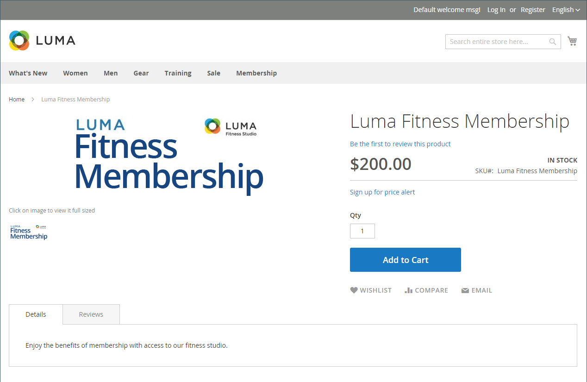

# 가상 제품

가상 제품 또는 디지털 상품은 멤버십, 서비스, 보증 또는 구독 및 책, 음악, 비디오 또는 기타 제품의 디지털 다운로드와 같은 유형 이외의 항목을 나타냅니다. 가상 제품은 개별적으로 판매되거나 의 일부로 포함될 수 있습니다 [그룹화된 제품](product-create-grouped.md), [구성 가능한 제품](product-create-configurable.md), 또는 [번들 제품](product-create-bundle.md) 제품 유형.

Nbsp; - Nbsp; - Nbsp; _[!UICONTROL Weight]_필드, 가상 제품과 간단한 제품을 만드는 과정은 동일하다. 다음은 를 사용하여 가상 제품을 만드는 프로세스를 보여 주는 지침입니다 [제품 템플릿](attribute-sets.md), 필수 필드 및 기본 설정. 기본 사항을 완료하면 필요에 따라 다른 제품 설정을 완료할 수 있습니다.

>[!NOTE]
>
>PayPal은 PayPal Express Checkout을 통해 디지털 상품 판매를 더 이상 지원하지 않습니다. 다음 중 하나를 사용하는 것이 좋습니다. [PayPal 결제 표준](../stores-purchase/paypal-payments-standard.md) 또는 가상 제품이 포함된 주문을 처리하는 다른 PayPal 결제 게이트웨이입니다.

{width="700" zoomable="yes"}

## 1단계: 제품 유형 선택

1. 다음에서 _관리자_ 사이드바, 이동 **[!UICONTROL Catalog]** > **[!UICONTROL Products]**.

1. 다음에서 _[!UICONTROL Add Product]_( {width="25"} ) 오른쪽 상단의 메뉴 아래에서&#x200B;**[!UICONTROL Virtual Product]**.

   {width="700" zoomable="yes"}

## 2단계: 속성 세트 선택

을(를) 선택하려면 [속성 집합](attribute-sets.md) 제품에 대한 템플릿으로 사용되는 템플릿은 다음 중 하나를 수행합니다.

- 을(를) 클릭합니다. **[!UICONTROL Attribute Set]** 필드에 속성 세트 이름의 전체 또는 일부를 입력합니다.

- 표시된 목록에서 사용할 속성 세트를 선택합니다.

양식이 변경 사항을 반영하도록 업데이트됩니다.

{width="600" zoomable="yes"}

## 3단계: 필요한 설정 완료

1. 다음을 입력합니다. **[!UICONTROL Product Name]**.

1. 기본값 적용 **[!UICONTROL SKU]** 제품 이름을 기반으로 하거나 다른 이름을 입력합니다.

1. 제품 입력 **[!UICONTROL Price]**.

1. 제품이 아직 게시할 준비가 되지 않았으므로 을(를) 설정합니다. **[!UICONTROL Enable Product]** 끝 `No`.

1. 클릭 **[!UICONTROL Save]** 계속합니다.

   제품이 저장되면 [스토어 뷰](introduction.md#product-scope) 선택기는 왼쪽 위 모서리에 나타납니다.

1. 다음을 선택합니다. **[!UICONTROL Store View]** 제품을 사용할 수 있는 위치.

   {width="600" zoomable="yes"}

## 4단계: 기본 설정 완료

1. 설정 **[!UICONTROL Tax Class]** 다음 중 하나를 수행합니다.

   - `None`
   - `Taxable Goods`

1. 다음을 입력합니다. **[!UICONTROL Quantity]** 재고가 있는 제품의 경우 다음 작업을 수행하십시오.

   - 기본값 적용 **[!UICONTROL Stock Status]** 설정 `In Stock`.

     가상 제품이 배송되지 않았으므로 **[!UICONTROL Weight]** 필드는 사용되지 않습니다.

   - 기본값 적용 **[!UICONTROL Visibility]** 설정 `Catalog, Search`.

   >[!NOTE]
   >
   >을 활성화한 경우 [Inventory management](../inventory-management/introduction.md), 단일 소스 판매자가 이 섹션에서 수량을 설정합니다. 다중 소스 판매자는 소스 섹션에서 소스 및 수량을 추가합니다. 다음을 참조하십시오 _출처 및 수량 지정(Inventory management)_ 섹션.

1. 할당하려면 **[!UICONTROL Categories]** 제품에 대해 **[!UICONTROL Select…]** 확인란을 선택하고 다음 중 하나를 수행합니다.

   **기존 범주 선택**:

   - 일치하는 항목을 찾을 때까지 상자에 입력을 시작합니다.

   - 할당할 카테고리의 확인란을 선택합니다.

   **범주 만들기**:

   - 클릭 **[!UICONTROL New Category]**.

   - 다음을 입력합니다. **[!UICONTROL Category Name]** 및 선택 **[!UICONTROL Parent Category]**&#x200B;를 설정하는 것이 좋습니다.

   - 클릭 **[!UICONTROL Create Category]**.

   제품을 설명하는 추가적인 개별 속성이 있을 수 있습니다. 선택 항목은 속성 세트에 따라 다르며 나중에 완료할 수 있습니다.

### 출처 및 수량 지정([!DNL Inventory Management])

{{$include /help/_includes/inventory-assign-sources.md}}

## 5단계: 제품 정보 작성

필요에 따라 다음 섹션의 정보를 작성합니다.

- [콘텐츠](product-content.md)
- [이미지 및 비디오](product-images-and-video.md)
- [검색 엔진 최적화](product-search-engine-optimization.md)
- [관련 제품, 상향 판매 및 교차 판매](related-products-up-sells-cross-sells.md)
- [사용자 정의 가능한 옵션](settings-advanced-custom-options.md)
- [웹 사이트의 제품](settings-basic-websites.md)
- [디자인](settings-advanced-design.md)
- [선물 옵션](product-gift-options.md)

>[!NOTE]
>
>다음 _[!UICONTROL Is this downloadable product?]_옵션은 기본적으로 비활성화되어 있습니다. 가상 제품에 대해 이 기능을 활성화하면 제품이 만들어집니다. [다운로드 가능](product-create-downloadable.md#downloadable-product).

## 6단계: 제품 게시

1. 제품을 카탈로그에 게시할 준비가 되었으면 을 설정합니다. **[!UICONTROL Enable Product]** 끝 `Yes`.

1. 다음 중 하나를 수행합니다.

   - **방법 1:** 저장 및 미리 보기

      - 오른쪽 상단 모서리에서 을(를) 클릭합니다. **[!UICONTROL Save]**.

      - 스토어에서 제품을 보려면 **[!UICONTROL Customer View]** 다음에 있음 _관리자_ (  ) 메뉴 아래의 제품에서 사용할 수 있습니다.

     저장소가 새 브라우저 탭에서 열립니다.

     {width="600" zoomable="yes"}

   - **방법 2:** 저장 및 닫기

     다음에서 _[!UICONTROL Save]_({width="25"} ) 메뉴, 선택&#x200B;**[!UICONTROL Save & Close]**.

## 기억해야 할 사항

- 가상상품은 서비스, 가입, 보증 등 비유형적 상품에 활용된다.

- 가상 제품은 단순한 제품과 매우 유사하지만 무게는 없습니다.

- 장바구니에 유형의 제품이 없는 한 체크아웃 중에는 배송 옵션이 나타나지 않습니다.
