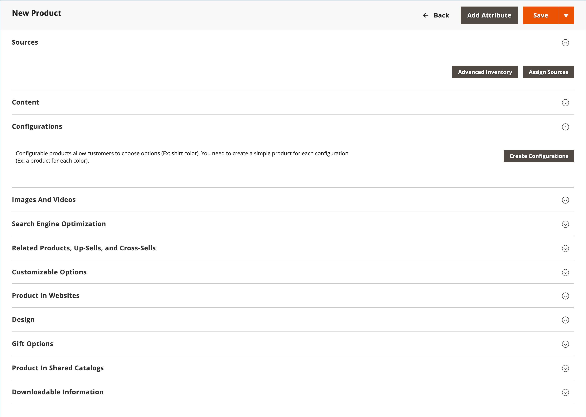

# 제품 만들기

제품 유형을 선택하는 것은 제품을 만들기 위해 가장 먼저 수행해야 하는 작업 중 하나입니다. 제품 카탈로그 구성을 막 시작하는 경우 몇 가지 샘플 제품을 만들어 각 제품 유형을 실험할 수 있습니다. 기본 제품 유형 외에도 _복합 제품_ 는 경우에 따라 다양한 색상 및 크기로 사용할 수 있는 구성 가능한 제품과 같이 여러 옵션이 있는 제품을 참조하는 데 사용됩니다.

>[!NOTE]
>
>자세한 내용은 카탈로그를 참조하십시오. [탐색](navigation.md), 설정 방법 [카테고리](categories.md) 및 [속성](product-attributes.md)및 카탈로그 [URL 옵션](catalog-urls.md) 가능합니다. 이러한 개념을 이해하면 카탈로그에 여러 제품을 추가하는 가장 효율적인 방법은 다음과 같습니다. [가져오기](../systems/data-import.md) CSV 파일에서 가져온 템플릿입니다.

{width="700" zoomable="yes"}

## 제품 유형

**[단순 제품](product-create-simple.md)** - 간단한 제품은 단일 SKU를 사용하는 실제 항목입니다. 간단한 제품은 다양한 가격과 제품의 변형을 판매 할 수있는 입력 제어 기능을 가지고 있습니다. 간단한 제품은 그룹화되고, 번들로 구성되고, 구성 가능한 제품과 연계하여 사용할 수 있습니다.

**[구성 가능한 제품](product-create-configurable.md)** - 구성 가능한 제품은 각 변형에 대한 옵션 목록이 있는 단일 제품으로 표시됩니다. 그러나 각 옵션은 개별 SKU를 사용하는 별도의 간단한 제품을 나타내므로 각 변형에 대한 인벤토리를 추적할 수 있습니다.

**[그룹화된 제품](product-create-grouped.md)** - 그룹화된 제품은 여러 독립형 제품을 그룹으로 표시합니다. 단일 제품의 변형을 제공하거나 프로모션을 위해 그룹화할 수 있습니다. 제품은 따로 구입하거나 그룹으로 구입할 수 있습니다.

**[가상 제품](product-create-virtual.md)** - 가상 제품은 유형 제품이 아니며 일반적으로 서비스, 멤버십, 보증 및 구독과 같은 제품에 사용됩니다. 가상 제품은 그룹화되고 번들 제품과 연계하여 사용할 수 있습니다.

**[번들 제품](product-create-bundle.md)**  - 번들 제품을 통해 고객이 다양한 옵션에서 &quot;직접 구축&quot;할 수 있습니다. 꾸러미는 선물 바구니, 컴퓨터 또는 사용자 지정할 수 있는 기타 모든 것일 수 있습니다. 번들의 각 항목은 별도의 독립 실행형 제품입니다.

**[다운로드 가능한 제품](product-create-downloadable.md)** - 디지털 다운로드 가능한 제품은 다운로드된 하나 이상의 파일로 구성됩니다. 파일은 서버에 상주하거나 다른 서버에 URL로 제공될 수 있습니다.

**[기프트 카드](product-gift-card-create.md)** - ([Adobe Commerce](../landing/home.md#product-editions) 기프트 카드에는 세 가지가 있습니다. _가상_ 기프트 카드는 이메일로 보냅니다. _물리적_ 선물 카드는 수령인에게 발송됩니다. _결합_ 가상 카드와 실제 카드가 결합된 기프트 카드. 각 코드에는 체크아웃 중에 상환되는 고유한 코드가 있습니다. 기프트 카드도 그룹화된 제품에 포함될 수 있습니다.

## 제품 설정

가장 자주 사용되는 제품 설정 및 속성이 페이지 맨 위에 표시되고 사용자 지정 속성이 그 뒤에 표시됩니다. 다른 모든 제품 설정은 페이지 하단의 확장 가능한 섹션에 있습니다.

{width="600" zoomable="yes"}

| 설정 | 설명 |
|--- |--- |
| [[!UICONTROL Sources]](../inventory-management/sources-assign-per-product.md) | (시기 [[!DNL Inventory Management]](../inventory-management/introduction.md) 사용) 제품을 배포할 수 있는 소스를 나열합니다. |
| [[!UICONTROL Content]](product-content.md) | 상점 첫 화면 제품 페이지에 나타나는 기본 제품 설명을 입력하고 편집하는 데 사용됩니다. |
| [[!UICONTROL Configurations]](product-configurations.md) | 제품의 기존 변형을 나열하며, 구성 가능한 제품 유형과 함께 사용할 변형을 생성하는 데 사용할 수 있습니다. |
| [[!UICONTROL Product Reviews]](settings-advanced-product-reviews.md) | 고객이 제품에 대해 제출한 모든 검토를 나열합니다. |
| [[!UICONTROL Search Engine Optimization]](product-search-engine-optimization.md) | 검색 엔진이 제품을 색인화하는 데 사용하는 URL 키 및 메타데이터 필드를 지정합니다. |
| [[!UICONTROL Related Products, Up-Sells, and Cross-Sells]](related-products-up-sells-cross-sells.md) | 고객이 관심을 가질 수 있는 추가 제품 선택을 제공하는 간단한 홍보 블록을 상점 앞에 설정하는 데 사용됩니다. |
| [[!UICONTROL Customizable Options]](settings-advanced-custom-options.md) | 제품에 사용자 정의 가능한 옵션을 추가합니다. |
| [[!UICONTROL Product in Websites]](settings-basic-websites.md) | 스토어 계층에 따라 제품을 사용할 수 있는 각 웹 사이트를 식별합니다. |
| [[!UICONTROL Design]](settings-advanced-design.md) | 제품 페이지에 다른 테마를 적용하고, 열 레이아웃을 변경하고, 제품 옵션이 나타나는 위치를 결정하고, 사용자 지정 XML 코드를 입력하는 데 사용됩니다. |
| [[!UICONTROL Gift options]](product-gift-options.md) | 제품 수준에서 체크아웃하는 동안 선물 메시지 옵션을 활성화하거나 비활성화하는 데 사용됩니다. |
| [[!UICONTROL Product In Shared Catalogs]](../b2b/catalog-shared.md) |  (사용 가능 대상 [Adobe Commerce용 B2B](../b2b/introduction.md) 만 해당) 다른 회사에 대해 사용자 지정 가격으로 공유 카탈로그를 유지 관리할 수 있습니다. |
| [[!UICONTROL Downloadable Information]](product-create-downloadable.md#step-5-complete-the-downloadable-information) | 제품 다운로드의 매개 변수를 정의하는 데 사용됩니다. |

{style="table-layout:auto"}

## 고급 가격 및 재고 관리

고급 가격 및 인벤토리 설정에 액세스하려면 아래 링크를 클릭하십시오. **[!UICONTROL Price]** 및 **[!UICONTROL Quantity]**. 자세한 내용은 [가격 관리](pricing-advanced.md) 및 [Inventory management](../inventory-management/introduction.md).
