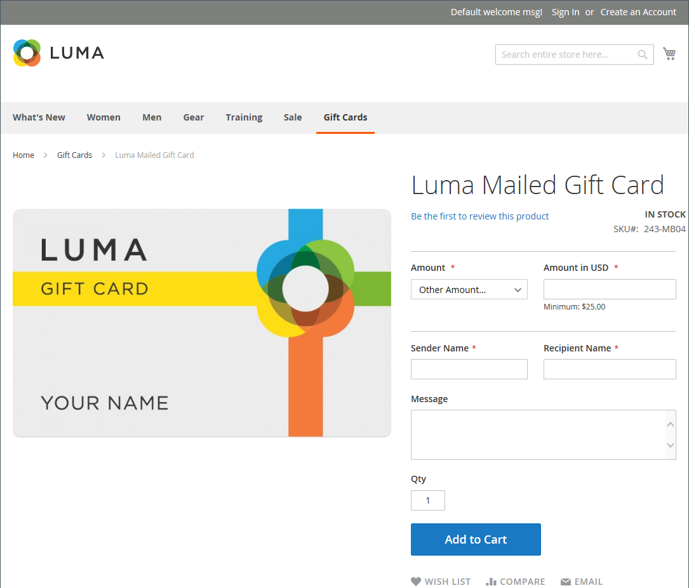

# 기프트 카드 제품

{{ee-feature}}

각 기프트 카드에는 고유 코드가 있어 체크아웃 시 한 고객만 상환할 수 있습니다. 기프트 카드를 판매하려면 [코드 풀](../stores-purchase/product-gift-card-accounts.md#step-3-establish-the-gift-card-code-pool)을 설정해야 합니다. 장바구니에서 기프트 카드를 상환하는 방법에 대한 자세한 내용은 [기프트 카드 워크플로우](../stores-purchase/product-gift-card-workflow.md)를 참조하십시오.

{width="700" zoomable="yes"}

기프트 카드 상품에는 세 가지가 있습니다.

- **가상** - 가상 기프트 카드가 받는 사람의 전자 메일 주소로 전송되며, 이 주소는 기프트 카드를 구입하는 동안 필요합니다. 배송 주소는 필요하지 않습니다.

- **실제** - 실제 기프트 카드가 받는 사람 주소로 배송되며, 기프트 카드를 구입하는 동안 필요합니다.

- **결합** - 결합된 기프트 카드가 배송되어 받는 사람에게 전자 메일로 전송됩니다. 상품권을 구매하는 동안 받는 사람의 이메일과 배송 주소가 필요합니다.

## 기프트 카드 제품 만들기

다음 지침은 [제품 템플릿](attribute-sets.md), 필수 필드 및 기본 설정을 사용하여 기프트 카드를 만드는 프로세스를 보여 줍니다. 각 필수 필드는 빨간색 별표(`*`)로 표시되어 있습니다. 기본 사항을 완료하면 필요에 따라 다른 제품 설정을 완료할 수 있습니다.

### 1단계: 제품 유형 선택

1. _관리자_ 사이드바에서 **[!UICONTROL Catalog]** > **[!UICONTROL Products]**(으)로 이동합니다.

1. _[!UICONTROL Add Product]_&#x200B;의 오른쪽 상단({width="25"})  ) 메뉴에서&#x200B;**[!UICONTROL Gift Card]**&#x200B;을(를) 선택합니다.

   {width="700" zoomable="yes"}

### 2단계: 속성 세트 선택

기본 `Gift Card` 특성 집합을 사용하거나 다른 특성을 선택할 수 있습니다. 제품의 템플릿으로 사용되는 속성 세트를 선택하려면 다음 중 하나를 수행합니다.

- **[!UICONTROL Attribute Set]** 필드를 클릭하고 특성 집합의 이름의 전체 또는 일부를 입력합니다.

- 표시된 목록에서 사용할 속성 세트를 선택합니다.

{width="600" zoomable="yes"}

### 3단계: 필요한 설정 완료

1. 기프트 카드의 **[!UICONTROL Product Name]**&#x200B;을(를) 입력하십시오.

   이름에 기프트 카드의 유형을 표시할 수도 있습니다. 예: _Luma 가상 선물 카드_.

1. 제품에 대한 **[!UICONTROL SKU]**&#x200B;을(를) 입력하십시오.

   기본적으로 제품 이름이 기본 SKU로 사용됩니다.

1. **[!UICONTROL Card Type]**&#x200B;을(를) 다음 중 하나로 설정합니다.

   - `Virtual` - 가상 기프트 카드가 전자 메일로 받는 사람에게 배달됩니다.
   - `Physical` - 실제 기프트 카드는 미리 대량 생산하고 고유한 코드로 양각 처리할 수 있습니다.
   - `Combined` - 결합된 기프트 카드에는 가상 기프트 카드와 실제 기프트 카드의 특성이 모두 있습니다.

   {width="600" zoomable="yes"}

1. 고객에게 고정 금액을 선택하려면 **[!UICONTROL Add Amount]**&#x200B;을(를) 클릭하고 카드의 첫 번째 고정 값을 소수로 입력하십시오.

   고정 금액 선택을 입력하려면 각각에 대해 이 단계를 반복합니다.

1. 고객에게 기프트 카드의 가치를 설정하는 기능을 제공하려면 다음을 수행합니다.

   - **[!UICONTROL Open Amount]**&#x200B;을(를) `Yes`(으)로 설정합니다.

   - 허용되는 최소 및 최대 값의 범위를 정의하려면 **[!UICONTROL Open Amount From]** 및 **[!UICONTROL To]** 값을 입력하십시오.

   고정 가격, 미결 금액 가격 또는 두 가지 모두를 사용하여 기프트 카드를 만들 수 있습니다.

   >[!NOTE]
   >
   >기프트 카드 상품은 카탈로그에 있는 고유의 가격이 없습니다. 기프트 카드 가격은 구매 중 선택한 기프트 카드 금액에서 파생됩니다.

   {width="600" zoomable="yes"}

### 4단계: 기본 설정 완료

1. 실제 또는 결합된 기프트 카드의 경우 재고 **[!UICONTROL Quantity]**&#x200B;을(를) 입력하십시오.

1. 선물 카드를 배송하려면 패키지의 **[!UICONTROL Weight]**&#x200B;을(를) 입력하십시오.

1. **[!UICONTROL Categories]** 필드에서 `Gift Card`을(를) 선택합니다.

제품을 설명하는 추가적인 개별 속성이 있을 수 있습니다. 선택 내용은 속성 집합에 따라 달라지므로 나중에 완료할 수 있습니다.

### 5단계: 기프트 카드 정보 작성

제품 설정의 _[!UICONTROL Gift Card Information]_&#x200B;섹션을 사용하여 카드 관리 방법을 결정하는 [기프트 카드 구성](../configuration-reference/sales/gift-cards.md) 설정을 재정의할 수 있습니다.

1. _[!UICONTROL Gift Card Information]_&#x200B;섹션까지 아래로 스크롤합니다.

   이 섹션의 기본 설정은 시스템 구성에 따라 결정됩니다.

   {width="600" zoomable="yes"}

1. 기프트 카드가 작동하는 방식에 따라 추가 필드를 변경합니다.

   - **[!UICONTROL Treat Balance as Store Credit]** - 기프트 카드 소지자가 매장 크레딧으로 잔액을 사용할 수 있는지 여부를 결정합니다.

   - **[!UICONTROL Lifetime (days)]** - 선물 카드가 만료될 때까지 구매 후 일 수를 결정합니다. 카드 수명 제한을 설정하지 않으려면 이 필드를 비워 둡니다.

   - **[!UICONTROL Allow Message]** - 기프트 카드 구매자가 받는 사람에게 메시지를 입력할 수 있는지 여부를 결정합니다. 가상(이메일) 및 실제(배송) 기프트 카드 모두에 기프트 메시지를 포함할 수 있습니다.

   - **[!UICONTROL Email Template]** - 선물 카드를 받는 사람에게 보내는 알림에 사용되는 전자 메일 템플릿을 결정합니다.

### 6단계: 제품 정보 작성

필요에 따라 다음 섹션의 정보를 작성합니다.

- [콘텐츠](product-content.md)
- [이미지 및 비디오](product-images-and-video.md)
- [관련 제품, 상향 판매 및 교차 판매](related-products-up-sells-cross-sells.md)
- [검색 엔진 최적화](product-search-engine-optimization.md)
- [사용자 정의 가능한 옵션](settings-advanced-custom-options.md)
- [웹 사이트의 제품](settings-basic-websites.md)
- [디자인](settings-advanced-design.md)
- [선물 옵션](product-gift-options.md)

### 7단계: 제품 Publish

1. 제품을 카탈로그에 게시할 준비가 되면 **제품 사용** 스위치를 `Yes`(으)로 설정하십시오.

1. 다음 중 하나를 수행합니다.

   **메서드 1:** 저장 및 미리 보기

   - 오른쪽 상단에서 **[!UICONTROL Save]**&#x200B;을(를) 클릭합니다.

   - 스토어에서 제품을 보려면 _관리자_( ) 메뉴에서 **[!UICONTROL Customer View]**&#x200B;을(를) 선택하십시오.

   {width="600" zoomable="yes"}

   **메서드 2:** 저장 및 닫기

   _[!UICONTROL Save]_( {width="25"}) 메뉴에서&#x200B;**[!UICONTROL Save & Close]**&#x200B;을(를) 선택합니다.

## 기억해야 할 사항

- 선물 카드를 판매하려면 먼저 고유 번호의 _코드 풀_&#x200B;을 생성해야 합니다.

- 기프트 카드는 `Redeemable` 또는 `Non-Redeemable`(으)로 설정할 수 있습니다.

- 기프트 카드를 구입하는 동안 기프트 카드에 세금이 **_적용되지 않습니다_**. 구매한 상품권을 상품 구매에 사용한 경우에만 상품에 세금이 부과된다.

- 기프트 카드의 수명은 무제한이거나 지정된 일수로 설정할 수 있습니다.

- 기프트 카드의 가액은 고정 금액으로 설정하거나 최소와 최대치로 개설 금액을 설정할 수 있습니다.

- 기프트 카드 상품은 카탈로그에 있는 고유의 가격이 없습니다. 기프트 카드 가격은 구매 중 선택한 기프트 카드 금액에서 파생됩니다.

- 고객을 위한 기프트 카드 계정은 주문 시 또는 송장 발행 시 생성할 수 있습니다.
