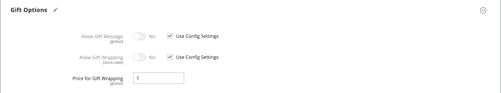
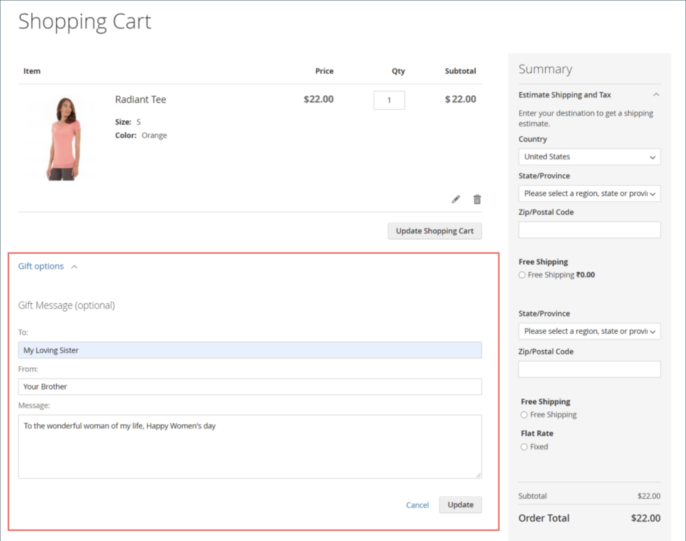

# 제품 설정 - [!UICONTROL Gift Options]

다음에서 _[!UICONTROL Gift Options]_섹션에서 제품 수준에서 체크아웃 시 선물 메시지 및 선물 포장 옵션을 설정할 수 있습니다. 기본 구성 설정을 재정의하려면&#x200B;**[!UICONTROL Use Config Settings]**확인란.

{width="600" zoomable="yes"}

## 단일 제품에 대한 선물 옵션 설정

1. 제품을 편집 모드로 엽니다.

1. 아래로 스크롤하고 확장합니다.  다음 _[!UICONTROL Gift Options]_섹션을 참조하고 다음을 수행합니다.

   - 기본 설정을 무시하려면 **[!UICONTROL Use Config Settings]** 확인란.

   - 설정 **[!UICONTROL Allow Gift Message]** 제품에 필요한 경우.

   -  ([Adobe Commerce](../landing/home.md#product-editions) 설정) **[!UICONTROL Allow Gift Wrapping]** 제품에 필요한 경우.

   -  ([Adobe Commerce](../landing/home.md#product-editions) 만 해당) 해당하는 경우 **[!UICONTROL Price for Gift Wrapping]**.

1. 완료되면 다음을 클릭하십시오. **[!UICONTROL Save]**.

## 스토어에 대한 선물 메시지 활성화

기본적으로 Commerce에서는 체크아웃 프로세스 중에 고객이 주문 및 제품에 개인화된 선물 메시지를 추가할 수 있습니다.

을 활성화하여 고객에게 이 기능을 제공할 수 있습니다. _선물 메시지_ 스토어:

1. 다음에서 _관리자_ 사이드바, 이동 **[!UICONTROL Stores]** > _[!UICONTROL Settings]_>**[!UICONTROL Configuration]**.

1. 왼쪽 패널에서 를 확장합니다. **[!UICONTROL Sales]** 및 선택 **[!UICONTROL Sales]** 밑에.

1. 확장  **[!UICONTROL Gift Options]** 페이지에서 참조할 수 있습니다.

1. 대상 **[!UICONTROL Allow Gift Messages on Order Level]**, 선택 `Yes` 전체 주문에 대해 단일 선물 메시지를 사용할 수 있도록 설정.

1. 대상 **[!UICONTROL Allow Gift Messages for Order Items]**, 선택 `Yes` 선물 메시지를 고객 장바구니의 개별 항목에 별도로 추가할 수 있습니다.

1. 클릭 **[!UICONTROL Save Config]**.

이 구성을 통해 고객은 다음 예와 같이 상점 첫 화면에서 장바구니 페이지에 선물 메시지를 추가할 수 있습니다.

{width="600" zoomable="yes"}
