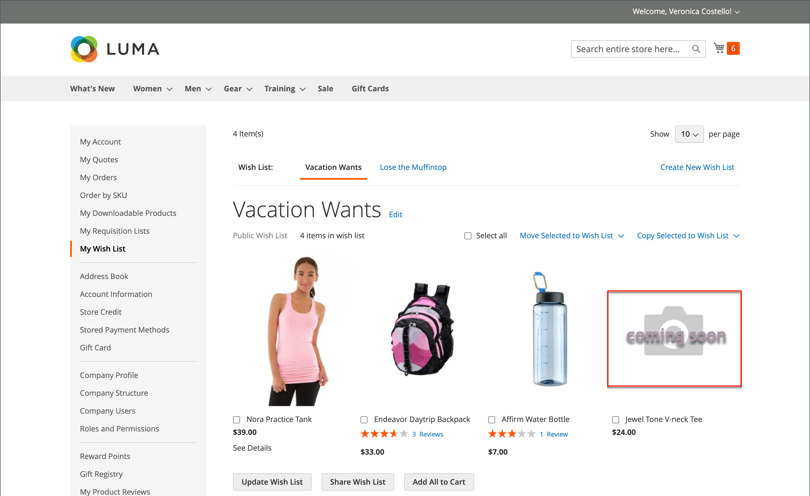

# 제품 이미지 구성

_[!UICONTROL Product Details]_페이지에서 볼 수 있도록 큰 이미지를 업로드하려는 경우 최대 픽셀 크기(너비 및 높이)를 설정하고 업로드 시 자동으로 파일 크기를 조정할 수 있습니다. 이러한 유형의 제품 이미지 업로드를 지원하기 위해 업로드할 때 더 큰 이미지 파일의 크기를 자동으로 조정할 수 있는 옵션이 있습니다. 카탈로그에 추가하려고 하지만 아직 표시할 이미지 자산이 없는 제품의 경우 자리 표시자 이미지를 구성할 수 있습니다.

## 제품 이미지 크기 조정

제품 이미지를 업로드할 때 크기가 다양한 더 큰 이미지를 추가하여 _[!UICONTROL Product Details]_페이지에 상세한 고품질 확대/축소를 제공할 수 있습니다. 모든 이미지의 크기와 모양이 유사하도록 모든 이미지가 특정 픽셀 크기와 일치하도록 하는 이미지 크기 조정 옵션이 있습니다. 이 옵션은 구성 설정을 사용하여 모든 제품 이미지의 크기를 자동으로 조정하므로 확대/축소 성능, 이미지 로드 속도 및 제품 이미지에 대한 균일한 디자인을 유지할 수 있습니다.

>[!NOTE]
>
>최상의 호환성을 위해서는 `sRGB` 색상 프로필이 있는 모든 제품 이미지를 업로드하는 것이 좋습니다. 다른 모든 색상 프로필은 제품 이미지를 업로드하는 동안 자동으로 `sRGB` 색상 프로필로 변환되어 업로드된 이미지에 색상 불일치가 발생할 수 있습니다.

최대 픽셀 폭과 높이를 설정하면 픽셀 단위의 실제 크기로 이미지 크기가 조정됩니다. Commerce은 비율을 유지하면서 너비와 높이 중 더 큰 값에 따라 이미지 크기를 조정합니다. JPG 이미지의 품질을 줄이면 파일 크기가 줄어듭니다.

예를 들어 100%의 3000 x 2100 픽셀 JPG은 5mb 이상의 이미지 파일일 수 있습니다. 이 이미지의 크기를 조정하면 너비가 1920픽셀로 줄어들고, 비율 및 품질이 80%로 유지되므로 파일 크기가 훨씬 작아지고 품질이 높아집니다.

### 이미지 크기 조정 활성화

1. _관리자_ 사이드바에서 **[!UICONTROL Stores]** > _[!UICONTROL Settings]_>**[!UICONTROL Configuration]**(으)로 이동합니다.

1. 왼쪽 패널에서 **[!UICONTROL Advanced]**&#x200B;을(를) 확장하고 **[!UICONTROL System]**&#x200B;을(를) 선택합니다.

1. _이미지 업로드 구성_ 섹션에서 를 확장합니다.

   기본 설정을 변경하려면 필요한 경우 **[!UICONTROL Use system value]** 확인란의 선택을 취소하십시오.

   {width="600" zoomable="yes"}

   이러한 구성 설정의 자세한 목록을 보려면 _구성 참조_&#x200B;에서 [_이미지 업로드 구성_](../configuration-reference/advanced/system.md#image-upload-configuration)&#x200B;을 참조하십시오.

1. 활성화하려면 **[!UICONTROL Enable Frontend Resize]**&#x200B;이(가) `Yes`(으)로 설정되어 있는지 확인하십시오.

1. `1`에서 `100`% 사이의 **[!UICONTROL Quality]** 설정을 입력하십시오.

   파일 크기를 줄이고 고품질을 유지하려면 80~90% 사이의 설정이 권장됩니다.

1. 이미지에 대해 **[!UICONTROL Maximum Width]**&#x200B;을(를) 픽셀 단위로 설정합니다.

   이미지 크기를 조정할 때 이 너비를 초과하지 않고 비율을 유지합니다.

1. 이미지에 대해 **[!UICONTROL Maximum Height]**&#x200B;을(를) 픽셀 단위로 설정합니다.

   이미지 크기를 조정할 때 이 높이를 초과하지 않고 비율을 유지합니다.

1. 완료되면 **[!UICONTROL Save Config]**&#x200B;을(를) 클릭합니다.

### 필드 설명

| 필드 | [범위](../getting-started/websites-stores-views.md#scope-settings) | 설명 |
|--- |--- |--- |
| [!UICONTROL Quality] | 글로벌 | 크기 조정된 이미지의 JPG 품질을 결정합니다. 품질이 낮을수록 파일 크기가 줄어듭니다. 파일 크기를 줄이고 고품질을 유지하려면 80~90%를 사용하는 것이 좋습니다. 기본값: 80 |
| [!UICONTROL Enable Frontend Resize] | 글로벌 | Commerce에서 _[!UICONTROL Product Details]_페이지에 대해 업로드할 수 있는 큰 크기의 이미지 크기를 조정할 수 있습니다. Commerce은 파일을 업로드할 때 JavaScript을 사용하여 이미지 파일의 크기를 조정합니다. 이미지 크기를 조정할 때 [최대 폭] 또는 [최대 높이]의 가장 큰 크기를 충족하고 초과하지 않도록 정확한 비율을 유지합니다. 기본값: `Yes` |
| [!UICONTROL Maximum Width] | 글로벌 | 이미지의 최대 픽셀 너비를 결정합니다. 이미지 크기를 조정할 때 이 너비를 초과하지 않습니다. 기본값: `1920` |
| [!UICONTROL Maximum Height] | 글로벌 | 이미지의 최대 픽셀 높이를 결정합니다. 이미지 크기를 조정할 때 이 높이를 초과하지 않습니다. 기본값: `1200` |

{style="table-layout:auto"}

## 이미지 자리 표시자

Adobe Commerce 및 Magento Open Source은 영구 제품 이미지를 사용할 수 있을 때까지 임시 이미지를 자리 표시자로 사용합니다. 각 역할에 대해 다른 자리 표시자를 업로드할 수 있습니다. 초기 자리 표시자 이미지는 샘플 로고이며, 선택한 이미지로 바꿀 수 있습니다.

{width="600" zoomable="yes"}

**_자리 표시자 이미지를 업로드하려면:_**

1. _관리자_ 사이드바에서 **[!UICONTROL Stores]** > _[!UICONTROL Settings]_>**[!UICONTROL Configuration]**(으)로 이동합니다.

1. 왼쪽 패널에서 **[!UICONTROL Catalog]**&#x200B;을(를) 확장하고 아래의 **[!UICONTROL Catalog]**&#x200B;을(를) 선택합니다.

1. **[!UICONTROL Product Image Placeholders]** 섹션에서 을 확장합니다.

   {width="600" zoomable="yes"}

   이러한 구성 설정의 자세한 목록을 보려면 _구성 참조_&#x200B;에서 [_제품 이미지 자리 표시자_](../configuration-reference/catalog/catalog.md#product-image-placeholders)&#x200B;를 참조하십시오.

1. 각 이미지 역할에 대해 **[!UICONTROL Choose File]**&#x200B;을(를) 클릭하고 컴퓨터에서 이미지를 찾은 다음 파일을 업로드하십시오.

   세 가지 역할 모두에 동일한 이미지를 사용하거나 각 역할에 대해 다른 자리 표시자 이미지를 업로드할 수 있습니다.

1. 완료되면 **[!UICONTROL Save]**&#x200B;을(를) 클릭합니다.

이미지 역할 및 권장 크기에 대한 자세한 내용은 [이미지 업로드](product-image.md#upload-an-image)를 참조하십시오.
