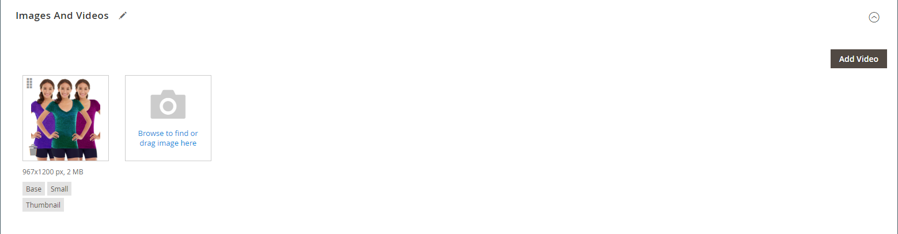
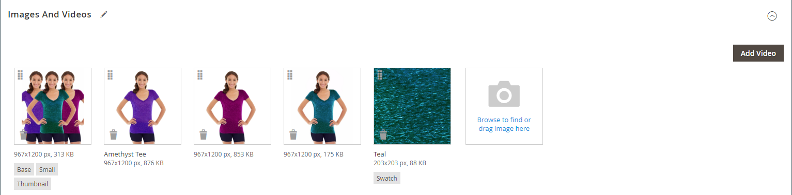
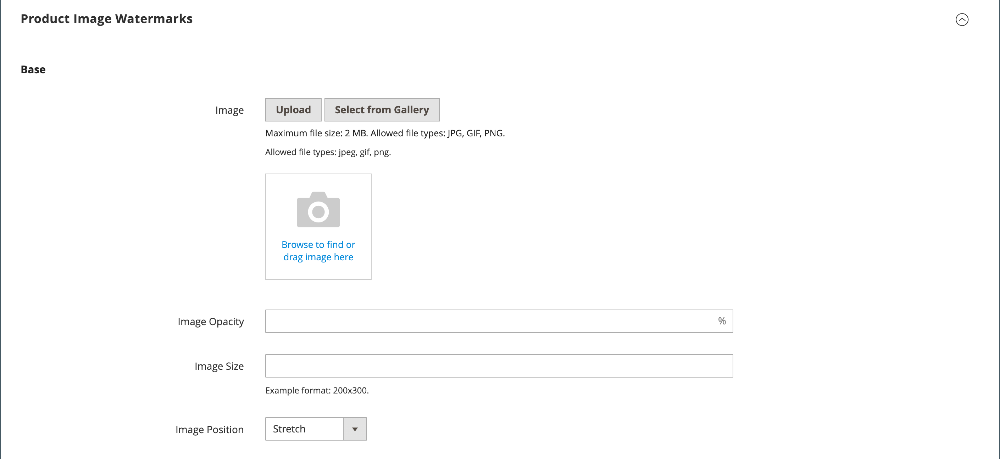
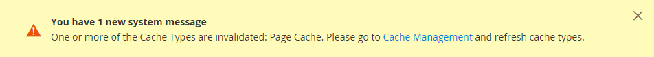
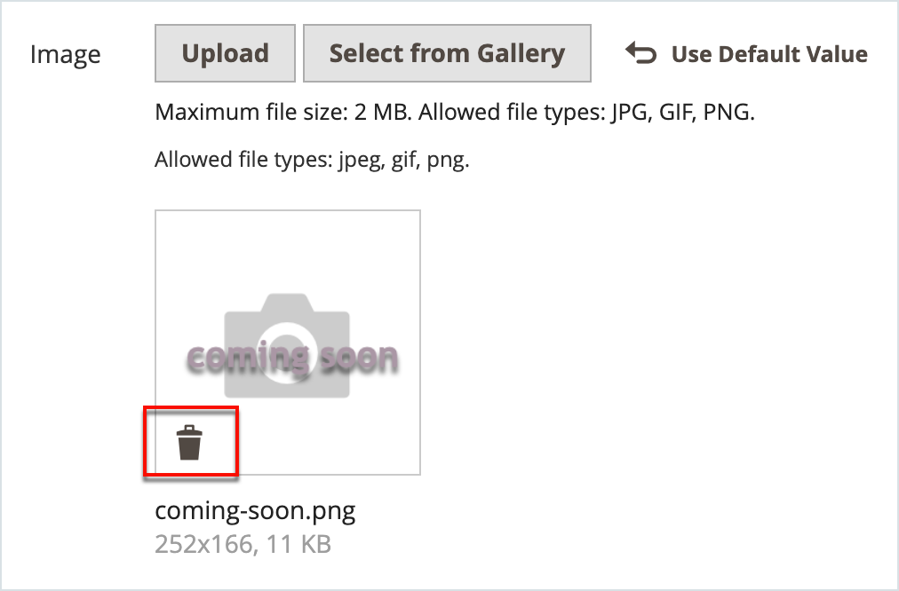

# 제품 이미지 및 비디오 관리

각 제품에 대해 여러 이미지와 비디오를 업로드하고, 순서를 재배열하며, 각 제품의 사용 방법을 제어할 수 있습니다. 관리할 이미지가 많은 경우 각 이미지를 개별적으로 업로드하지 않고 배치로 가져올 수도 있습니다. 자세한 내용은 [제품 이미지 가져오기](../systems/data-import-product-images.md).

에서 볼 수 있도록 큰 이미지를 업로드하려는 경우 _[!UICONTROL Product Details]_페이지 에서는 최대 픽셀 크기(너비 및 높이)를 설정하고 업로드 시 파일의 크기를 자동으로 조정할 수 있습니다. 업로드할 때 더 큰 이미지 파일의 크기를 자동으로 조정할 수 있는 옵션이 있습니다. 자세한 내용은 [제품 이미지 크기 조정](product-image-config.md#product-image-resizing).

## 제품 이미지 업데이트

1. 제품을 편집 모드로 엽니다.

1. 특정 스토어 보기로 작업하려면 **[!UICONTROL Store View]** 왼쪽 위 모서리에서 해당 뷰를 선택합니다.

   >[!NOTE]
   >
   >새 제품 이미지는 **_항상_** 업로드되고 표시되는 위치: **_모두_** 다음과 같은 경우에도 보기 저장 `All Store Views` 업로드에는 범위가 사용되지 않습니다.   특정 스토어 보기에서 제품 이미지를 숨기려면 해당 스토어 보기로 전환한 다음 을 선택해야 합니다. **[!UICONTROL Hide from Product Page]** 이미지에 대한 확인란을 선택하고 **[!UICONTROL Save]**.

1. 아래로 스크롤하고 를 확장합니다. _[!UICONTROL Images and Videos]_섹션.

### 이미지 업로드

최상의 호환성을 위해서는 과 함께 모든 제품 이미지를 업로드하는 것이 좋습니다. `sRGB` 색상 프로파일. 다른 모든 색상 프로파일은 자동으로 `sRGB` 제품 이미지를 업로드하는 동안 색상 프로필이 업로드된 이미지에 색상 불일치가 발생할 수 있습니다.

이미지 파일 이름 길이(확장명 포함)는 90자를 초과할 수 없습니다.

이미지를 업로드하려면 다음 중 하나를 수행하십시오.

- 바탕 화면에서 이미지를 드래그하여 _카메라_ (  )의 타일 _[!UICONTROL Images And Videos]_상자.

- 다음에서 _[!UICONTROL Images And Videos]_상자를 클릭하고_&#x200B;카메라&#x200B;_(  ) 타일을 만들고 컴퓨터에서 이미지 파일을 선택한 다음&#x200B;**[!UICONTROL Open]**.

  {width="600" zoomable="yes"}

### 이미지 다시 정렬

갤러리에서 이미지 순서를 변경하려면 _[!UICONTROL Sort]_(  ) 아이콘을 클릭하여 이미지를 의 다른 위치로 끌어서 놓습니다_[!UICONTROL Images And Videos]_ 상자.

{width="600" zoomable="yes"}

### 이미지 삭제

갤러리에서 이미지를 제거하려면 **[!UICONTROL Delete]** (  ) 아이콘(이미지 타일의 오른쪽 위 모서리)을 클릭하고 **[!UICONTROL Save]**.

### 이미지 세부 정보 설정

세부 사항 보기에서 열 이미지를 클릭하고 다음 중 하나를 수행합니다.

{width="600" zoomable="yes"}

세부 사항 보기를 닫으려면 _닫기_ (  ) 아이콘의 오른쪽 상단을 클릭합니다.

완료되면 다음을 클릭하십시오. **[!UICONTROL Save]**.

#### 대체 텍스트 입력

이미지 대체 텍스트는 웹 액세스 가능성을 개선하기 위해 화면 판독기에서 참조하고, 사이트를 색인화할 때 검색 엔진에서 참조합니다. 일부 브라우저에서는 마우스오버에 대체 텍스트를 표시합니다. 대체 텍스트는 여러 단어 길이일 수 있으며 신중하게 선택한 주요 단어를 포함할 수 있습니다.

다음에서 _[!UICONTROL Alt Text]_상자에 이미지에 대한 간단한 설명을 입력합니다.

#### 역할 할당

기본적으로 모든 역할은 제품에 업로드된 첫 번째 이미지에 할당됩니다. 역할을 다른 이미지에 재할당하려면 다음을 수행합니다.

다음에서 _[!UICONTROL Role]_상자에서 이미지에 지정할 역할을 선택합니다.

다음으로 돌아가기 _이미지 및 비디오_ 섹션에는 현재 할당된 역할이 각 이미지 아래에 표시됩니다.

{width="600" zoomable="yes"}

#### 이미지 숨기기

축소판 갤러리에서 이미지를 제외하려면 **[!UICONTROL Hidden]** 확인란 및 클릭 **[!UICONTROL Save]**.

{width="600" zoomable="yes"}

## 이미지 역할

| 이미지 역할 | 설명 |
|--- |--- |
| [!UICONTROL Thumbnail] | 썸네일 이미지는 썸네일 갤러리, 장바구니 및 일부 블록(예: 관련 항목)에 표시됩니다. 예제 크기: 50 x 50픽셀 |
| [!UICONTROL Small Image] | 작은 이미지는 카테고리 및 검색 결과 페이지의 목록에 있는 제품 이미지에 사용되고, 상향 판매, 교차 판매 및 새 제품 목록과 같은 섹션에 필요한 제품 이미지를 표시하는 데 사용됩니다. 예제 크기: 470 x 470픽셀 |
| [!UICONTROL Base Image] | 기본 이미지는 제품 세부 사항 페이지의 기본 이미지입니다. 이미지 컨테이너보다 큰 이미지를 업로드하면 이미지 확대/축소가 활성화됩니다. 달성하려는 확대/축소 수준에 따라 기본 이미지는 컨테이너 크기의 두 배 또는 세 배여야 합니다. 크기 예: 470 x 470픽셀(확대/축소 없음), 1100 x 1100픽셀(확대/축소 포함) |
| [!UICONTROL Swatch] | A [견본](swatches.md) 색상, 패턴 또는 질감을 표현하는 데 사용할 수 있습니다. 예제 크기: 50 x 50픽셀 |

{style="table-layout:auto"}

## 워터마크

나만의 독창적인 상품 이미지를 만드는 데 드는 비용까지 생각하면 파렴치한 경쟁사들이 마우스 클릭으로 훔치는 것을 막기 위해 할 수 있는 일은 별로 없다. 그러나 각 이미지에 워터마크를 배치하여 속성을 식별함으로써 덜 매력적인 타겟으로 만들 수 있습니다. 워터마크 파일은 JPG(JPEG), GIF 또는 PNG 이미지일 수 있습니다. GIF 및 PNG 파일 유형 모두 투명한 레이어를 지원하며, 이 레이어를 사용하여 워터마크에 투명한 배경을 지정할 수 있습니다.

다음에 사용되는 워터마크 _작음_ 다음 예의 이미지는 투명한 배경이 있는 검은색 로고이며, 다음 설정으로 PNG 파일로 저장됩니다.

- 크기: 50x50
- 불투명도: 5
- 위치: 타일

{width="700" zoomable="yes"}

### 제품 이미지에 워터마크 추가

1. 다음에서 _관리자_ 사이드바, 이동 **[!UICONTROL Content]** > _[!UICONTROL Design]_>**[!UICONTROL Configuration]**.

   디자인 구성에 대한 자세한 내용은 [디자인 구성](../content-design/configuration.md).

1. 구성할 스토어 보기를 찾아 다음을 클릭합니다. **[!UICONTROL Edit]** 다음에서 _[!UICONTROL Action]_열.

1. 아래 _[!UICONTROL Other Settings]_, 확장  다음&#x200B;**[!UICONTROL Product Image Watermarks]**섹션.

   {width="600" zoomable="yes"}

   다음 **[!UICONTROL Base]**, **[!UICONTROL Thumbnail]**, **[!UICONTROL Small]**, 및 **[!UICONTROL Swatch Image]** 이미지 설정은 동일합니다.

1. 다음 방법 중 하나를 사용하여 워터마크 이미지 에셋을 추가합니다.

   - 클릭 **[!UICONTROL Upload]** 워터마크로 사용하기 위해 업로드할 시스템의 이미지 파일을 선택하십시오.
   - 클릭 **[!UICONTROL Select from Gallery]** 에서 이미지 에셋 선택 [미디어 갤러리](../content-design/media-gallery.md).

1. 워터마크 표시에 대한 설정을 완료합니다.

   - 다음을 입력합니다. **[!UICONTROL Image Opacity]** 백분율로. For example: `40`

   - 다음을 입력합니다. **[!UICONTROL Image Size]** 픽셀 단위. For example: `200 x 200`

   - 설정 **[!UICONTROL Image Position]** 워터마크가 표시되는 위치를 파악합니다.

1. 완료되면 다음을 클릭하십시오. **[!UICONTROL Save Config]**.

1. 캐시를 새로 고치라는 메시지가 나타나면 **[!UICONTROL Cache Management]** 시스템 메시지에서 잘못된 캐시를 새로 고칩니다.

   {width="600" zoomable="yes"}

>[!TIP]
>
>다음을 클릭할 수 있습니다. **[!UICONTROL Use Default Value]**  기본값을 복원합니다.

### 워터마크 삭제

1. 이미지의 왼쪽 아래에서 **[!UICONTROL Delete]** (  ) 아이콘.

   {width="300"}

1. 클릭 **[!UICONTROL Save Config]**.

1. 캐시를 새로 고치라는 메시지가 나타나면 **[!UICONTROL Cache Management]** 시스템 메시지에서 잘못된 캐시를 새로 고칩니다.

   워터마크 이미지가 Storefront에서 지속되면 캐시 관리로 돌아간 다음 를 클릭합니다. **[!UICONTROL Flush Magento Cache]**.
