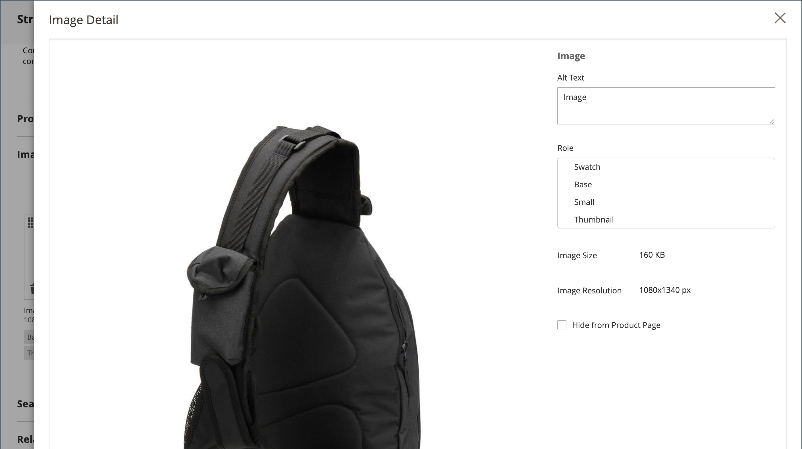

# 제품 설정 - [!UICONTROL Images and Videos]

_[!UICONTROL Images and Videos]_&#x200B;섹션에서 여러 이미지를 업로드하고, 이미지를 다시 정렬하고, 각 이미지가 사용되는 방식을 제어하는 등의 기본 이미지 관리 작업을 수행할 수 있습니다. 개별 이미지를 추가로 제어하려면_&#x200B;세부 보기&#x200B;_에서 각 이미지를 열 수 있습니다. 자세한 내용은 [카탈로그 이미지 및 비디오](catalog-images-video.md)를 참조하세요.

## 새 이미지 업로드

1. 제품을 편집 모드로 엽니다.

1. 아래로 스크롤하여 _[!UICONTROL Images and Videos]_&#x200B;섹션에서 를 확장합니다.

   {width="600" zoomable="yes"}

1. 제품 이미지를 추가할 준비가 되면 다음 중 하나를 수행하십시오.

   - 바탕 화면에서 이미지를 끌어 _카메라_() 타일에 놓습니다.

   - _카메라_() 타일을 클릭하고 이미지 파일을 선택한 다음 **[!UICONTROL Open]**&#x200B;을(를) 클릭합니다.

제품 이미지를 사용할 수 있을 때까지 [자리 표시자](product-image-config.md#image-placeholders) 이미지가 카탈로그에 표시됩니다.

## 이미지 세부 사항

제품 이미지를 추가할 때 _[!UICONTROL Image Detail]_&#x200B;창에서 이미지 표시를 사용자 지정할 수 있습니다.

{width="600" zoomable="yes"}

제품에 대한 이미지 표시 옵션을 설정하려면 다음을 수행합니다.

1. 제품 이미지를 클릭합니다.

1. **[!UICONTROL Alt text]** 입력.

1. 이미지를 표시할 **[!UICONTROL Role]**&#x200B;을(를) 선택하십시오(하나의 이미지에 대해 모든 역할을 선택할 수 있음).

   - `Swatch`
   - `Base`
   - `Small`
   - `Thumbnail`

   이러한 모든 역할은 기본적으로 처음 추가된 이미지에 대해 선택됩니다.

   {width="600" zoomable="yes"}

제품 페이지에서 제품 이미지를 숨기려면 **[!UICONTROL Hide from Product Page]** 확인란을 선택합니다.
