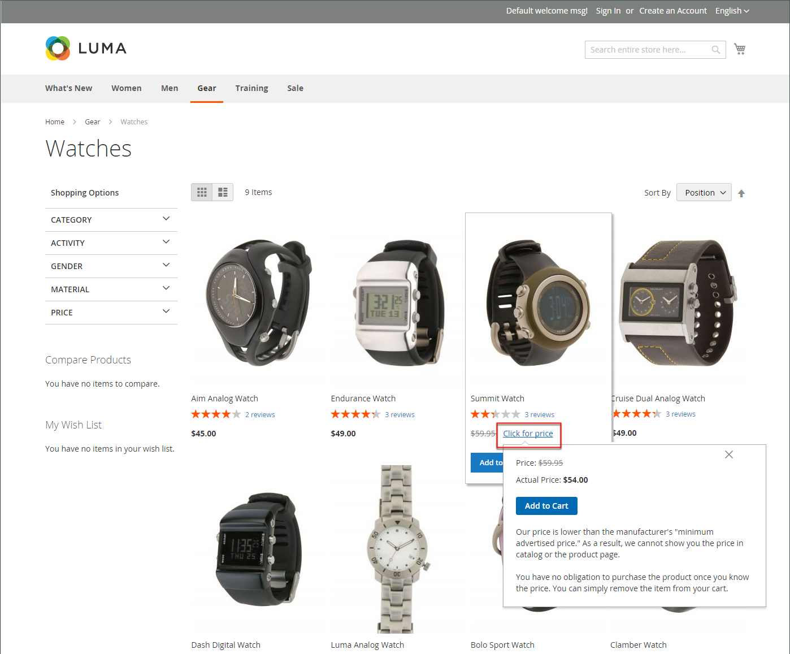
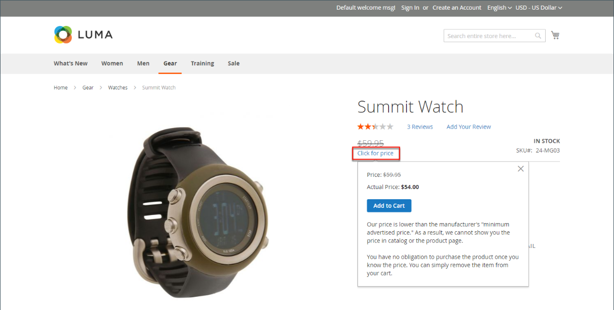

# 광고된 최소 가격

상인은 제조업자가 제시한 소매가격(MSRP)보다 낮은 가격을 표시하지 못하도록 하는 경우도 있다. MAP(최소 광고 가격)을 사용하면 고객에게 더 나은 가격을 제공하면서도 제조업체의 요구 사항을 준수할 수 있습니다. 요구 사항은 제조업체마다 다르기 때문에 허용되지 않는 페이지에 실제 가격이 표시되지 않도록 스토어를 구성할 수 있습니다.

MAP 기능은 일반 제품 가격 대신 전용 _가격 클릭_ 링크를 추가합니다. 매장 내 가격이 해당 상품 최저가 이하로 책정된 경우, 점포에서 가격 정보를 처리할 수 있는 두 가지 방법이 있다. 첫 번째 방법은 가격이 표시되지 않는 것입니다. 구매자가 _가격 클릭_ 버튼을 클릭하면 제품을 판매하는 실제 가격만 표시됩니다. 두 번째 방법은 목록/시세를 취소선으로 표시하여 자신의 가격이 더 낮다는 것을 강조하는 것입니다.

또한 맵 기능을 사용하여 몇 가지 개선 사항을 제안할 수 있습니다. 예를 들어 고객이 이러한 제품을 장바구니에 추가하면 장바구니로 리디렉션되지 않고, 대신 구매자가 다음과 같은 작업을 수행할 수 있는 오퍼가 표시됩니다.

- 장바구니에서 품목을 제거합니다(구매자가 가격을 명확히 하고자 하며 아직 구매 결정을 하지 않은 경우 수행할 수 있음).

- 장바구니에 보관하고 계속 쇼핑하세요

- 체크아웃 진행

## 맵 논리

일부 제품에는 사용자 지정 옵션 또는 자체 SKU 및 재고 관리를 사용하는 간단한 제품 등, 선택한 옵션에 따라 달라지는 가격이 있습니다. 이들 제품에 대해서는 제품 종류 및 가격 설정에 따라 다음과 같은 논리가 적용된다. 실제 가격은 Order Management, 고객 관리 도구 및 보고서에서 사용됩니다.

## 제품 유형에 MAP 사용

| 제품 유형 | 설명 |
|--- |--- |
| [단순](product-create-simple.md), [가상](product-create-virtual.md) | 실제 가격은 카탈로그 목록 및 제품 페이지에 자동으로 표시되지 않지만 [!UICONTROL Display Actual Price] 설정에 따라서만 포함됩니다. 사용자 정의 옵션 가격이 정상적으로 표시됩니다. |
| [그룹화됨](product-create-grouped.md) | 연결된 단순 제품의 가격이 카탈로그 목록 및 제품 페이지에 자동으로 표시되지 않고 [!UICONTROL Display Actual Price] 설정에 따라서만 포함됩니다. |
| [구성 가능](product-create-configurable.md) | 실제 가격은 카탈로그 목록 및 제품 페이지에 자동으로 표시되지 않지만 [!UICONTROL Display Actual Price] 설정에 따라서만 포함됩니다. 옵션 가격은 정상적으로 표시됩니다. |
| [번들](product-create-bundle.md)(고정 가격 포함) | 실제 가격은 카탈로그 페이지에 자동으로 표시되지 않지만 [!UICONTROL Display Actual Price] 설정에 따라서만 포함됩니다. 번들 품목의 가격이 정상적으로 나타납니다. MAP은 동적 가격책정이 적용된 번들 제품에 사용할 수 없습니다. |
| [다운로드 가능](product-create-downloadable.md) | 실제 가격은 카탈로그 목록 및 제품 페이지에 자동으로 표시되지 않지만 [!UICONTROL Display Actual Price] 설정에 따라서만 포함됩니다. 각 다운로드 링크와 연계된 가격은 정상적으로 표시됩니다. |

{style="table-layout:auto"}

## 가격 설정에 MAP 사용

| 가격 설정 | 설명 |
|--- |--- |
| 주요 가격 | MAP을 주가격에 적용하면 옵션, 번들 품목 및 관련 제품(주가격에서 더하거나 빼기) 가격이 정상적으로 나타납니다. |
| 관련 제품 가격 | 제품에 기본 가격이 없고 해당 가격이 관련 제품 가격에서 파생된 경우(예: 그룹화된 제품) 관련 제품의 MAP 설정이 적용됩니다. |
| [MSRP](product-price-minimum-advertised.md) | 장바구니의 제품에 제조업체의 MSRP(Suggested Retail Price)가 지정되어 있으면 이 가격이 누락되지 않습니다. |
| [계층 가격](product-price-tier.md) | 계층 가격이 설정된 경우 계층 가격 메시지가 카탈로그에 표시되지 않습니다. 제품 페이지에는 특정 수량 이상을 주문할 때 가격이 낮아질 수 있다는 알림이 표시되지만 할인은 백분율로만 표시됩니다. 그룹화된 제품의 관련 제품의 경우 할인은 제품 페이지에 표시되지 않습니다. 계층 가격은 실제 가격 표시 설정에 따라 표시됩니다. |
| [특별 가격](product-price-special.md) | 특별 가격이 지정된 경우 실제 가격 표시 설정에 따라 특별 가격이 표시됩니다. |

## 맵 구성

MAP(최소 광고 가격) 기능은 기본적으로 활성화되어 있지 않습니다. 이 기능을 스토어에 추가하려면 기능을 활성화하고 제품에 대한 맵 설정을 구성해야 합니다. MAP 설정은 카탈로그의 모든 제품에 적용하거나 특정 제품에 대해 구성할 수 있습니다. MAP이 전 세계적으로 활성화되면 상점 내 모든 제품 가격이 보이지 않게 됩니다. 다양한 구성 옵션을 사용하여 제조업체와의 계약 조건을 준수하면서도 고객에게 더 나은 가격을 제공할 수 있습니다.

{width="700" zoomable="yes"}

글로벌 레벨에서 MAP을 활성화 또는 비활성화하고, 모든 제품에 적용하고, 실제 가격이 표시되는 방법을 정의할 수 있습니다. 스토어에 나타나는 관련 메시지 및 정보 팁의 텍스트도 편집할 수 있습니다.

MAP이 활성화되면 제품 수준 MAP 설정을 사용할 수 있습니다. MSRP를 입력하고 실제 가격이 매장에 나타나도록 하는 방법을 선택하여 개별 제품에 MAP을 적용할 수 있습니다. 제품 수준 맵 설정은 전역 맵 설정을 재정의합니다.

{width="700" zoomable="yes"}

### 1단계: 스토어 보기에 대해 MAP 활성화

1. _관리자_ 사이드바에서 **[!UICONTROL Stores]** > _[!UICONTROL Settings]_>**[!UICONTROL Configuration]**(으)로 이동합니다.

1. 해당하는 경우 오른쪽 위 모서리에 구성이 적용되는 보기로 **[!UICONTROL Store View]**&#x200B;을(를) 설정합니다.

1. 왼쪽 패널에서 **[!UICONTROL Sales]**&#x200B;을(를) 확장하고 아래의 **[!UICONTROL Sales]**&#x200B;을(를) 선택합니다.

1. _[!UICONTROL Minimum Advertised Price]_&#x200B;섹션에서 를 확장합니다.

1. 필요한 경우 **맵 사용**&#x200B;을(를) `Yes`(으)로 설정합니다.

   {width="600" zoomable="yes"}

   이러한 구성 옵션에 대한 자세한 목록이 필요하면 _구성 참조_&#x200B;에서 [_최소 광고 가격_](../configuration-reference/sales/sales.md#minimum-advertised-price)&#x200B;을 참조하십시오.

### 2단계: 맵 설정 구성

다음 방법 중 하나를 사용하여 MAP 설정을 구성합니다.

#### 방법 1: 모든 제품에 대한 MAP 구성

1. 고객에게 실제 가격을 표시할 시기와 위치를 결정하려면 다음을 수행합니다.

   - 기본값을 변경하려면 **[!UICONTROL Use system value]** 확인란의 선택을 취소하십시오.

   - **실제 가격 표시**&#x200B;를 다음 중 하나로 설정합니다.
      - `In Cart`
      - `Before Order Confirmation`
      - `On Gesture (on click)`

1. **[!UICONTROL Default Popup Text Message]**&#x200B;에 표시할 텍스트를 입력하십시오.

1. **[!UICONTROL Default "What's This" Text Message]**&#x200B;에 표시할 추가 설명을 입력하십시오.

1. 완료되면 **[!UICONTROL Save Config]**&#x200B;을(를) 클릭합니다.

#### 방법 2: 단일 제품에 대한 MAP 구성

1. _관리자_ 사이드바에서 **[!UICONTROL Catalog]** > **[!UICONTROL Inventory]** > **[!UICONTROL Products]**(으)로 이동합니다.

1. 제품을 **[!UICONTROL Edit]** 모드로 엽니다.

1. 왼쪽 패널에서 **[!UICONTROL Advanced Settings]**&#x200B;을(를) 확장하고 **[!UICONTROL Advanced Pricing]**&#x200B;을(를) 선택합니다.

   >[!NOTE]
   >
   >[!UICONTROL Manufacturer's Suggested Retail Price] 및 [!UICONTROL Display Actual Price] 필드는 구성에서 [최저 광고가격](../configuration-reference/sales/sales.md#minimum-advertised-price)을(를) 사용하도록 설정한 경우에만 나타납니다.

1. **[!UICONTROL Manufacturer's Suggested Retail Price]**(MSRP)을(를) 입력하십시오.

   이 예에서 제품 가격은 $54.00이고 MSRP는 59.95입니다.

   {width="600" zoomable="yes"}

1. **[!UICONTROL Display Actual Price]**&#x200B;을(를) 다음 중 하나로 설정합니다.

   - `Use config` - (기본값) 저장소에 대해 표시 설정을 [구성됨](../configuration-reference/sales/sales.md#minimum-advertised-price)(으)로 적용합니다. |
   - `On Gesture` - 고객이 _가격 클릭_ 또는 _을 클릭하면 실제 제품 가격이 팝업으로 표시됩니다._ 링크입니다.
   - `In Cart` - 장바구니에 실제 제품 가격을 표시합니다.
   - `Before Order Confirmation` - 주문 확인 직전 체크아웃 프로세스가 끝날 때 실제 제품 가격을 표시합니다.

1. 완료되면 **[!UICONTROL Done]**&#x200B;을(를) 클릭한 다음 **[!UICONTROL Save]**&#x200B;을(를) 클릭합니다.
