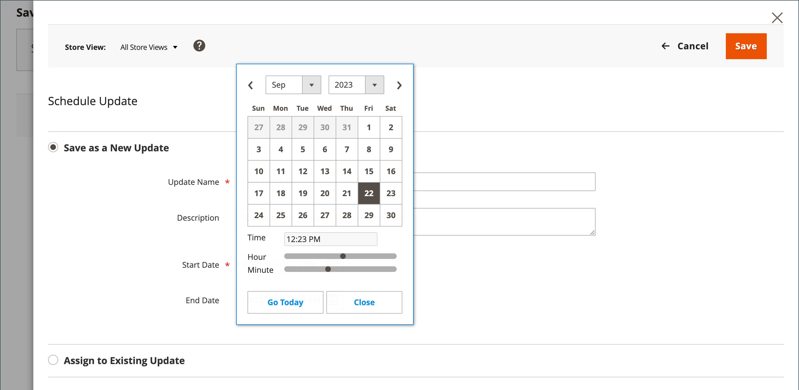
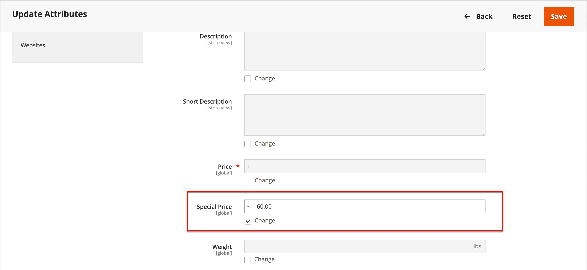
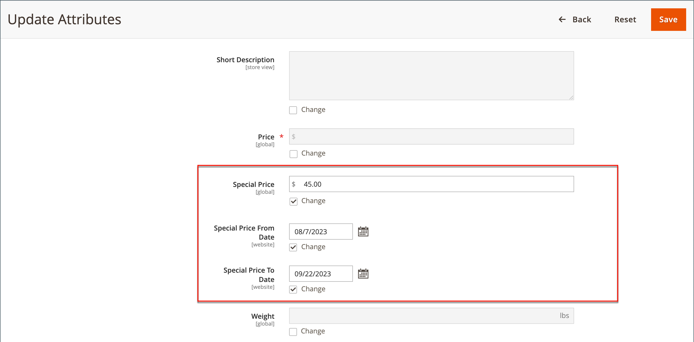

# 특별 가격

특별 가격은 지정된 기간 동안 제공될 수 있습니다. 지정된 기간 동안 정가 대신 특가가 나타나고, 이어서 정가를 나타내는 표기가 나온다.

{width="700" zoomable="yes"}

## 개별 제품에 특별 가격 적용

카탈로그의 단일 제품에 대한 특별 가격을 쉽게 설정할 수 있습니다.

### 예약된 업데이트 사용

{{ee-feature}}

Adobe Commerce에 대한 지원 포함 [예약된 업데이트](../content-design/content-staging-scheduled-update.md). 이러한 프로모션 도구를 사용하여 지정된 기간 동안 특정 제품에 특별 가격을 적용합니다.

1. 제품을 편집 모드로 엽니다.

1. 클릭 **[!UICONTROL Scheduled Update]**.

   {width="600" zoomable="yes"}

1. 대상 **이름 업데이트**&#x200B;를 클릭하고 특별 가격 프로모션의 이름을 입력합니다.

1. 개요 입력 **[!UICONTROL Description]**.

1. 사용 _캘린더_ (  ) 아이콘 을 클릭하여 **[!UICONTROL Start Date]** 및 **[!UICONTROL End Date]** 특별 가격 프로모션용.

   다음을 사용할 수 있습니다. **[!UICONTROL Hour]** 및 **[!UICONTROL Minute]** 시작 및 종료 시간을 선택할 수 있는 슬라이더도 있습니다. 클릭 **[!UICONTROL Close]** 시작 및 끝이 설정되는 경우.

   {width="600" zoomable="yes"}

1. 아래로 스크롤하여 _가격_ 필드, 클릭 **[!UICONTROL Advanced Pricing]**&#x200B;을 클릭하고 금액을 입력합니다. **[!UICONTROL Special Price]** 예약된 업데이트에 따라 적용됩니다.

   {width="600" zoomable="yes"}

1. 완료되면 다음을 클릭하십시오. **[!UICONTROL Done]** 그런 다음 **[!DNL Save]**.

   상점에서는 카탈로그 목록과 제품 페이지에 특별 가격이 표시됩니다.

   다음 _[!UICONTROL Scheduled Change]_은 페이지 맨 위에 나타납니다.

   {width="600" zoomable="yes"}

### 간단한 시작 및 종료 날짜 사용

{{ce-feature}}

Magento Open Source은 Advanced Pricing 옵션의 간단한 시작 및 종료 일자 옵션을 포함합니다.

1. 제품을 편집 모드로 엽니다.

1. 아래로 스크롤하여 _[!UICONTROL Price]_필드, 클릭&#x200B;**[!UICONTROL Advanced Pricing]**을(를) 입력한 다음&#x200B;**[!UICONTROL Special Price]**금액.

1. 사용 _캘린더_ (  ) 아이콘 을 클릭하여 **[!UICONTROL Start Date]** 및 **[!UICONTROL End Date]** 특별 가격 프로모션용.

   특가는 시작일(00:01) 시작 자정 직후부터 적용되며 종료일 전날 자정 직전(23:59)까지 계속된다.

   {width="600" zoomable="yes"}

1. 완료되면 다음을 클릭하십시오. **[!UICONTROL Done]** 그런 다음 **[!UICONTROL Save]**.

   상점에서는 카탈로그 목록과 제품 페이지에 특별 가격이 표시됩니다.

## 여러 제품에 특별 가격 적용

의 여러 변형과 같이, 여러 제품에 특별 가격을 지정할 수도 있습니다. [구성 가능한 제품](product-create-configurable.md).

### 선택한 제품에 대한 특별 가격 설정

{{ee-feature}}

다음 예는 Adobe Commerce에서 구성 가능한 제품의 여러 제품 변형에 동일한 특별 가격을 할당하는 방법을 보여줍니다.

1. 다음에서 _[!UICONTROL Products]_페이지, 클릭&#x200B;**[!UICONTROL Filters]**을(를) 입력한 후&#x200B;**[!UICONTROL Name]**구성 가능한 제품의

1. 설정 **[!UICONTROL Type]** 끝 `Configurable Product` 및 클릭 **[!UICONTROL Apply Filters]**.

1. 모든 제품에 동일한 특별 가격을 지정하려면 첫 번째 열의 헤더에 있는 컨트롤을 다음으로 설정합니다. `Select All`.

   포함할 각 제품의 확인란을 선택할 수도 있습니다.

1. 설정 **[!UICONTROL Actions]** 제어 대상 `Update attributes`.

1. 아래로 스크롤하여 _[!UICONTROL Special Price]_필드 및 선택&#x200B;**[!UICONTROL Change]**확인란_[!UICONTROL Special Price]_ 필드에 입력하고 제공할 특별 가격을 입력합니다.

   {width="600" zoomable="yes"}

1. 완료되면 다음을 클릭하십시오. **[!UICONTROL Save]**.

상점에서 사용할 수 있는 특별 가격은 카탈로그 목록 및 제품 페이지에 표시됩니다. 구성 가능한 제품의 경우 옵션을 선택하면 제품 페이지에 일반 가격도 표시됩니다.

### 선택한 제품에 대한 특별 가격 및 날짜 범위 설정

{{ce-feature}}

다음 예에서는 Magento Open Source에서 구성 가능한 제품의 여러 제품 변형에 동일한 특별 가격을 할당하는 방법을 보여 줍니다.

1. 다음에서 _관리자_ 사이드바, 이동 **[!UICONTROL Catalog]** > **[!UICONTROL Products]**.

1. 클릭 **[!UICONTROL Filters]**.

1. 다음을 입력합니다. **[!UICONTROL Name]** 구성 가능한 제품의

1. 설정 **[!UICONTROL Type]** 끝 `Simple Product`.

   {width="600" zoomable="yes"}

1. 클릭 **[!UICONTROL Apply Filters]**.

   격자에 구성 가능한 제품의 변형으로 연결된 모든 간단한 제품이 나열됩니다.

1. 모든 제품에 동일한 특별 가격을 지정하려면 첫 번째 열의 헤더에 있는 컨트롤을 다음으로 설정합니다. `Select All`.

   포함할 각 제품의 확인란을 선택할 수도 있습니다.

1. 설정 **[!UICONTROL Actions]** 제어 대상 `Update attributes`.

   {width="600" zoomable="yes"}

1. 아래로 스크롤하여 _로 이동합니다.[!UICONTROL Special Price]**을 지정하고 다음을 수행합니다.

   - 다음 항목 선택 **[!UICONTROL Change]** _ 아래에 있는 확인란[!UICONTROL Special Price]** 필드에 제공할 특별 가격을 입력합니다.

   - 다음 항목 선택 **[!UICONTROL Change]** 확인란 _일자 이후 특별 가격_ 필드를 클릭하고 _캘린더_ (  )을 클릭하고 특별 가격 판촉의 첫 번째 날짜를 선택합니다.

     특가는 시작일(00:01) 시작 자정 직후부터 적용되며 종료일 전날 자정 직전(23:59)까지 계속된다.

   - 다음 항목 선택 **[!UICONTROL Change]** 확인란 _현재까지 특별 가격_ 필드를 클릭하고 _캘린더_ (  ), 특별 가격 프로모션의 마지막 날짜를 선택합니다.

   {width="600" zoomable="yes"}

1. 완료되면 다음을 클릭하십시오. **[!UICONTROL Save]**.

   몇 개의 레코드가 특별 가격으로 업데이트되었는지 나타내는 메시지입니다.

   이 특별 가격은 지정된 날짜에 상점에서 사용할 수 있게 되며 카탈로그 목록 및 제품 페이지에 표시됩니다. 구성 가능한 제품의 경우 옵션을 선택하면 제품 페이지에 일반 가격도 표시됩니다.

   {width="600" zoomable="yes"}

## 테스트

카탈로그 목록 및 제품 페이지 모두의 상점 첫 화면에 특가가 올바르게 표시되지 않으면 브라우저 캐시를 지우십시오.

1. 다음에서 _관리자_ 사이드바, 이동 **[!UICONTROL System]** > **[!UICONTROL Cache Management]**.

1. 클릭 **[!UICONTROL Flush Magento Cache]**.

>[!NOTE]
>
>다음 **_final_** 제품 가격은 다음과 같이 계산됩니다 **_최소값_** 다음 공식을 사용한 관련 가격:  `Final Price=Min(Regular(Base) Price, Group(Tier) Price, Special Price, Catalog Price Rule) + Sum(Min Price per each required custom option)`

>[!NOTE]
>
>**_고정 가격_** 사용자 정의 가능한 제품 옵션 _아님_ 그룹 가격, 계층 가격, 특별 가격 또는 카탈로그 가격 규칙의 영향을 받습니다.
