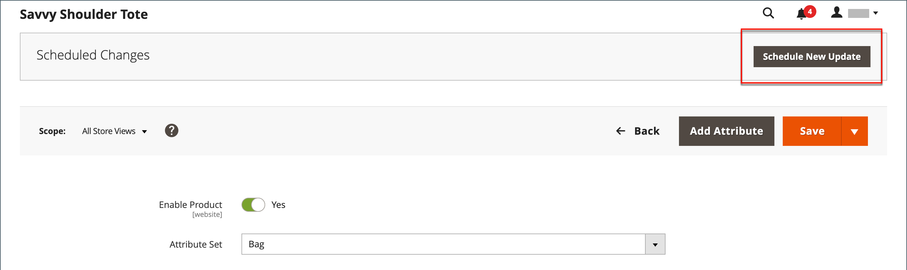

# 특별 가격

특별 가격은 지정된 기간 동안 제공될 수 있습니다. 지정된 기간 동안 정가 대신 특가가 나타나고, 이어서 정가를 나타내는 표기가 나온다.

{width="700" zoomable="yes"}

## 개별 제품에 특별 가격 적용

카탈로그의 단일 제품에 대한 특별 가격을 쉽게 설정할 수 있습니다.

### 예약된 업데이트 사용

{{ee-feature}}

Adobe Commerce에는 [예약된 업데이트](../content-design/content-staging-scheduled-update.md)에 대한 지원이 포함되어 있습니다. 이러한 프로모션 도구를 사용하여 지정된 기간 동안 특정 제품에 특별 가격을 적용합니다.

1. 제품을 편집 모드로 엽니다.

1. **[!UICONTROL Scheduled Update]**&#x200B;을(를) 클릭합니다.

   {width="600" zoomable="yes"}

1. **이름 업데이트**&#x200B;에 특별 가격 프로모션의 이름을 입력하십시오.

1. 간단한 **[!UICONTROL Description]**&#x200B;을(를) 입력하십시오.

1. _달력_( ) 아이콘을 사용하여 특별 가격 프로모션의 **[!UICONTROL Start Date]** 및 **[!UICONTROL End Date]**&#x200B;을(를) 선택하십시오.

   **[!UICONTROL Hour]** 및 **[!UICONTROL Minute]** 슬라이더를 사용하여 시작 및 종료 시간을 선택할 수도 있습니다. 시작 및 끝이 설정되면 **[!UICONTROL Close]**&#x200B;을(를) 클릭합니다.

   {width="600" zoomable="yes"}

1. _가격_ 필드까지 아래로 스크롤하고 **[!UICONTROL Advanced Pricing]**&#x200B;을(를) 클릭한 다음 예약된 업데이트에 따라 적용할 **[!UICONTROL Special Price]**&#x200B;의 금액을 입력합니다.

   {width="600" zoomable="yes"}

1. 완료되면 **[!UICONTROL Done]**&#x200B;을(를) 클릭한 다음 **[!DNL Save]**&#x200B;을(를) 클릭합니다.

   상점에서는 카탈로그 목록과 제품 페이지에 특별 가격이 표시됩니다.

   _[!UICONTROL Scheduled Change]_&#x200B;이(가) 페이지 맨 위에 나타납니다.

   {width="600" zoomable="yes"}

### 간단한 시작 및 종료 날짜 사용

{{ce-feature}}

Magento Open Source은 Advanced Pricing 옵션의 간단한 시작 및 종료 일자 옵션을 포함합니다.

1. 제품을 편집 모드로 엽니다.

1. _[!UICONTROL Price]_&#x200B;필드까지 아래로 스크롤하여&#x200B;**[!UICONTROL Advanced Pricing]**&#x200B;을(를) 클릭하고&#x200B;**[!UICONTROL Special Price]**&#x200B;금액을 입력합니다.

1. _달력_( ) 아이콘을 사용하여 특별 가격 프로모션의 **[!UICONTROL Start Date]** 및 **[!UICONTROL End Date]**&#x200B;을(를) 선택하십시오.

   특가는 시작일(00:01) 시작 자정 직후부터 적용되며 종료일 전날 자정 직전(23:59)까지 계속된다.

   {width="600" zoomable="yes"}

1. 완료되면 **[!UICONTROL Done]**&#x200B;을(를) 클릭한 다음 **[!UICONTROL Save]**&#x200B;을(를) 클릭합니다.

   상점에서는 카탈로그 목록과 제품 페이지에 특별 가격이 표시됩니다.

## 여러 제품에 특별 가격 적용

[구성 가능한 제품](product-create-configurable.md)의 여러 변형과 같이 여러 제품에 특별 가격을 할당할 수도 있습니다.

### 선택한 제품에 대한 특별 가격 설정

{{ee-feature}}

다음 예는 Adobe Commerce에서 구성 가능한 제품의 여러 제품 변형에 동일한 특별 가격을 할당하는 방법을 보여줍니다.

1. _[!UICONTROL Products]_&#x200B;페이지에서&#x200B;**[!UICONTROL Filters]**&#x200B;을(를) 클릭하고 구성 가능한 제품의&#x200B;**[!UICONTROL Name]**&#x200B;을(를) 입력하십시오.

1. **[!UICONTROL Type]**&#x200B;을(를) `Configurable Product`(으)로 설정하고 **[!UICONTROL Apply Filters]**&#x200B;을(를) 클릭합니다.

1. 모든 제품에 동일한 특별 가격을 할당하려면 첫 번째 열의 헤더에 있는 컨트롤을 `Select All`(으)로 설정합니다.

   포함할 각 제품의 확인란을 선택할 수도 있습니다.

1. **[!UICONTROL Actions]** 컨트롤을 `Update attributes`(으)로 설정합니다.

1. _[!UICONTROL Special Price]_&#x200B;필드로 스크롤하여&#x200B;_[!UICONTROL Special Price]_ 필드 아래의 **[!UICONTROL Change]** 확인란을 선택하고 제공할 특별 가격을 입력합니다.

   {width="600" zoomable="yes"}

1. 완료되면 **[!UICONTROL Save]**&#x200B;을(를) 클릭합니다.

상점에서 사용할 수 있는 특별 가격은 카탈로그 목록 및 제품 페이지에 표시됩니다. 구성 가능한 제품의 경우 옵션을 선택하면 제품 페이지에 일반 가격도 표시됩니다.

### 선택한 제품에 대한 특별 가격 및 날짜 범위 설정

{{ce-feature}}

다음 예에서는 Magento Open Source에서 구성 가능한 제품의 여러 제품 변형에 동일한 특별 가격을 할당하는 방법을 보여 줍니다.

1. _관리자_ 사이드바에서 **[!UICONTROL Catalog]** > **[!UICONTROL Products]**(으)로 이동합니다.

1. **[!UICONTROL Filters]**&#x200B;을(를) 클릭합니다.

1. 구성 가능한 제품의 **[!UICONTROL Name]**&#x200B;을(를) 입력하십시오.

1. **[!UICONTROL Type]**&#x200B;을(를) `Simple Product`(으)로 설정합니다.

   {width="600" zoomable="yes"}

1. **[!UICONTROL Apply Filters]**&#x200B;을(를) 클릭합니다.

   격자에 구성 가능한 제품의 변형으로 연결된 모든 간단한 제품이 나열됩니다.

1. 모든 제품에 동일한 특별 가격을 할당하려면 첫 번째 열의 헤더에 있는 컨트롤을 `Select All`(으)로 설정합니다.

   포함할 각 제품의 확인란을 선택할 수도 있습니다.

1. **[!UICONTROL Actions]** 컨트롤을 `Update attributes`(으)로 설정합니다.

   {width="600" zoomable="yes"}

1. _[!UICONTROL Special Price]** 필드로 아래로 스크롤하여 다음을 수행합니다.

   - _[!UICONTROL Special Price] **&#x200B; 필드 아래의 &#x200B;** [!UICONTROL Change]** 확인란을 선택하고 제공할 특별 가격을 입력합니다.

   - _다음 날짜부터 특별 가격_ 필드 아래에서 **[!UICONTROL Change]** 확인란을 선택하고 _일정_()을 클릭한 다음 특별 가격 프로모션의 첫 번째 날짜를 선택합니다.

     특가는 시작일(00:01) 시작 자정 직후부터 적용되며 종료일 전날 자정 직전(23:59)까지 계속된다.

   - _특가 누계_ 필드 아래에서 **[!UICONTROL Change]** 확인란을 선택하고 _달력_( )을 클릭한 다음 특가 프로모션의 마지막 날짜를 선택하십시오.

   {width="600" zoomable="yes"}

1. 완료되면 **[!UICONTROL Save]**&#x200B;을(를) 클릭합니다.

   몇 개의 레코드가 특별 가격으로 업데이트되었는지 나타내는 메시지입니다.

   이 특별 가격은 지정된 날짜에 상점에서 사용할 수 있게 되며 카탈로그 목록 및 제품 페이지에 표시됩니다. 구성 가능한 제품의 경우 옵션을 선택하면 제품 페이지에 일반 가격도 표시됩니다.

   {width="600" zoomable="yes"}

## 테스트

카탈로그 목록 및 제품 페이지 모두의 상점 첫 화면에 특가가 올바르게 표시되지 않으면 브라우저 캐시를 지우십시오.

1. _관리자_ 사이드바에서 **[!UICONTROL System]** > **[!UICONTROL Cache Management]**(으)로 이동합니다.

1. **[!UICONTROL Flush Magento Cache]**&#x200B;을(를) 클릭합니다.

>[!NOTE]
>
>**_final_** 제품 가격은 다음 공식을 사용하여 **_minimum_** 관련 가격으로 계산됩니다.  `Final Price=Min(Regular(Base) Price, Group(Tier) Price, Special Price, Catalog Price Rule) + Sum(Min Price per each required custom option)`

>[!NOTE]
>
>**_고정 가격_** 제품 사용자 지정 가능 옵션은 그룹 가격, 계층 가격, 특별 가격 또는 카탈로그 가격 규칙의 영향을 받지 _않습니다_.
