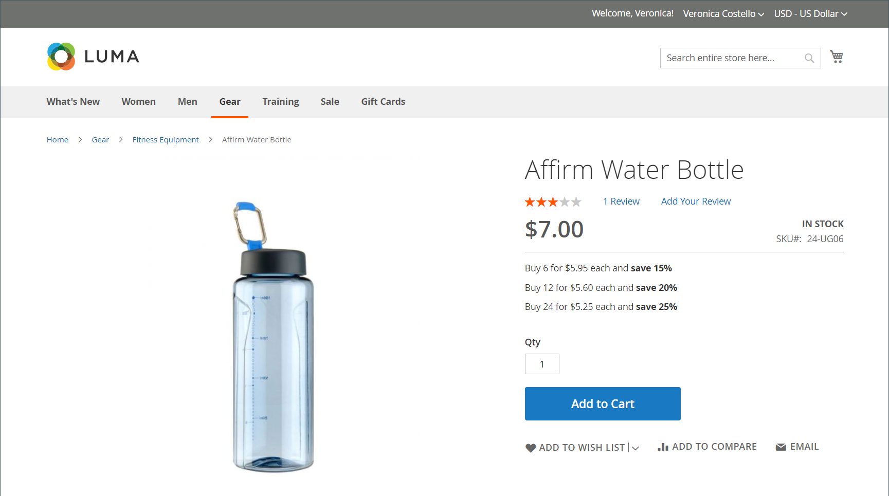
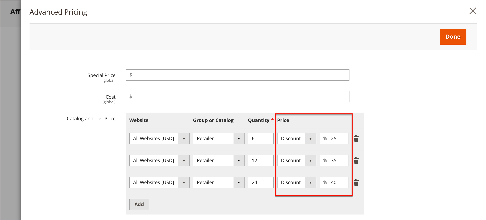

# 계층 가격

계층 가격을 사용하면 상점 첫 화면의 제품 목록 또는 제품 페이지에서 수량 할인을 제공할 수 있습니다. 특정 매장 보기, 고객 그룹 또는 공유 카탈로그에 할인을 적용할 수 있습니다.

업데이트할 제품이 많다면 개별적으로 입력하는 것보다 계층 가격 변경 사항을 가져오는 것이 가장 효율적입니다. 자세한 내용은 [계층 가격 가져오기](../systems/data-import-price-tier.md)를 참조하십시오.

{width="700" zoomable="yes"}

제품 페이지는 수량 할인을 계산하고 다음과 같은 메시지를 표시합니다.

`Buy 6 for $5.95 each and save 15%`

상점가의 가격은 최고 수량에서 최저 수량까지 우선한다. 수량 `5`에 대한 계층 가격과 `10`에 대한 계층 가격이 있고 고객이 장바구니에 5개, 6개, 7개, 8개 또는 9개 품목을 추가하는 경우, 고객은 수량 `5` 계층에 대해 할인된 가격을 받습니다. 고객이 열 번째 항목을 추가하면 수량 `10` 계층에 지정된 할인 가격이 수량 `5`에 대한 계층 가격보다 우선하며, `10`에 대한 할인 가격이 적용됩니다.

## 제품에 대한 가격 계층 추가

1. 제품을 편집 모드로 엽니다.

1. _[!UICONTROL Price]_필드 아래에서&#x200B;**[!UICONTROL Advanced Pricing]**을(를) 클릭합니다.

1. _[!UICONTROL Tier Price]_섹션에서&#x200B;**[!UICONTROL Add]**을(를) 클릭합니다.

   여러 가격의 계층을 만드는 경우 각 추가 수준에 대해 **[!UICONTROL Add]**&#x200B;을(를) 클릭하면 모든 계층을 동시에 작업할 수 있습니다. 그룹의 각 계층에는 동일한 웹 사이트 및 고객 그룹 또는 공유 카탈로그 할당이 있지만 수량 및 가격은 다릅니다.

## 가격 계층 구성

1. 스토어에 웹 사이트가 여러 개 있는 경우 계층 가격 설정이 적용되는 **[!UICONTROL Website]**&#x200B;을(를) 선택하십시오.

1. 필요한 경우 **[!UICONTROL Customer Group]** 또는 **[!UICONTROL Shared Catalog]**&#x200B;을(를) 선택하여 가격 책정 계층의 가용성을 제한하십시오( [Adobe Commerce B2B](./b2b/../introduction.md)에서만 사용 가능).

1. **[!UICONTROL Qty]**&#x200B;의 경우 할인을 받으려면 주문해야 하는 수량을 입력하십시오.

   - **방법 1:** 고정 금액으로 가격 입력

     **[!UICONTROL Price]**&#x200B;을(를) `Fixed`(으)로 설정하고 해당 계층의 한 단위에 대해 조정된 가격을 입력합니다.

     {width="600" zoomable="yes"}

   - **메서드 2:** 백분율로 가격 입력

     **[!UICONTROL Price]**&#x200B;을(를) `Discount`(으)로 설정하고 제품 기본 가격에서 할인된 가격의 백분율을 입력합니다.

     예를 들어 15% 할인의 경우 `15` 숫자를 입력합니다. (가격은 `15.00`과 같이 소수점 이하 두 자리로 저장됩니다.)

     >[!NOTE]
     >
     >할인된 가격을 받으려면 _[!UICONTROL Price]_필드가 아닌_[!UICONTROL Special Price]_ 필드에 정의된 값에 대해 정의된 백분율이 계산됩니다.

     {width="600" zoomable="yes"}

## 가격 구성 완료

1. 다른 웹 사이트 또는 고객 그룹에 대해 다른 계층 가격 집합을 추가하려면 이전 단계를 반복합니다.

1. 완료되면 **[!UICONTROL Done]**&#x200B;을(를) 클릭한 다음 **[!UICONTROL Save]**&#x200B;을(를) 클릭합니다.

>[!NOTE]
>
>**_final_** 제품 가격은 다음 공식을 사용하여 **_minimum_** 관련 가격으로 계산됩니다.  `Final Price=Min(Regular(Base) Price, Group(Tier) Price, Special Price, Catalog Price Rule) + Sum(Min Price per each required custom option)`

>[!NOTE]
>
>**_고정 가격_** 제품 사용자 지정 가능 옵션은 그룹 가격, 계층 가격, 특별 가격 또는 카탈로그 가격 규칙의 영향을 받지 _않습니다_.

## 카탈로그 가격 규칙에 대한 계층 가격 책정 활성화

[!BADGE SaaS만]{type=Positive url="https://experienceleague.adobe.com/en/docs/commerce/user-guides/product-solutions" tooltip="Adobe Commerce as a Cloud Service 프로젝트에만 적용됩니다(Adobe 관리 SaaS 인프라)."}

이전 버전의 Commerce에서는 계층 가격을 카탈로그 가격 규칙과 함께 사용할 수 없었습니다. 카탈로그 규칙은 계층 가격 구성을 무시하고 원래 기본 가격에서 할인만 계산했습니다. 이제 Adobe Commerce as a Cloud Service을 사용하여 카탈로그 가격 규칙 계산에 계층 가격을 포함하도록 선택할 수 있습니다.

이 기능을 활성화하려면

1. **[!UICONTROL Stores]** > *[!UICONTROL Settings]* > **[!UICONTROL Configuration]** > **[!UICONTROL Sales]** > **[!UICONTROL Sales]** > **[!UICONTROL Promotions]**(으)로 이동하고 **[!UICONTROL Apply Catalog Price Rule on Grouped Price]** 필드를 **[!UICONTROL Yes]**(으)로 설정합니다.

   {width="700" zoomable="yes"}

1. 카탈로그 가격 규칙으로 타깃팅하려는 각 특정 고객 그룹 또는 공유 카탈로그(예: `1`, `Wholesale` 또는 판매자 정의 그룹)에 대해 `Retail` 수량으로 계층 가격을 정의합니다. `ALL GROUPS` 고객 그룹 및 `Default` 공유 카탈로그를 이 용도로 사용할 수 없습니다. 수량이 `1`인 계층 가격이 정의되지 않은 그룹에 대해 계층 가격을 사용할 수 없습니다.

1. 필요에 따라 `1`보다 큰 수량을 사용하여 추가 계층 가격을 정의합니다. 이러한 추가 계층 가격은 고객이 장바구니에 제품의 추가 수량을 추가할 때 평소와 같이 적용됩니다. 카탈로그 가격 규칙은 이러한 추가 계층 가격에는 적용되지 않습니다.

단일 제품을 구매할 때 카탈로그 가격 규칙과 함께 계층 가격 책정이 작동하는 방식을 보여 주려면 다음 예를 고려하십시오.

- 제품의 기준 가격은 미화 100달러입니다.
- 수량 `Wholesale`, 고정 가격 90USD의 `1` 고객 그룹에 대해 계층 가격이 정의됩니다.
- 카탈로그 가격 규칙에서는 `Wholesale` 고객 그룹에 대해 10% 할인을 제공합니다.

카탈로그 가격 규칙에 대해 계층 가격을 사용할 수 있는 경우, 시스템은 다음 플로우를 사용하여 최종 가격을 계산합니다.

1. 고객이 로그인하기 전에 제품 가격이 100달러(표준 기준 가격)로 표시됩니다.

1. 고객이 `Wholesale` 그룹의 구성원으로 로그인하면 제품 가격이 90달러(`Wholesale` 그룹의 계층 가격)로 조정됩니다.

1. 카탈로그 가격 규칙이 적용돼 티어 가격 90달러를 10% 할인해 최종 가격 81달러가 된다.

다음 테이블에서는 카탈로그 가격 규칙에 대해 계층 가격책정을 사용할 수 있고 카탈로그 가격 규칙이 모든 고객 그룹에 대해 10% 할인을 제공하는 경우의 가격 계산을 요약합니다.

제품: 표준 가격 $100(단일 품목 구매)

| 고객 그룹 | 계층 가격(수량=1) | 새로운 기준 가격 | 최종 가격 |
|---|---|---|---|
| 모든 그룹 | 구성되지 않음 | 100달러 | $100 - 10% = $90 |
| 도매 | 고정: $85 | US$85 | $85 - 10% = $76.50 |
| Retailer | 20% 할인 | 80달러 | $80 - 10% = $72.00 |
| VIP | 15% 할인 | US$85 | $85 - 10% = $76.50 |
