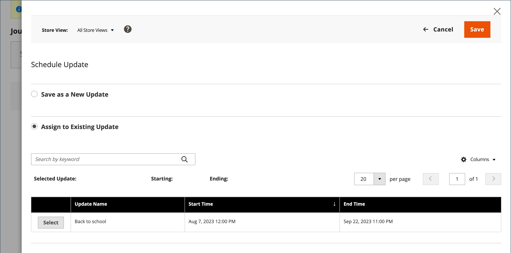
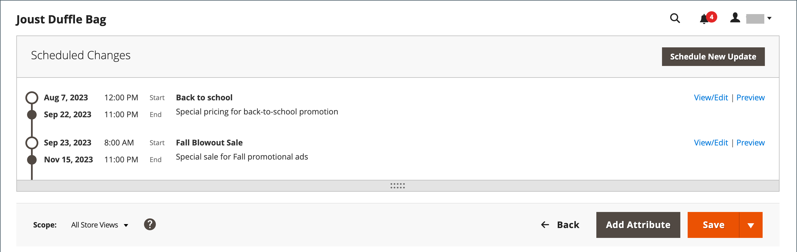
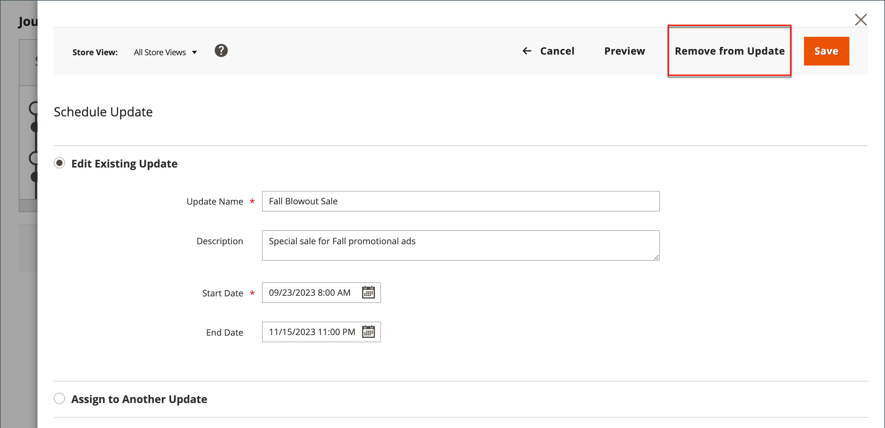
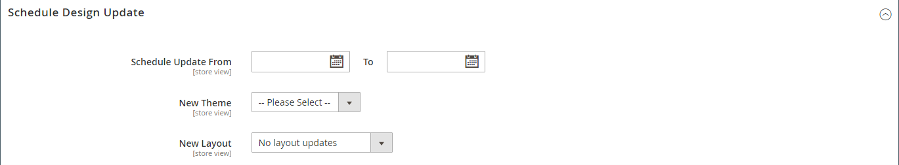

# 제품 업데이트 예약

{{ee-feature}}

제품 업데이트는 일정에 따라 적용하고 다른 콘텐츠 변경 사항과 그룹화할 수 있습니다. 다음을 사용할 수 있습니다. [콘텐츠 스테이징](../content-design/content-staging.md) 제품에 대해 예약된 변경 사항을 기반으로 캠페인을 만들거나 기존 캠페인에 변경 사항을 적용합니다.

>[!NOTE]
>
>모든 예약된 업데이트가 연속적으로 적용되므로 모든 엔티티에 한 번에 하나의 예약된 업데이트만 있을 수 있습니다. 모든 예약된 업데이트는 해당 시간대 내의 모든 스토어 보기에 적용됩니다. 따라서 엔티티는 서로 다른 스토어 보기에 대해 동시에 서로 다른 예약된 업데이트를 가질 수 없습니다. 현재 예약된 업데이트의 영향을 받지 않는 모든 스토어 뷰 내의 모든 엔티티 속성 값은 이전 예약된 업데이트가 아닌 기본값에서 가져옵니다.

>[!NOTE]
>
>예약된 업데이트에 대한 스테이징 미리 보기는 항상 다음에서 시작됩니다. **기본값** 스토어 보기 - 스테이징 업데이트 캠페인을 탐색하는 고객의 경험을 에뮬레이션합니다.

## 예약된 업데이트 만들기

1. 다음에서 _관리자_ 사이드바, 이동 **[!UICONTROL Catalog]** > **[!UICONTROL Products]**.

1. 기존 제품을 선택하고 **[!UICONTROL Edit]**.

1. 클릭 **[!UICONTROL Schedule New Update]**.

1. 선택 **[!UICONTROL Save as a New Update]**.

1. 대상 **[!UICONTROL Update Name]**, 새 콘텐츠 스테이징 캠페인의 이름을 입력합니다.

1. 개요 입력 **[!UICONTROL Description]** 업데이트 및 사용 방법

1. 달력() 도구: **[!UICONTROL Start Date]** 및 **[!UICONTROL End Date]** 캠페인을 위한 것입니다.

   >[!NOTE]
   >
   >캠페인 **[!UICONTROL Start Date]** 및 **[!UICONTROL End Date]** 다음을 사용하여 정의해야 합니다. **_기본값_** 각 웹 사이트의 로컬 시간대에서 변환되는 관리 시간대입니다. 예를 들어 미국 시간대를 기준으로 캠페인을 시작하려는 시간대가 다른 여러 웹 사이트의 경우 각 현지 시간대에 대해 별도의 업데이트를 예약해야 합니다. 설정 **[!UICONTROL Start Date]** 및 **[!UICONTROL End Date]** 로컬 웹 사이트 시간대에서 기본 관리 시간대로 변환됩니다.

   {width="600" zoomable="yes"}

1. 아래로 스크롤하여 _[!UICONTROL Price]_및 클릭&#x200B;**[!UICONTROL Advanced Pricing]**.

1. 입력 **[!UICONTROL Special Price]** 예약된 캠페인 동안 제품에 대해 다음을 클릭합니다. **[!UICONTROL Done]**.

1. 완료되면 다음을 클릭하십시오. **[!UICONTROL Save]**.

## 기존 업데이트에 할당

1. 다음에서 _관리자_ 사이드바, 이동 **[!UICONTROL Catalog]** > **[!UICONTROL Products]**.

1. 기존 제품을 선택하고 **[!UICONTROL Edit]**.

1. 클릭 **[!UICONTROL Schedule New Update]**.

1. 선택 **[!UICONTROL Assign to Existing Campaign]**.

1. 목록에서 수정할 캠페인을 선택합니다.

   {width="600" zoomable="yes"}

1. 확장  **[!UICONTROL Content]**.

1. 완료되면 다음을 클릭하십시오. **[!UICONTROL Save]**.

## 예약된 변경 내용 보기

예약된 변경 사항은 캠페인의 시작 및 종료 날짜와 함께 제품 페이지의 맨 위에 표시됩니다.

{width="600" zoomable="yes"}

## 예약된 변경 내용 편집

1. 다음에서 _[!UICONTROL Scheduled Changes]_페이지 상단의 상자에서&#x200B;**[!UICONTROL View/Edit]**.

1. 예약된 업데이트에 필요한 변경 작업을 수행합니다.

1. 클릭 **[!UICONTROL Save]**.

## 예약된 변경 내용 제거

1. 다음에서 _[!UICONTROL Scheduled Changes]_페이지 상단의 상자에서&#x200B;**[!UICONTROL View/Edit]**.

1. 상단 막대에서 **[!UICONTROL Remove from Update]**.

   {width="600" zoomable="yes"}

1. 대화 상자에서 다음을 선택합니다. **[!UICONTROL Delete the Update]** 및 클릭 **[!UICONTROL Done]**.

   >[!NOTE]
   >
   >업데이트에서 제품이 제거되며 모든 예약된 변경 사항이 손실됩니다.

## 디자인 업데이트 예약

{{ce-feature}}

다음 _[!UICONTROL Schedule Design Update]_섹션은 제품 페이지의 모양을 일시적으로 변경하는 기능을 제공합니다. 시즌, 프로모션에 대한 디자인 변경을 예약하거나 새로운 항목을 만들기 위해 예약할 수 있습니다. 디자인 변경 사항이 적용되도록 미리 예약할 수 있습니다. 또는_&#x200B;물방울&#x200B;_을 참조하십시오.

{width="600" zoomable="yes"}

| 필드 | 설명 |
|--- |--- |
| [!UICONTROL Schedule Update From/To] | 사용자 지정 레이아웃을 제품에 적용할 때의 날짜 범위를 결정합니다. |
| [!UICONTROL New Theme] | 사용자 지정 테마를 제품에 적용합니다. |
| [!UICONTROL New Layout] | 제품 페이지에 다른 레이아웃을 적용합니다. 옵션:  **[!UICONTROL No layout updates]**- 기본적으로 제품 페이지에 대해 레이아웃 업데이트를 사용할 수 없습니다. **[!UICONTROL Empty]** - 4열 페이지와 같은 고유한 레이아웃을 정의할 수 있습니다. (XML에 대한 이해가 필요합니다.)  **[!UICONTROL 1 column]**- 제품 페이지에 1열 레이아웃을 적용합니다. **[!UICONTROL 2 columns with left bar]** - 왼쪽 사이드바가 있는 2열 레이아웃을 제품 페이지에 적용합니다.  **[!UICONTROL 2 columns with right bar]**- 오른쪽 사이드바가 있는 2열 레이아웃을 제품 페이지에 적용합니다. **[!UICONTROL 3 columns]** - 제품 페이지에 3열 레이아웃을 적용합니다. |

{style="table-layout:auto"}
