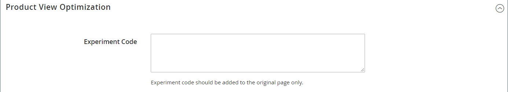

# 제품 설정 - [!UICONTROL Product View Optimization]

[Google 콘텐츠 실험](../merchandising-promotions/google-content-experiments.md)을 사용하여 일련의 A/B 테스트를 설정한 후 _[!UICONTROL Product View Optimization]_&#x200B;섹션을 사용하여 Google의 코드 조각을 테스트할 원본 제품에 붙여넣으십시오.

이 섹션은 [Google Analytics](../merchandising-promotions/google-analytics.md) Google API 구성에서 **[!UICONTROL Google Content Experiments]**&#x200B;을(를) 사용하도록 설정한 경우에만 나타납니다.

{width="600" zoomable="yes"}
