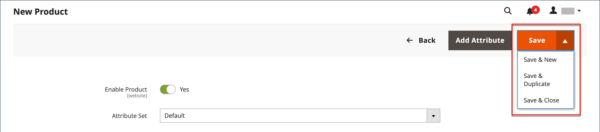

# 제품 작업 영역

사용된 속성 세트에 따라 필드 선택이 변경되지만 제품 작업 영역은 기본적으로 모든 제품 유형에 대해 동일합니다. 제품 속성은 양식 상단에 있으며 다음으로 제품 정보의 확장 가능한 섹션이 옵니다. 새 제품을 처음 저장하면 양식의 왼쪽 상단에 _[!UICONTROL Store View]_&#x200B;선택기가 나타납니다.

{width="700" zoomable="yes"}

## [!UICONTROL Enable Product] 설정

제품의 온라인 상태는 양식 상단에 있는 스위치로 표시됩니다. 온라인 상태를 변경하려면 **[!UICONTROL Enable Product]** 스위치를 `Yes` 또는 `No`(으)로 설정하십시오.

| 제어 | 설명 |
|-------- | ----------- |
|  | 제품이 온라인 상태임을 나타냅니다. |
|  전환 | 제품이 오프라인 상태임을 나타냅니다. |

{style="table-layout:auto"}

## 속성 집합

[특성 집합](attribute-sets.md)의 이름이 왼쪽 위 모서리에 나타나고 제품 레코드에 나타나는 필드를 결정합니다. 다른 속성 세트를 선택하려면 기본 속성 세트 이름 옆의 아래쪽 화살표를 클릭합니다.

{width="600" zoomable="yes"}

## 확장/축소

섹션을 확장하거나 축소하려면 확장  또는 확장  아이콘을 클릭합니다.

## [!UICONTROL Save] 메뉴

_[!UICONTROL Save]_&#x200B;메뉴에는 저장 및 계속, 제품 저장 및 만들기, 제품 저장 및 복제 또는 저장 및 닫기를 수행할 수 있는 몇 가지 옵션이 포함되어 있습니다.

{width="600" zoomable="yes"}

| 명령 | 설명 |
|--- |--- |
| [!UICONTROL Save] | 현재 제품을 저장하고 작업을 계속합니다. |
| [!UICONTROL Save & New] | 현재 제품을 저장하고 닫은 다음 동일한 제품 유형 및 템플릿을 기준으로 새 제품을 시작합니다. |
| [!UICONTROL Save & Duplicate] | 현재 제품을 저장하고 닫은 다음 새 복사본을 엽니다. |
| [!UICONTROL Save & Close] | 현재 제품을 저장하고 _[!UICONTROL Products]_&#x200B;작업 영역으로 돌아갑니다. |

{style="table-layout:auto"}

## 기본 필드 값

제품을 만들 때 시간을 절약하기 위해 여러 제품 필드의 기본값은 다른 필드의 값을 참조합니다. 기본값을 사용하거나 다른 값을 입력할 수 있습니다. 다음 필드에 기본값이 자동으로 생성되었습니다.

| 필드 | 기본값 |
|----- |------- |
| [!UICONTROL SKU] | 제품 이름을 기반으로 합니다. |
| [!UICONTROL Meta Title] | 제품 이름을 기반으로 합니다. |
| [!UICONTROL Meta Keywords] | 제품 이름을 기반으로 합니다. |
| [!UICONTROL Meta Description] | 제품 이름 및 설명을 기반으로 합니다. |

{style="table-layout:auto"}

다른 필드의 값을 나타내는 자리 표시자는 중괄호로 묶입니다. [특성 집합](attribute-sets.md) 제품에 포함된 모든 특성 코드를 자리 표시자로 사용할 수 있습니다.

{width="600" zoomable="yes"}

이러한 설정의 자세한 목록을 보려면 _구성 참조_&#x200B;에서 [제품 필드 자동 생성](../configuration-reference/catalog/catalog.md#product-fields-auto-generation)을 참조하십시오.

### 자리 표시자 값 편집

1. _관리자_ 사이드바에서 **[!UICONTROL Stores]** > _[!UICONTROL Settings]_>**[!UICONTROL Configuration]**(으)로 이동합니다.

1. 왼쪽 패널에서 **[!UICONTROL Catalog]**&#x200B;을(를) 확장하고 아래의 **[!UICONTROL Catalog]**&#x200B;을(를) 선택합니다.

1. **[!UICONTROL Product Fields Auto-Generation]** 섹션에서 를 확장하고 자리 표시자 값을 필요에 따라 변경합니다.

   예를 들어 모든 제품에 대해 포함할 특정 키워드나 모든 메타 설명에 포함할 구문이 있는 경우 해당 필드에 직접 값을 입력합니다.

   >[!NOTE]
   >
   >기존 자리 표시자 값을 유지하려면 각 마크업 태그를 둘러싸는 이중 중괄호를 유지합니다.

1. 완료되면 **[!UICONTROL Save Config]**&#x200B;을(를) 클릭합니다.

### 일반 자리 표시자

- `{{color}}`
- `{{country_of_manufacture}}`
- `{{description}}`
- `{{gender}}`
- `{{material}}`
- `{{name}}`
- `{{short_description}}`
- `{{size}}`
- `{{sku}}`
