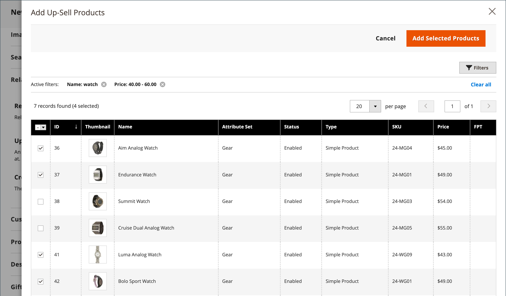

# 제품 설정 - [!UICONTROL Related Products, Up-Sells, and Cross-Sells]

_[!UICONTROL Related Products, Up-Sells, and Cross-Sells]_섹션을 사용하여 고객이 관심을 가질 수 있는 추가 제품을 제공하는 간단한 홍보용 블록을 설정합니다. 자세한 내용은 [제품 관계](../merchandising-promotions/product-relationships.md)를 참조하세요.

{width="600" zoomable="yes"}

모든 블록은 특정 옵션에 속하는 제품 목록으로 구성됩니다.

| 필드 | 설명 |
|--- |--- |
| [!UICONTROL ID] | 제품 엔티티에 할당된 고유 숫자 식별자입니다. |
| [!UICONTROL Thumbnail] | 제품 썸네일 이미지 |
| [!UICONTROL Name] | 제품 이름. |
| [!UICONTROL Status] | 제품 상태를 나타냅니다. 옵션: `Enabled` / `Disabled`. 비활성화된 제품은 프런트 엔드의 블록에 표시되지 않습니다. |
| [!UICONTROL Attribute Set] | 제품의 템플릿으로 사용되는 속성 세트의 이름입니다. |
| [!UICONTROL SKU] | 제품에 지정된 고유한 Stock Keeping Unit. |
| [!UICONTROL Price] | 제품의 단가입니다. |
| [!UICONTROL Action] | 옵션: `Remove`. 블록에서 제품을 제거합니다. |

{style="table-layout:auto"}

>[!TIP]
>
>(Adobe Commerce만 해당) **Adobe Sensei에서 제공하는 제품 권장 사항**을 사용하면 집계된 방문자 데이터를 심층 분석할 수 있는 인공 지능 및 머신 러닝 알고리즘을 사용하여 제품 관계를 정의하는 프로세스를 단순화할 수 있습니다. 이 데이터를 Adobe Commerce 카탈로그와 결합하면 쇼핑객에게 매력적이고 관련성이 높으며 개인화된 경험을 제공합니다.
> 
>수동으로 구성한 제품 권장 사항 및 상향 판매에 대한 대안으로 이 Adobe 개발 확장을 사용하는 방법에 대한 자세한 내용은 _[제품 권장 사항 안내서](https://experienceleague.adobe.com/docs/commerce/product-recommendations/guide-overview.html)_&#x200B;를 참조하십시오.

## 관련 제품

관련 제품은 고객이 보고 있는 항목 외에도 구매해야 합니다. 고객은 확인란을 클릭하여 품목을 장바구니에 넣을 수 있습니다. _관련 제품_ 블록의 배치는 정의된 테마 및 페이지 레이아웃에 따라 달라집니다. 아래 예제에서는 _관련 제품_ 블록이 _제품 보기_ 페이지 하단에 나타납니다. 2열 레이아웃으로 _관련 제품_ 블록이 오른쪽 사이드바에 표시되는 경우가 많습니다.

{width="600" zoomable="yes"}

관련 제품을 설정하려면

1. 제품을 편집 모드로 엽니다.

1. 아래로 스크롤하여 **[!UICONTROL Related Products, Up-Sells, and Cross-Sells]** 섹션에서 를 확장합니다.

1. **[!UICONTROL Add Related Products]**&#x200B;을(를) 클릭합니다.

1. [필터 컨트롤](../getting-started/admin-grid-controls.md)을 사용하여 원하는 제품을 찾으십시오.

1. 목록에서 관련 제품으로 사용할 제품의 확인란을 선택합니다.

   {width="600" zoomable="yes"}

1. 완료되면 **[!UICONTROL Add Selected Products]**&#x200B;을(를) 클릭합니다.

## 상향 판매

상향 판매 제품은 현재 고려되는 제품 대신 고객이 선호할 수 있는 품목입니다. 상향 판매로 제공되는 품목은 더 높은 품질, 더 인기 있는 품목 또는 더 나은 수익 마진이 될 수 있습니다. 업셀 제품은 _다음 제품에 관심이 있을 수 있습니다_.

{width="600" zoomable="yes"}

상향 판매 제품을 선택하려면 다음을 수행하십시오.

1. 제품을 편집 모드로 엽니다.

1. 아래로 스크롤하여 **[!UICONTROL Related Products, Up-Sells, and Cross-Sells]** 섹션에서 를 확장합니다.

1. **[!UICONTROL Add Up-Sell Products]**&#x200B;을(를) 클릭합니다.

1. [필터 컨트롤](../getting-started/admin-grid-controls.md)을 사용하여 원하는 제품을 찾으십시오.

1. 목록에서 업셀 제품으로 사용할 제품의 확인란을 선택합니다.

   {width="600" zoomable="yes"}

1. 완료되면 **[!UICONTROL Add Selected Products]**&#x200B;을(를) 클릭합니다.

>[!NOTE]
>
>상위 번들 제품은 항상 모든 하위 제품에 대한 상향 판매 제품으로 표시됩니다.

## 크로스셀

크로스셀 품목은 체크아웃 라인의 현금 등록기 옆에 위치한 충동 구매와 유사합니다. 교차 판매로 제공되는 제품은 고객이 체크아웃 프로세스를 시작하기 바로 전에 장바구니 페이지에 표시됩니다.

>[!NOTE]
>
>스토어 보기당 교차 판매 항목을 표시하거나 숨기려면 장바구니에서 [체크아웃 > 장바구니](../configuration-reference/sales/checkout.md) 옵션(_[!UICONTROL Show Cross-sell Items]_)을 참조하세요. 특정 판매 동안 또는 스토어 보기에서 A/B 테스트를 위해 교차 판매를 숨길 수 있습니다.

{width="600" zoomable="yes"}

**_크로스셀 제품을 선택하려면:_**

1. 제품을 편집 모드로 엽니다.

1. 아래로 스크롤하여 **[!UICONTROL Related Products, Up-Sells, and Cross-Sells]** 섹션에서 를 확장합니다.

1. **[!UICONTROL Add Cross-Sell Products]**&#x200B;을(를) 클릭합니다.

1. [필터 컨트롤](../getting-started/admin-grid-controls.md)을 사용하여 원하는 제품을 찾으십시오.

1. 목록에서 크로스셀 제품으로 사용할 제품의 확인란을 선택합니다.

   {width="600" zoomable="yes"}

1. 완료되면 **[!UICONTROL Add Selected Products]**&#x200B;을(를) 클릭합니다.
