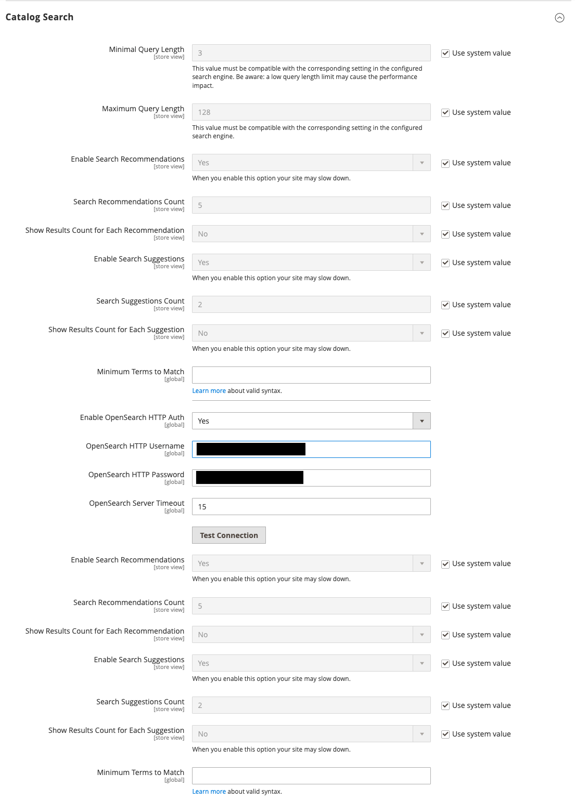

# 카탈로그 검색 구성

카탈로그 검색 구성에는 두 가지 변형이 있습니다. 첫 번째 메서드는 [Live Search](https://experienceleague.adobe.com/docs/commerce-merchant-services/live-search/overview.html)을(를) 설치할 때 사용할 수 있는 설정을 설명합니다. 두 번째 메서드는 [OpenSearch](https://experienceleague.adobe.com/docs/commerce-operations/installation-guide/prerequisites/search-engine/overview.html){:target=&quot;_blank&quot;}를 사용하는 기본 Adobe Commerce의 구성 설정을 설명합니다.

>[!NOTE]
>
>클라우드 인프라 프로젝트의 경우 [_Commerce on Cloud Infrastructure Guide_](https://experienceleague.adobe.com/en/docs/commerce-cloud-service/user-guide/configure/service/opensearch)의 추가 지침을 참조하십시오.

## 방법 1: [!DNL Live Search]이(가) 있는 Adobe Commerce

1. _관리자_ 사이드바에서 **[!UICONTROL Stores]** > _[!UICONTROL Settings]_>**[!UICONTROL Configuration]**(으)로 이동합니다.

1. 왼쪽 패널에서 **[!UICONTROL Catalog]**&#x200B;을(를) 확장하고 아래의 **[!UICONTROL Catalog]**&#x200B;을(를) 선택합니다.

1. **[!UICONTROL Catalog Search]** 섹션에서 를 확장합니다.

   {width="600" zoomable="yes"}

   이러한 옵션에 대한 자세한 목록이 필요하면 _구성 참조_&#x200B;에서 [Live Search가 있는 Adobe Commerce](../configuration-reference/catalog/catalog.md#adobe-commerce-with-live-search)을(를) 참조하십시오.

1. 검색 쿼리 텍스트의 길이 및 단어 수를 제한하려면 **[!UICONTROL Minimal Query Length]** 및 **[!UICONTROL Maximum Query Length]**&#x200B;에 대한 값을 설정하십시오.

1. 더 빠른 응답을 위해 캐시할 인기 검색 결과의 양을 제한하려면 **[!UICONTROL Number of top search results to cache]**&#x200B;의 양을 설정하십시오.

   기본값은 `100`입니다. `0` 값을 입력하면 두 번째로 입력한 검색어와 결과가 모두 캐시됩니다.

1. [storefront pop over](https://experienceleague.adobe.com/docs/commerce-merchant-services/live-search/live-search-storefront/quick-tour.html)에서 반환된 결과를 사용할 수 있는 최대 줄 수를 변경하려면 다른 **[!UICONTROL Autocomplete Limit]** 값을 입력하십시오.

   라인 수를 제한하면 검색 성능이 향상되고 반환된 목록의 크기가 줄어듭니다. 기본값은 `8`줄입니다.

## 방법 2: OpenSearch가 있는 Commerce

>[!IMPORTANT]
>
>- 2023년 8월의 [!DNL Elasticsearch 7] 지원 종료 발표로 인해 모든 Adobe Commerce 고객은 OpenSearch 2.x 검색 엔진으로 마이그레이션하는 것이 좋습니다. 제품을 업그레이드하는 동안 검색 엔진을 마이그레이션하는 방법에 대한 자세한 내용은 _업그레이드 안내서_&#x200B;에서 [OpenSearch로 마이그레이션](https://experienceleague.adobe.com/docs/commerce-operations/upgrade-guide/prepare/opensearch-migration.html)을 참조하십시오.
>- 버전 2.4.4 및 2.4.3-p2에서는 Elasticsearch 레이블이 지정된 모든 필드가 OpenSearch에도 적용됩니다. 버전 2.4.6에서 Elasticsearch 8.x에 대한 지원이 도입되었을 때 Elasticsearch 구성과 OpenSearch 구성을 구별하기 위해 새 레이블이 만들어졌습니다. 그러나 두 구성 옵션은 동일합니다.

### 1단계: 일반 검색 옵션 구성

>[!NOTE]
>
>OpenSearch 및 Search를 사용하면 접미사에 의한 Elasticsearch을 즉시 사용할 수 없습니다. 예를 들어 키워드에 SKU의 끝 부분만 포함된 경우 SKU로 검색하면 예상 결과가 반환되지 않을 수 있습니다.

1. _관리자_ 사이드바에서 **[!UICONTROL Stores]** > _[!UICONTROL Settings]_>**[!UICONTROL Configuration]**(으)로 이동합니다.

1. 왼쪽 패널에서 **[!UICONTROL Catalog]**&#x200B;을(를) 확장하고 아래의 **[!UICONTROL Catalog]**&#x200B;을(를) 선택합니다.

1. **[!UICONTROL Catalog Search]** 섹션에서 를 확장합니다.

   {zoomable="yes"}

   이러한 옵션에 대한 자세한 내용은 _구성 참조_&#x200B;에서 [기본 검색이 있는 Adobe Commerce](../configuration-reference/catalog/catalog.md#adobe-commerce-with-native-search)을(를) 참조하십시오.

1. 검색 쿼리 텍스트의 길이 및 단어 수를 제한하려면 **[!UICONTROL Minimal Query Length]** 및 **[!UICONTROL Maximum Query Length]**&#x200B;에 대한 값을 설정하십시오.

   >[!IMPORTANT]
   >
   >이 최소 및 최대 범위에 대해 설정된 값은 검색 엔진 구성의 해당 범위 세트와 호환되어야 합니다. 예를 들어 Commerce에서 이러한 값을 `2` 및 `300`(으)로 설정하는 경우 검색 엔진에서 해당 값을 업데이트합니다.

1. 더 빠른 응답을 위해 캐시할 인기 검색 결과의 양을 제한하려면 **[!UICONTROL Number of top search results to cache]**&#x200B;의 양을 설정하십시오.

   기본값은 `100`입니다. `0` 값을 입력하면 두 번째로 입력한 검색어와 결과가 모두 캐시됩니다.

1. Product EAV 인덱서를 활성화하거나 비활성화하려면 **[!UICONTROL Enable EAV Indexer]**&#x200B;을(를) 설정합니다.

   이 기능은 색인 생성 속도를 향상시키고 타사 확장에서 색인을 사용하지 못하도록 제한합니다.

1. 검색 자동 완성에 대해 표시할 최대 검색 결과 수를 제한하려면 **[!UICONTROL Autocomplete Limit]**&#x200B;의 양을 설정하십시오.

   이 양을 제한하면 검색 성능이 향상되고 표시된 목록 크기가 줄어듭니다. 기본값은 `8`입니다.

### 2단계: OpenSearch 연결 구성

>[!IMPORTANT]
>
>Commerce을 설치하거나 업그레이드할 때 **[!UICONTROL Search Engine]**, **[!UICONTROL OpenSearch Server Hostname]**, **[!UICONTROL OpenSearch Server Port]**, **[!UICONTROL OpenSearch Index Prefix]**, **[!UICONTROL Enable OpenSearch HTTP Auth]** 및 **[!UICONTROL OpenSearch Server Timeout]** 필드가 구성되었습니다. 이러한 값은 OpenSearch를 업그레이드하거나 수정할 때만 변경해야 합니다.

1. **[!UICONTROL Search Engine]**&#x200B;에 대해 `OpenSearch`을(를) 선택합니다.

1. **[!UICONTROL OpenSearch Server Hostname]**&#x200B;의 경우 Commerce 설치 시 구성된 기본값을 사용합니다.

1. **[!UICONTROL OpenSearch Server Port]**&#x200B;의 경우 Commerce 설치 시 구성된 기본값을 사용합니다.

   이 예제에서 기본값은 `9200`입니다.

1. **[!UICONTROL OpenSearch Index Prefix]**&#x200B;의 경우 Elasticsearch 인덱스를 식별할 접두사를 입력하십시오.

   기본값은 `magento2`입니다.

1. HTTP 인증을 사용하여 OpenSearch 서버에 액세스할 사용자 이름과 암호를 묻는 메시지를 표시하려면 **[!UICONTROL Enable OpenSearch HTTP Auth]**&#x200B;을(를) `Yes`(으)로 설정합니다.

1. **[!UICONTROL OpenSearch Server Timeout]**&#x200B;에 대해 시스템 시간이 초과되기 전 시간(초)을 입력합니다.

   기본값은 `15`입니다.

1. 구성을 확인하려면 **[!UICONTROL Test Connection]**&#x200B;을(를) 클릭합니다.

### 3단계: 제안 및 권장 사항 구성

>[!NOTE]
>
>검색 제안 및 권장 사항은 서버 성능에 영향을 줄 수 있습니다.

1. 권장 사항을 제공하려면 **[!UICONTROL Enable Search Recommendations]**&#x200B;을(를) `Yes`(으)로 설정하고 다음을 수행하십시오.

   - **[!UICONTROL Search Recommendation Count]**&#x200B;에 대해 제공할 권장 사항 수를 입력하십시오.

   - 각 권장 사항에 대해 검색된 결과 수를 표시하려면 **[!UICONTROL Show Results Count for Each Recommendation]**&#x200B;을(를) `Yes`(으)로 설정하십시오.

1. **[!UICONTROL Enable Search Suggestions]**&#x200B;을(를) `Yes`(으)로 설정하고 다음을 수행합니다.

   - **[!UICONTROL Search Suggestions Count]**&#x200B;에 제공할 검색 제안 횟수를 입력하십시오.

   - 각 제안에 대해 검색된 결과 수를 표시하려면 **[!UICONTROL Show Results for Each Suggestion]**&#x200B;을(를) `Yes`(으)로 설정하십시오.

### 4단계: 일치시킬 최소 용어 구성

검색어 반환을 위해 검색 결과가 일치해야 하는 쿼리의 최소 용어 수를 제어하려면 **[!UICONTROL Minimum Terms to Match]**&#x200B;에 대한 값을 지정하십시오. 이 값을 지정하면 쇼핑객의 최적의 결과 관련성을 확보할 수 있습니다. 허용되는 값 목록은 OpenSearch 설명서의 [minimum_should_match 매개 변수](https://opensearch.org/docs/latest/query-dsl/minimum-should-match/)을(를) 참조하십시오.

완료되면 **[!UICONTROL Save Config]**&#x200B;을(를) 클릭합니다.
