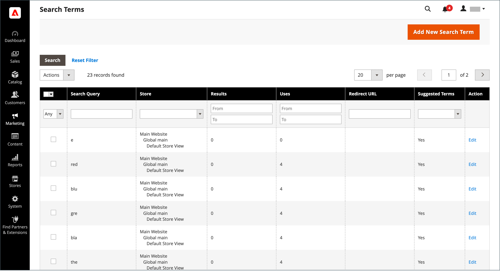
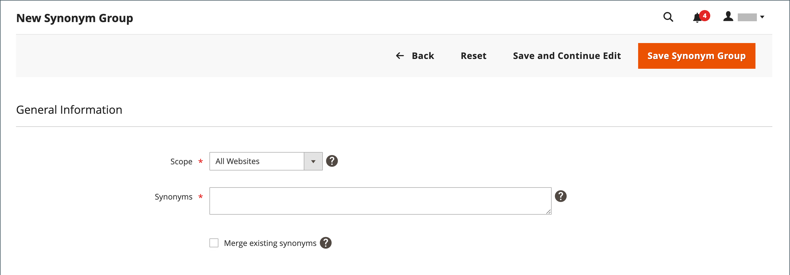
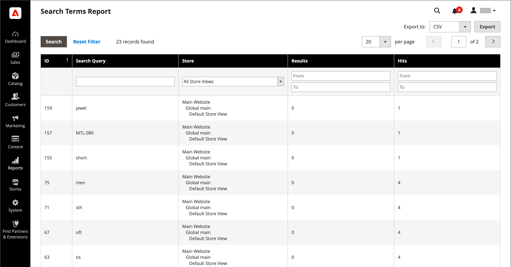

# 검색어 관리

검색어에 대한 [랜딩 페이지](../content-design/pages.md)은(는) 콘텐츠 페이지, 카테고리 페이지, 제품 세부 사항 페이지 또는 다른 사이트의 페이지일 수 있습니다.

검색어를 사용하여 일반적인 철자 오류를 캡처하고 적절한 페이지로 리디렉션합니다. 예를 들어, 연철 뜰 가구를 파는 경우, 많은 사람들이 이 용어의 철자를 _rod iron_ 또는 _rot iron_&#x200B;으로 잘못 쓰는 것을 알고 있습니다. 맞춤법이 틀린 단어를 검색어로 입력하고 _철자_&#x200B;의 동의어를 만들 수 있습니다. 단어의 철자가 틀리더라도 그 검색은 철판 가공을 위한 페이지로 향한다.

고객이 스토어에서 제품을 찾을 때 사용하는 검색어를 조사하여 고객이 무엇을 찾는지 알아볼 수도 있습니다. 카탈로그에 없는 제품을 찾는 사람이 충분한 경우 영업 기회를 나타낼 수 있습니다. 그 동안, 빈 손으로 남기지 않고 카탈로그에 있는 다른 제품으로 리디렉션할 수 있습니다.

## 검색어 추가

스토어에서 사람들이 검색하는 데 사용하는 새로운 단어를 학습할 때 검색어 목록에 추가하여 카탈로그에서 가장 일치하는 제품으로 안내할 수 있습니다.

{width="700" zoomable="yes"}

| 열 | 설명 |
|--- |--- |
| [!UICONTROL Search Query] | 검색을 수행하는 데 사용되는 쿼리입니다. |
| [!UICONTROL Store] | 검색 쿼리가 적용된 저장소입니다. |
| [!UICONTROL Results] | 쿼리에서 찾은 결과 수. |
| [!UICONTROL Uses] | 사용 횟수. |
| [!UICONTROL Redirect URL] | 검색을 수행한 후 사용자가 리디렉션된 대상 페이지의 URL입니다. |
| [!UICONTROL Suggested Terms] | 쿼리 결과에 추천 용어가 표시되는지 여부를 결정합니다. |
| [!UICONTROL Actions] | 제품을 편집 모드로 엽니다. |

{style="table-layout:auto"}

>[!NOTE]
>
>쇼핑객이 이 검색 쿼리를 사용하여 검색을 실행할 때마다 결과 수가 업데이트됩니다. 제품을 변경하거나 제거하는 경우에는 업데이트되지 않습니다.

### 검색어 추가

1. _관리자_ 사이드바에서 **[!UICONTROL Marketing]** > _[!UICONTROL SEO & Search]_>**[!UICONTROL Search Terms]**(으)로 이동합니다.

1. **[!UICONTROL Add New Search Term]**&#x200B;을(를) 클릭합니다.

   {width="600" zoomable="yes"}

1. **[!UICONTROL Search Query]** 상자의 _[!UICONTROL General Information]_아래에 새 검색어로 추가할 단어 또는 구를 입력합니다.

1. 스토어를 여러 언어로 사용할 수 있는 경우 해당 **[!UICONTROL Store]** 보기를 선택하십시오.

1. 검색 결과를 스토어의 다른 페이지나 다른 웹 사이트로 리디렉션하려면 **[!UICONTROL Redirect URL]** 필드에 대상 페이지의 전체 URL을 입력하십시오.

1. 검색에서 결과가 반환되지 않을 때마다 이 용어를 제안으로 사용하려면 **[!UICONTROL Display in Suggested Terms]**&#x200B;을(를) `Yes`(으)로 설정하십시오.

1. 완료되면 **[!UICONTROL Save Search]**&#x200B;을(를) 클릭합니다.

## 검색어 편집

1. _[!UICONTROL Search Terms]_그리드에서 레코드 행을 클릭하여 검색어를 편집 모드로 엽니다.

1. 필요한 사항을 변경합니다.

1. 완료되면 **[!UICONTROL Save Search]**&#x200B;을(를) 클릭합니다.

## 검색어 삭제

검색어를 삭제하는 방법에는 그리드 및 편집 페이지에서 두 가지가 있습니다.

_[!UICONTROL Search Terms]_눈금의&#x200B;**메서드 1:**

1. 목록에서 삭제할 용어의 확인란을 선택합니다.

1. 목록의 왼쪽 상단 모서리에서 **[!UICONTROL Actions]**&#x200B;을(를) `Delete`(으)로 설정합니다.

1. 완료되면 **[!UICONTROL Submit]**&#x200B;을(를) 클릭합니다.

_[!UICONTROL Edit a Search Term]_페이지의&#x200B;**메서드 2:**

1. _관리자_ 사이드바에서 **[!UICONTROL Marketing]** > _[!UICONTROL SEO & Search]_>**[!UICONTROL Search Terms]**(으)로 이동합니다.

1. 삭제할 검색어를 찾아 편집 모드로 엽니다.

1. **[!UICONTROL Delete Search]**&#x200B;을(를) 클릭합니다.

1. 작업을 확인하려면 **[!UICONTROL OK]**&#x200B;을(를) 클릭합니다.

## 인기 검색어

스토어의 바닥글에 있는 _검색어_ 링크에는 스토어 방문자가 사용한 검색어가 인기도순으로 표시됩니다. 검색어는 _태그 클라우드_ 형식으로 표시됩니다. 여기서 텍스트 크기는 검색어의 인기도를 나타냅니다.

기본적으로 인기 검색어는 검색 엔진 최적화 도구로 활성화되지만 카탈로그 검색 프로세스에 직접 연결할 수 없습니다. 검색어 페이지는 검색 엔진으로 인덱싱되므로 페이지에 있는 모든 검색어가 검색어 순위 및 스토어 가시성을 개선하는 데 도움이 될 수 있습니다. 인기 검색어 페이지의 URL: `mystore.com/search/term/popular/`

{width="600" zoomable="yes"}

**_인기 검색어를 구성하려면:_**

1. _관리자_ 사이드바에서 **[!UICONTROL Stores]** > _[!UICONTROL Settings]_>**[!UICONTROL Configuration]**(으)로 이동합니다.

1. 왼쪽 패널에서 **[!UICONTROL Catalog]**&#x200B;을(를) 확장하고 아래의 **[!UICONTROL Catalog]**&#x200B;을(를) 선택합니다.

1. **[!UICONTROL Search Engine Optimization]** 섹션에서 를 확장합니다.

   {width="600" zoomable="yes"}

   이러한 옵션에 대한 자세한 목록이 필요하면 _구성 참조_&#x200B;에서 [검색 엔진 최적화](../configuration-reference/catalog/catalog.md#search-engine-optimization)를 참조하십시오.

1. 필요에 따라 **[!UICONTROL Popular Search Terms]**&#x200B;을(를) 설정합니다.

   필요한 경우 **[!UICONTROL Use system value]** 확인란의 선택을 취소하여 이 설정을 변경합니다.

1. 완료되면 **[!UICONTROL Save Config]**&#x200B;을(를) 클릭합니다.

>[!NOTE]
>
>자주 사용하는 [카탈로그 검색](search-configuration.md)의 캐싱을 추가로 구성할 수 있습니다.

## 동의어 검색

[카탈로그 검색](search-configuration.md)의 효율성을 개선하는 한 가지 방법은 사람들이 동일한 항목을 설명하는 데 사용할 수 있는 다른 용어를 포함하는 것입니다. 다른 사람이 _소파_&#x200B;를 찾고 있고 제품이 _소파_(으)로 나열되어 있다고 해서 판매에서 지고 싶지 않습니다. _couch_&#x200B;의 동의어로 _sofa_, _davenport_, _lovesat_&#x200B;을(를) 입력하여 더 광범위한 검색어를 캡처하고 동일한 랜딩 페이지로 보낼 수 있습니다.

Adobe Commerce은 두 가지 다른 동의어 관리 솔루션을 지원합니다.

- 라이브 검색 [동의어](https://experienceleague.adobe.com/docs/commerce/live-search/live-search-admin/synonyms/synonyms.html) 기능은 라이브 검색이 설치된 Adobe Commerce 설치에 사용할 수 있습니다.
- 이 페이지에 설명된 표준 검색 동의어 기능 은 모든 Adobe Commerce 설치에 대해 즉시 사용할 수 있습니다.

>[!NOTE]
>
>표준 검색 동의어 기능은 `name` 및 `sku` 제품 특성을 기본적으로 지원합니다&#x200B;**_전용_**.

>[!IMPORTANT]
>
>동의어 검색 기능은 전체 텍스트 일치 검색 방법만 사용합니다.

{width="700" zoomable="yes"}

### 동의어 그룹 만들기

1. _관리자_ 사이드바에서 **[!UICONTROL Marketing]** > _[!UICONTROL SEO & Search]_>**[!UICONTROL Search Synonyms]**(으)로 이동합니다.

   _[!UICONTROL Search Synonyms]_그리드가 나타납니다. 검색 동의어를 처음 사용하는 경우 그리드가 비어 있습니다.

   {width="700" zoomable="yes"}

1. **[!UICONTROL New Synonym Group]**&#x200B;을(를) 클릭합니다.

   {width="700" zoomable="yes"}

1. 동의어가 적용되는 저장소 보기로 **[!UICONTROL Scope]**&#x200B;을(를) 설정합니다.

1. 그룹에 각 동의어를 쉼표로 구분하여 입력합니다. 사람들이 검색 기준으로 사용할 수 있는 단어를 선택합니다. For example:

   - `sweatshirt, sweat shirt, hoodie, fleece`
   - `cell phone, mobile phone, smart phone`
   - `couch, sofa, davenport`
   - `wrought iron, rot iron, rod iron`

1. 이러한 동의어를 범위가 같은 다른 동의어와 그룹으로 병합하려면 **[!UICONTROL Merge existing synonyms]** 확인란을 선택하십시오.

1. 완료되면 **[!UICONTROL Save Synonym Group]**&#x200B;을(를) 클릭합니다.

### 동의어 그룹 편집

1. _[!UICONTROL Search Synonyms]_그리드에서 레코드 행을 클릭하여 편집 모드에서 동의어 그룹을 엽니다.

1. 필요한 사항을 변경합니다.

1. 완료되면 **[!UICONTROL Save Synonym Group]**&#x200B;을(를) 클릭합니다.

### 동의어 그룹 삭제

동의어 그룹을 삭제하는 방법에는 그리드 및 편집 페이지에서 두 가지가 있습니다.

검색 동의어 그리드의 **메서드 1:**

1. _[!UICONTROL Search Synonyms]_그리드에서 삭제할 그룹의 확인란을 선택합니다.

1. 목록의 왼쪽 상단 모서리에서 **[!UICONTROL Actions]**&#x200B;을(를) `Delete`(으)로 설정합니다.

1. 완료되면 **[!UICONTROL Submit]**&#x200B;을(를) 클릭합니다.

동의어 그룹 편집 페이지의 **방법 2:**

1. 동의어 검색 그리드에서 레코드 행을 눌러 편집 모드에서 동의어 그룹을 엽니다.

1. **[!UICONTROL Delete Synonym Group]**&#x200B;을(를) 클릭합니다.

1. 메시지가 표시되면 그룹 제거를 확인합니다.

## 검색어 보고서

검색어 보고서는 각 용어에 대한 결과 수와 해당 용어가 사용된 횟수(히트)를 보여줍니다. 보고서 데이터는 용어, 저장, 결과 및 히트로 필터링하고 추가 분석을 위해 내보낼 수 있습니다.

### 보고서 보기

1. _관리자_ 사이드바에서 **[!UICONTROL Reports]** > _[!UICONTROL Marketing]_>**[!UICONTROL Search Terms]**(으)로 이동합니다.

1. 컨트롤을 사용하여 필요에 따라 보고서를 필터링합니다.

   {width="700" zoomable="yes"}

## 보고서 내보내기

1. **[!UICONTROL Export to]**&#x200B;의 경우 내보내기 형식을 선택하십시오.

   - `CSV` - 일반 텍스트 데이터를 포함하는 쉼표로 구분된 값 파일
   - `Excel XML` - XML 기반의 스프레드시트 데이터 형식

1. **[!UICONTROL Export]**&#x200B;을(를) 클릭합니다.

   생성된 파일은 다운로드를 위해 지정된 폴더에 자동으로 저장됩니다.

### 보고서 열

| 열 | 설명 |
|--- |--- |
| [!UICONTROL ID] | 검색어 항목에 대해 생성된 고유 숫자 ID |
| [!UICONTROL Search Query] | 검색을 수행하는 데 사용되는 쿼리 |
| [!UICONTROL Store] | 검색 쿼리가 적용된 스토어 |
| [!UICONTROL Results] | 결과 수 |
| [!UICONTROL Hits] | 사용 횟수 |

{style="table-layout:auto"}
