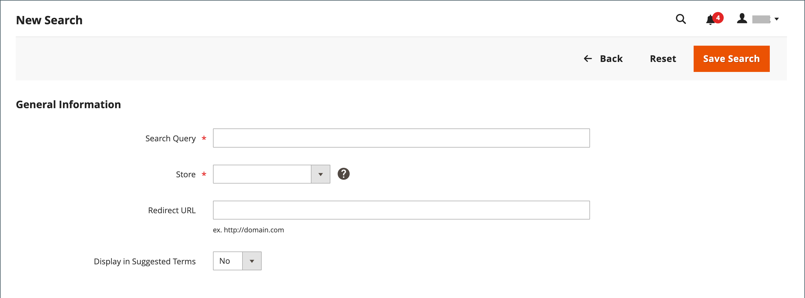

# 검색어 관리

다음 [랜딩 페이지](../content-design/pages.md) 검색어는 콘텐츠 페이지, 카테고리 페이지, 제품 세부 사항 페이지 또는 다른 사이트의 페이지일 수 있습니다.

검색어를 사용하여 일반적인 철자 오류를 캡처하고 적절한 페이지로 리디렉션합니다. 예를 들어, 당신이 연철 뜰 가구를 판매한다면, 당신은 많은 사람들이 용어의 철자를 다음과 같이 잘못 썼다는 것을 알고 있습니다. _막대 다리미_&#x200B;또는 짝수 _썩은 철분_. 맞춤법이 틀린 단어를 검색어로 각각 입력하고 동의어로 만들 수 있습니다. _단철_. 단어의 철자가 틀리더라도 그 검색은 철판 가공을 위한 페이지로 향한다.

고객이 스토어에서 제품을 찾을 때 사용하는 검색어를 조사하여 고객이 무엇을 찾는지 알아볼 수도 있습니다. 카탈로그에 없는 제품을 찾는 사람이 충분한 경우 영업 기회를 나타낼 수 있습니다. 그 동안, 빈 손으로 남기지 않고 카탈로그에 있는 다른 제품으로 리디렉션할 수 있습니다.

## 검색어 추가

스토어에서 사람들이 검색하는 데 사용하는 새로운 단어를 학습할 때 검색어 목록에 추가하여 카탈로그에서 가장 일치하는 제품으로 안내할 수 있습니다.

{width="700" zoomable="yes"}

| 열 | 설명 |
|--- |--- |
| [!UICONTROL Search Query] | 검색을 수행하는 데 사용되는 쿼리입니다. |
| [!UICONTROL Store] | 검색 쿼리가 적용된 저장소입니다. |
| [!UICONTROL Results] | 쿼리에서 찾은 결과 수. |
| [!UICONTROL Uses] | 사용 횟수. |
| [!UICONTROL Redirect URL] | 검색을 수행한 후 사용자가 리디렉션된 대상 페이지의 URL입니다. |
| [!UICONTROL Suggested Terms] | 쿼리 결과에 추천 용어가 표시되는지 여부를 결정합니다. |
| [!UICONTROL Actions] | 제품을 편집 모드로 엽니다. |

{style="table-layout:auto"}

>[!NOTE]
>
>쇼핑객이 이 검색 쿼리를 사용하여 검색을 실행할 때마다 결과 수가 업데이트됩니다. 제품을 변경하거나 제거하는 경우에는 업데이트되지 않습니다.

### 검색어 추가

1. 다음에서 _관리자_ 사이드바, 이동 **[!UICONTROL Marketing]** > _[!UICONTROL SEO & Search]_>**[!UICONTROL Search Terms]**.

1. 클릭 **[!UICONTROL Add New Search Term]**.

   {width="600" zoomable="yes"}

1. 아래 _[!UICONTROL General Information]_다음에서&#x200B;**[!UICONTROL Search Query]**상자에 새 검색어로 추가할 단어나 구를 입력합니다.

1. 스토어를 여러 언어로 사용할 수 있는 경우 해당하는 언어를 선택하십시오. **[!UICONTROL Store]** 보기.

1. 검색 결과를 스토어의 다른 페이지 또는 다른 웹 사이트로 리디렉션하려면 **[!UICONTROL Redirect URL]** 필드.

1. 검색에서 결과가 반환되지 않을 때마다 이 용어를 제안으로 사용하려면 을 설정합니다. **[!UICONTROL Display in Suggested Terms]** 끝 `Yes`.

1. 완료되면 다음을 클릭하십시오. **[!UICONTROL Save Search]**.

## 검색어 편집

1. 다음에서 _[!UICONTROL Search Terms]_그리드에서 레코드의 행을 클릭하여 검색어를 편집 모드로 엽니다.

1. 필요한 사항을 변경합니다.

1. 완료되면 다음을 클릭하십시오. **[!UICONTROL Save Search]**.

## 검색어 삭제

검색어를 삭제하는 방법에는 그리드 및 편집 페이지에서 두 가지가 있습니다.

**방법 1:** 다음에서 _[!UICONTROL Search Terms]_격자

1. 목록에서 삭제할 용어의 확인란을 선택합니다.

1. 목록의 왼쪽 상단 모서리에서 을(를) 설정합니다. **[!UICONTROL Actions]** 끝 `Delete`.

1. 완료되면 다음을 클릭하십시오. **[!UICONTROL Submit]**.

**방법 2:** 다음에서 _[!UICONTROL Edit a Search Term]_페이지

1. 다음에서 _관리자_ 사이드바, 이동 **[!UICONTROL Marketing]** > _[!UICONTROL SEO & Search]_>**[!UICONTROL Search Terms]**.

1. 삭제할 검색어를 찾아 편집 모드로 엽니다.

1. 클릭 **[!UICONTROL Delete Search]**.

1. 작업을 확인하려면 다음을 클릭합니다. **[!UICONTROL OK]**.

## 인기 검색어

다음 _검색어_ 스토어 바닥글의 링크에는 스토어 방문자가 사용한 검색어가 인기도 순으로 표시됩니다. 검색어가 다음에 표시됨 _태그 클라우드_ 형식 - 텍스트 크기가 용어의 인기를 나타냅니다.

기본적으로 인기 검색어는 검색 엔진 최적화 도구로 활성화되지만 카탈로그 검색 프로세스에 직접 연결할 수 없습니다. 검색어 페이지는 검색 엔진으로 인덱싱되므로 페이지에 있는 모든 검색어가 검색어 순위 및 스토어 가시성을 개선하는 데 도움이 될 수 있습니다. 인기 검색어 페이지의 URL은 다음과 같습니다. `mystore.com/search/term/popular/`

{width="600" zoomable="yes"}

**_인기 검색어를 구성하려면 다음을 수행합니다._**

1. 다음에서 _관리자_ 사이드바, 이동 **[!UICONTROL Stores]** > _[!UICONTROL Settings]_>**[!UICONTROL Configuration]**.

1. 왼쪽 패널에서 를 확장합니다. **[!UICONTROL Catalog]** 및 선택 **[!UICONTROL Catalog]** 밑에.

1. 확장  다음 **[!UICONTROL Search Engine Optimization]** 섹션.

   {width="600" zoomable="yes"}

   이러한 옵션에 대한 자세한 목록은 다음을 참조하십시오. [검색 엔진 최적화](../configuration-reference/catalog/catalog.md#search-engine-optimization) 다음에서 _구성 참조_.

1. 설정 **[!UICONTROL Popular Search Terms]** 필요한 경우.

   필요한 경우 **[!UICONTROL Use system value]** 확인란을 선택하여 이 설정을 변경할 수 있습니다.

1. 완료되면 다음을 클릭하십시오. **[!UICONTROL Save Config]**.

>[!NOTE]
>
>인기 캐싱을 추가로 구성할 수 있습니다 [카탈로그 검색](search-configuration.md).

## 동의어 검색

의 효과를 개선하는 한 가지 방법 [카탈로그 검색](search-configuration.md) 사람들이 동일한 항목을 설명하는 데 사용할 수 있는 다른 용어를 포함하는 것입니다. 누군가가 물건을 찾는다고 해서 손절매를 원하는 것은 아니다 _소파_, 제품이 (으)로 나열됨 _소파_. 다음을 입력하여 더 광범위한 검색어를 캡처할 수 있습니다. _소파_, _대븐포트_, 및 _러브비트_ 의 동의어로 _소파_&#x200B;를 누르고 동일한 랜딩 페이지로 안내합니다.

Adobe Commerce은 두 가지 다른 동의어 관리 솔루션을 지원합니다.

- 라이브 검색 [동의어](https://experienceleague.adobe.com/docs/commerce-merchant-services/live-search/live-search-admin/synonyms/synonyms.html) 이 기능은 라이브 검색이 설치된 Adobe Commerce 설치에 사용할 수 있습니다.
- 이 페이지에 설명된 표준 검색 동의어 기능 은 모든 Adobe Commerce 설치에 대해 즉시 사용할 수 있습니다.

>[!NOTE]
>
>표준 동의어 검색 기능은 기본적으로 를 지원합니다 `name` 및 `sku` 제품 속성 **_전용_**.

{width="700" zoomable="yes"}

### 동의어 그룹 만들기

1. 다음에서 _관리자_ 사이드바, 이동 **[!UICONTROL Marketing]** > _[!UICONTROL SEO & Search]_>**[!UICONTROL Search Synonyms]**.

   다음 _[!UICONTROL Search Synonyms]_격자가 나타납니다. 검색 동의어를 처음 사용하는 경우 그리드가 비어 있습니다.

   {width="700" zoomable="yes"}

1. 클릭 **[!UICONTROL New Synonym Group]**.

   {width="700" zoomable="yes"}

1. 설정 **[!UICONTROL Scope]** 동의어가 적용되는 스토어 뷰로 이동합니다.

1. 그룹에 각 동의어를 쉼표로 구분하여 입력합니다. 사람들이 검색 기준으로 사용할 수 있는 단어를 선택합니다. For example:

   - `sweatshirt, sweat shirt, hoodie, fleece`
   - `cell phone, mobile phone, smart phone`
   - `couch, sofa, davenport`
   - `wrought iron, rot iron, rod iron`

1. 이러한 동의어를 범위가 같은 다른 동의어와 그룹으로 병합하려면 **[!UICONTROL Merge existing synonyms]** 확인란.

1. 완료되면 다음을 클릭하십시오. **[!UICONTROL Save Synonym Group]**.

### 동의어 그룹 편집

1. 다음에서 _[!UICONTROL Search Synonyms]_그리드에서 레코드의 행을 클릭하여 편집 모드에서 동의어 그룹을 엽니다.

1. 필요한 사항을 변경합니다.

1. 완료되면 다음을 클릭하십시오. **[!UICONTROL Save Synonym Group]**.

### 동의어 그룹 삭제

동의어 그룹을 삭제하는 방법에는 그리드 및 편집 페이지에서 두 가지가 있습니다.

**방법 1:** 동의어 검색 그리드에서

1. 다음에서 _[!UICONTROL Search Synonyms]_그리드에서 삭제할 그룹의 확인란을 선택합니다.

1. 목록의 왼쪽 상단 모서리에서 을(를) 설정합니다. **[!UICONTROL Actions]** 끝 `Delete`.

1. 완료되면 다음을 클릭하십시오. **[!UICONTROL Submit]**.

**방법 2:** 동의어 그룹 편집 페이지

1. 동의어 검색 그리드에서 레코드 행을 눌러 편집 모드에서 동의어 그룹을 엽니다.

1. 클릭 **[!UICONTROL Delete Synonym Group]**.

1. 메시지가 표시되면 그룹 제거를 확인합니다.

## 검색어 보고서

검색어 보고서는 각 용어에 대한 결과 수와 해당 용어가 사용된 횟수(히트)를 보여줍니다. 보고서 데이터는 용어, 저장, 결과 및 히트로 필터링하고 추가 분석을 위해 내보낼 수 있습니다.

### 보고서 보기

1. 다음에서 _관리자_ 사이드바, 이동 **[!UICONTROL Reports]** > _[!UICONTROL Marketing]_>**[!UICONTROL Search Terms]**.

1. 컨트롤을 사용하여 필요에 따라 보고서를 필터링합니다.

   {width="700" zoomable="yes"}

## 보고서 내보내기

1. 대상 **[!UICONTROL Export to]**&#x200B;내보내기 형식을 선택합니다.

   - `CSV` - 일반 텍스트 데이터를 포함하는 쉼표로 구분된 값 파일
   - `Excel XML` - XML 기반의 스프레드시트 데이터 형식

1. 클릭 **[!UICONTROL Export]**.

   생성된 파일은 다운로드를 위해 지정된 폴더에 자동으로 저장됩니다.

### 보고서 열

| 열 | 설명 |
|--- |--- |
| [!UICONTROL ID] | 검색어 항목에 대해 생성된 고유 숫자 ID |
| [!UICONTROL Search Query] | 검색을 수행하는 데 사용되는 쿼리 |
| [!UICONTROL Store] | 검색 쿼리가 적용된 스토어 |
| [!UICONTROL Results] | 결과 수 |
| [!UICONTROL Hits] | 사용 횟수 |

{style="table-layout:auto"}
