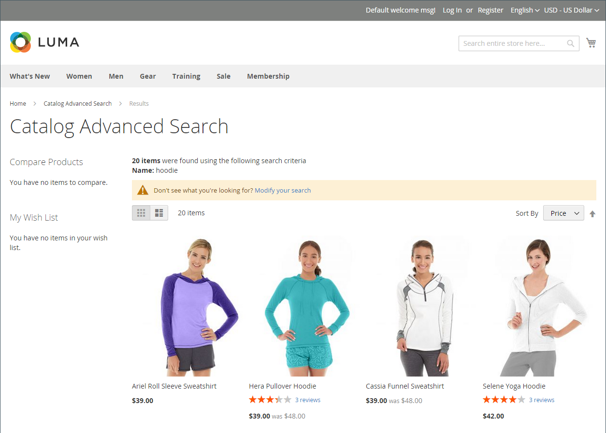

# 카탈로그 검색 개요

>[!TIP]
>
>[[!DNL Live Search]](https://experienceleague.adobe.com/docs/commerce/live-search/overview.html?lang=ko)은(는) 빠르고, 관련성이 높고, 직관적인 검색 환경을 제공하며, Adobe Commerce에서 추가 비용 없이 사용할 수 있습니다. 이 섹션에서는 [!DNL Live Search]과(와) 다를 수 있는 표준 검색 기능에 대해 설명합니다.

탐색만 의존한 고객보다 검색을 이용하는 사람이 구매를 할 가능성이 높다는 연구결과가 나왔다. 실제로 일부 연구에 따르면, 검색을 이용하는 사람들은 구매에 성공할 가능성이 거의 두 배이다.

다음 섹션에서는 기본 카탈로그 검색 기능에 대해 설명합니다. 기본 카탈로그 검색 기능을 구성하고 사용자 지정하는 방법에 대한 자세한 내용은 다음을 참조하십시오.

- [카탈로그 검색 구성](search-configuration.md)
- [검색 결과](search-results.md)
- [검색어 관리](search-terms.md)

>[!NOTE]
>
>Commerce의 기본 검색 기능은 정확한 일치 검색 결과를 제공합니다. Adobe Commerce에서 설치 및 활성화에 사용할 수 있는 선택적 모듈인 [!DNL Live Search]은(는) 다르게 구현되며 결과는 정확한 검색 문자열로 제한되지 않습니다. 예를 들어, _Omega_&#x200B;에 대해 숫자로 레이블이 지정된 제품이 10개인 경우: `Omega 1`을(를) 검색하면 기본 검색 기능과 함께 _Omega 1_&#x200B;이(가) 한 번 일치합니다. 그러나 라이브 검색에서 제공하는 동일한 검색 문자열은 여러 항목 _Omega 1_&#x200B;과(와) _Omega 10_&#x200B;을(를) 일치시킵니다.

## 빠른 검색

>[!NOTE]
>
>[[!DNL Live Search]](https://experienceleague.adobe.com/ko/docs/commerce/live-search/overview)이(가) 설치되고 [[!DNL Storefront Popover]](https://experienceleague.adobe.com/ko/docs/commerce/live-search/live-search-storefront/storefront-popover) 위젯이 활성화되면 검색 상자가 &quot;입력한 대로 검색&quot;을 반환하여 팝업이 표시됩니다.

스토어 헤더의 검색 상자는 방문자가 카탈로그에서 제품을 찾을 수 있도록 도와줍니다. 검색 텍스트는 전체 또는 부분 제품 이름 또는 제품을 설명하는 다른 단어 또는 구문일 수 있습니다. 사람들이 제품을 찾는 데 사용하는 검색어는 관리자로부터 관리할 수 있습니다.

1. **[!UICONTROL Search]**&#x200B;의 경우 고객이 찾고자 하는 내용의 처음 몇 글자를 입력합니다.

   카탈로그에 있는 모든 일치 항목이 검색 결과 수와 함께 아래에 표시됩니다.

1. 고객이 Enter 키를 누르거나 일치하는 제품 목록에서 결과를 클릭합니다.

   {width="700" zoomable="yes"}

## 고급 검색

>[!NOTE]
>
>여기에 설명된 고급 양식 검색 기능은 [[!DNL Live Search]](https://experienceleague.adobe.com/docs/commerce/live-search/overview.html?lang=ko)에 적용되지 않습니다.

고급 검색을 사용하면 쇼핑객이 양식에 입력한 값을 기반으로 카탈로그를 검색할 수 있습니다. 양식에는 여러 필드가 있으므로 단일 검색에 여러 매개 변수가 포함될 수 있습니다. 결과는 기준에 일치하는 카탈로그의 모든 제품 목록입니다. 고급 검색 링크가 저장소의 바닥글에 있습니다.

{width="700" zoomable="yes"}

양식의 각 필드는 제품 카탈로그의 속성에 해당합니다. 필드를 추가하려면 특성의 프론트엔드 속성을 `Include in Advanced Search`(으)로 설정하십시오. 너무 많으면 검색 속도가 느려지기 때문에 고객이 제품을 찾는 데 사용할 가능성이 가장 높은 필드만 포함하는 것이 좋습니다.

1. 스토어의 바닥글에서 고객이 **[!UICONTROL Advanced Search]**&#x200B;을(를) 클릭합니다.

1. _고급 검색_ 양식에서 은 필요한 수만큼 필드에 전체 또는 일부 값을 추가합니다.

1. 결과를 표시하려면 **[!UICONTROL Search]**&#x200B;을(를) 클릭합니다.

   {width="700" zoomable="yes"}

1. 고객이 검색 결과에서 찾고 있는 항목을 찾지 못할 경우 **[!UICONTROL Modify your search]**&#x200B;을(를) 클릭하고 다른 기준 조합을 시도합니다.
