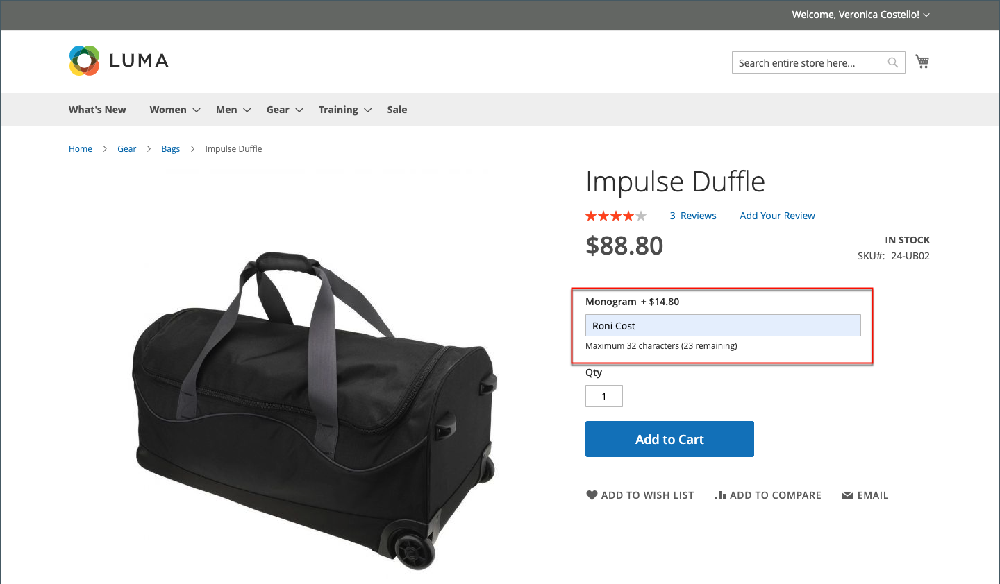
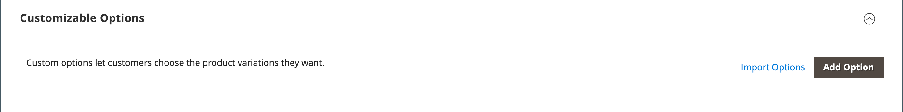

# 제품 설정 - [!UICONTROL Customizable Options]

사용자 정의 가능한 옵션을 제품에 추가하면 텍스트, 선택 및 날짜 입력 유형을 포함한 다양한 옵션을 손쉽게 제공할 수 있습니다. 사용자 정의 가능한 옵션은 재고 요구 사항이 간단한 경우 좋은 솔루션입니다. 그러나 단일 SKU의 변형을 기반으로 하므로 스톡을 관리하거나 가격 규칙 조건의 기반으로 사용할 수 없습니다. 옵션이 동일한 제품이 여러 개 있는 경우 한 제품을 설정하고 옵션을 다른 제품으로 가져올 수 있습니다.

고객이 사용자 정의 가능한 옵션이 있는 제품을 구매하면 선택한 각 옵션에 대한 설명이 제품 설명 아래에 나타나고 관련 마크업(또는 Markdown)이 제품 가격에 자동으로 적용됩니다.

{width="700" zoomable="yes"}

장바구니 가격 규칙이 구매에 의해 트리거되는 경우, 초기 계산은 먼저 제품 가격에 적용되고 두 번째는 적용 가능한 사용자 정의 옵션에 대한 조정과 함께 라인 항목 가격에 적용됩니다. 다음 예에서는 고객이 74.00달러에 더플 백을 구입하고 모노그램에 사용자 정의 가능한 옵션을 구입합니다. 기본 제품 가격에는 $14.80의 마크업이 적용되며 조정된 가격은 $88.80로 표시됩니다. 이 경우, 더플 백의 구매는 제품 SKU를 기반으로 장바구니 가격 규칙을 트리거하고 구매에 할인을 적용하고 무료 배송을 적용합니다. 장바구니 가격 규칙은 사용자 지정 가능한 옵션에 의해 트리거되지 않지만, 사용자 지정 가능한 옵션에 대한 마크업을 포함하는 장바구니 콘텐츠에 할인을 적용합니다.

{width="700" zoomable="yes"}

>[!NOTE]
>
>카탈로그 가격 규칙 할인은 고정 가격 사용자 정의 가능 옵션에 적용되지 않습니다.

## 사용자 지정 가능한 옵션 만들기

1. 제품을 편집 모드로 엽니다.

1. 아래로 스크롤하여 _[!UICONTROL Customizable Options]_섹션에서 를 확장합니다.

1. **[!UICONTROL Add Option]**&#x200B;을(를) 클릭합니다.

   {width="600" zoomable="yes"}

1. 새 옵션 설정을 완료합니다.

   - **[!UICONTROL Option Title]**&#x200B;에 옵션 이름을 입력하십시오.

   - 데이터 항목 형식에 대해 **[!UICONTROL Option Type]**&#x200B;을(를) 설정합니다.

   - 제품을 구매하는 데 옵션이 필요하지 않으면 **[!UICONTROL Required]** 확인란의 선택을 취소하십시오.

1. 데이터 입력 유형에 따라 필드를 작성합니다.

   - **[!UICONTROL Title]**&#x200B;의 경우 이 옵션의 이름을 입력하십시오.

   - (선택 사항) **[!UICONTROL Price]**&#x200B;의 경우 이 옵션에 적용되는 기본 제품 가격에서 마크업이나 Markdown을 입력합니다.

   - **[!UICONTROL Price Type]**&#x200B;을(를) 다음 중 하나로 설정합니다.

      - `Fixed` - 변동 가격이 기본 제품 가격과 고정 금액(예: $1)만큼 다릅니다.
      - `Percentage` - 변형 가격이 기본 제품 가격과 백분율(예: 10%)로 다릅니다.

   - (선택 사항) 옵션에 대해 **[!UICONTROL SKU]**&#x200B;을(를) 입력합니다. 옵션 SKU는 제품 SKU에 추가된 접미사입니다.

   - _[!UICONTROL Option Type]_이(가) `File`인 경우 파일에 대한 매개 변수를 설정하십시오.**[!UICONTROL Compatible File Extensions]**의 경우 올바른 확장을 쉼표로 구분된 값(예: `png, jpg, gif`)으로 입력하십시오.**[!UICONTROL Maximum Image Size]**의 경우 최대 이미지 크기를 픽셀 단위로 입력하십시오. 텍스트 항목인 경우&#x200B;**[!UICONTROL Maximum Characters]**의 최대값을 입력하십시오.

   {width="600" zoomable="yes"}

1. (선택 사항) 사용자 지정 가능한 다른 옵션을 추가하려면 **[!UICONTROL Add Option]**&#x200B;을(를) 클릭합니다.

   - 이전과 같이 설정을 완료합니다.

   - 옵션 순서를 변경하려면 _[!UICONTROL Order]_ 아이콘을 클릭하고 옵션을 목록의 새 위치로 끕니다.

   추가할 각 옵션에 대해 이 단계를 반복합니다.

1. 완료되면 **[!UICONTROL Save]**&#x200B;을(를) 클릭합니다.

## 사용자 정의 가능한 옵션 가져오기

1. _사용자 지정 옵션_ 섹션에서 **[!UICONTROL Import Options]**&#x200B;을(를) 클릭합니다.

1. 사용자 정의 가능한 옵션이 있는 모든 제품이 그리드에 나타납니다.

1. 목록에서 가져올 옵션이 있는 제품의 확인란을 선택합니다.

1. **[!UICONTROL Import]**&#x200B;을(를) 클릭합니다.

1. 완료되면 계속해서 사용자 지정 옵션을 추가하거나 **[!UICONTROL Save and Close]**&#x200B;을(를) 클릭할 수 있습니다.

## 입력 유형

| 유형 | 설명 |
|---------------------|---------------|
| [!UICONTROL Text] | 고객이 필요한 정보를 입력할 수 있는 입력 라인 또는 텍스트 상자. 옵션: **[!UICONTROL Field]**- 텍스트를 위한 한 줄 입력 필드입니다. **[!UICONTROL Area]** - 여러 줄 입력 필드입니다. 이 유형은 HTML과 같은 고급 서식을 지원하지 않습니다. 최대 문자 를 사용하여 입력할 수 있는 텍스트 길이를 제한하고 관리자에서 입력한 텍스트가 올바르게 표시되는지 확인합니다. |
| [!UICONTROL File] | 고객이 파일을 업로드할 수 있습니다. |
| [!UICONTROL Select] | 고객이 사용한 입력 유형에 따라 단일 옵션 또는 여러 옵션을 선택할 수 있습니다. 옵션: **[!UICONTROL Drop-down]**- 하나의 선택 항목만 허용하는 옵션의 드롭다운 목록입니다. **[!UICONTROL Radio Buttons]** - 하나의 선택 항목만 허용하는 옵션 집합입니다. **[!UICONTROL Checkbox]**- 확인란은 예/아니요 옵션의 변형입니다. 제품에 확인란이 두 개 이상 있는 경우 여러 항목을 선택할 수 있습니다. **[!UICONTROL Multiple Select]** - 여러 항목을 선택할 수 있는 옵션의 드롭다운 목록 상자입니다. 여러 옵션을 선택하려면 Ctrl 키(PC) 또는 Command 키(Mac)를 누른 채 각 옵션을 클릭합니다. |
| [!UICONTROL Date] | 고객이 날짜 또는 시간을 입력하거나 달력에서 값을 선택할 수 있도록 허용합니다. 옵션:  **[!UICONTROL Date]**- 날짜 값에 대한 입력 필드입니다. 날짜를 필드에 직접 입력하거나 목록 또는 달력에서 선택할 수 있습니다. 입력 방법 및 형식은 [날짜 및 시간 옵션](attributes-input-types.md#date-and-time-options) 구성에 따라 결정됩니다. **[!UICONTROL Date & Time]** - 날짜 및 시간 값에 대한 입력 필드. **[!UICONTROL Time]**- 시간 값에 대한 입력 필드. |

{style="table-layout:auto"}
