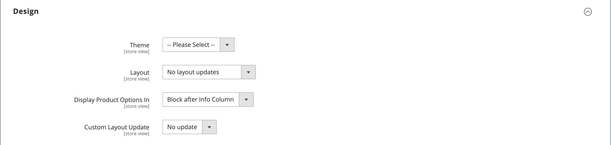

# 제품 설정 - [!UICONTROL Design]

_[!UICONTROL Design]_설정을 사용하면 제품 페이지에 다른 테마를 적용하고, 열 레이아웃을 변경하고, 제품 옵션이 표시되는 위치를 결정하고, 사용자 지정 XML 코드를 입력할 수 있습니다.

{width="600" zoomable="yes"}

>[!NOTE]
>
>각 범주에 대해 디자인 설정이 다른 여러 범주에 동일한 제품이 할당되면 [검색 엔진 최적화 구성 옵션](../configuration-reference/catalog/catalog.md#search-engine-optimization)에서 **[!UICONTROL Use Categories Path for Product URLs]** = `Yes`을(를) 설정하는 것이 좋습니다. 이 설정에 액세스하려면 **[!UICONTROL Stores]** > _[!UICONTROL Settings]_>**[!UICONTROL Configuration]**(으)로 이동하여&#x200B;**[!UICONTROL Catalog]**을(를) 확장하고 왼쪽 패널의 아래에 있는&#x200B;**[!UICONTROL Catalog]**을(를) 선택한 다음 페이지의&#x200B;**[!UICONTROL Search Engine Optimization]**섹션을 확장합니다.

| 필드 | [범위](../getting-started/websites-stores-views.md#scope-settings) | 설명 |
|---|---|----|
| [!UICONTROL Theme] | 스토어 뷰 | (Adobe Commerce만 해당) 제품에 다른 테마를 적용할 수 있는 기능을 제공합니다. 옵션: (사용 가능한 모든 테마) |
| [!UICONTROL Layout] | 스토어 뷰 | 제품 페이지에 다른 [레이아웃](../content-design/page-layout.md)을 적용할 수 있는 기능을 제공합니다. 옵션:  **[!UICONTROL No layout updates]**- 기본적으로 제품 페이지에서 레이아웃 업데이트를 사용할 수 없습니다. **[!UICONTROL Empty]** - 4열 페이지와 같은 고유한 레이아웃을 정의할 수 있습니다. (XML에 대한 이해가 필요합니다.)  **[!UICONTROL 1 column]**- 제품 페이지에 1열 레이아웃을 적용합니다. **[!UICONTROL 2 columns with left bar]** - 왼쪽 사이드바가 있는 2열 레이아웃을 제품 페이지에 적용합니다.  **[!UICONTROL 2 columns with right bar]**- 오른쪽 사이드바가 있는 2열 레이아웃을 제품 페이지에 적용합니다. **[!UICONTROL 3 columns]** - 제품 페이지에 3열 레이아웃을 적용합니다.  **[!UICONTROL Page -- Full Width]**- ([[!DNL Page Builder]](../page-builder/introduction.md) 필요) CMS 페이지의 전체 너비 레이아웃을 제품 페이지에 적용합니다. **[!UICONTROL Category -- Full Width]** - ([!DNL Page Builder] 필요) 범주 페이지의 전체 너비 레이아웃을 제품 페이지에 적용합니다.  **[!UICONTROL Product -- Full Width]**- ([!UICONTROL Page Builder] 필요) 제품 페이지의 전체 너비 레이아웃을 제품 페이지에 적용합니다. |
| [!UICONTROL Display Product Options In] | 스토어 뷰 | 제품 페이지에서 제품 옵션이 표시되는 위치를 결정합니다. 옵션: `Product Info Column` / `Block after Info Column` |
| [!UICONTROL Custom Layout Update] | 스토어 뷰 | 제품 페이지에서 사용자 지정 레이아웃을 업데이트하는 옵션에 액세스하는 데 사용됩니다. |

{style="table-layout:auto"}
