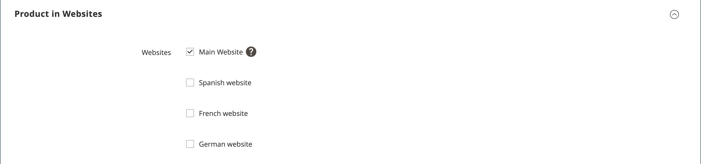

# 제품 설정 - [!UICONTROL Product in Websites]

_[!UICONTROL Product in Websites]_섹션은 [스토어 계층 구조](../stores-purchase/stores.md)에 따라 제품을 사용할 수 있는 각 웹 사이트를 식별합니다.

{width="550"}

**_제품을 다른 웹 사이트로 복사하려면:_**

1. 제품을 편집 모드로 엽니다.

1. 아래로 스크롤하여 _[!UICONTROL Product in Websites]_섹션에서 를 확장합니다.

   웹 사이트의 {width="600" zoomable="yes"}

1. 복사한 제품을 배치할 웹 사이트의 확인란을 선택합니다.

   단일 웹 사이트 설치의 경우 기본적으로 웹 사이트 확인란이 선택됩니다.

1. 기존 제품의 복사본을 만들 **[!UICONTROL Store View]**&#x200B;을(를) 선택하십시오.

1. **[!UICONTROL Save]**&#x200B;을(를) 클릭하고 다음을 수행합니다.

   - 제품 레코드로 돌아가면 **[!UICONTROL Store View]** 선택기를 제품이 복사된 스토어 보기로 설정합니다. 범위 전환을 확인하는 메시지가 표시되면 **[!UICONTROL OK]**&#x200B;을(를) 클릭합니다.

   - 이 스토어 보기에 대한 제품의 **[!UICONTROL Price]**&#x200B;을(를) 입력하십시오.

   기본 통화의 범위가 `website`(으)로 설정되어 있으므로 각 웹 사이트에서 다른 가격으로 제품을 판매할 수 있습니다.

1. 완료되면 **[!UICONTROL Save]**&#x200B;을(를) 클릭합니다.
