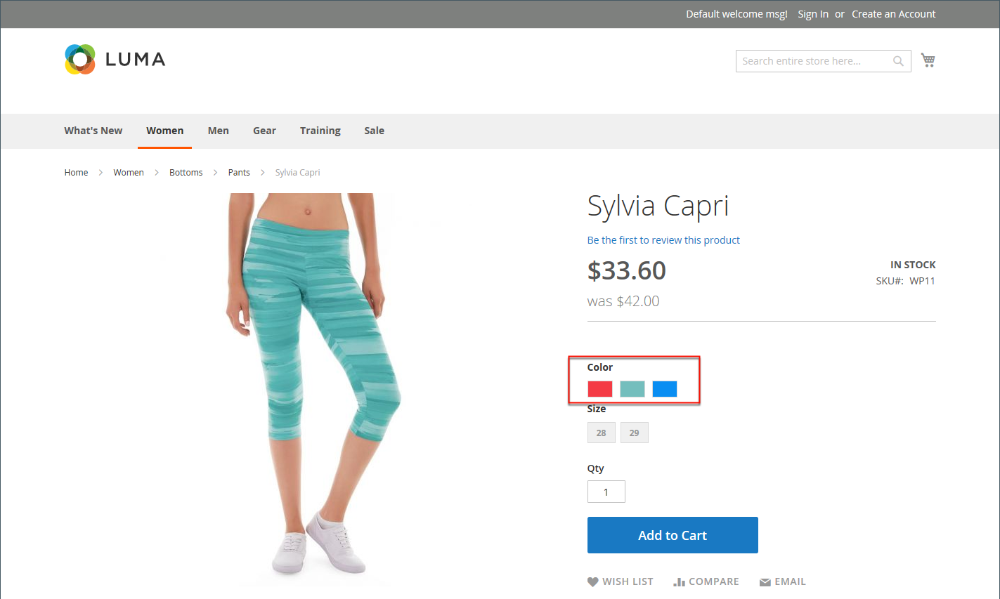
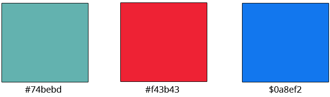
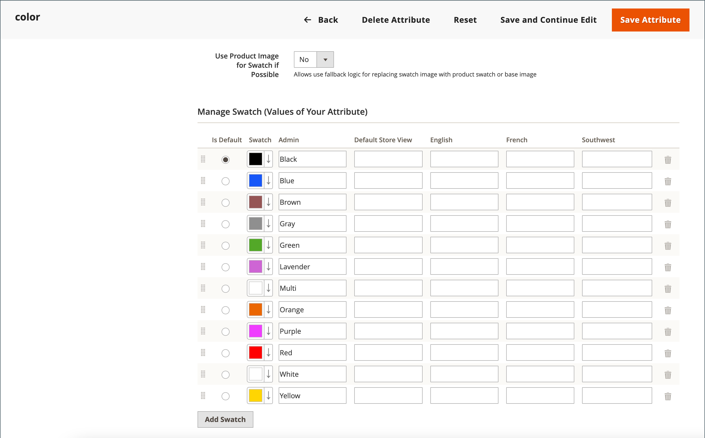
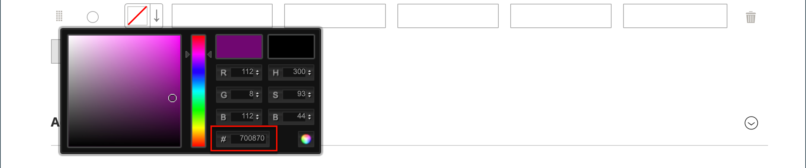

# 제품 견본

고객은 색상 선택에 대한 높은 기대를 가지며 제품 설명이 사용 가능한 각 색상, 패턴 또는 질감을 정확하게 나타내는 것이 중요합니다. 예를 들어 다음 예제의 바지는 빨강, 녹색 및 파랑으로 사용할 수 없습니다. 오히려, 그들은 아마도 이 제품에서 고유한 빨강, 초록, 파랑의 특정한 음영에서만 이용 가능합니다.

{width="700" zoomable="yes"}

[구성 가능한 제품](product-create-configurable.md)의 경우 시각적 견본, 텍스트 견본 또는 입력 컨트롤로 색상을 표시할 수 있습니다. 견본은 제품 페이지, 제품 목록 및 [계층화된 탐색](navigation-layered.md)에서 사용할 수 있습니다. 제품 페이지에서 견본은 견본이 선택되면 동기화되어 해당 제품 이미지를 표시합니다. 고객이 견본을 선택하면 해당 값이 입력 필드에 나타나고 현재 선택 항목으로 견본의 윤곽이 표시됩니다.

>[!NOTE]
>
>관리자의 [!UICONTROL Attribute Edit] 페이지에서 _[!UICONTROL Update Product Preview Image]_옵션 값을 `No`(으)로 설정하여 견본을 선택할 때 해당 단순 제품 이미지를 표시하지 않도록 견본 특성을 구성할 수 있습니다.

## 텍스트 기반 견본

견본에 이미지를 사용할 수 없는 경우 속성 값이 텍스트로 표시됩니다. 텍스트 기반 색상 견본은 텍스트 레이블이 있는 버튼과 같으며, 이미지가 있는 색상 견본과 같은 방식으로 동작합니다. 텍스트 기반 견본을 사용하여 사용 가능한 크기를 표시하면 사용할 수 없는 모든 크기가 제외됩니다.

{width="700" zoomable="yes"}

## 레이어 탐색의 색상 견본

color 특성의 _[!UICONTROL Use in Layered Navigation]_속성이 `Yes`(으)로 설정된 경우 계층화된 탐색에서도 견본을 사용할 수 있습니다. 다음 예제에서는 레이어 탐색의 텍스트 기반 및 색상 이미지 견본을 모두 보여 줍니다.

{width="700" zoomable="yes"}

## 제품에 대한 색상 견본 만들기

견본을 `color` 특성의 구성 요소로 정의하거나 특정 제품에 대해 로컬로 설정하고 [제품 이미지](product-image.md#upload-an-image)(으)로 업로드할 수 있습니다.

이전 예에서 &quot;Sylvia Capri&quot; 바지는 `red`, `green` 및 `blue`의 특정 값으로 사용할 수 있습니다. 색상 견본은 제품 이미지에서 가져온 것이므로 각각이 색상을 실제로 표현한 것입니다. `color` 특성은 모든 제품 색상과 견본에 대한 정보를 관리하는 데 사용됩니다.

### 1단계: 견본 만들기

다음 방법 중 하나를 사용하여 제품에 대한 색상 견본을 생성합니다.

#### 방법 1: 색상 견본 추가

1. 제품의 실제 색상을 캡처하려면 사진 편집기에서 이미지를 열고 스포이드 도구를 사용하여 정확한 색상을 식별하고 동등한 16진수 값을 기록합니다.

   {width="400"}

1. _관리자_ 사이드바에서 **[!UICONTROL Stores]** > _[!UICONTROL Attributes]_>**[!UICONTROL Product]**(으)로 이동합니다.

1. 그리드에서 편집 모드로 _color_ 특성을 엽니다.

1. **[!UICONTROL Catalog Input Type for Store Owner]**&#x200B;이(가) `Visual Swatch`(으)로 설정되어 있는지 확인하십시오.

1. 제품 표시 페이지에서 견본을 선택할 때 해당하는 간단한 제품 이미지를 표시하지 않으려면 **[!UICONTROL Update Product Preview Image]**&#x200B;을(를) `No`(으)로 설정하십시오.

1. _[!UICONTROL Manage Swatch (Values of Your Attribute)]_에서&#x200B;**[!UICONTROL Add Swatch]**을(를) 클릭하고 다음을 수행합니다.

   {width="600" zoomable="yes"}

   - _견본_ 열에서 새 견본을 클릭하고 메뉴에서 **[!UICONTROL Choose a color]**&#x200B;을(를) 선택합니다.

     {width="500" zoomable="yes"}

   - 색상 선택기에서 **#** 필드에 커서를 놓고 현재 값을 삭제한 다음 새 색상의 6자리 16진수 값을 입력합니다.

     {width="500" zoomable="yes"}

   - 견본을 저장하려면 색상 선택기의 오른쪽 아래 모서리에 있는 _색상 휠_(  ) 아이콘을 클릭합니다.

   - _관리자_ 열에서 저장소 관리자에게 색을 설명하는 레이블을 입력합니다.

     해당하는 경우 지원되는 각 언어에 대한 색상 번역을 입력할 수도 있습니다. 다음 예제에서는 색상이 특정 제품에만 사용되므로 SKU가 _Admin_ 레이블에 참조용으로 포함됩니다. 레이블에 공백 또는 밑줄을 포함할 수 있지만 하이픈은 포함할 수 없습니다.

   - _기본값_ 열에서 기본 옵션으로 사용할 견본을 선택합니다.

   - 색상 견본의 순서를 변경하려면 _[!UICONTROL Order]_ 아이콘을 클릭하고 항목을 목록의 새 위치로 끕니다.

     {width="400"}

1. 완료되면 **[!UICONTROL Save Attribute]**&#x200B;을(를) 클릭하고 메시지가 표시되면 캐시를 새로 고칩니다.

1. 편집 모드에서 각 제품을 열고 **Color** 특성을 올바른 견본으로 업데이트하십시오.

   여러 제품을 동시에 업데이트하려면 아래 단계를 따르십시오.

#### 방법 2: 견본 이미지 업로드

1. 견본의 이미지를 캡처하려면 사진 편집기에서 제품 이미지를 열고 색상, 패턴 또는 질감을 나타내는 이미지의 사각형 영역을 저장합니다.

   필요한 경우 제품의 각 변형에 대해 이 작업을 반복할 수 있습니다.

   견본의 크기와 치수는 테마에 의해 결정됩니다. 일반적으로 이미지를 사각형으로 저장하면 패턴의 종횡비를 유지하는 데 도움이 됩니다.

   {width="400"}

1. _관리자_ 사이드바에서 **[!UICONTROL Stores]** > _[!UICONTROL Attributes]_>**[!UICONTROL Product]**(으)로 이동합니다.

1. 그리드에서 **[!UICONTROL color]** 특성을 편집 모드로 엽니다.

1. **[!UICONTROL Catalog Input Type for Store Owner]**&#x200B;이(가) `Visual Swatch`(으)로 설정되어 있는지 확인하십시오.

1. 제품 표시 페이지에서 견본을 선택할 때 해당하는 간단한 제품 이미지를 표시하지 않으려면 **[!UICONTROL Update Product Preview Image]**&#x200B;을(를) `No`(으)로 설정하십시오.

1. _[!UICONTROL Manage Swatch]_(특성 값)에서&#x200B;**[!UICONTROL Add Swatch]**을(를) 클릭하고 다음을 수행합니다.

   - _[!UICONTROL Swatch]_열에서 새 견본을 클릭하여 메뉴를 표시하고&#x200B;**[!UICONTROL Upload a file]**을(를) 선택합니다.

   - 준비한 견본 파일로 이동하여 업로드할 파일을 선택합니다.

   - 각 견본 이미지에 대해 이 단계를 반복합니다.

   - 관리자 및 상점 첫 화면의 레이블을 입력합니다.

     이 예에서 SKU는 특정 제품에만 사용되므로 참조를 위해 관리 레이블에 포함됩니다. 레이블에 공백 또는 밑줄을 포함할 수 있지만 하이픈은 포함할 수 없습니다.

     {width="500" zoomable="yes"}

1. 완료되면 **[!UICONTROL Save Attribute]**&#x200B;을(를) 클릭하고 메시지가 표시되면 캐시를 새로 고칩니다.

1. 편집 모드에서 각 제품을 열고 **[!UICONTROL Color]** 특성을 올바른 견본으로 업데이트하십시오.

   여러 제품을 동시에 업데이트하려면 아래 단계를 따르십시오.

### 2단계: 제품 업데이트

1. _관리자_ 사이드바에서 **[!UICONTROL Catalog]** > **[!UICONTROL Products]**(으)로 이동합니다.

1. **[!UICONTROL Filter]**&#x200B;을(를) 사용하여 이름 또는 SKU별로 목록을 표시하고 해당 제품만 포함하십시오.

1. 그리드에서 견본이 적용되는 각 제품의 확인란을 선택합니다.

1. **[!UICONTROL Actions]**&#x200B;을(를) `Update Attributes`(으)로 설정합니다.

   이 예에서, 바지의 모든 파란색 구성이 선택된다.

   {width="600" zoomable="yes"}

1. **[!UICONTROL Color]** 특성까지 아래로 스크롤하고 **[!UICONTROL Change]** 확인란을 선택합니다.

   {width="400"}

1. 선택한 제품에 적용되는 견본을 선택하고 **[!UICONTROL Save]**&#x200B;을(를) 클릭합니다.

1. 메시지가 표시되면 캐시를 새로 고칩니다.

   {width="200"}

## 단순 제품에 색상 견본 추가

1. _관리자_ 사이드바에서 **[!UICONTROL Catalog]** > **[!UICONTROL Products]**(으)로 이동합니다.

1. 편집 모드에서 제품을 열고 제품 상태를 확인합니다(활성화되어야 함).

1. `Configurations` 탭 아래의 **[!UICONTROL Create Configurations]** 단추를 클릭합니다.

1. 팝업 창에서 Color 특성과 **[!UICONTROL Next]**&#x200B;을(를) 선택합니다.

1. 이 제품에 포함할 속성에서 색상 견본을 선택합니다.

1. 진행률 표시줄에서 **[!UICONTROL Next]**&#x200B;을(를) 클릭합니다.

1. [이미지, 가격 및 수량을 구성합니다](product-create-configurable.md#step-3-configure-the-images-price-and-quantity).

   이 단계에서는 각 구성의 이미지, 가격 및 수량을 설정합니다. 사용 가능한 옵션은 각각에 대해 동일하며 하나만 선택할 수 있습니다. 모든 SKU에 동일한 설정을 적용하거나, 각 SKU에 고유한 설정을 적용하거나, 설정을 지금 건너뛸 수 있습니다.

1. 이미지, 가격 및 수량 구성이 완료되면 오른쪽 상단의 **[!UICONTROL Next]**&#x200B;을(를) 클릭합니다.

   구성 섹션의 하단에 현재 제품 변형이 나타납니다. 구성에 만족하면 **[!UICONTROL Generate Products]**&#x200B;을(를) 클릭합니다.
