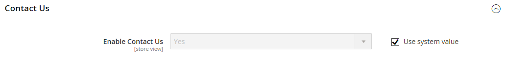

# [!UICONTROL General] > [!UICONTROL Contacts]

{{config}}

## [!UICONTROL Contact Us]

<!-- zoom -->

<!-- [Contact Us](https://experienceleague.adobe.com/en/docs/commerce-admin/start/setup/store-details#contact-us-form) -->

| 필드 | [범위](../../getting-started/websites-stores-views.md#scope-settings) | 설명 |
|--- |--- |--- |
| [!UICONTROL Enable Contact Us] | 스토어 뷰 | [_문의하기_](../../getting-started/store-details.md#contact-us-form) 페이지를 활성화하고 바닥글에 링크를 넣습니다. |

{style="table-layout:auto"}

## [!UICONTROL Email Options]

<!-- zoom -->

<!-- [Email Options](https://experienceleague.adobe.com/en/docs/commerce-admin/start/setup/store-details#contact-us-form) -->

| 필드 | [범위](../../getting-started/websites-stores-views.md#scope-settings) | 설명 |
|--- |--- |--- |
| [!UICONTROL Send Emails To] | 스토어 뷰 | _문의하기_ 페이지에서 모든 응답을 받는 전자 메일 주소를 식별합니다. |
| [!UICONTROL Email Sender] | 스토어 뷰 | _문의하기_ 페이지에서 전자 메일 질문에 대한 모든 응답에 사용되는 스토어 연락처를 식별합니다. 기본 보낸 사람: `Custom Email 2` |
| [!UICONTROL Email Template] | 스토어 뷰 | _문의하기_ 페이지에서 전자 메일 질문에 대한 모든 응답의 기반으로 사용할 템플릿을 지정합니다. 기본 템플릿: `Contact Form` |

{style="table-layout:auto"}
