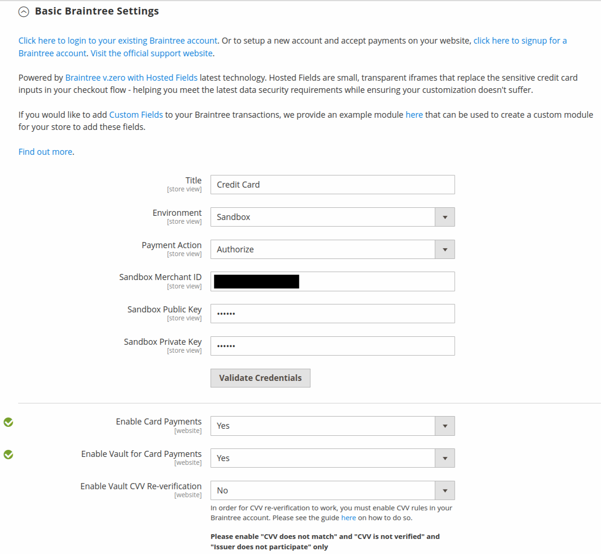

# [!UICONTROL Sales] > [!UICONTROL Payment Methods] > [!UICONTROL Braintree]

>[!IMPORTANT]
>
>**Commerce 2.4 마이그레이션:** 
>2.4.0 이전 버전의 Adobe Commerce 및 Magento Open Source의 경우, 가맹점은 [Commerce Marketplace](https://marketplace.magento.com/catalogsearch/result/?q=braintree)에서 공식 Braintree 결제 통합 확장을 설치하고 구성하여 핵심 통합을 대체하는 것이 좋습니다. 2.4.0부터 확장이 이제 코어 릴리스에 포함됩니다.
>  
>Commerce 2.4로 마이그레이션할 때 판매자는 Marketplace에 배포된 확장(`paypal/module-braintree` 또는 `gene/module-braintree`)을 제거하고 `Magento_Braintree` 대신 `PayPal_Braintree` 네임스페이스를 사용하도록 코드 사용자 지정을 업데이트해야 합니다. Commerce용 번들 확장과 Commerce Marketplace에 배포된 확장의 구성 설정이 유지됩니다. 해당 버전의 확장 기능으로 지불된 지불은 정상적으로 캡처, 무효화 또는 환불됩니다.
>  
>Commerce 2.4.0으로 업그레이드하고 이전 2.3.x 버전에서 권장 Commerce Marketplace 확장 기능을 사용하지 않는 경우 다중 주소 기능이 2.4.0 버전의 Braintree에서 작동하지 않습니다. 쇼핑객이 _여러 주소에 게재_&#x200B;을(를) 선택하면 Braintree 결제 방법이 나타나지 않습니다. 이전에 2.3.x에 대해 권장된 Commerce Marketplace 확장에 이 다중 주소 문제가 있습니다.

{{config}}

## [!UICONTROL Basic Braintree Settings]

<!-- zoom -->

| 필드 | [범위](../../getting-started/websites-stores-views.md#scope-settings) | 설명 |
|--- |--- |--- |
| [!UICONTROL Title] | 스토어 뷰 | 기본값: `Credit Card`(Braintree) |
| [!UICONTROL Environment] | 스토어 뷰 | 옵션: `Sandbox` / `Production` |
| [!UICONTROL Payment Action] | 스토어 뷰 | 결제가 처리될 때 Braintree이 취하는 조치를 결정합니다. 옵션:  **`Authorize`**- 고객의 신용 카드에 있는 자금은 승인되지만 계정에서 이체되지 않습니다. 주문이 스토어 관리자에서 생성됩니다. 나중에 판매를 캡처하고 송장을 생성할 수 있습니다. **`Intent Sale`**(이전 릴리스의 경우 이전 `Authorize and Capture`) - 고객의 신용 카드에 있는 자금은 Braintree에 의해 승인되고 캡처되며 매장 관리자에 주문과 송장이 생성됩니다. |
| [!UICONTROL Sandbox Merchant ID] | 스토어 뷰 | 전체 샌드박스 게이트웨이 계정에 대한 고유 식별자입니다. _공개 ID_ 또는 _프로덕션 ID_&#x200B;이라고도 하는 판매자 ID는 프로덕션 및 샌드박스 게이트웨이에 대해 다릅니다. 이 필드는 _[!UICONTROL Environment]_필드가 `Sandbox`(으)로 설정된 경우 나타납니다. |
| [!UICONTROL Sandbox Public Key] | 스토어 뷰 | 암호화된 데이터에 대한 액세스를 제한하는 사용자별 공용 식별자입니다. 샌드박스 Braintree 게이트웨이와 연결된 각 사용자에게는 고유한 샌드박스 공개 키가 있습니다. 이 필드는 _[!UICONTROL Environment]_필드가 `Sandbox`(으)로 설정된 경우 나타납니다. |
| [!UICONTROL Sandbox Private Key] | 스토어 뷰 | 암호화된 데이터에 대한 액세스를 제한하는 사용자별 개인 식별자입니다. 샌드박스 Braintree 게이트웨이와 연결된 각 사용자에게는 샌드박스에 대한 자체 개인 키가 있습니다. 이 필드는 _[!UICONTROL Environment]_필드가 `Sandbox`(으)로 설정된 경우 나타납니다. |
| [!UICONTROL Merchant ID] | 스토어 뷰 | 게이트웨이에 있을 수 있는 여러 판매자 계정을 포함하여 전체 게이트웨이 계정에 대한 고유 식별자입니다. _공개 ID_ 또는 _프로덕션 ID_&#x200B;이라고도 하는 판매자 ID는 프로덕션 및 샌드박스 게이트웨이에 대해 다릅니다. 이 필드는 _[!UICONTROL Environment]_필드가 `Production`(으)로 설정된 경우 나타납니다. |
| [!UICONTROL Public Key] | 스토어 뷰 | 암호화된 데이터에 대한 액세스를 제한하는 사용자별 공용 식별자입니다. Braintree 게이트웨이와 연결된 각 사용자에게는 고유한 공개 키가 있습니다. 이 필드는 _[!UICONTROL Environment]_필드가 `Production`(으)로 설정된 경우 나타납니다. |
| [!UICONTROL Private Key] | 스토어 뷰 | 암호화된 데이터에 대한 액세스를 제한하는 사용자별 개인 식별자입니다. Braintree 게이트웨이와 연결된 각 사용자는 고유한 개인 키를 가집니다. 이 필드는 _[!UICONTROL Environment]_필드가 `Production`(으)로 설정된 경우 나타납니다. |
| [!UICONTROL Enable Card Payments] | 웹 사이트 | 고객이 Braintree 신용카드 결제 방법을 결제 방법으로 사용할 수 있는지 여부를 결정합니다. 옵션: `Yes` / `No` |
| [!UICONTROL Enable Vault for Card Payments] | 웹 사이트 | 활성화하면 은 고객 결제 정보를 위한 안전한 저장소를 제공하므로 고객은 구매 시마다 신용 카드 정보를 다시 입력할 필요가 없습니다. 옵션: `Yes` / `No` |
| [!UICONTROL Enable Vault CVV Reverification] | 웹 사이트 | 활성화하면 Braintree 계정의 CVV 규칙 설정에 대한 유효성 검사가 수행됩니다. 옵션: `Yes` / `No` |

{style="table-layout:auto"}

## [!UICONTROL Advanced Braintree Settings]

{width="550" zoomable="yes"}

| 필드 | [범위](../../getting-started/websites-stores-views.md#scope-settings) | 설명 |
|--- |--- |--- |
| [!UICONTROL Vault Title] | 웹 사이트 | 고객 카드 정보가 저장된 자격 증명 모음을 식별하는 참조용 설명 제목입니다. |
| [!UICONTROL Merchant Account ID] | 웹 사이트 | 이 웹 사이트의 Braintree 거래와 연결할 판매자 계정 ID입니다. 비워 두면 Braintree 계정의 기본 머천트 계정이 사용됩니다. |
| [!UICONTROL Enable Checkout Express Payments] | 웹 사이트 | PayPal, PayLater, Apple Pay 및 Google Pay를 포함하여 체크아웃 프로세스가 시작될 때 빠른 결제 옵션을 통해 체크아웃 경험을 제공합니다. 옵션: `Yes` / `No` |
| [!UICONTROL Skip Fraud Checks on Admin Orders] | 웹 사이트 | 트랜잭션이 `Yes`(으)로 설정된 경우에만 관리자를 통해 주문한 주문에 대해 [!DNL Advanced Fraud Tools] 검사의 일부로 평가를 위해 전송되지 않도록 합니다. 옵션: `Yes` / `No` |
| [!UICONTROL Bypass Fraud Protection Threshold] | 웹 사이트 | 임계값이 충족되거나 초과되면 `Advanced Fraud Protection` 검사를 무시합니다. 이 필드를 비워 두면 이 옵션이 비활성화됩니다. |
| [!UICONTROL Debug] | 웹 사이트 | Braintree 시스템과 저장소 간의 통신이 로그 파일에 기록되는지 여부를 결정합니다. 옵션: `Yes` / `No` |
| [!UICONTROL CVV Verification] | 웹 사이트 | 고객이 신용 카드 뒷면에서 세 자리 보안 코드를 제공해야 하는지 여부를 결정합니다. 옵션: `Yes` / `No` |
| [!UICONTROL Send Card Line Items] | 웹 사이트 | 모든 결제 방법에 대한 장바구니 라인 항목을 보냅니다. 옵션: `Yes` / `No` |
| [!UICONTROL Credit Card Types] | 웹 사이트 | Braintree 결제로 수락하는 각 신용 카드를 지정합니다. 카드 조합을 선택하려면 `Ctrl`(또는 Mac에서 `Command`)을 길게 누르십시오. 옵션: `American Express` / `Visa` / `MasterCard` / `Discover` / `JCB` / `Diners` / `Maestro International` |
| [!UICONTROL Sort Order] | 웹 사이트 | 체크아웃 시 Braintree이 다른 결제 방법과 함께 나열되는 순서를 결정합니다. |

## [!UICONTROL Braintree Webhooks Settings]

<!-- zoom -->

| 필드 | [범위](../../getting-started/websites-stores-views.md#scope-settings) | 설명 |
|--- |--- |--- |
| [!UICONTROL Enable Webhook] | 웹 사이트 | 사기 보호, ACH 결제, 로컬 결제 방법 및 분쟁에 대해 웹후크 기능을 사용할 수 있도록 합니다. 옵션: `Yes` / `No` |
| [!UICONTROL Fraud Protection URL] | 웹 사이트 | 이 URL을 Braintree 계정에 [!UICONTROL Webhook Destination URL](으)로 추가하십시오. **이 URL은 안전하고 공개적으로 액세스할 수 있어야 합니다.** |
| [!UICONTROL Fraud Protection Approve Order Status] | 웹 사이트 | Braintree이 사기 방지를 승인하면 선택한 주문 상태가 Commerce 주문에 지정됩니다. 이 상태는 ACH 결제 방법이 사용되는 주문의 상태와 Braintree에서 `SETTLED`(으)로 이동할 때 이를 업데이트하는 데 사용됩니다. |
| [!UICONTROL Fraud Protection Reject Order Status] | 웹 사이트 | Braintree이 사기 행위 보호를 거부하면 선택한 주문 상태가 Commerce 주문에 할당됩니다. 이 상태는 ACH 결제 방법이 사용되는 주문의 상태를 업데이트하는 데 사용되며, Braintree에서 `SETTLEMENT`이(가) `DECLINED`인 경우 |

{style="table-layout:auto"}

## [!UICONTROL Country Specific Settings]

<!-- zoom -->

| 필드 | [범위](../../getting-started/websites-stores-views.md#scope-settings) | 설명 |
|--- |--- |--- |
| [!UICONTROL Payment from Applicable Countries] | 웹 사이트 | 모든 국가에서 Braintree으로 처리된 지급을 수락할지 또는 특정 국가에서만 수락할지를 결정합니다. 옵션: `All Allowed Countries` / `Specific Countries` |
| [!UICONTROL Payment from Specific Countries] | 웹 사이트 | 해당하는 경우 는 Braintree에서 처리한 지급을 수락하는 특정 국가를 식별합니다. |
| [!UICONTROL Country Specific Credit Card Types] | 웹 사이트 | Braintree에서 처리한 결제에 대해 국가별로 허용되는 신용 카드를 식별합니다. 각 국가별로 레코드가 저장됩니다. 옵션:  **`Country`**- 국가를 선택합니다. **`Allowed Card Types`** - 국가에서 Braintree 결제로 수락된 각 신용 카드를 선택합니다.  **`Add`**- 다른 국가의 신용 카드를 허용하는 줄을 추가합니다. **`Action`** - 국가에 대해 허용되는 신용 카드 기록을 삭제합니다. |

{style="table-layout:auto"}

## [!UICONTROL ACH through Braintree]

<!-- zoom -->

| 필드 | [범위](../../getting-started/websites-stores-views.md#scope-settings) | 설명 |
|--- |--- |--- |
| [!UICONTROL Enabled ACH Direct Debit] | 웹 사이트 | [!DNL ACH Direct Debit]이(가) Braintree을 통해 결제 방법으로 포함되는지 여부를 결정합니다. 옵션: `Yes` / `No` |
| [!UICONTROL Enable Vault for ACH Direct Debit] | 웹 사이트 | 고객은 나중에 사용하기 위해 일회용 ACH 직불 결제 방법을 저장/저장할 수 있습니다. 결제 세부 사항이 저장되면 고객은 데이터를 다시 입력하거나 결제 정보를 다시 인증하지 않고도 ACH 직불 결제 방법을 사용할 수 있습니다. 옵션: `Yes` / `No` |
| [!UICONTROL Sort Order] | 웹 사이트 | 체크아웃 중에 [!DNL ACH Direct Debit]이(가) 다른 결제 방법과 함께 나열되는 순서를 결정합니다. |

{style="table-layout:auto"}

## [!UICONTROL Apple Pay through Braintree]

<!-- zoom -->

| 필드 | [범위](../../getting-started/websites-stores-views.md#scope-settings) | 설명 |
|--- |--- |--- |
| [!UICONTROL Enable ApplePay through Braintree] | 웹 사이트 | Apple 페이가 Braintree을 통한 결제 수단으로 포함되는지 여부를 결정합니다. 옵션: `Yes` / `No`    도메인은 먼저 Braintree 계정에서 [확인](https://developer.paypal.com/braintree/docs/guides/apple-pay/configuration/javascript/v3)되어야 합니다. |
| [!UICONTROL Enable Vault for ApplePay] | 웹 사이트 | 고객은 향후 사용을 위해 Apple 결제 방법을 저장/저장할 수 있습니다. 결제 세부 사항이 저장되면 고객은 데이터를 다시 입력하거나 결제 정보를 다시 인증하지 않고도 Apple 페이를 사용할 수 있습니다. 옵션: `Yes` / `No` |
| [!UICONTROL Payment Action] | 웹 사이트 | 결제가 처리될 때 Braintree이 취하는 조치를 결정합니다. 옵션:  **`Authorize`**- 고객 카드의 자금이 승인되었지만 고객 계정에서 이체되지 않습니다. 주문이 스토어 관리자에서 생성됩니다. 나중에 판매를 캡처하고 송장을 생성할 수 있습니다. **`Intent Sale`** - 고객 카드의 자금은 Braintree이 승인하고 캡처하며 매장 관리자에 주문과 송장이 만들어집니다. **_참고:_** 2.3.x 및 이전 릴리스의 `Authorize and Capture`입니다. |
| [!UICONTROL Merchant Name] | 스토어 뷰 | ApplePay 팝업에 고객에게 표시되는 레이블입니다. |
| [!UICONTROL Sort Order] | 웹 사이트 | 체크아웃 시 Apple Pay가 다른 결제 방법과 함께 나열되는 순서를 결정합니다. |

{style="table-layout:auto"}

## [!UICONTROL Local Payment Methods]

<!-- zoom -->

| 필드 | [범위](../../getting-started/websites-stores-views.md#scope-settings) | 설명 |
|--- |--- |--- |
| [!UICONTROL Enabled Local Payment Methods] | 웹 사이트 | Braintree을 통해 로컬 결제 방법을 결제 방법으로 포함할지 여부를 결정합니다. 옵션: `Yes` / `No` |
| [!UICONTROL Title] | 웹 사이트 | 체크아웃 결제 방법 섹션에 표시되는 레이블입니다. 기본값: `Local Payments` |
| [!UICONTROL Fallback Button Text] | 웹 사이트 | 고객을 웹 사이트로 다시 안내하는 대체 Braintree 페이지에 나타나는 단추에 사용할 텍스트를 입력합니다. 기본값: `Complete Checkout` |
| [!UICONTROL Redirect on Fail] | 웹 사이트 | 로컬 결제 방법 트랜잭션이 취소되거나 실패하거나 오류가 발생할 때 고객을 리디렉션해야 하는 URL을 지정합니다. 결제 페이지(예: `https://www.domain.com/checkout#payment`)여야 합니다. |
| [!UICONTROL Allowed Payment Method] | 웹 사이트 | 사용할 로컬 결제 방법을 선택합니다. 옵션: `Bancontact` / `EPS` / `giropay` / `iDeal` / `Klarna Pay Now` / `SOFORT` / `MyBank` / `P24` / `SEPA/ELV Direct Debit` (아직 지원되지 않음) |
| [!UICONTROL Sort Order] | 웹 사이트 | 체크아웃 시 로컬 결제 방법이 다른 결제 방법과 함께 나열되는 순서를 결정합니다. |

{style="table-layout:auto"}

>[!NOTE]
>
>번들 Braintree 확장은 [Braintree 개발자 설명서](https://developer.paypal.com/braintree/docs/guides/local-payment-methods/overview)에 나열된 모든 로컬 결제 방법을 지원하지 않습니다. 다른 로컬 결제 방법은 향후 릴리스에서 지원될 예정입니다.

## [!UICONTROL GooglePay through Braintree]

<!-- zoom -->

| 필드 | [범위](../../getting-started/websites-stores-views.md#scope-settings) | 설명 |
|--- |--- |--- |
| [!UICONTROL Enabled GooglePay through Braintree] | 웹 사이트 | Braintree을 통해 결제 방법으로 [!DNL Google Pay] 결제를 포함할지 여부를 결정합니다. 옵션: `Yes` / `No` |
| [!UICONTROL Enable Vault for GooglePay] | 웹 사이트 | 고객은 향후 사용을 위해 Google 결제 방법을 저장/저장할 수 있습니다. 결제 세부 사항이 저장되면 고객은 데이터를 다시 입력하거나 결제 정보를 다시 인증하지 않고도 Google 페이를 사용할 수 있습니다. 옵션: `Yes` / `No` |
| [!UICONTROL Payment Action] | 웹 사이트 | 결제가 처리될 때 Braintree이 취하는 조치를 결정합니다. 옵션:  **`Authorize`**- 고객 카드의 자금이 승인되었지만 고객 계정에서 이체되지 않습니다. 주문이 스토어 관리자에서 생성됩니다. 나중에 판매를 캡처하고 송장을 생성할 수 있습니다. **`Intent Sale`** - 고객 카드의 자금은 Braintree이 승인하고 캡처하며 매장 관리자에 주문과 송장이 만들어집니다. **_참고:_** 2.3.x 및 이전 릴리스의 `Authorize and Capture`입니다. |
| [!UICONTROL Button Color] | 웹 사이트 | [!DNL Google Pay] 단추의 색을 결정합니다. 옵션: `White` / `Black` |
| [!UICONTROL Merchant ID] | 스토어 뷰 | Google에서 제공한 ID를 여기에 입력해야 합니다. |
| [!UICONTROL Accepted Cards] | 웹 사이트 | 고객이 [!DNL Google Pay]을(를) 사용하여 주문하는 데 사용할 수 있는 카드 유형을 선택하십시오. |
| [!UICONTROL Sort Order] | 웹 사이트 | 체크아웃 시 Google Pay가 다른 결제 방법과 함께 나열되는 순서를 결정합니다. |

{style="table-layout:auto"}

## [!UICONTROL Venmo through Braintree]

<!-- zoom -->

| 필드 | [범위](../../getting-started/websites-stores-views.md#scope-settings) | 설명 |
|--- |--- |--- |
| [!UICONTROL Enable Venmo through Braintree] | 웹 사이트 | [!DNL Venmo]이(가) Braintree을 통해 결제 방법으로 포함되는지 여부를 결정합니다. 옵션: `Yes` / `No` |
| [!UICONTROL Enable Vault for Venmo] | 웹 사이트 | 고객은 향후 사용을 위해 Venmo 결제 방법을 저장/저장할 수 있습니다. 결제 내역이 저장되면 고객은 데이터를 다시 입력하거나 결제 정보를 재인증하지 않고도 벤모 결제 방식을 사용할 수 있다. 옵션: `Yes` / `No` |
| [!UICONTROL Payment Action] | 웹 사이트 | 결제가 처리될 때 Braintree이 취하는 조치를 결정합니다. 옵션:  **`Authorize`**- 고객 카드의 자금이 승인되었지만 고객 계정에서 이체되지 않습니다. 주문이 스토어 관리자에서 생성됩니다. 나중에 판매를 캡처하고 송장을 생성할 수 있습니다. **`Intent Sale`** - 고객 카드의 자금은 Braintree이 승인하고 캡처하며 매장 관리자에 주문과 송장이 만들어집니다. **_참고:_** 2.3.x 및 이전 릴리스의 _승인 및 캡처_&#x200B;입니다. |
| [!UICONTROL Sort Order] | 웹 사이트 | 체크아웃 시 Venmo가 다른 결제 방법과 함께 나열되는 순서를 결정합니다. |

{style="table-layout:auto"}

## [!UICONTROL PayPal through Braintree]

{width="550" zoomable="yes"}

| 필드 | [범위](../../getting-started/websites-stores-views.md#scope-settings) | 설명 |
|--- |--- |--- |
| [!UICONTROL Enable PayPal through Braintree] | 웹 사이트 | PayPal이 Braintree을 통해 결제 방법으로 포함되는지 여부를 결정합니다. 옵션: `Yes` / `No` |
| [!UICONTROL Enable PayPal Credit through Braintree] | 웹 사이트 | Braintree을 통해 결제 방법으로 PayPal 크레딧이 포함되는지 여부를 결정합니다. 옵션: `Yes` / `No`. `Enable PayPal through Braintree`이(가) `Yes`(으)로 설정되면 이 필드가 표시됩니다. |
| [!UICONTROL Enable PayPal PayLater through Braintree] | 웹 사이트 | PayPal PayLater가 Braintree을 통해 결제 수단으로 포함되는지 여부를 결정합니다. 옵션: `Yes` / `No`. `Enable PayPal through Braintree`이(가) `Yes`(으)로 설정되면 이 필드가 표시됩니다. |
| [!UICONTROL Title] | 스토어 뷰 | 체크아웃 중에 고객에게 Braintree을 통해 PayPal을 식별하는 레이블입니다. 기본값: `PayPal` |
| [!UICONTROL Vault Enabled] | 웹 사이트 | 활성화하면 은 고객 결제 정보를 위한 안전한 저장소를 제공하므로 고객은 구매 시마다 자신의 PayPal 정보를 다시 입력할 필요가 없습니다. 옵션: `Yes` / `No` |
| [!UICONTROL Send Cart Line Items for PayPal] | 웹 사이트 | 라인 항목(주문 항목)을 PayPal에 기프트 카드, 품목 선물 포장, 주문 선물 포장, 스토어 크레딧, 배송 및 세금과 함께 라인 항목으로 보냅니다. 옵션: `Yes` / `No` |
| [!UICONTROL Sort Order] | 웹 사이트 | 체크아웃 시 PayPal through Braintree이 다른 결제 방법과 함께 나열되는 순서를 결정하는 숫자입니다. |
| [!UICONTROL Override Merchant Name] | 스토어 뷰 | 각 스토어 조회수에 대해 판매자를 식별하는 데 사용할 수 있는 대체 이름. |
| [!UICONTROL Payment Action] | 웹 사이트 | 지불이 처리될 때 Braintree을 통해 PayPal이 취하는 조치를 결정합니다. 옵션:  **`Authorize`**- 고객 카드의 자금이 승인되었지만 고객 계정에서 이체되지 않습니다. 주문이 스토어 관리자에서 생성됩니다. 나중에 판매를 캡처하고 송장을 생성할 수 있습니다. **`Authorize and Capture`** - 고객 카드의 자금은 PayPal이 Braintree을 통해 승인하고 캡처하며 매장 관리자에 주문과 송장이 만들어집니다. |
| [!UICONTROL Payment from Applicable Countries] | 웹 사이트 | 모든 국가의 Braintree을 통해 PayPal에서 처리한 결제를 수락할지 또는 특정 국가에서만 결제할지 결정합니다. 옵션: `All Allowed Countries` / `Specific Countries` |
| [!UICONTROL Payment from Specific Countries] | 웹 사이트 | 해당하는 경우 는 Braintree에서 처리한 지급을 수락하는 특정 국가를 식별합니다. |
| [!UICONTROL Require Customer's Billing Address] | 웹 사이트 | 주문을 제출하는 데 고객의 청구 주소가 필요한지 여부를 결정합니다. 옵션: `Yes` / `No` |
| [!UICONTROL Debug] | 웹 사이트 | Braintree 시스템을 통한 PayPal과 저장소 간의 통신이 로그 파일에 기록되는지 여부를 결정합니다. 옵션: `Yes` / `No` |
| [!UICONTROL Display on Shopping Cart] | 웹 사이트 | [미니 장바구니](../../stores-purchase/cart-configuration.md#mini-cart) 및 [장바구니](../../stores-purchase/cart.md) 페이지에 PayPal 단추가 표시되는지 여부를 결정합니다. 옵션: `Yes` / `No` |

{style="table-layout:auto"}

>[!NOTE]
>
>**[!DNL PayPal Credit]** 또는 **[!DNL PayPal PayLater]**&#x200B;을(를) 사용하도록 설정할 수 있습니다. 두 메서드를 동시에 활성화할 수 없습니다.

### [!UICONTROL Styling]

<!-- zoom -->

| 필드 | [범위](../../getting-started/websites-stores-views.md#scope-settings) | 설명 |
|--- |--- |--- |
| [!UICONTROL Location] | 웹 사이트 | 상점 첫 화면에서 PayPal 단추 및 메시지를 렌더링할 위치를 결정합니다. 옵션: `Mini-Cart and Cart Page` / `Checkout Page` / `Product Page` |

{style="table-layout:auto"}

**[!UICONTROL Mini-Cart and Cart Page]**

이 섹션의 옵션 및 설정은 _[!UICONTROL Location]_필드의 설정에 따라 다릅니다.

| 필드 | [범위](../../getting-started/websites-stores-views.md#scope-settings) | 설명 |
|--- |--- |--- |
| [!UICONTROL PayPal Button Type] | 웹 사이트 | 단추를 다음 세 가지 형식 중 하나로 설정합니다. `PayPal Button` / `PayPal Pay Later Button` / `PayPal Credit Button` |

**[!UICONTROL PayPal Button]**

이 섹션의 옵션 및 설정은 _[!UICONTROL PayPal Button Type]_필드에서 선택한 단추 유형에 따라 다릅니다.

| 필드 | [범위](../../getting-started/websites-stores-views.md#scope-settings) | 설명 |
|--- |--- |--- |
| [!UICONTROL Show PayPal Button] | 웹 사이트 | 선택한 위치에서 PayPal 단추의 위치를 결정합니다. 옵션: `Yes` / `No` |
| [!UICONTROL Button Label] | 웹 사이트 | PayPal 단추의 레이블을 결정합니다. 옵션: `Paypal` / `Checkout` / `Buy Now` / `Pay` |
| [!UICONTROL Color] | 웹 사이트 | PayPal 단추의 색상을 결정합니다. 옵션: `Blue` / `Black` / `Gold` / `Silver` |
| [!UICONTROL Shape] | 웹 사이트 | PayPal 단추의 모양을 결정합니다. 옵션: `Pill` / `Rectangle` |
| [!UICONTROL Size(Deprecated)] | 웹 사이트 | PayPal 단추의 크기를 결정합니다. 옵션: `Medium` / `Large` / `Responsive` |

{style="table-layout:auto"}

>[!NOTE]
>
>**[!DNL Size(Deprecated)]** 구성 필드는 더 이상 사용되지 않으며 PayPal 단추 스타일에 사용되지 않습니다.

**[!UICONTROL PayLater Messaging]**

| 필드 | [범위](../../getting-started/websites-stores-views.md#scope-settings) | 설명 |
|--- |--- |--- |
| [!UICONTROL Show PayLater Messaging] | 웹 사이트 | 선택한 위치에서 PayLater 메시지를 활성화합니다. 옵션: `Yes` / `No`. 사용하도록 설정하면 사용 가능한 오퍼에 대한 PayLater 메시지를 표시합니다([제한 적용](https://developer.paypal.com/docs/checkout/pay-later/us/)). |
| [!UICONTROL Message Layout] | 웹 사이트 | PayLater 메시지 레이아웃을 결정합니다. 옵션: `Text` / `Flex` |
| [!UICONTROL Logo] | 웹 사이트 | PayPal 단추에 사용되는 로고 유형을 결정합니다. 옵션: `Inline` / `Primary` / `Alternative` / `None` |
| [!UICONTROL Logo Position] | 웹 사이트 | PayPal 단추의 로고 위치를 결정합니다. 옵션: `Left` / `Right` / `Top` |
| [!UICONTROL Text Color] | 웹 사이트 | PayPal 단추의 텍스트 색을 결정합니다. 옵션: `Black` / `White` / `Monochrome` / `Grayscale` |

{style="table-layout:auto"}

이러한 옵션이 설정되면 PayPal 버튼과 PayLater 메시지의 미리 보기를 볼 수 있습니다. 설정을 적용하거나 값을 재설정하는 데 사용할 수 있는 컨트롤이 있습니다.

| 필드 | [범위](../../getting-started/websites-stores-views.md#scope-settings) | 설명 |
|--- |--- |--- |
| [!UICONTROL Apply] | 웹 사이트 | 단추 및 PayLater 메시지에 대해 선택한 스타일 설정을 저장하고 현재 위치 및 현재 단추 유형에 적용합니다. |
| [!UICONTROL Apply to All Buttons] | 웹 사이트 | 단추 및 PayLater 메시지 값에 대해 선택한 스타일 설정을 저장하고 모든 단추 유형 및 위치에 적용합니다. |
| [!UICONTROL Reset to Recommended Defaults] | 웹 사이트 | 단추 및 PayLater 메시지에 대한 권장 기본값으로 스타일 설정을 반환하고 모든 단추 유형 및 위치에 적용합니다. |

{style="table-layout:auto"}

## 3d 보안 확인 설정

<!-- zoom -->

| 필드 | [범위](../../getting-started/websites-stores-views.md#scope-settings) | 설명 |
|--- |--- |--- |
| [!UICONTROL 3D Secure Verification] | 웹 사이트 | 고객이 _VISA에서 확인_&#x200B;과 같은 프로그램에 등록할 때 트랜잭션이 추가 확인 프로세스를 통과해야 하는지 여부를 결정합니다. 옵션: `Yes` / `No` |
| [!UICONTROL Always request 3DS] | 웹 사이트 | 모든 트랜잭션에 대해 항상 3D 보안 요청에 도전합니다. 옵션: `Yes` / `No` |
| [!UICONTROL Threshold Amount] | 웹 사이트 | 단일 주문에서 처리하도록 승인된 최대 주문 금액을 결정합니다. Braintree은 주문 금액이 이 임계값 금액을 초과하는 경우 승인을 거부합니다. |
| [!UICONTROL Verify for Applicable Countries] | 웹 사이트 | 결제를 확인해야 하는 국가를 결정합니다. 옵션: `All Allowed Countries` / `Specific Countries` |
| [!UICONTROL Verify for Specific Countries] | 웹 사이트 | 해당하는 경우 Braintree 결제를 확인해야 하는 특정 국가를 식별합니다. |

{style="table-layout:auto"}

## [!UICONTROL Dynamic Descriptors]

<!-- zoom -->

| 필드 | [범위](../../getting-started/websites-stores-views.md#scope-settings) | 설명 |
|--- |--- |--- |
| [!UICONTROL Name] | 스토어 뷰 | 이름 설명자에는 별표(*)로 구분된 두 부분이 있습니다. 설명자의 첫 번째 부분은 회사 또는 DBA를 식별하고 두 번째 부분은 제품을 식별합니다. 예를 들어 `company*myproduct`   설명자의 회사 및 제품 부분의 길이는 최대 22자의 길이에 대해 다음과 같은 방법으로 할당할 수 있습니다.  **`Option 1`**- 회사는 3자, 제품은 최대 18자 **`Option 2`** - 회사는 7자, 제품은 최대 14자  **`Option 3`**- 회사는 최대 12자, 제품은 최대 9자일 수 있습니다 |
| [!UICONTROL Phone] | 스토어 뷰 | 전화 설명자 길이는 10~14자여야 하며 숫자, 대시, 괄호 및 마침표만 포함할 수 있습니다. 예: `9999999999` `(999) 999-9999` `999.999.9999` |
| [!UICONTROL URL] | 스토어 뷰 | URL 설명자는 도메인 이름을 나타내며 최대 13자까지 사용할 수 있습니다. 예: `company.com` |

{style="table-layout:auto"}
