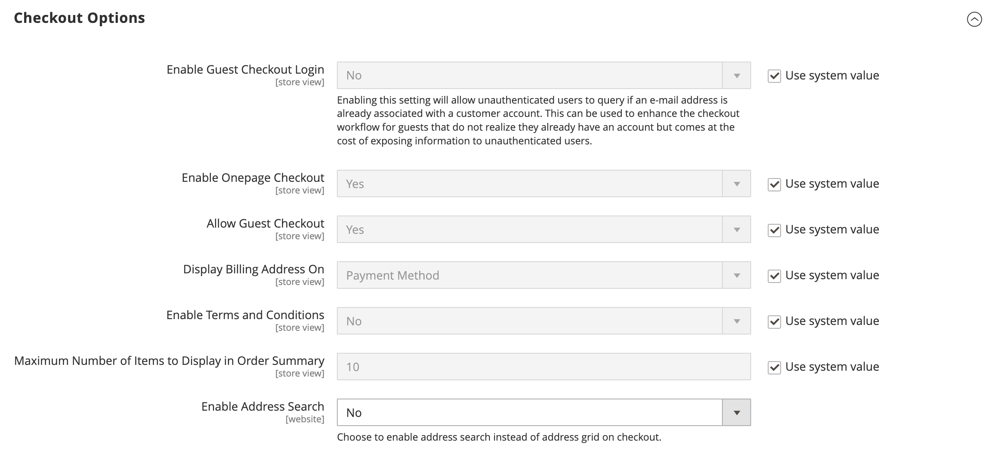

# [!UICONTROL Sales] > [!UICONTROL Checkout]

{{config}}

## [!UICONTROL Checkout Options]

<!-- zoom -->

<!--[Checkout Options](https://docs.magento.com/user-guide/sales/checkout-options.html) -->

| 필드 | [범위](../../getting-started/websites-stores-views.md#scope-settings) | 설명 |
|------------------------------------------------------------------|--- |----------------------------------------------------------------------------------------------------------------------------------------------------------------------------------------------------------------------------------------------------------------------------------------------------------------------------------------------------------------------------------------------------------------------------------------------------------------------|
| [!UICONTROL Enable Guest Checkout Login] | 스토어 뷰 | 이메일 주소가 이미 고객 계정과 연결되어 있는 경우 인증되지 않은 사용자(상점 및 API)가 쿼리할 수 있도록 하려면 이 설정을 활성화하십시오. 입력한 이메일 주소가 고객 계정에 이미 등록되어 있지만 인증되지 않은 사용자에게 정보를 노출하는 대가로 제공되는 경우 로그인 프롬프트를 표시하여 게스트의 체크아웃 워크플로우를 개선하는 데 사용할 수 있습니다.  옵션: `Yes` / `No` |
| [!UICONTROL Enable Onepage Checkout] | 스토어 뷰 | 다음 여부를 결정합니다. [한 페이지 체크아웃](../../stores-purchase/checkout-process.md#checkout-options) 는 기본 체크아웃 형식입니다. 옵션: `Yes` / `No` |
| [!UICONTROL Allow Guest Checkout] | 스토어 뷰 | 게스트가 다음을 진행할 수 있는지 여부를 결정합니다. [등록하지 않고 체크아웃](../../stores-purchase/checkout-guest.md) 스토어에 있는 계정입니다. 옵션: `Yes` / `No` |
| [!UICONTROL Enable Terms and Conditions] | 스토어 뷰 | 고객이 다음에 동의해야 하는지 여부를 결정합니다. [약관](../../stores-purchase/terms-and-conditions.md) 구매 전 판매. 옵션: `Yes` / `No` |
| [!UICONTROL Display Billing Address On] | 스토어 뷰 | 체크아웃하는 동안 청구 주소의 위치를 결정합니다. 옵션: `Payment Method` / `Payment Page` |
| [!UICONTROL Maximum Number of Items to Display in Order Summary] | 스토어 뷰 | 에 나타날 수 있는 최대 항목 수를 결정합니다. _주문 요약_ 체크아웃하는 동안. 기본값은 입니다 `10`. |
| [!UICONTROL Enable Address Search] | 웹 사이트 |  (Adobe Commerce만 해당) 고객이 [주소 검색](../../stores-purchase/checkout-address-search.md) 배송, 검토 및 결제 단계에 대한 기능. 이 기능이 활성화되어 있으면 고객 주소 수 제한 을 사용하여 체크아웃 중에 이 기능을 활성화하는 데 필요한 저장된 주소 수를 설정합니다. 옵션: `Yes` / `No` |
| 고객 주소 수 제한 | 웹 사이트 |  (Adobe Commerce만 해당) 주소 검색이 활성화되면 체크 아웃 중에 이 기능을 활성화하는 데 필요한 저장된 주소 수를 결정합니다. 고객의 저장된 주소 수가 이 수를 충족하거나 초과하면 기본 주소만 _배송_ 및 _검토 및 결제_ 단계. 고객은 검색 기능을 사용하여 선택한 주소를 변경할 수 있습니다. 기본값은 입니다 `10`. |

{style="table-layout:auto"}

## [!UICONTROL Shopping Cart]

<!-- zoom -->

<!--[Shopping Cart](https://docs.magento.com/user-guide/sales/cart-configuration.html) -->

| 필드 | [범위](../../getting-started/websites-stores-views.md#scope-settings) | 설명 |
|--- |--- |--- |
| [!UICONTROL Quote Lifetime (days)] | 웹 사이트 | 다음을 결정합니다. [견적 가격의 라이프타임](../../stores-purchase/cart-configuration.md#quote-lifetime), 일 단위. |
| [!UICONTROL After Adding a Product Redirect to Shopping Cart] | 스토어 뷰 | 다음 여부를 결정합니다. [장바구니 페이지가 표시됨](../../stores-purchase/cart-configuration.md#redirect-to-cart) 제품이 장바구니에 추가된 직후. 옵션: `Yes` / `No` |
| [!UICONTROL Number of Items to Display Pager] | 스토어 뷰 | 호출기가 트리거되기 전에 장바구니에 있는 항목의 수를 결정합니다. 기본값: `20` |
| [!UICONTROL Show Cross-sell Items in the Shopping Cart] | 스토어 뷰 | 다음의 경우 표시: [크로스셀 항목](../../catalog/related-products-up-sells-cross-sells.md#cross-sells) 장바구니에 표시되어 고객에게 추가 판매 옵션을 제공합니다. 옵션: `Yes` (기본값) / `No` |
| [!UICONTROL Grouped Product Image] | 스토어 뷰 | 다음을 결정합니다. [축소판](../../stores-purchase/cart-configuration.md#cart-thumbnails) 다음에 대해 표시되는 이미지 [그룹화된 제품](../../catalog/product-create-grouped.md) 장바구니에서. 옵션: `Product Thumbnail Itself` / `Parent Product Thumbnail` |
| [!UICONTROL Configurable Product Image] | 스토어 뷰 | 다음을 결정합니다. [축소판](../../stores-purchase/cart-configuration.md#cart-thumbnails) 장바구니에서 구성 가능한 제품에 대해 표시되는 이미지. 옵션: `Product Thumbnail Itself` / `Parent Product Thumbnail` |
| [!UICONTROL Preview Quote Lifetime (minutes)] | 스토어 뷰 | 장바구니에서 미리 볼 때 견적의 최대 기간(분)을 결정합니다. |
| [!UICONTROL Enable Clear Shopping Cart] | 웹 사이트 | 사용자가 단일 작업으로 장바구니의 컨텐츠를 지울 수 있는 옵션을 장바구니에 표시할지 여부를 결정합니다. 옵션: `Yes` / `No` |

{style="table-layout:auto"}

## [!UICONTROL My Cart Link]

<!-- zoom -->

<!-- [*My Cart Link*](https://docs.magento.com/user-guide/sales/mini-cart.html) -->

| 필드 | [범위](../../getting-started/websites-stores-views.md#scope-settings) | 설명 |
|--- |--- |--- |
| [!UICONTROL Display Cart Summary] | 웹 사이트 | 내 장바구니 링크 뒤에 괄호 안에 표시되는 값을 결정합니다. 옵션: `Display number of items in cart` / `Display item quantities` |

{style="table-layout:auto"}

## 미니 카트

<!-- zoom -->

<!-- [*Mini Cart*](https://docs.magento.com/user-guide/sales/mini-cart.html) -->

| 필드 | [범위](../../getting-started/websites-stores-views.md#scope-settings) | 설명 |
|--- |--- |--- |
| [!UICONTROL Display Mini Cart] | 스토어 뷰 | 헤더의 장바구니 아이콘을 클릭할 때 저장소 페이지에 미니 장바구니가 표시되는지 여부를 결정합니다. 미니 장바구니의 표시는 테마에 따라 다릅니다. 옵션: `Yes` / `No` |
| [!UICONTROL Number of Items to Display Scrollbar] | 스토어 뷰 | 스크롤 막대가 트리거되기 전에 미니 장바구니에 나타날 수 있는 항목 수를 결정합니다. 기본값: `5` |
| [!UICONTROL Maximum Number of Items to Display] | 스토어 뷰 | 미니 장바구니에 표시할 수 있는 최대 항목 수를 결정합니다. 기본값: `10` |

{style="table-layout:auto"}

## [!UICONTROL Payment Failed Emails]

<!-- zoom -->

<!-- [*Payment Failed Emails*](https://docs.magento.com/user-guide/sales/checkout-payment-failed-emails.html) -->

| 필드 | [범위](../../getting-started/websites-stores-views.md#scope-settings) | 설명 |
|--- |--- |--- |
| [!UICONTROL Payment Failed Email Receiver] | 스토어 뷰 | 결제 실패 이메일을 수신한 스토어 담당자를 식별합니다. 기본 받는 사람: `General Contact` |
| [!UICONTROL Payment Failed Email Sender] | 스토어 뷰 | 결제 실패 이메일의 발신자로 표시되는 스토어 연락처를 식별합니다. 기본 발신자: `General Contact` |
| [!UICONTROL Payment Failed Template] | 스토어 뷰 | 결제 실패 이메일에 사용되는 템플릿을 식별합니다. 기본 템플릿: `Payment Failed` |
| [!UICONTROL Send Payment Failed Copy To] | 스토어 뷰 | 결제 실패 이메일의 사본을 받을 사용자의 이메일 주소를 제공합니다. 여러 주소는 쉼표로 구분합니다. |
| [!UICONTROL Send Payment Failed Copy Method] | 스토어 뷰 | 복사본을 보내는 데 사용되는 이메일 방법을 나타냅니다. 옵션:  **`Bcc`**- 고객에게 전송된 동일한 이메일의 헤더에 수신자를 포함하여 맹목적인 무료 사본을 보냅니다. BCC 수신자는 고객에게 표시되지 않습니다. **`Separate Email`** - 사본을 별도의 이메일로 전송합니다. |

{style="table-layout:auto"}
