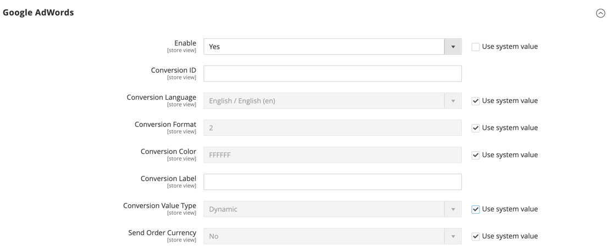
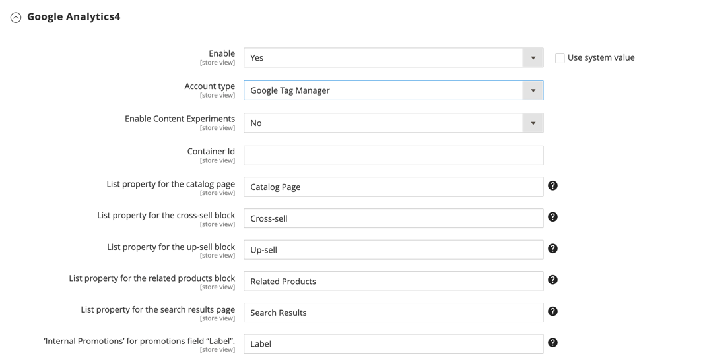

# [!UICONTROL Sales] > [!UICONTROL Google API]

{{config}}

## [!UICONTROL Google Analytics]

<!-- zoom -->

<!-- [Google Analytics](https://experienceleague.adobe.com/en/docs/commerce-admin/marketing/google-tools/google-analytics) -->

| 필드 | [범위](../../getting-started/websites-stores-views.md#scope-settings) | 설명 |
| ----- | ------------------------------------------ | ----------- |
| [!UICONTROL Enable] | 스토어 뷰 | 저장소에 대해 [!DNL Google Analytics]을(를) 사용하도록 설정합니다. 옵션: `Yes` / `No` |
| [!UICONTROL Account Type] | 스토어 뷰 | (Adobe Commerce만 해당) Google Analytics 계정 유형에 따라 구성 옵션을 결정합니다. 옵션: Universal Analytics(기본값) / Google Tag Manager |
| [!UICONTROL Account Number] | 스토어 뷰 | [!DNL Google Analytics] 계정을 만들 때 할당된 계정 번호 또는 추적 코드입니다. |
| [!UICONTROL Anonymize IP] | 스토어 뷰 | [!DNL Google Analytics] 결과에 나타나는 IP 주소에서 식별 정보를 제거할지 여부를 결정합니다. |

{style="table-layout:auto"}

## [!UICONTROL Google Analytics - Google Tag Manager]

{{ee-feature}}

<!-- zoom -->

**[!UICONTROL Account Type]**&#x200B;이(가) `Google Tag Manager`(으)로 설정되면 추가 필드가 표시됩니다.

| 필드 | [범위](../../getting-started/websites-stores-views.md#scope-settings) | 설명 |
| ----- | ------------------------------------------ | ----------- |
| [!UICONTROL Container ID] | 스토어 뷰 | [!DNL Google Tag Manager] 컨테이너의 고유 ID입니다. 이 값은 일반적으로 `GTM-`(으)로 시작합니다. 이 ID는 [!DNL Google Tag Manager] 계정에 있습니다. 저장소에 대해 [!DNL Google Tag Manager]이(가) 이미 설치 및 구성된 경우 컨테이너 ID가 이 필드에 자동으로 표시됩니다. |
| [!UICONTROL List property for the catalog page] | 스토어 뷰 | 카탈로그 페이지와 연결된 [!DNL Google Tag Manager] 속성을 식별합니다. 기본값: `Catalog Page` |
| [!UICONTROL List property for the cross-sell block] | 스토어 뷰 | 교차 판매 블록과 연결된 [!DNL Google Tag Manager] 속성을 식별합니다. 기본값: `Cross-sell` |
| [!UICONTROL List property for the up-sell block] | 스토어 뷰 | 업셀 블록과 연결된 [!DNL Google Tag Manager] 속성을 식별합니다. 기본값: `Up-sell` |
| [!UICONTROL List property for the related products block] | 스토어 뷰 | 관련 제품 블록과 연결된 [!DNL Google Tag Manager] 속성을 식별합니다. 기본값: `Related Products` |
| [!UICONTROL List property for the search results page] | 스토어 뷰 | 검색 결과 페이지와 연결된 [!DNL Google Tag Manager] 속성을 식별합니다. 기본값: `Search Results` |
| [!UICONTROL 'Internal Promotions' for promotions field "Label"] | 스토어 뷰 | 내부 프로모션의 레이블과 연결된 [!DNL Google Tag Manager] 속성을 식별합니다. 기본값: `Label` |

{style="table-layout:auto"}

## [!UICONTROL Google AdWords]

<!-- zoom -->

<!-- [Google AdWords](https://experienceleague.adobe.com/en/docs/commerce-admin/marketing/google-tools/google-adwords) -->

| 필드 | [범위](../../getting-started/websites-stores-views.md#scope-settings) | 설명 |
| ----- | ------------------------------------------ | ----------- |
| [!UICONTROL Enable] | 스토어 뷰 | 스토어에 대해 Google AdWords를 활성화합니다. 옵션: `Yes` / `No` |
| [!UICONTROL Conversion ID] | 스토어 뷰 | Google AdWords 계정의 ID입니다. |
| [!UICONTROL Conversion Language] | 스토어 뷰 | AdWords 변환에 사용되는 언어입니다. 옵션: `All available languages` |
| [!UICONTROL Conversion Format] | 스토어 뷰 | 전환 페이지에 표시되는 [!DNL Google Site Stats] 알림의 형식을 결정합니다. 알림은 방문자의 방문을 추적하는 데 사용되는 쿠키에 대해 방문자에게 알려주는 페이지에 연결됩니다. 이 숫자 값은 AdWords 스크립트의 `google_conversion_format` 변수에 할당됩니다. 자세한 내용은 Google 웹 사이트에서 [전환 추적 정보](https://support.google.com/google-ads/answer/1722022?hl=en)를 참조하세요. 옵션:  **`1`**- 한 줄 알림을 표시합니다. **`2`** - (기본값) 두 줄 알림을 표시합니다.  **`3`**- 고객 알림을 표시하지 않습니다. |
| [!UICONTROL Conversion Color] | 스토어 뷰 | 전환 레이블의 색상을 결정합니다. [색상 선택기](https://www.w3schools.com/colors/colors_picker.asp)를 사용하여 16진수 값을 선택합니다. 이 16진수 값은 AdWords 스크립트의 `google_conversion_color` 변수에 할당됩니다. 예: ffffff `var google_conversion_color = "ffffff";` |
| [!UICONTROL Conversion Label] | 스토어 뷰 | [!DNL Google Site Stats] 알림과 함께 표시되는 텍스트 레이블입니다. 이 텍스트 문자열은 AdWords 스크립트의 `~` 변수에 할당됩니다. 예: &quot;쇼핑해 주셔서 감사합니다!&quot; |
| [!UICONTROL Conversion Value Type] | 스토어 뷰 | 전환이 발생하는 시기를 결정하는 데 사용되는 값 유형을 지정합니다. 옵션:  **`Dynamic`**- 동적 주문 금액을 기준으로 전환이 발생했는지 확인합니다. **`Constant`** - 입력한 값을 기반으로 전환이 발생했는지 확인합니다. |
| [!UICONTROL Conversion Value] | 스토어 뷰 | _[!UICONTROL Constant]_전환 값 형식에 사용되는 값을 지정합니다. |
| [!UICONTROL Send Order Currency] | 스토어 뷰 | AdWords(기본 통화가 다른 웹 사이트의 경우)에서 거래별 통화 전환 값을 활성화합니다. |

{style="table-layout:auto"}

## [!UICONTROL Google GTag]

{{gtag-api-note}}

### [!UICONTROL Google Analytics4]

<!-- zoom -->

<!-- [Google Analytics4](https://experienceleague.adobe.com/en/docs/commerce-admin/marketing/google-tools/google-analytics) -->

| 필드 | [범위](../../getting-started/websites-stores-views.md#scope-settings) | 설명 |
| ----- | ------------------------------------------ | ----------- |
| [!UICONTROL Enable] | 스토어 뷰 | 스토어에 Google Analytics 4를 활성화합니다. 옵션: `Yes` / `No` |
| [!UICONTROL Account Type] | 스토어 뷰 | (Adobe Commerce만 해당) Google Analytics 계정 유형에 따라 구성 옵션을 결정합니다. 옵션: `Google Analytics4`(기본값) / `Google Tag Manager` |
| [!UICONTROL Measurement ID] | 스토어 뷰 | Google Analytics 계정을 만들 때 지정된 계정 번호 또는 추적 코드입니다. |
| [!UICONTROL Anonymize IP] | 스토어 뷰 | Google Analytics 결과에 나타나는 IP 주소에서 식별 정보가 제거되는지 여부를 결정합니다. |

{style="table-layout:auto"}

### [!UICONTROL Google Analytics4 - Google Tag Manager]

{{ee-feature}}

<!-- zoom -->

**[!UICONTROL Account Type]**&#x200B;이(가) `Google Tag Manager`(으)로 설정되면 추가 필드가 표시됩니다.

| 필드 | [범위](../../getting-started/websites-stores-views.md#scope-settings) | 설명 |
| ----- | ------------------------------------------ | ----------- |
| [!UICONTROL Container Id] | 스토어 뷰 | [!DNL Google Tag Manager] 컨테이너의 고유 ID입니다. 이 값은 일반적으로 `GTM-`(으)로 시작합니다. 이 ID는 Google 탭 관리자 계정에 있습니다. 저장소에 대해 [!DNL Google Tag Manager]이(가) 이미 설치 및 구성된 경우 컨테이너 ID가 이 필드에 자동으로 표시됩니다. |
| [!UICONTROL List property for the catalog page] | 스토어 뷰 | 카탈로그 페이지와 연결된 [!DNL Google Tag Manager] 속성을 식별합니다. 기본값: `Catalog Page` |
| [!UICONTROL List property for the cross-sell block] | 스토어 뷰 | 교차 판매 블록과 연결된 [!DNL Google Tag Manager] 속성을 식별합니다. 기본값: `Cross-sell` |
| [!UICONTROL List property for the up-sell block] | 스토어 뷰 | 업셀 블록과 연결된 [!DNL Google Tag Manager] 속성을 식별합니다. 기본값: `Up-sell` |
| [!UICONTROL List property for the related products block] | 스토어 뷰 | 관련 제품 블록과 연결된 [!DNL Google Tag Manager] 속성을 식별합니다. 기본값: `Related Products` |
| [!UICONTROL List property for the search results page] | 스토어 뷰 | 검색 결과 페이지와 연결된 [!DNL Google Tag Manager] 속성을 식별합니다. 기본값: `Search Results` |
| [!UICONTROL 'Internal Promotions' for promotions field "Label"] | 스토어 뷰 | 내부 프로모션의 레이블과 연결된 [!DNL Google Tag Manager] 속성을 식별합니다. 기본값: `Label` |

{style="table-layout:auto"}

### [!UICONTROL Google AdWords]

<!-- zoom -->

<!-- -- Google AdWords](https://experienceleague.adobe.com/en/docs/commerce-admin/marketing/google-tools/google-adwords) -->

| 필드 | [범위](../../getting-started/websites-stores-views.md#scope-settings) | 설명 |
| ----- | ------------------------------------------ | ----------- |
| [!UICONTROL Enable] | 스토어 뷰 | 스토어에 대해 Google AdWords를 활성화합니다. 옵션: `Yes` / `No` |
| [!UICONTROL Conversion ID] | 스토어 뷰 | Google AdWords 계정의 ID입니다. |
| [!UICONTROL Conversion Language] | 스토어 뷰 | AdWords 변환에 사용되는 언어입니다. 옵션: 사용 가능한 모든 언어 |
| [!UICONTROL Conversion Format] | 스토어 뷰 | 전환 페이지에 나타나는 Google 사이트 상태 알림의 형식을 결정합니다. 알림은 방문자의 방문을 추적하는 데 사용되는 쿠키에 대해 방문자에게 알려주는 페이지에 연결됩니다. 이 숫자 값은 AdWords 스크립트의 `google_conversion_format` 변수에 할당됩니다. 자세한 내용은 Google 웹 사이트에서 [전환 추적 정보](https://support.google.com/google-ads/answer/1722022?hl=en)를 참조하세요. 옵션:  **`1`**- 한 줄 알림을 표시합니다. **`2`** - (기본값) 두 줄 알림을 표시합니다.  **`3`**- 고객 알림을 표시하지 않습니다. |
| [!UICONTROL Conversion Color] | 스토어 뷰 | 전환 레이블의 색상을 결정합니다. [색상 선택기](https://www.w3schools.com/colors/colors_picker.asp)를 사용하여 16진수 값을 선택합니다. 이 16진수 값은 AdWords 스크립트의 `google_conversion_color` 변수에 할당됩니다. 예: ffffff `var google_conversion_color = "ffffff";` |
| [!UICONTROL Conversion Label] | 스토어 뷰 | Google 사이트 상태 알림과 함께 표시되는 텍스트 레이블입니다. 이 텍스트 문자열은 AdWords 스크립트의 `~` 변수에 할당됩니다. 예: &quot;쇼핑해 주셔서 감사합니다!&quot; |
| [!UICONTROL Conversion Value Type] | 스토어 뷰 | 전환이 발생하는 시기를 결정하는 데 사용되는 값 유형을 지정합니다. 옵션:  **`Dynamic`**- 동적 주문 금액을 기준으로 전환이 발생했는지 확인합니다. **`Constant`** - 입력한 값을 기반으로 전환이 발생했는지 확인합니다. |
| [!UICONTROL Conversion Value] | 스토어 뷰 | _[!UICONTROL Constant]_전환 값 형식에 사용되는 값을 지정합니다. |
| [!UICONTROL Send Order Currency] | 스토어 뷰 | AdWords(기본 통화가 다른 웹 사이트의 경우)에서 거래별 통화 전환 값을 활성화합니다. |

{style="table-layout:auto"}
