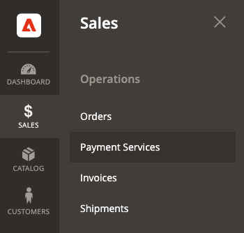
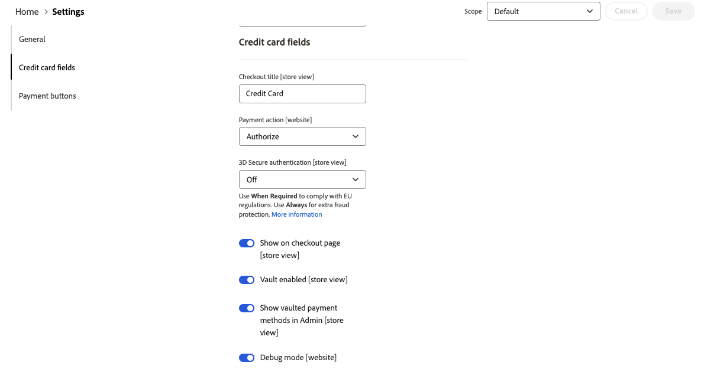
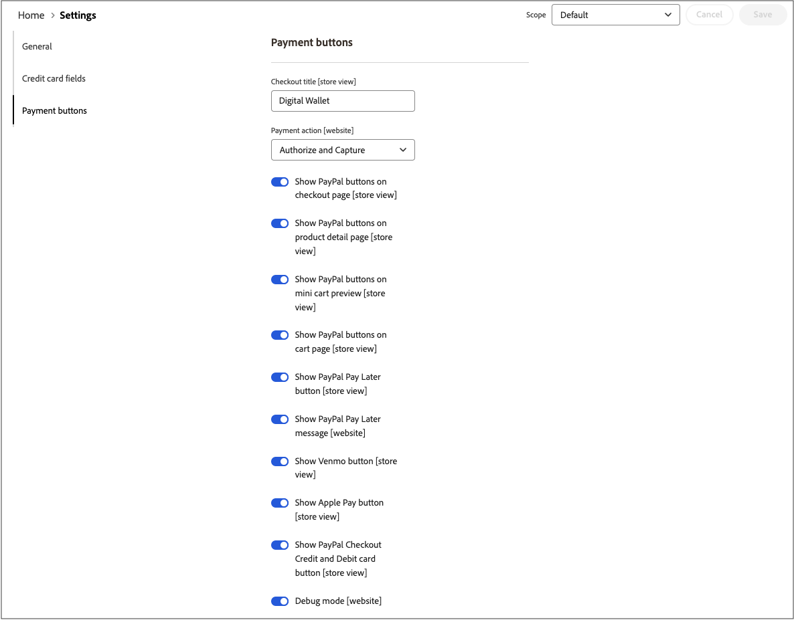

# [!UICONTROL Sales] > [!UICONTROL Payment Methods] > [!UICONTROL Payment Services]

결제 서비스는 강력하고 안전한 결제 처리를 위해 샌드박스 테스트 및 간단한 설정을 포함한 턴키 셀프서비스 솔루션을 제공합니다. 자세한 내용은 [_결제 서비스 사용 안내서_](https://experienceleague.adobe.com/docs/commerce-merchant-services/payment-services/guide-overview.html).

결제 서비스에 대한 구성 설정에 액세스하려면 _관리자_ 사이드바 이동 **[!UICONTROL Sales]** > **[!UICONTROL Payment Services]** 및 클릭 **[!UICONTROL Settings]**.

{width="400"}

>[!NOTE]
>
>대신 레거시 구성을 사용하려면 [설정](https://experienceleague.adobe.com/docs/commerce-merchant-services/payment-services/configure/settings.html), 참조 [이전 구성](https://experienceleague.adobe.com/docs/commerce-merchant-services/payment-services/configure/configure-admin.html).

## [!UICONTROL General]

{width="600" zoomable="yes"}

| 필드 | [범위](../../getting-started/websites-stores-views.md#scope-settings) | 설명 |
|---|---|---|
| [!UICONTROL Enable] | 웹 사이트 | 활성화 또는 비활성화 [!DNL Payment Services] 웹 사이트용. 옵션: [!UICONTROL Yes] / [!UICONTROL No] |
| [!UICONTROL Payment mode] | 스토어 뷰 | 스토어에 대한 메서드 또는 환경을 설정합니다. 옵션: [!UICONTROL Sandbox] / [!UICONTROL Production] |
| [!UICONTROL Sandbox Merchant ID] | 스토어 뷰 | 샌드박스 온보딩 중 자동으로 생성되는 샌드박스 판매자 ID입니다. |
| [!UICONTROL Production Merchant ID] | 스토어 뷰 | 샌드박스 온보딩 중 자동으로 생성되는 프로덕션 판매자 ID입니다. |
| [!UICONTROL Soft Descriptor] | 웹 사이트 또는 스토어 보기 | 웹 사이트 및 스토어 보기에 고객 거래에 대한 정보를 제공하고 브랜드, 스토어 또는 제품 라인을 설명하는 부드러운 설명자를 추가합니다. 다음 [!UICONTROL Use website] toggle은 웹 사이트 수준에서 추가된 모든 소프트 설명자를 적용합니다. 다음 [!UICONTROL Use default] toggle은 기본값으로 추가된 모든 소프트 설명자를 적용합니다. |

{style="table-layout:auto"}

## [!UICONTROL Credit card fields]

{width="600" zoomable="yes"}

| 필드 | [범위](../../getting-started/websites-stores-views.md#scope-settings) | 설명 |
|---|---|---|
| [!UICONTROL Title] | 스토어 뷰 | 체크아웃 중에 결제 방법 보기에서 이 결제 방법의 제목으로 표시할 텍스트를 추가합니다. |
| [!UICONTROL Payment Action] | 웹 사이트 | 다음 [지불 조치](payment-methods.md#payment-actions) 지정된 결제 방법에 대해 참조할 수 있습니다. 옵션: [!UICONTROL Authorize] / [!UICONTROL Authorize and Capture] |
| [!UICONTROL 3DS Secure authentication] | 웹 사이트 | 활성화 또는 비활성화 [3DS 보안 인증](https://experienceleague.adobe.com/docs/commerce-merchant-services/payment-services/security-compliance/security.html#3ds). 옵션: [!UICONTROL Always] / [!UICONTROL When Required] / [!UICONTROL Off] |
| [!UICONTROL Show on checkout page] | 웹 사이트 | 신용 카드 필드가 체크아웃 페이지에 표시되도록 활성화하거나 비활성화합니다. 옵션: [!UICONTROL Yes] / [!UICONTROL No] |
| [!UICONTROL Vault enabled] | 스토어 뷰 | 활성화 또는 비활성화 [신용 카드 소산](https://experienceleague.adobe.com/docs/commerce-merchant-services/payment-services/payments-checkout/vaulting.html). 옵션: [!UICONTROL Yes] / [!UICONTROL No] |
| [!UICONTROL Show vaulted payment methods in Admin] | 스토어 뷰 | 관리자에서 고객에 대한 주문을 완료하는 기능을 활성화하거나 비활성화합니다. [적립된 결제 방법 사용](https://experienceleague.adobe.com/docs/commerce-merchant-services/payment-services/payments-checkout/vaulting.html). 옵션: [!UICONTROL Yes] / [!UICONTROL No] |
| [!UICONTROL Debug Mode] | 웹 사이트 | 디버그 모드를 활성화하거나 비활성화합니다. 옵션: [!UICONTROL Yes] / [!UICONTROL No] |

{style="table-layout:auto"}

## [!UICONTROL Payment buttons]

{width="600" zoomable="yes"}

| 필드 | [범위](../../getting-started/websites-stores-views.md#scope-settings) | 설명 |
|---|---|---|
| [!UICONTROL Title] | 스토어 뷰 | 체크아웃 중에 결제 방법 보기에서 이 결제 방법의 제목으로 표시할 텍스트를 추가합니다. |
| [!UICONTROL Payment Action] | 웹 사이트 | 다음 [지불 조치](payment-methods.md#payment-actions){target="_blank"} 지정된 결제 방법에 대해 참조할 수 있습니다. 옵션: [!UICONTROL Authorize] / [!UICONTROL Authorize and Capture] |
| [!UICONTROL Show PayPal buttons on checkout page] | 스토어 뷰 | 활성화 또는 비활성화 [!DNL PayPal Smart Buttons] 체크아웃 페이지에서 확인할 수 있습니다. 옵션: [!UICONTROL  Yes] / [!UICONTROL No] |
| [!UICONTROL Show PayPal buttons on product detail page] | 스토어 뷰 | 활성화 또는 비활성화 [!DNL PayPal Smart Buttons] 제품 세부 사항 페이지에서 확인할 수 있습니다. 옵션: [!UICONTROL  Yes] / [!UICONTROL No] |
| [!UICONTROL Show PayPal buttons in mini-cart preview] | 스토어 뷰 | 활성화 또는 비활성화 [!DNL PayPal Smart Buttons] ( 미니 장바구니 미리 보기) 옵션: [!UICONTROL Yes] / [!UICONTROL No] |
| [!UICONTROL Show PayPal buttons on cart page] | 스토어 뷰 | 활성화 또는 비활성화 [!DNL PayPal Smart Buttons] 장바구니 페이지에서 확인할 수 있습니다. 옵션: [!UICONTROL Yes] / [!UICONTROL No] |
| [!UICONTROL Show PayPal Pay Later button] | 스토어 뷰 | 지급 버튼이 표시되는 나중에 지급 옵션 표시를 활성화하거나 비활성화합니다. 옵션: [!UICONTROL Yes] / [!UICONTROL No] |
| [!UICONTROL Show PayPal Pay Later Message] | 웹 사이트 | 장바구니, 제품 페이지, 미니 장바구니에서, 그리고 체크아웃 흐름 동안 나중에 결제 메시지를 활성화하거나 비활성화합니다. 옵션: [!UICONTROL Yes] / [!UICONTROL No] |
| [!UICONTROL Show Venmo button] | 스토어 뷰 | 결제 버튼이 표시되는 Venmo 결제 옵션을 활성화하거나 비활성화합니다. 옵션: [!UICONTROL Yes] / [!UICONTROL No] |
| [!UICONTROL Show Apple Pay button] | 스토어 뷰 | 결제 버튼이 표시되는 Apple 결제 옵션을 활성화하거나 비활성화합니다. 옵션: [!UICONTROL Yes] / [!UICONTROL No] |
| [!UICONTROL Show PayPal Credit and Debit card button] | 스토어 뷰 | 결제 버튼이 표시되는 신용 및 직불 카드 결제 옵션을 활성화하거나 비활성화합니다. 옵션: [!UICONTROL Yes] / [!UICONTROL No] |
| [!UICONTROL Debug Mode] | 웹 사이트 | 디버그 모드를 활성화하거나 비활성화합니다. 옵션: [!UICONTROL Yes] / [!UICONTROL No] |

{style="table-layout:auto"}

## [!UICONTROL PayPal Smart Button Styling]

{width="600" zoomable="yes"}

| 필드 | [범위](../../getting-started/websites-stores-views.md#scope-settings) | 설명 |
|--- |--- |--- |
| [!UICONTROL Layout] | 스토어 뷰 | 결제 버튼에 대한 레이아웃 스타일을 정의합니다. 옵션: [!UICONTROL Vertical] / [!UICONTROL Horizontal] |
| [!UICONTROL Tagline] | 스토어 뷰 | 태그 라인 활성화/비활성화. 옵션: [!UICONTROL Yes] / [!UICONTROL No] |
| [!UICONTROL Color] | 스토어 뷰 | 결제 버튼의 색상을 정의합니다. 옵션: [!UICONTROL Blue] / [!UICONTROL Gold] / [!UICONTROL Silver] / [!UICONTROL White] / [!UICONTROL Black] |
| [!UICONTROL Shape] | 스토어 뷰 | 결제 버튼의 모양을 정의합니다. 옵션: [!UICONTROL Rectangular] / [!UICONTROL Pill] |
| [!UICONTROL Responsive Button Height] | 스토어 뷰 | 결제 단추에서 기본 높이를 사용하는지 여부를 정의합니다. 옵션: [!UICONTROL Yes] / [!UICONTROL No] |
| [!UICONTROL Height] | 스토어 뷰 | 결제 버튼의 높이를 정의합니다. 기본값: 없음 |
| [!UICONTROL Label] | 스토어 뷰 | 결제 버튼에 표시되는 레이블을 정의합니다. 옵션: [!UICONTROL PayPal] / [!UICONTROL Checkout] / [!UICONTROL Buynow] / [!UICONTROL Pay] / [!UICONTROL Installment] |

{style="table-layout:auto"}
