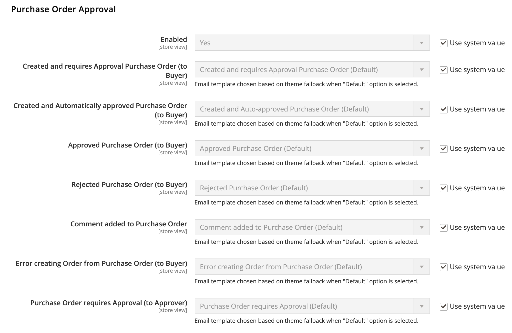

# [!UICONTROL Sales] > [!UICONTROL Sales Emails]

{{config}}

## [!UICONTROL General Settings]

<!-- zoom -->

<!-- [General Settings](https://docs.magento.com/user-guide/system/email-communications.html) -->

| 필드 | [범위](../../getting-started/websites-stores-views.md#scope-settings) | 설명 |
|--- |--- |--- |
| [!UICONTROL Asynchronous sending] | 글로벌 | 영업 이메일이 비동기적으로 전송되는지 여부를 결정합니다. 비동기 전송을 활성화하는 것이 좋습니다. 옵션:  **`Disable`**- (기본값) 이벤트에 의해 트리거되면 판매 이메일이 전송됩니다. **`Enable`** - (권장) 판매 이메일은 사전 결정된 일정한 간격으로 전송됩니다. |

{style="table-layout:auto"}

## [!UICONTROL Order]

<!-- zoom -->

<!-- [Order](https://docs.magento.com/user-guide/sales/orders.html) -->

| 필드 | [범위](../../getting-started/websites-stores-views.md#scope-settings) | 설명 |
|--- |--- |--- |
| [!UICONTROL Enabled] | 스토어 뷰 | 활성화되면 은 수행한 각 주문에 대해 트랜잭션 이메일을 보냅니다. 옵션: `Yes` / `No` |
| [!UICONTROL New Order Confirmation Email Sender] | 스토어 뷰 | 메시지를 보낸 사람으로 표시되는 스토어 연락처를 식별합니다. 기본 발신자: `Sales Representative` |
| [!UICONTROL New Order Confirmation Template] | 스토어 뷰 | 고객이 수행한 새 주문을 확인하기 위해 전송된 템플릿을 식별합니다. 기본 템플릿: `New Order` |
| [!UICONTROL New Order Confirmation Template for Guest] | 스토어 뷰 | 게스트가 수행한 새 주문을 확인하기 위해 전송된 템플릿을 식별합니다. 기본 템플릿: `New Order for Guest` |
| [!UICONTROL Send Order Email Copy To] | 스토어 뷰 | 주문 이메일 사본을 받을 사용자의 이메일 주소를 제공합니다. 여러 주소는 쉼표로 구분합니다. |
| [!UICONTROL Send Order Email Copy Method] | 스토어 뷰 | 복사본을 보내는 데 사용되는 이메일 방법을 나타냅니다. 옵션은 다음과 같습니다.  **`Bcc`**- 고객에게 전송된 동일한 이메일의 헤더에 수신자를 포함하여 맹목적인 무료 사본을 보냅니다. BCC 수신자는 고객에게 표시되지 않습니다. **`Separate Email`** - 사본을 별도의 이메일로 전송합니다. |

{style="table-layout:auto"}

## [!UICONTROL Order Comments]

<!-- zoom -->

<!-- [Order Comments](https://docs.magento.com/user-guide/sales/order-processing.html) -->

| 필드 | [범위](../../getting-started/websites-stores-views.md#scope-settings) | 설명 |
|--- |--- |--- |
| [!UICONTROL Enabled] | 스토어 뷰 | 활성화되면 은 각 주문 댓글에 대한 트랜잭션 이메일을 보냅니다. 옵션: `Yes` / `No` |
| [!UICONTROL Order Comment Email Sender] | 스토어 뷰 | 메시지를 보낸 사람으로 표시되는 스토어 연락처를 식별합니다. 기본 발신자: `Sales Representative` |
| [!UICONTROL Order Comment Email Template] | 스토어 뷰 | 고객 주문에 댓글이 추가되면 전송된 템플릿을 식별합니다. 기본 템플릿: `Order Update` |
| [!UICONTROL New Order Confirmation Template for Guest] | 스토어 뷰 | 게스트 주문에 댓글이 추가되면 전송된 템플릿을 식별합니다. 기본 템플릿: `Order Update for Guest` |
| [!UICONTROL Send Order Email Copy To|Store View] | 주문 댓글 전자 메일의 복사본을 받는 모든 사람의 전자 메일 주소를 제공합니다. 여러 주소는 쉼표로 구분합니다. |
| [!UICONTROL Send Order Email Copy Method] | 스토어 뷰 | 복사본을 보내는 데 사용되는 방법을 나타냅니다. 옵션은 다음과 같습니다.  **`Bcc`**- 고객에게 전송된 동일한 이메일의 헤더에 수신자를 포함하여 맹목적인 무료 사본을 보냅니다. BCC 수신자는 고객에게 표시되지 않습니다. **`Separate Email`** - 사본을 별도의 이메일로 전송합니다. |

{style="table-layout:auto"}

## [!UICONTROL Invoice]

<!-- zoom -->

<!-- [Invoice](https://docs.magento.com/user-guide/sales/invoices.html) -->

| 필드 | [범위](../../getting-started/websites-stores-views.md#scope-settings) | 설명 |
|--- |--- |--- |
| [!UICONTROL Enabled] | 스토어 뷰 | 활성화되면 생성된 각 송장에 대한 트랜잭션 이메일을 보냅니다. 옵션: `Yes` / `No` |
| [!UICONTROL Invoice Email Sender] | 스토어 뷰 | 메시지를 보낸 사람으로 표시되는 스토어 연락처를 식별합니다. 기본 발신자: `Sales Representative` |
| [!UICONTROL Invoice Email Template] | 스토어 뷰 | 고객에 대한 송장이 생성될 때 전송되는 템플릿을 식별합니다. 기본 템플릿: `New Invoice` |
| [!UICONTROL Invoice Email Template for Guest] | 스토어 뷰 | 게스트에 대한 송장이 생성될 때 전송되는 템플릿을 식별합니다. 기본 템플릿: `New Invoice for Guest` |
| [!UICONTROL Send Invoice Email Copy To] | 스토어 뷰 | 송장 전자 메일 사본을 받을 사용자의 전자 메일 주소를 제공합니다. 여러 주소는 쉼표로 구분합니다. |
| [!UICONTROL Send Invoice Email Copy Method] | 스토어 뷰 | 복사본을 보내는 데 사용되는 방법을 나타냅니다. 옵션은 다음과 같습니다.  **`Bcc`**- 고객에게 전송된 동일한 이메일의 헤더에 수신자를 포함하여 맹목적인 무료 사본을 보냅니다. BCC 수신자는 고객에게 표시되지 않습니다. **`Separate Email`** - 사본을 별도의 이메일로 전송합니다. |

{style="table-layout:auto"}

## [!UICONTROL Invoice Comments]

<!-- zoom -->

<!-- [Invoice Comments](https://docs.magento.com/user-guide/sales/invoice-create.html) -->

| 필드 | [범위](../../getting-started/websites-stores-views.md#scope-settings) | 설명 |
|--- |--- |--- |
| [!UICONTROL Enabled] | 스토어 뷰 | 활성화되면 은 각 송장 주석에 대한 트랜잭션 이메일을 보냅니다. 옵션: `Yes` / `No` |
| [!UICONTROL Invoice Comment Email Sender] | 스토어 뷰 | 메시지를 보낸 사람으로 표시되는 스토어 연락처를 식별합니다. 기본 발신자: `Sales Representative` |
| [!UICONTROL Invoice Comment Email Template] | 스토어 뷰 | 고객 송장에 주석이 추가될 때 전송되는 템플릿을 식별합니다. 기본 템플릿: `Invoice Update` |
| [!UICONTROL Invoice Comment Email Template for Guest] | 스토어 뷰 | 게스트 송장에 댓글이 추가될 때 전송되는 템플릿을 식별합니다. 기본 템플릿: `Invoice Update for Guest` |
| [!UICONTROL Send Invoice Comment Email Copy To] | 스토어 뷰 | 송장 주석 이메일의 사본을 받을 사용자의 이메일 주소를 제공합니다. 여러 주소는 쉼표로 구분합니다. |
| [!UICONTROL Send Invoice Comments Email Copy Method] | 스토어 뷰 | 복사본을 보내는 데 사용되는 이메일 방법을 나타냅니다. 옵션은 다음과 같습니다.  **`Bcc`**- 고객에게 전송된 동일한 이메일의 헤더에 수신자를 포함하여 맹목적인 무료 사본을 보냅니다. BCC 수신자는 고객에게 표시되지 않습니다. **`Separate Email`** - 사본을 별도의 이메일로 전송합니다. |

{style="table-layout:auto"}

## [!UICONTROL Shipment]

<!-- zoom -->

<!-- [Shipment](https://docs.magento.com/user-guide/sales/shipments.html) -->

| 필드 | [범위](../../getting-started/websites-stores-views.md#scope-settings) | 설명 |
|--- |--- |--- |
| [!UICONTROL Enabled] | 스토어 뷰 | 활성화되면 은 생성된 각 선적에 대해 트랜잭션 이메일을 전송합니다. 옵션: `Yes` / `No` |
| [!UICONTROL Shipment Email Sender] | 스토어 뷰 | 메시지를 보낸 사람으로 표시되는 스토어 연락처를 식별합니다. 기본 발신자: `Sales Representative` |
| [!UICONTROL Shipment Email Template] | 스토어 뷰 | 고객에 대한 선적이 생성될 때 전송된 템플리트를 식별합니다. 기본 템플릿: `New Shipment` |
| [!UICONTROL Shipment Email Template for Guest] | 스토어 뷰 | 게스트를 위한 선적이 생성될 때 전송되는 템플릿을 식별합니다. 기본 템플릿: `New Shipment for Guest` |
| [!UICONTROL Send Shipment Email Copy To] | 스토어 뷰 | 배송 이메일 복사본을 받아야 하는 사용자의 이메일 주소를 제공합니다. 여러 주소는 쉼표로 구분합니다. |
| [!UICONTROL Send Shipment Email Copy Method] | 스토어 뷰 | 복사본을 보내는 데 사용되는 방법을 나타냅니다. 옵션은 다음과 같습니다.  **`Bcc`**- 고객에게 전송된 동일한 이메일의 헤더에 수신자를 포함하여 맹목적인 무료 사본을 보냅니다. BCC 수신자는 고객에게 표시되지 않습니다. **`Separate Email`** - 사본을 별도의 이메일로 전송합니다. |

{style="table-layout:auto"}

## [!UICONTROL Shipment Comments]

<!-- zoom -->

<!-- [Shipment Comments](https://docs.magento.com/user-guide/sales/shipments.html) -->

| 필드 | [범위](../../getting-started/websites-stores-views.md#scope-settings) | 설명 |
|--- |--- |--- |
| [!UICONTROL Enabled] | 스토어 뷰 | 활성화되면 은 각 배송 댓글에 대한 트랜잭션 이메일을 보냅니다. 옵션: `Yes` / `No` |
| [!UICONTROL Shipment Comment Email Sender] | 스토어 뷰 | 메시지를 보낸 사람으로 표시되는 스토어 연락처를 식별합니다. 기본 발신자: `Sales Representative` |
| [!UICONTROL Shipment Comment Email Template] | 스토어 뷰 | 고객 배송에 댓글이 추가될 때 전송되는 템플릿을 식별합니다. 기본 템플릿: `Shipment Update` |
| [!UICONTROL Shipment Comment Email Template for Guest] | 스토어 뷰 | 게스트 게재에 댓글이 추가될 때 전송되는 템플릿을 식별합니다. 기본 템플릿: `Shipment Update for Guest` |
| [!UICONTROL Send Shipment Comment Email Copy To] | 스토어 뷰 | 발송 댓글 메일의 사본을 받을 사용자의 이메일 주소를 제공합니다. 여러 주소는 쉼표로 구분합니다. |
| [!UICONTROL Send Shipment Comments Email Copy Method] | 스토어 뷰 | 복사본을 보내는 데 사용되는 이메일 방법을 나타냅니다. 옵션은 다음과 같습니다.  **`Bcc`**- 고객에게 전송된 동일한 이메일의 헤더에 수신자를 포함하여 맹목적인 무료 사본을 보냅니다. BCC 수신자는 고객에게 표시되지 않습니다. **`Separate Email`** - 사본을 별도의 이메일로 전송합니다. |

{style="table-layout:auto"}

## [!UICONTROL Credit Memo]

<!-- zoom -->

<!-- [Credit Memo](https://docs.magento.com/user-guide/sales/credit-memos.html) -->

| 필드 | [범위](../../getting-started/websites-stores-views.md#scope-settings) | 설명 |
|--- |--- |--- |
| [!UICONTROL Enabled] | 스토어 뷰 | 생성된 각 대변 메모에 대해 트랜잭션 이메일을 활성화합니다. 옵션: `Yes` / `No` |
| [!UICONTROL Credit Memo Email Sender] | 스토어 뷰 | 메시지를 보낸 사람으로 표시되는 스토어 연락처를 식별합니다. 기본 발신자: `Sales Representative` |
| [!UICONTROL Credit Memo Email Template] | 스토어 뷰 | 고객에 대한 대변 메모가 생성될 때 전송되는 템플릿을 식별합니다. 기본 템플릿: `New Credit Memo` |
| [!UICONTROL Credit Memo Email Template for Guest] | 스토어 뷰 | 게스트에 대한 대변 메모가 생성될 때 전송되는 템플릿을 식별합니다. 기본 템플릿: `New Credit Memo for Guest` |
| [!UICONTROL Send Credit Memo Email Copy To] | 스토어 뷰 | 대변 메모 이메일 복사본을 받아야 하는 모든 사람의 이메일 주소를 제공합니다. 여러 주소는 쉼표로 구분합니다. |
| [!UICONTROL Send Credit Memo Email Copy Method] | 스토어 뷰 | 복사본을 보내는 데 사용되는 방법을 나타냅니다. 옵션은 다음과 같습니다.  **`Bcc`**- 고객에게 전송된 동일한 이메일의 헤더에 수신자를 포함하여 맹목적인 무료 사본을 보냅니다. BCC 수신자는 고객에게 표시되지 않습니다. **`Separate Email`** - 사본을 별도의 이메일로 전송합니다. |

{style="table-layout:auto"}

## [!UICONTROL Credit Memo Comments]

<!-- zoom -->

<!-- [Credit Memo Comments](https://docs.magento.com/user-guide/sales/credit-memo-create.html) -->

| 필드 | [범위](../../getting-started/websites-stores-views.md#scope-settings) | 설명 |
|--- |--- |--- |
| [!UICONTROL Enabled] | 스토어 뷰 | 활성화되면 은 각 대변 메모 댓글에 대한 트랜잭션 이메일을 보냅니다. 옵션: `Yes` / `No` |
| [!UICONTROL Credit Memo Comment Email Sender] | 스토어 뷰 | 메시지를 보낸 사람으로 표시되는 스토어 연락처를 식별합니다. 기본 발신자: `Sales Representative` |
| [!UICONTROL Credit Memo Comment Email Template] | 스토어 뷰 | 고객 대변 메모에 주석이 추가될 때 전송되는 템플릿을 식별합니다. 기본 템플릿: `Credit Memo Update` |
| [!UICONTROL Credit Memo Comment Email Template for Guest] | 스토어 뷰 | 게스트 대변 메모에 댓글이 추가될 때 전송되는 템플릿을 식별합니다. 기본 템플릿: `Credit Memo Update for Guest` |
| [!UICONTROL Send Credit Memo Comment Email Copy To] | 스토어 뷰 | 메모 메모 메모 메모 메모 전자 메일의 복사본을 받을 사용자의 전자 메일 주소를 지정합니다. 여러 주소는 쉼표로 구분합니다. |
| [!UICONTROL Send Credit Memo Comments Email Copy Method] | 스토어 뷰 | 복사본을 보내는 데 사용되는 이메일 방법을 나타냅니다. 옵션은 다음과 같습니다.  **`Bcc`**- 고객에게 전송된 동일한 이메일의 헤더에 수신자를 포함하여 맹목적인 무료 사본을 보냅니다. BCC 수신자는 고객에게 표시되지 않습니다. **`Separate Email`** - 사본을 별도의 이메일로 전송합니다. |

{style="table-layout:auto"}

## [!UICONTROL Order Ready For Pickup in Store]

<!-- zoom -->

<!-- [Order Ready For Pickup in Store](https://docs.magento.com/user-guide/shipping/shipping-in-store-delivery.html) -->

| 필드 | [범위](../../getting-started/websites-stores-views.md#scope-settings) | 설명 |
|--- |--- |--- |
| [!UICONTROL Enabled] | 스토어 뷰 | 활성화된 경우 은 주문이 매장 픽업될 준비가 되면 트랜잭션 이메일을 보냅니다. 옵션: `Yes` / `No` |
| [!UICONTROL Order Ready For Pickup Email Sender] | 스토어 뷰 | 메시지를 보낸 사람으로 표시되는 스토어 연락처를 식별합니다. 기본 발신자: `General Contact` |
| [!UICONTROL Order Ready For Pickup Email Template] | 스토어 뷰 | 등록된 고객을 위해 스토어에서 픽업할 준비가 된 각 주문의 트랜잭션 전자 메일에 사용되는 템플릿을 식별합니다. 기본 템플릿: `Order is Ready for Pickup` |
| [!UICONTROL Order Ready For Pickup Email Template for Guest] | 스토어 뷰 | 게스트를 위해 스토어에서 픽업할 준비가 된 각 주문의 트랜잭션 전자 메일에 사용되는 템플릿을 식별합니다. 기본 템플릿: `Order is Ready for Pickup for Guest` |
| 주문 보내기 픽업 전자 메일 복사 대상 | 스토어 뷰 | 복사본을 받을 사용자의 이메일 주소를 지정합니다. _픽업 준비 주문_ 이메일. 여러 주소는 쉼표로 구분합니다. |
| [!UICONTROL Send Order Ready For Pickup Email Copy Method] | 스토어 뷰 | 복사본을 보내는 데 사용되는 이메일 방법을 나타냅니다. 옵션:  **`Bcc`**- 고객에게 전송된 동일한 이메일의 헤더에 수신자를 포함하여 맹목적인 무료 사본을 보냅니다. BCC 수신자는 고객에게 표시되지 않습니다. **`Separate Email`** - 사본을 별도의 이메일로 전송합니다. |

{style="table-layout:auto"}

## [!UICONTROL Purchase Order Approval]

{{b2b-feature}}

<!-- zoom -->

| 필드 | [범위](../../getting-started/websites-stores-views.md#scope-settings) | 설명 |
|--- |--- |--- |
| [!UICONTROL Enabled] | 스토어 뷰 | 활성화된 경우 구매 주문 프로세스 중에 이메일을 전송합니다. 옵션: `Yes` / `No` |
| [!UICONTROL Created and requires Approval Purchase Order (to Buyer)] | 스토어 뷰 | 구매 주문 작성자에게 이메일 확인을 보냅니다. |
| [!UICONTROL Created and Automatically approved Purchase Order (to Buyer)] | 스토어 뷰 | 구매 주문 작성자에게 이메일 확인을 보냅니다. |
| [!UICONTROL Approved Purchase Order (to Buyer)] | 스토어 뷰 | 구매 주문 승인 시 작성자에게 이메일을 보냅니다. |
| [!UICONTROL Rejected Purchase Order (to Buyer)] | 스토어 뷰 | 구매 주문이 거부되면 작성자에게 이메일을 보냅니다. |
| [!UICONTROL Comment added to Purchase Order] | 스토어 뷰 | PO에 댓글이 추가되면 작성자에게 이메일을 보냅니다. |
| [!UICONTROL Error creating Order from Purchase Order (to Buyer)] | 스토어 뷰 | PO를 주문으로 전환할 때 오류가 발생했음을 작성자에게 알립니다. |
| [!UICONTROL Purchase Order required Approval (to Approver)] | 스토어 뷰 | 승인자에게 구매 주문의 승인이 필요하다는 것을 알리는 이메일을 보냅니다. |

{style="table-layout:auto"}

## [!UICONTROL Quote]

{{b2b-feature}}

<!-- zoom -->

<!-- [Quotes](https://docs.magento.com/user-guide/customers/account-dashboard-quotes.html) -->

| 필드 | [범위](../../getting-started/websites-stores-views.md#scope-settings) | 설명 |
|--- |--- |--- |
| [!UICONTROL Enabled] | 스토어 뷰 | 현재 스토어 보기에서 견적 이메일 메시지를 보낼 수 있습니다. 옵션: `Yes` / `No` |
| [!UICONTROL Updated Quote Template (to Buyer)] | 스토어 뷰 | 업데이트된 견적을 사용할 수 있을 때 구매자에게 전송되는 알림에 사용되는 이메일 템플릿을 결정합니다. 기본 템플릿: `Updated Quote` |
| [!UICONTROL Declined Quote Template (to Buyer)] | 스토어 뷰 | 견적이 거부될 때 구매자에게 전송된 알림에 사용되는 이메일 템플릿을 결정합니다. 기본 템플릿: `Declined Quote` |
| [!UICONTROL New Quote Template (to Seller)] | 스토어 뷰 | 새 견적에 대한 요청을 받을 때 판매자에게 전송되는 알림에 사용되는 이메일 템플릿을 결정합니다. 기본 템플릿: `New Quote` |
| [!UICONTROL Updated Quote Template (to Seller)] | 스토어 뷰 | 업데이트된 견적을 받을 때 판매자에게 전송되는 알림에 사용되는 이메일 템플릿을 결정합니다. 기본 템플릿: `Updated Quote` |
| [!UICONTROL Quote Expiration (in 48 hrs)] | 스토어 뷰 | 견적이 만료되기 48시간 전에 전송되는 만료 알림에 사용되는 이메일 템플릿을 지정합니다. 기본 템플릿: `Expiration Warning` |
| [!UICONTROL Quote Expiration (in 24 hrs)] | 스토어 뷰 | 견적이 만료되기 24시간 전에 전송되는 만료 알림에 사용되는 이메일 템플릿을 지정합니다. 기본 템플릿: `Expiration Warning 1` |
| [!UICONTROL Expiration Date Reset] | 스토어 뷰 | 만료 날짜가 변경되면 전송되는 알림에 사용되는 이메일 템플릿을 지정합니다. 기본 템플릿: `Expiration Date Reset` |
| [!UICONTROL Send Quote Email Copy To] | 스토어 뷰 | 견적 이메일 사본을 받을 각 사용자의 이메일 주소를 지정합니다. 여러 주소는 쉼표로 구분합니다. |
| [!UICONTROL Send Quote Email Copy Method] | 스토어 뷰 | 복사본을 보내는 데 사용되는 이메일 방법을 나타냅니다. 옵션은 다음과 같습니다.  **`Bcc`**- 고객에게 전송된 동일한 이메일의 헤더에 수신자를 포함하여 맹목적인 무료 사본을 보냅니다. BCC 수신자는 고객에게 표시되지 않습니다. **`Separate Email`** - 사본을 별도의 이메일로 전송합니다. |

{style="table-layout:auto"}

## [!UICONTROL RMA]

{{ee-feature}}

<!-- zoom -->

<!-- [RMA](https://docs.magento.com/user-guide/sales/returns.html) -->

| 필드 | [범위](../../getting-started/websites-stores-views.md#scope-settings) | 설명 |
|--- |--- |--- |
| [!UICONTROL Enabled] | 스토어 뷰 | 생성된 각 RMA에 대해 이메일 알림을 활성화합니다. 옵션: `Yes` / `No` |
| [!UICONTROL RMA Email Sender] | 스토어 뷰 | 다음 항목을 식별합니다. [저장소 연락처](../../getting-started/store-details.md#store-email-addresses) 메시지를 보낸 사람으로 표시됩니다. 기본값: `Sales Representative` |
| [!UICONTROL RMA Email Template] | 스토어 뷰 | 다음을 결정합니다. [이메일 템플릿](../../systems/email-templates.md) 고객에 대해 RMA가 생성될 때 전송되는 알림에 사용됩니다. 기본 템플릿: `New RMA` |
| [!UICONTROL RMA Email Template for Guest] | 스토어 뷰 | 게스트에 대해 RMA가 생성될 때 전송되는 템플릿을 결정합니다. 기본 템플릿: `New RMA for Guest` |
| [!UICONTROL Send RMA Email Copy To] | 스토어 뷰 | RMA 이메일 복사본을 받아야 하는 사용자의 이메일 주소를 제공합니다. 여러 주소는 쉼표로 구분합니다. |
| [!UICONTROL Send RMA  Email Copy Method] | 스토어 뷰 | 복사본을 보내는 데 사용되는 이메일 방법을 나타냅니다. 옵션은 다음과 같습니다.  **`Bcc`**- 고객에게 전송된 동일한 이메일의 헤더에 수신자를 포함하여 맹목적인 무료 사본을 보냅니다. BCC 수신자는 고객에게 표시되지 않습니다. **`Separate Email`** - 사본을 별도의 이메일로 전송합니다. |

{style="table-layout:auto"}

## [!UICONTROL RMA Authorization]

{{ee-feature}}

<!-- zoom -->

<!-- [RMA Authorization](https://docs.magento.com/user-guide/sales/rma-configure.html) -->

| 필드 | [범위](../../getting-started/websites-stores-views.md#scope-settings) | 설명 |
|--- |--- |--- |
| [!UICONTROL Enabled] | 스토어 뷰 | 활성화되면 은 각 RMA 인증에 대한 이메일 알림을 보냅니다. 옵션: `Yes` / `No` |
| [!UICONTROL RMA Authorization Email Sender] | 스토어 뷰 | 다음 항목을 식별합니다. [저장소 연락처](../../getting-started/store-details.md#store-email-addresses) 메시지를 보낸 사람으로 표시됩니다. 기본값: `Sales Representative` |
| [!UICONTROL RMA Authorization Email Template] | 스토어 뷰 | 다음을 결정합니다. [이메일 템플릿](../../systems/email-templates.md) RMA 인증 알림을 전송할 때 사용됩니다. 기본 템플릿: `RMA Authorization` |
| [!UICONTROL RMA Authorization Email Template for Guest] | 스토어 뷰 | RMA 인증 알림이 게스트에게 전송될 때 사용할 템플릿을 결정합니다. 기본 템플릿: `RMA Authorization for Guest` |
| [!UICONTROL Send RMA Authorization Email Copy To] | 스토어 뷰 | RMA 인증 이메일 사본을 받을 사용자의 이메일 주소를 제공합니다. 여러 주소는 쉼표로 구분합니다. |
| [!UICONTROL Send RMA Authorization Email Copy Method] | 스토어 뷰 | 복사본을 보내는 데 사용되는 이메일 방법을 나타냅니다. 옵션은 다음과 같습니다.  **`Bcc`**- 고객에게 전송된 동일한 이메일의 헤더에 수신자를 포함하여 맹목적인 무료 사본을 보냅니다. BCC 수신자는 고객에게 표시되지 않습니다. **`Separate Email`** - 사본을 별도의 이메일로 전송합니다. |

{style="table-layout:auto"}

## [!UICONTROL RMA Admin Comments]

{{ee-feature}}

<!-- zoom -->

| 필드 | [범위](../../getting-started/websites-stores-views.md#scope-settings) | 설명 |
|--- |--- |--- |
| [!UICONTROL Enabled] | 스토어 뷰 | 활성화되면 각 RMA 관리자 댓글에 대한 이메일 알림을 보냅니다. 옵션: `Yes` / `No` |
| [!UICONTROL RMA Comment Email Sender] | 스토어 뷰 | 다음 항목을 식별합니다. [저장소 연락처](../../getting-started/store-details.md#store-email-addresses) 메시지를 보낸 사람으로 표시됩니다. 기본값: `Sales Representative` |
| [!UICONTROL RMA Comment Email Template] | 스토어 뷰 | 다음을 결정합니다. [이메일 템플릿](../../systems/email-templates.md) 관리자가 고객에 대한 RMA에 주석을 추가할 때 사용됩니다. 기본 템플릿: `RMA Admin Comments` |
| [!UICONTROL RMA Comment Email Template for Guest] | 스토어 뷰 | 관리자가 게스트에 대한 RMA에 댓글을 추가할 때 사용되는 템플릿을 결정합니다. 기본 템플릿: `RMA Admin Comments for Guest` |
| [!UICONTROL Send RMA Comment Email Copy To] | 스토어 뷰 | 알림의 사본을 받을 사용자의 이메일 주소를 제공합니다. 여러 주소는 쉼표로 구분합니다. |
| [!UICONTROL Send RMA Comments Email Copy Method] | 스토어 뷰 | 복사본을 보내는 데 사용되는 이메일 방법을 나타냅니다. 옵션은 다음과 같습니다.  **`Bcc`**- 고객에게 전송된 동일한 이메일의 헤더에 수신자를 포함하여 맹목적인 무료 사본을 보냅니다. BCC 수신자는 고객에게 표시되지 않습니다. **`Separate Email`** - 사본을 별도의 이메일로 전송합니다. |

{style="table-layout:auto"}

## [!UICONTROL RMA Customer Comments]

{{ee-feature}}

<!-- zoom -->

<!-- [RMA Customer Comments](https://docs.magento.com/user-guide/sales/returns.html) -->

| 필드 | [범위](../../getting-started/websites-stores-views.md#scope-settings) | 설명 |
|--- |--- |--- |
| [!UICONTROL Enabled] | 스토어 뷰 | 활성화되면 은 각 RMA 고객 댓글에 대한 이메일 알림을 보냅니다. 옵션: `Yes` / `No` |
| [!UICONTROL RMA Comment Email Sender] | 스토어 뷰 | 다음 항목을 식별합니다. [저장소 연락처](../../getting-started/store-details.md#store-email-addresses) 메시지를 보낸 사람으로 표시됩니다. 기본값: `Customer Support` |
| [!UICONTROL RMA Comment Email Recipient] | 스토어 뷰 | 고객 의견 이메일 수신자인 스토어 연락처를 식별합니다. 기본값: `Sales Representative` |
| [!UICONTROL RMA Comment Email Template] | 스토어 뷰 | 다음을 결정합니다. [이메일 템플릿](../../systems/email-templates.md) 고객이 RMA에 주석을 추가할 때 사용됩니다. 기본 템플릿: `RMA Admin Comments` |
| [!UICONTROL Send RMA Comment Email Copy To] | 스토어 뷰 | 알림의 사본을 받을 사용자의 이메일 주소를 제공합니다. 여러 주소는 쉼표로 구분합니다. |
| [!UICONTROL Send RMA Comments Email Copy Method] | 스토어 뷰 | 복사본을 보내는 데 사용되는 이메일 방법을 나타냅니다. 옵션은 다음과 같습니다.  **`Bcc`**- 고객에게 전송된 동일한 이메일의 헤더에 수신자를 포함하여 맹목적인 무료 사본을 보냅니다. BCC 수신자는 고객에게 표시되지 않습니다. **`Separate Email`** - 사본을 별도의 이메일로 전송합니다. |

{style="table-layout:auto"}
