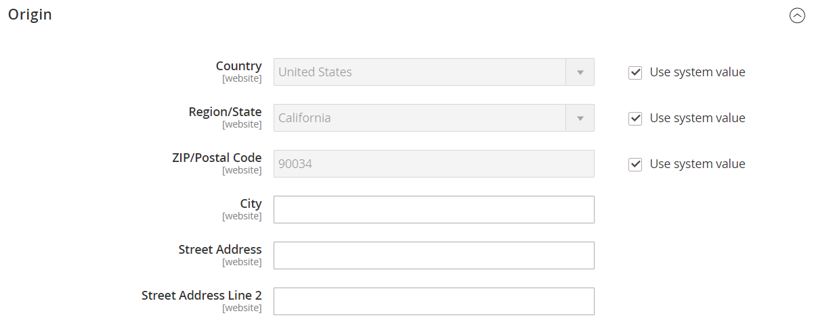

# [!UICONTROL Sales] > [!UICONTROL Shipping Settings]

{{config}}

이러한 설정 변경에 대한 자세한 내용은 _저장 및 구매 경험 안내서_&#x200B;에서 [배송 설정](../../stores-purchase/shipping-settings.md)을 참조하세요.

## [!UICONTROL Origin]

<!-- zoom -->

| 필드 | [범위](../../getting-started/websites-stores-views.md#scope-settings) | 설명 |
|--- |--- |--- |
| [!UICONTROL Country] | 웹 사이트 | 원산지국. |
| [!UICONTROL Region/State] | 웹 사이트 | 원점 영역 또는 상태입니다. |
| [!UICONTROL ZIP/Postal Code] | 웹 사이트 | 출발지 ZIP 또는 우편 번호. |
| [!UICONTROL City] | 웹 사이트 | 원점 도시. |
| [!UICONTROL Street Address] | 웹 사이트 | 출발지 주소. |
| [!UICONTROL Street Address Line 2] | 웹 사이트 | 필요한 경우 출발지 주소 추가 줄. |

{style="table-layout:auto"}

## [!UICONTROL Shipping Policy Parameters]

<!-- zoom -->

| 필드 | [범위](../../getting-started/websites-stores-views.md#scope-settings) | 설명 |
|--- |--- |--- |
| [!UICONTROL Apply Custom Shipping Policy] | 웹 사이트 | 체크아웃 중에 배송 정책이 표시되는지 여부를 결정합니다. 옵션: `Yes` / `No` |
| [!UICONTROL Shipping Policy] | 스토어 뷰 | 배송 정책을 텍스트로 포함합니다. |

{style="table-layout:auto"}

## [!UICONTROL Shipment Tracking URLs]

[!BADGE SaaS만]{type=Positive url="https://experienceleague.adobe.com/ko/docs/commerce/user-guides/product-solutions" tooltip="Adobe Commerce as a Cloud Service 프로젝트에만 적용됩니다(Adobe 관리 SaaS 인프라)."}

<!-- zoom -->

| 필드 | [범위](../../getting-started/websites-stores-views.md#scope-settings) | 설명 |
|--- |--- |--- |
| [!UICONTROL Enable Custom Tracking URLs] | 스토어 뷰 | 쇼핑객 이메일에 전송된 배송 추적 번호가 링크인지 일반 텍스트인지 결정합니다. 기본값인 `No`은(는) 숫자가 일반 텍스트임을 나타냅니다. 옵션: `Yes` / `No` |
| [!UICONTROL USPS Tracking URL] | 스토어 뷰 | 미국 우편 서비스 배송에 대한 URL 템플릿입니다. |
| [!UICONTROL UPS Tracking URL] | 스토어 뷰 | 통합 소포 서비스 배송에 대한 URL 템플릿입니다. |
| [!UICONTROL FedEx Tracking URL] | 스토어 뷰 | Federal Express 배송의 URL 템플릿입니다. |
| [!UICONTROL DHL Tracking URL] | 스토어 뷰 | DHL Express 발송을 위한 URL 템플릿. |

{style="table-layout:auto"}
