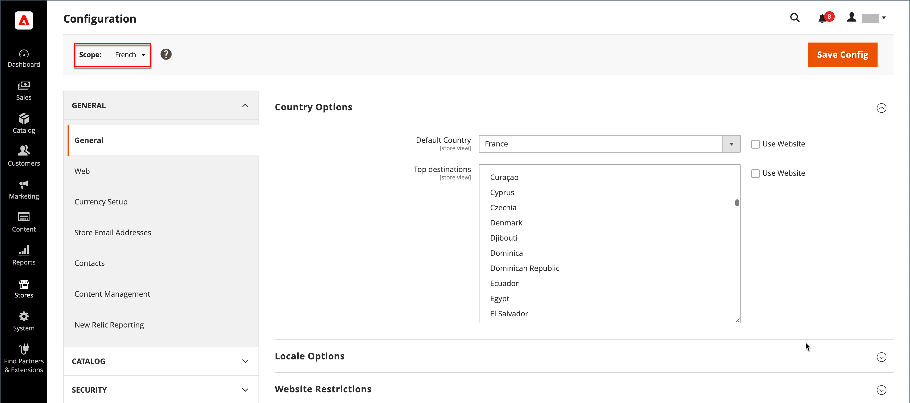

# 구성 범위

많은 구성 페이지의 왼쪽 위 모서리에 있는 보기 저장 선택기는 특정 범위에 대한 페이지 보기를 필터링하고 Commerce에서 사용하는 일부 엔티티의 값을 설정합니다. 이 워크플로우는 이름이 계층의 각 수준을 나열하며 범위를 다른 수준으로 변경하는 데 사용됩니다. 현재 범위를 나타내는 모든 설정은 회색으로 표시되므로 현재 범위 설정을 나타내는 설정만 사용할 수 있습니다. 범위는 처음에 _기본 구성_(으)로 설정됩니다. 제한된 액세스 권한을 가진 관리자의 경우 사용 가능한 저장소 보기 목록에는 사용자가 액세스할 수 있는 [권한](../systems/permissions.md)이 있는 항목만 포함됩니다.

| 레벨 | 설명 |
|--- |--- |
| [!UICONTROL Default Config] | 기본 시스템 구성입니다. |
| [!UICONTROL Main Website] | 계층 맨 위에 있는 웹 사이트의 이름입니다. |
| [!UICONTROL Main Website Store] | 상위 웹 사이트와 연결된 기본 스토어의 이름입니다. |
| [!UICONTROL Default Store View] | 상위 스토어와 연결된 기본 스토어 보기의 이름입니다. |
| [!UICONTROL Stores Configuration] | 저장소 그리드로 이동하여 관리자 사이드바에서 [!UICONTROL Stores] > [!UICONTROL All Stores]을(를) 선택하는 것과 같습니다. |

{style="table-layout:auto"}

{width="700" zoomable="yes"}

## [!UICONTROL Use system value]

많은 구성 설정 오른쪽에 있는 _[!UICONTROL Use System Value]_확인란은 현재 구성 범위 내에서 기본 필드 값을 적용하거나 재정의하는 데 사용됩니다. 확인란을 선택하면 기본 필드 값을 변경할 수 없습니다. 값을 변경하려면 확인란의 선택을 취소하고 새 값을 입력합니다. 시스템 값을 변경할 때마다 확인하라는 메시지가 표시됩니다.

확인란 레이블은 현재 범위에 따라 변경되며 항상 범위 계층 구조에서 한 단계 위의 상위 수준을 참조합니다. 상위 수준은 해당 수준 아래의 모든 항목에 대한 컨테이너이므로, 상위 수준의 범위 설정은 재정의되지 않는 한 상속됩니다.

## 기본값 옵션

| 확인란 | 설명 |
|--- |--- |
| [!UICONTROL Use system value] | 이 확인란은 구성 범위가 `Default Config`(으)로 설정된 경우 나타납니다. |
| [!UICONTROL Use Default] | 이 확인란은 구성 범위가 기본 `Website`(으)로 설정되어 있을 때 나타나며 웹 사이트에 할당된 기본 저장소를 참조합니다. |
| [!UICONTROL Use Website] | 이 확인란은 구성 범위가 특정 저장소 보기로 설정된 경우에 나타납니다. 선택하면 스토어 보기와 연결된 상위 웹 사이트의 설정이 사용됩니다. 이 경우, 웹 사이트와 연관된 기본 스토어에 적용되는 것으로 이해되기 때문에 스토어 레벨은 생략된다. |

{style="table-layout:auto"}

## 범위 설정

특정 웹 사이트, 스토어 또는 스토어 보기에만 적용되는 구성 설정을 만들기 전에 다음을 수행하십시오.

1. _관리자_ 사이드바에서 다음 중 하나를 실행하십시오.

   - 대부분의 구성 설정을 보려면 **[!UICONTROL Stores]** > _[!UICONTROL Settings]_>**[!UICONTROL Configuration]**(으)로 이동하십시오.

   - [디자인 관련 설정](../content-design/configuration.md)의 경우 **[!UICONTROL Content]** > _[!UICONTROL Design]_>**[!UICONTROL Configuration]**(으)로 이동합니다. 그런 다음 격자에서 해당 스토어 뷰를 선택합니다.

1. 변경할 구성 설정으로 이동하여 다음을 수행합니다.

   - 왼쪽 상단 모서리에서 구성이 적용되는 특정 보기로 **[!UICONTROL Store View]**&#x200B;을(를) 설정합니다. 범위 전환을 확인하는 메시지가 표시되면 **[!UICONTROL OK]**&#x200B;을(를) 클릭합니다.

     각 필드 뒤에 확인란이 표시되며 추가 필드를 사용할 수 있습니다.

   - 편집할 필드 뒤에 있는 **[!UICONTROL Use system value]** 확인란의 선택을 취소합니다. 그런 다음 뷰 값을 업데이트합니다.

   - 페이지에서 업데이트해야 하는 모든 필드에 대해 이 프로세스를 반복합니다.

   {width="700" zoomable="yes"}

1. 완료되면 **[!UICONTROL Save Config]**&#x200B;을(를) 클릭합니다.

## 범위 빠른 참조

| 범위 | 설명 |
|--- |--- |
| **[!UICONTROL Global]** |  |
| 관리자 | 설치의 모든 웹 사이트, 스토어 및 스토어 조회수는 동일한 관리자로부터 관리됩니다. |
| 기본 구성 | 전역 [기본 구성](../getting-started/websites-stores-views.md#scope-settings) 설정은 하위 수준에서 재정의되지 않는 한 저장소 계층 구조를 통해 사용됩니다. |
| 카탈로그 | _catalog_ 용어는 제품 데이터베이스 전체를 의미하며 설치 전체에서 사용할 수 있습니다. |
| 제품 가격 | 글로벌 또는 웹 사이트 수준에서 애플리케이션에 대한 제품 가격을 구성할 수 있습니다. |
| 제품 구성 | [구성 가능한 제품](../catalog/product-create-configurable.md) 옵션으로 사용되는 특성에는 전역 범위가 있어야 합니다. |
| 고객 | 글로벌 또는 웹 사이트 수준에서 애플리케이션에 대한 고객 계정을 구성할 수 있습니다. 각 웹 사이트에는 별도의 [고객 계정](../customers/customer-account-scope.md) 집합이 있거나 설치 시 다른 웹 사이트와 고객 계정을 공유할 수 있습니다. |
| **[!UICONTROL Website]** |  |
| 도메인 | 추가 [웹 사이트](../stores-purchase/introduction.md#store-structure)를 기본 도메인의 하위 도메인으로 설정하거나 별도의 IP 주소와 전용 도메인을 가질 수 있습니다. |
| 고객 | 글로벌 또는 웹 사이트 수준에서 애플리케이션에 대한 고객 계정을 구성할 수 있습니다. 각 웹 사이트에는 별도의 [고객 계정](../customers/customer-account-scope.md) 집합이 있거나 설치 시 다른 웹 사이트와 고객 계정을 공유할 수 있습니다. |
| 통화 | 각 웹 사이트에 다른 [기본 통화](../stores-purchase/currency-configuration.md)를 할당할 수 있습니다. 기본 통화는 모든 거래를 처리하는 데 사용됩니다. 단, 스토어 보기의 로케일에 따라 다른 표시 통화가 고객에게 표시될 수 있습니다. |
| 제품 | 개별 제품은 웹 사이트 수준에서 계층에 할당됩니다. 제품 표에는 카탈로그에 있는 모든 제품과 해당 제품을 사용할 수 있는 웹 사이트가 나열됩니다. [웹 사이트의 제품](../catalog/settings-basic-websites.md) 설정은 제품을 사용할 수 있는 각 웹 사이트를 식별합니다. |
| 제품 가격 | 응용 프로그램에 대해 글로벌 또는 웹 사이트 수준에서 [제품 가격](../catalog/catalog-price-scope.md)을 구성할 수 있습니다. |
| 결제 방법 | 각 스토어 보기에 대해 제목과 지침을 구성할 수 있지만 [결제 방법](../stores-purchase/payments.md)은 웹 사이트 수준에서 구성됩니다. |
| 체크아웃 | [체크아웃 프로세스](../stores-purchase/checkout-process.md)는 웹 사이트 수준에서 수행되지만 각 스토어 보기에 대해 일부 표시 옵션을 구성할 수 있습니다. 웹 사이트와 연결된 모든 스토어의 [체크아웃 구성](../stores-purchase/checkout-process.md#checkout-options)이 동일합니다. |
| 허용된 국가 | 허용된 국가는 웹 사이트 수준에서 구성할 수 있습니다. [허용된 국가](../getting-started/store-details.md#country-options) 설정은 체크 아웃에서 고객이 올 수 있는 위치를 제한하는 데 사용됩니다. |
| **[!UICONTROL Store]** |  |
| 도메인 | 여러 스토어를 사용하는 경우 각 스토어는 동일한 도메인, 하위 도메인 또는 명확히 다른 도메인을 가질 수 있습니다. 자세한 내용은 [스토어 추가](../stores-purchase/stores.md#add-stores)를 참조하세요. |
| 루트 범주 | 각 스토어에는 &quot;루트&quot; 카테고리와 하위 카테고리를 기반으로 하는 별도의 제품 세트와 메인 메뉴가 있을 수 있습니다. 각 카탈로그에는 저장소 수준에서 할당된 [루트 범주](../catalog/category-root.md)이(가) 있습니다. |
| **[!UICONTROL Store View]** |  |
| 하위 범주 | 기본 메뉴를 구성하는 [하위 범주](../catalog/category-create.md#category-structure)(루트 아래)은 저장소 보기 수준에서 할당됩니다. |
| 로케일 | 각 스토어 보기에 다른 [로케일](../getting-started/store-details.md#locale-options)을(를) 할당할 수 있습니다. 표시 통화, 측정 단위 및 관리 인터페이스는 로케일에 따라 다릅니다. |
| 언어 | 여러 언어를 지원하려면 각 스토어 보기에 대해 제품 설명을 포함한 모든 콘텐츠가 [번역됨](../stores-purchase/store-localize.md#localize-products)이어야 합니다. |
| 통화 표시 | 기본 통화를 사용하여 웹 사이트 수준에서 트랜잭션이 처리되지만 각 스토어 보기에 대해 다른 [표시 통화](../stores-purchase/currency-configuration.md)를 사용할 수 있습니다. |

{style="table-layout:auto"}
