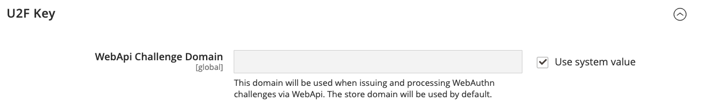

# [!UICONTROL Security] > [!UICONTROL 2FA]

>[!NOTE]
>
>IMS(Adobe Identity Management Services) 인증을 활성화한 저장소에는 기본 Adobe Commerce 및 2FA(Magento Open Source 2단계 인증)가 비활성화되어 있습니다. Adobe 자격 증명으로 Adobe Commerce 인스턴스에 로그인한 관리자는 많은 관리 작업에 대해 다시 인증할 필요가 없습니다. Adobe IMS는 관리자 가 현재 세션에 로그인할 때 인증을 처리합니다. [Adobe IMS와 Adobe Commerce 통합 개요](https://experienceleague.adobe.com/docs/commerce-admin/start/admin/ims/adobe-ims-integration-overview.html?lang=ko)를 참조하십시오.

{{config}}

이러한 설정 변경에 대한 자세한 내용은 _관리 시스템 안내서_&#x200B;에서 [2단계 인증(2FA)](../../systems/security-two-factor-authentication.md)을 참조하십시오.

## [!UICONTROL General]

<!-- zoom -->

| 필드 | [범위](../../getting-started/websites-stores-views.md#scope-settings) | 설명 |
|--- |--- |--- |
| [!UICONTROL Providers to use] | 글로벌 | 필요한 2단계 인증 방법을 나타냅니다. 공급자를 두 개 이상 선택하는 경우 각 사용자는 다음에 로그인할 때 각 2FA 메서드를 구성해야 합니다. |
| [!UICONTROL Configuration Email URL for Web API] | 글로벌 | 사용자 지정 구현의 경우 처음 로그인할 때 _관리자_ 사용자에게 전송되는 대체 전자 메일 구성 링크의 URL입니다. 전자 메일 템플릿에서 자리 표시자 `:tfat`을 사용하여 토큰이 삽입된 위치를 지정하십시오. |
| [!UICONTROL Retry attempt limit for Two-Factor Authentication] | 글로벌 | 계정이 일시적으로 비활성화되기 전에 관리자가 [!DNL one-time password (OTP)]을(를) 입력할 수 있는 횟수를 결정합니다. 기본값: `10` |
| [!UICONTROL Two-Factor Authentication lockout time (seconds)] | 글로벌 | 계정이 일시적으로 비활성화되기 전에 관리자가 [!DNL one-time password (OTP)] 입력을 대기할 수 있는 시간(초)을 결정합니다. 기본값: `300` |

{style="table-layout:auto"}

## [!UICONTROL Google]

<!-- zoom -->

| 필드 | [범위](../../getting-started/websites-stores-views.md#scope-settings) | 설명 |
|--- |--- |--- |
| [!UICONTROL OTP Window] | 글로벌 | 만료된 후 시스템에서 관리자 [!DNL one-time-password (OTP)]을(를) 수락하는 시간(초)을 결정합니다. 단일 OTP의 수명(일반적으로 30초)보다 높을 수 없습니다. 기본값: `29` |

{style="table-layout:auto"}

## [!UICONTROL Duo Security]

<!-- zoom -->

| 필드 | [범위](../../getting-started/websites-stores-views.md#scope-settings) | 설명 |
|--- |--- |--- |
| [!UICONTROL Client Id] | 글로벌 | [!DNL Duo Security] 계정의 클라이언트 ID. |
| [!UICONTROL Client Secret] | 글로벌 | [!DNL Duo Security] 계정의 클라이언트 암호입니다. |
| [!UICONTROL Integration Key] | 글로벌 | [!DNL Duo Security] API 계정의 통합 키입니다. |
| [!UICONTROL Secret Key] | 글로벌 | [!DNL Duo Security] API 계정의 비밀 키. |
| [!UICONTROL API Hostname] | 글로벌 | [!DNL Duo Security] 계정의 API 호스트 이름입니다. |

{style="table-layout:auto"}

## [!UICONTROL Authy]

<!-- zoom -->

| 필드 | [범위](../../getting-started/websites-stores-views.md#scope-settings) | 설명 |
|--- |--- |--- |
| [!UICONTROL API Key] | 글로벌 | [!DNL Authy] 계정의 API 키입니다. |
| [!UICONTROL OneTouch Message] | 글로벌 | 로그인 시 [!DNL Authy] 인증자에 표시되는 메시지입니다. 기본값: `Login request to your Magento Admin` |

{style="table-layout:auto"}

## [!UICONTROL U2F Key]

<!-- zoom -->

| 필드 | [범위](../../getting-started/websites-stores-views.md#scope-settings) | 설명 |
|--- |--- |--- |
| [!UICONTROL WebApi Challenge Domain] | 글로벌 | 사용자 지정 WebAPI 구현에 대한 [!DNL WebAuthn] 문제를 발행하고 처리하는 데 사용되는 도메인입니다. |

{style="table-layout:auto"}
