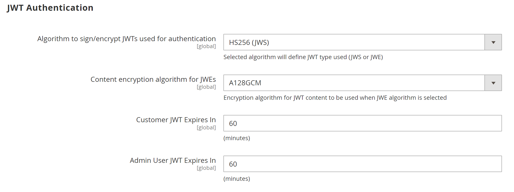

# [!UICONTROL Services] > [!UICONTROL Magento Web API]

{{config}}

<!-- [X-ref](../systems/integrations.md) -->

## [!UICONTROL SOAP Settings]

<!-- zoom -->

| 필드 | [범위](../../getting-started/websites-stores-views.md#scope-settings) | 설명 |
|--- |--- |--- |
| [!UICONTROL Default Response Charset] | 스토어 뷰 | 기본 문자 집합을 결정합니다. 비어 있는 경우 UTF-8이 사용됩니다. |

{style="table-layout:auto"}

## [!UICONTROL GraphQl Input Limits]

<!-- zoom -->

| 필드 | [범위](../../getting-started/websites-stores-views.md#scope-settings) | 설명 |
|--- |--- |--- |
| [!UICONTROL Enable Input Limits] | 스토어 뷰 | GraphQL 호출에 입력 제한을 사용할 수 있는지 여부를 결정합니다. 기본값: `No`. |
| [!UICONTROL Maximum Page Size] | 스토어 뷰 | GraphQL 응답에서 페이지가 매겨진 검색 결과에 허용된 최대 항목 수를 설정합니다. _입력 제한 사용_ = `No`인 경우에는 이 옵션을 사용할 수 없습니다. |

{style="table-layout:auto"}

## [!UICONTROL Web Api Input Limits]

<!-- zoom -->

| 필드 | [범위](../../getting-started/websites-stores-views.md#scope-settings) | 설명 |
|--- |--- |--- |
| [!UICONTROL Enable Input Limits] | 스토어 뷰 | 웹 API 호출에 입력 제한을 사용할 수 있는지 여부를 결정합니다. 기본값: `No`. |
| 입력 목록 제한 | 스토어 뷰 | 웹 API 요청의 엔티티 배열 속성에 허용되는 최대 항목 수를 설정합니다. _입력 제한 사용_ = `No`인 경우에는 이 옵션을 사용할 수 없습니다. |
| [!UICONTROL Maximum Page Size] | 스토어 뷰 | 웹 API 응답에서 페이지가 매겨진 검색 결과에 허용되는 최대 항목 수를 설정합니다. _입력 제한 사용_ = `No`인 경우에는 이 옵션을 사용할 수 없습니다. |
| [!UICONTROL Default Page Size] | 스토어 뷰 | 웹 API 응답에서 페이지가 매겨진 검색 결과의 기본 항목 수를 설정합니다. |

{style="table-layout:auto"}

## [!UICONTROL Web API Security]

<!-- zoom -->

| 필드 | [범위](../../getting-started/websites-stores-views.md#scope-settings) | 설명 |
|--- |--- |--- |
| [!UICONTROL Allow Anonymous Guest Access] | 글로벌 | 게스트가 CMS, 카탈로그에 익명으로 액세스하고 SOAP 및 REST API에서 리소스를 저장할 수 있는지 확인합니다. 기본적으로 익명 게스트 액세스는 허용되지 않습니다. 옵션: `Yes` / `No` |

{style="table-layout:auto"}

## [!UICONTROL JWT Authentication]

<!-- zoom -->

| 필드 | [범위](../../getting-started/websites-stores-views.md#scope-settings) | 설명 |
|--- |--- |--- |
| [!UICONTROL Algorithm to sign/encrypt JWTs used for authentication] | 글로벌 | JWT(JSON 웹 토큰) 암호화에 사용되는 JWS 또는 JWE 알고리즘의 유형을 지정합니다. |
| [!UICONTROL Content encryption algorithm for JWEs] | 글로벌 | JWE 알고리즘을 선택한 경우 JWT 암호화에 사용되는 콘텐츠 암호화 알고리즘의 유형을 지정합니다. 이 옵션은 JWS 알고리즘에서는 무시됩니다. |
| [!UICONTROL Customer JWT Expires In] | 글로벌 | 고객 JWT 전달자 토큰이 만료될 때까지의 시간(분)을 설정합니다. 이 필드가 비어 있거나 음수 값을 갖는 경우 고객 JWT 전달자 토큰이 30분 후에 만료됩니다. 기본값: `60` |
| [!UICONTROL Admin User JWT Expires In] | 글로벌 | Admin JWT 전달자 토큰이 만료될 때까지의 시간(분)을 설정합니다. 이 필드가 비어 있거나 음수 값을 갖는 경우 관리자 JWT 전달자 토큰이 30분 후에 만료됩니다. 기본값: `60` |

{style="table-layout:auto"}
