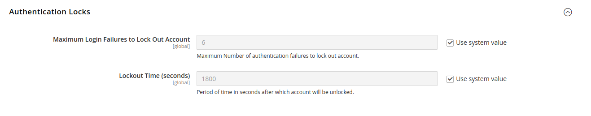

# [!UICONTROL Services] > [!UICONTROL OAuth]

{{config}}

## [!UICONTROL Access Token Expiration]

<!-- zoom -->

| 필드 | [범위](../../getting-started/websites-stores-views.md#scope-settings) | 설명 |
|--- |--- |--- |
| [!UICONTROL Customer Token Lifetime (hours]) | 글로벌 | 고객 API 토큰이 만료되기 전 시간(시간)을 결정합니다. 필드가 비어 있으면 고객 토큰이 만료되지 않습니다. 기본값: `1` |
| [!UICONTROL Admin Token Lifetime (hours)] | 글로벌 | 관리 API 토큰이 만료될 때까지의 시간(시간)을 결정합니다. 필드가 비어 있으면 관리 토큰이 만료되지 않습니다. 기본값: `4` |

{style="table-layout:auto"}

>[!NOTE]
>
>전달자 고객 및 관리자 API 토큰 수명 및 암호화 알고리즘은 [JWT 인증](magento-web-api.md#jwt-authentication) 구성 설정에 의해 제어됩니다.

## [!UICONTROL Cleanup Settings]

<!-- zoom -->

| 필드 | [범위](../../getting-started/websites-stores-views.md#scope-settings) | 설명 |
|--- |--- |--- |
| [!UICONTROL Cleanup Probability] | 글로벌 | 정리를 시작하기 전 OAuth 요청 횟수를 지정합니다. 정리를 비활성화하려면 `0`을(를) 입력하지 마십시오. |
| [!UICONTROL Enable WSDL Cache] | 글로벌 | 항목이 정리되기 전 항목의 보존 기간을 분 단위로 결정합니다. |

{style="table-layout:auto"}

## [!UICONTROL Consumer Settings]

<!-- zoom -->

| 필드 | [범위](../../getting-started/websites-stores-views.md#scope-settings) | 설명 |
|--- |--- |--- |
| [!UICONTROL OAuth consumer credentials HTTP Post timeout] | 글로벌 | 고객이 자격 증명을 게시할 때 시스템이 시간 초과되는 데 걸리는 시간(초)을 지정합니다. |
| [!UICONTROL OAuth consumer credentials HTTP Post maxredirects] | 글로벌 | 소비자 자격 증명 게시와 관련된 최대 리디렉션 수를 지정합니다. |
| [!UICONTROL Expiration Period] | 글로벌 | OAuth 토큰 교환이 시작된 후 사용하지 않은 키/암호가 만료될 때까지 남은 시간(초)을 결정합니다. |

{style="table-layout:auto"}

## [!UICONTROL Authentication Locks]

<!-- zoom -->

| 필드 | [범위](../../getting-started/websites-stores-views.md#scope-settings) | 설명 |
|--- |--- |--- |
| [!UICONTROL Maximum Login Failures to Lock Out Account] | 글로벌 | 계정을 잠글 최대 인증 실패 수를 지정합니다. |
| [!UICONTROL Lockout Time (seconds)] | 글로벌 | 계정이 잠금 해제된 후 걸리는 시간을 초 단위로 지정합니다. |

{style="table-layout:auto"}
