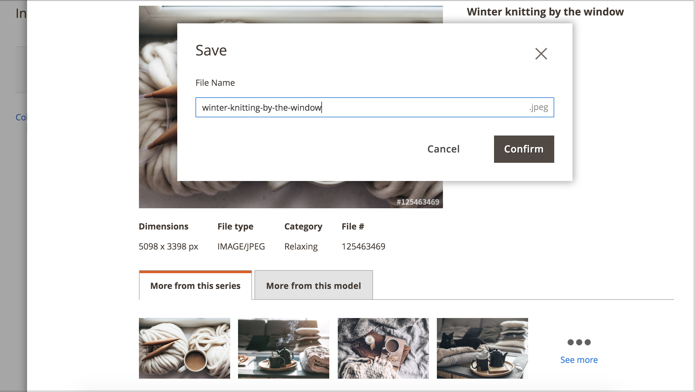

# Adobe Stock 이미지에 라이센스 부여

프로덕션 Adobe Commerce 및 Magento Open Source 스토어에 사용하려는 Adobe Stock 자산에 라이센스가 있어야 합니다. 이 라이선스는 이미지에 대한 법적 액세스 권한을 보장하며 모든 [이미지 미리 보기](./adobe-stock-save-preview.md)에 있는 Adobe Stock 워터마크를 제거합니다. 이미지에 라이선스를 부여하거나 이미 라이선스가 부여된 이미지를 저장하려면 Adobe 계정에 로그인해야 합니다.

새 [[!DNL Media Gallery]](media-gallery.md)은(는) Adobe Stock과 직접 통합되므로 갤러리 페이지에서 직접 이미지에 라이선스를 부여하기가 쉽습니다.

>[!BEGINSHADEBOX]

**전제 조건**

Adobe Stock 라이선스 기능은 [Adobe Stock 통합](./adobe-stock.md)이 설치 및 구성된 경우에만 사용할 수 있습니다. [Adobe Stock][adobe-stock] 이미지에 라이선스를 부여하려면 유료 Adobe Stock 플랜과 [Adobe 계정][adobe-signin]이 필요합니다.

>[!ENDSHADEBOX]

## 새 [!DNL Media Gallery]에서 이미지 라이선스 부여

1. _관리자_ 사이드바에서 **[!UICONTROL Content]** > _[!UICONTROL Media]_>**[!UICONTROL Media Gallery]**(으)로 이동합니다.

1. [Adobe Stock 이미지 사용](./adobe-stock-manage.md)의 단계에 따라 로그인하고 미리 보기 이미지를 [미디어 저장소](./media-storage.md)에 저장합니다.

   {width="600" zoomable="yes"}

1. 이미지 아래의 세 점({width="10" zoomable="no"})을 클릭한 다음 **[!UICONTROL License]**&#x200B;을(를) 클릭합니다.

   {width="600" zoomable="yes"}

   >[!NOTE]
   >
   >로그인하지 않은 경우 로그인 양식이 나타납니다. 로그인에 대한 자세한 내용은 [Adobe Stock 이미지 사용](./adobe-stock-manage.md)을 참조하세요.

1. 라이선스 확인 대화 상자에서 **[!UICONTROL Confirm]**&#x200B;을(를) 클릭하여 이미지에 라이선스를 부여합니다.

   {width="350" zoomable="yes"}

   >[!NOTE]
   >
   >이미지에 라이선스를 부여하려면 계정에서 [Adobe Stock 크레딧][stock-credits]을(를) 사용할 수 있어야 합니다.

## 표준 미디어 스토리지에서 이미지 라이센스 부여

1. [Adobe Stock 검색 그리드에 액세스][adobe-stock-manage.md].

1. [이미지 세부 정보를 보려면][adobe-stock-manage.md#view-image-details] 검색 그리드에서 이미지를 순서대로 클릭합니다.

1. 이미지의 현재 라이센스 상태에 따라 다음 중 하나를 수행합니다.

   - 이미지에 이미 라이선스가 부여된 경우 **[!UICONTROL Save]**&#x200B;을(를) 클릭합니다.

   - 이미지에 라이선스를 부여한 _라이선스가 없음_&#x200B;인 경우 **[!UICONTROL License and Save]**&#x200B;을(를) 클릭합니다.

     >[!NOTE]
     >
     >이미지에 라이선스를 부여하려면 계정에서 [Adobe Stock 크레딧][stock-credits]을(를) 사용할 수 있어야 합니다.

   이 작업은 이미지를 [미디어 저장소](./media-storage.md)에 저장하는 데 사용되는 파일 이름을 지정하라는 메시지를 표시합니다. 기본 파일 이름이 제공되지만 기본 설정에 따라 이름을 사용자 지정할 수 있습니다.

   {width="550" zoomable="yes"}

1. **[!UICONTROL Confirm]**&#x200B;을(를) 클릭합니다.

   페이지가 미디어 스토리지로 리디렉션되고 저장된 미리보기가 표시됩니다.

[access-search]: adobe-stock-manage.md#access-the-adobe-stock-search-grid
[view-details]: adobe-stock-manage.md#view-image-details
[stock-credits]: https://helpx.adobe.com/kr/stock/help/credit-packs.html
[adobe-stock]: https://stock.adobe.com
[adobe-signin]: https://helpx.adobe.com/kr/manage-account/using/access-adobe-id-account.html
