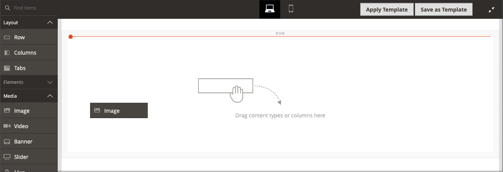
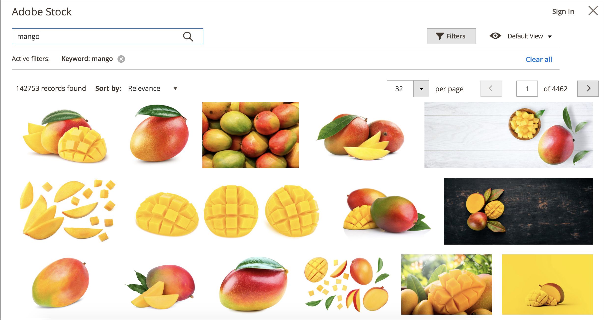
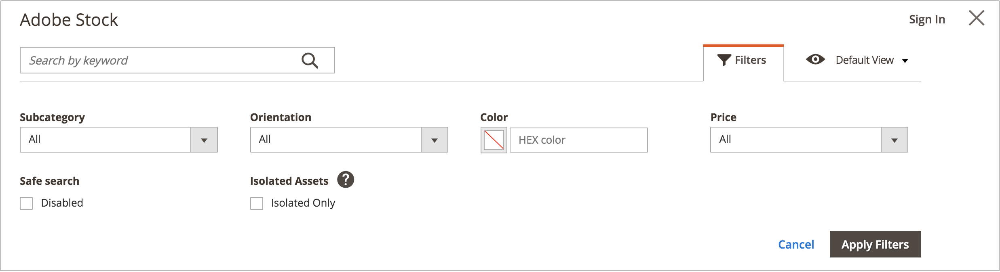
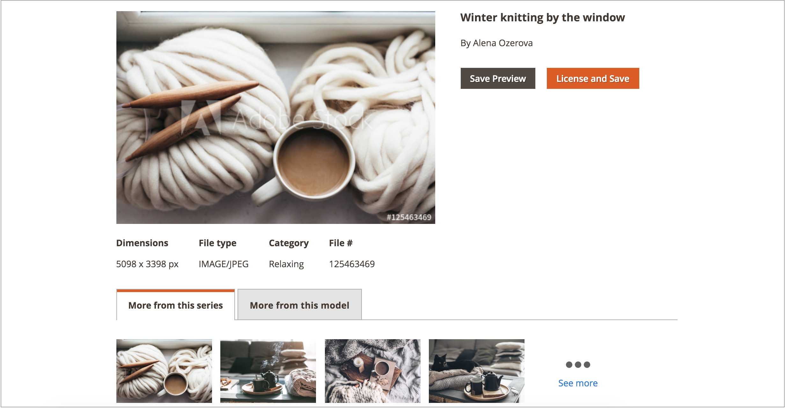

# Adobe Stock 이미지 사용

[Adobe Stock](https://stock.adobe.com) 이미지를 사용하여 이미지 콘텐츠를 업로드할 수 있습니다. 한 가지 일반적인 사용 사례는 페이지를 만들 때 이미지 콘텐츠를 업로드하고 배치하는 것입니다.

[[!DNL Media Gallery]](media-gallery.md)은(는) Adobe Stock과 직접 통합되므로 갤러리 페이지에서 직접 이미지에 라이선스를 부여하기가 쉽습니다.

## Adobe Stock 검색 그리드 액세스

[페이지를 추가 또는 편집](page-add.md), [카테고리를 만들기 또는 편집](../catalog/category-create.md) 또는 [콘텐츠 편집기를 통해 이미지 삽입](editor-insert-image.md)할 때 Adobe Stock 검색 패널에 액세스할 수 있습니다.

**_Adobe Stock 자산을 검색하고 주식 이미지를 페이지에 추가하려면:_**

1. _관리자_ 사이드바에서 **[!UICONTROL Content]** > _[!UICONTROL Elements]_>**[!UICONTROL Pages]**(으)로 이동합니다.

1. **[!UICONTROL Add a New Page]**&#x200B;을(를) 클릭합니다.

   기존 페이지를 편집하려면 _[!UICONTROL Action]_열을 사용하여&#x200B;**[!UICONTROL Select]**을(를) 클릭하고&#x200B;**[!UICONTROL Edit]**을(를) 선택할 수 있습니다.

1. **[!UICONTROL Content]** 섹션에서 를 확장하고 다음을 수행합니다.

   - [WYSIWYG 편집기를 사용하도록 설정](editor.md)한 경우 **[!UICONTROL Show/Hide Editor]**&#x200B;을(를) 클릭한 다음 **[!UICONTROL Insert Image]**&#x200B;을(를) 클릭합니다.

   - [페이지 빌더를 사용하도록 설정](../page-builder/setup.md)한 경우 **[!UICONTROL Media]** 패널을 확장하고 **[!UICONTROL Image]** 자리 표시자를 대상 컨테이너로 끕니다. **[!UICONTROL Select from Gallery]**&#x200B;을(를) 클릭합니다.

     {width="600" zoomable="yes"}

1. **[!UICONTROL Search Adobe Stock]**&#x200B;을(를) 클릭합니다.

**_Adobe Stock 자산을 검색하고 주식 이미지를 범주에 추가하려면:_**

1. _관리자_ 사이드바에서 **[!UICONTROL Catalog]** > **[!UICONTROL Categories]**(으)로 이동합니다.

1. **[!UICONTROL Add Root Category]** 또는 **[!UICONTROL Add Subcategory]**&#x200B;을(를) 클릭합니다.

   기존 카테고리에 이미지를 추가하려면 왼쪽 목록에서 카테고리 이름을 클릭합니다.

1. **[!UICONTROL Content]** 섹션을 확장하고 _[!UICONTROL Category Image]_에서&#x200B;**[!UICONTROL Select from Gallery]**을(를) 클릭합니다.

1. **[!UICONTROL Search Adobe Stock]**&#x200B;을(를) 클릭합니다.

WYSIWYG 편집기에서 Adobe Stock 에셋을 검색하고 스톡 이미지를 추가하려면 다음을 수행하십시오.

1. **[!UICONTROL Show/Hide Editor]**&#x200B;을(를) 클릭합니다.

1. **[!UICONTROL Insert Image]**&#x200B;을(를) 클릭합니다.

1. **[!UICONTROL Search Adobe Stock]**&#x200B;을(를) 클릭합니다.

   {width="600" zoomable="yes"}

## Adobe Stock 에셋 필터링 및 검색

[Adobe Stock 검색 그리드](#access-the-adobe-stock-search-grid)는 쿼리 및 필터링 기능을 제공하여 [!DNL Commerce] 스토어에 적합한 이미지를 찾을 수 있도록 도와줍니다.

기본적으로 표시되는 검색 결과는 수백 개의 검색 결과가 있는 Adobe Stock에서 선별한 갤러리에서 가져온 것입니다. 자체 키워드 검색을 적용하면 Adobe Stock을 통해 사용할 수 있는 수백만 개의 자산을 검색하는 것입니다.

### 키워드로 Adobe Stock 에셋 검색

1. [Adobe Stock 검색 그리드에 액세스](#access-the-adobe-stock-search-grid).

1. 왼쪽 상단의 **[!UICONTROL Search by keyword]** 입력 필드에 키워드 검색을 입력하고 돋보기를 클릭하거나 **Enter**&#x200B;를 누릅니다.

   {width="600" zoomable="yes"}

### Adobe Stock 에셋 필터링

1. [Adobe Stock 에셋에 대한 키워드 검색 실행](#search-for-adobe-stock-assets-by-keywords).

1. **[!UICONTROL Filters]**&#x200B;을(를) 클릭합니다.

   검색 결과를 구체화하는 데 사용할 수 있는 몇 가지 필터가 있습니다.

   | 필터 | 설명 |
   |---|---|
   | [!UICONTROL Subcategory] | **사진** 또는 **일러스트레이션**&#x200B;인 이미지 필터링 |
   | [!UICONTROL Orientation] | 크기, 모양 및 특성별로 이미지 필터링 |
   | [!UICONTROL Color] | 색상 팔레트를 사용하여 색상별로 이미지 필터링 |
   | [!UICONTROL Price] | 비용에 따라 이미지 필터링 |
   | [!UICONTROL Safe search] | 안전 검색 활성화 또는 비활성화 |
   | [!UICONTROL Isolated Assets] | 주제가 단색 배경에 단독으로 표시되는 _격리된 자산_(으)로만 표시를 제한합니다. |

   {style="table-layout:auto"}

   {width="600" zoomable="yes"}

1. **[!UICONTROL Apply Filters]**&#x200B;을(를) 클릭합니다.

   검색 결과 그리드가 세분화된 검색으로 업데이트됩니다.

## 이미지 세부 사항 보기

각 이미지에는 보기에 사용할 수 있는 세부 사항이 있습니다. [이미지 미리 보기 저장](adobe-stock-save-preview.md) 또는 [이미지 저장(및 선택적으로 라이선스 부여)](adobe-stock-license-image.md)과 같은 추가 이미지 관련 작업은 이 자세히 보기를 통해 사용할 수 있습니다.

1. [Adobe Stock 검색 그리드에 액세스](#access-the-adobe-stock-search-grid).

1. 검색 결과에서 이미지를 클릭합니다.

   다음과 같은 추가 이미지 세부 정보가 표시됩니다.

   - 더 큰 버전의 이미지
   - _[!UICONTROL Dimensions]_,_[!UICONTROL File type]_, _[!UICONTROL Category]_,_[!UICONTROL File]_ 및 _키워드_&#x200B;와 같은 이미지 메타데이터
   - 동일한 _시리즈_ 또는 _모델_&#x200B;의 이미지와 같은 관련 이미지
   - [[!UICONTROL Save Preview]](adobe-stock-save-preview.md) 및 [[!UICONTROL Save (and optionally license) Image]](adobe-stock-license-image.md)과(와) 같은 작업 단추

     {width="600" zoomable="yes"}

## Adobe 계정에 로그인

이미지에 대한 완전한 액세스 권한을 얻고 Adobe Stock 워터마크를 제거하려면 이미지를 사용하려면 [Adobe 계정으로 로그인](https://helpx.adobe.com/manage-account/using/access-adobe-id-account.html)하고 라이선스 권한에 대한 크레딧을 구매해야 합니다.

1. [Adobe Stock 검색 그리드에 액세스](#access-the-adobe-stock-search-grid).

1. 오른쪽 상단의 **[!UICONTROL Sign In]**&#x200B;을(를) 클릭합니다.

   새 브라우저 창에서 [Adobe 로그인 프로세스](https://helpx.adobe.com/manage-account/using/access-adobe-id-account.html)를 안내합니다.

   로그인 프로세스가 완료되면 라이선스가 부여된 이미지 상태가 검색 결과에 레이블로 표시됩니다.

   {width="600" zoomable="yes"}

### 검색 결과의 라이선스 상태 보기

[Adobe 계정에 로그인](#log-in-to-your-adobe-account).

Adobe 계정과 연결된 라이선스가 부여된 모든 이미지에는 레이블이 표시되어 라이선스가 부여된 이미지를 명확히 합니다.

{width="600" zoomable="yes"}

### 미디어 저장소에 이미지 저장

Adobe Stock 통합을 사용하여 검색된 이미지를 [!DNL Commerce] [미디어 저장소](media-storage.md)에 저장하여 [!DNL Commerce] 저장소에서 쉽게 재사용할 수 있습니다.

[이미지 미리 보기](adobe-stock-save-preview.md) 또는 [라이선스가 부여된 이미지](adobe-stock-license-image.md)의 두 가지 유형의 이미지를 저장할 수 있습니다.

#### 이미지 미리 보기 저장

이미지 미리 보기는 Adobe Stock 에셋의 워터마크가 지정된 버전입니다. 이미지 미리 보기는 무료이며, 특정 이미지에 대한 라이선스를 구입하고 프로덕션 스토어에서 사용하기 전에 다른 이미지를 실험해 볼 수 있는 좋은 방법입니다.

1. [Adobe Stock 검색 그리드에 액세스](#access-the-adobe-stock-search-grid).

1. [이미지 세부 정보를 보려면](#view-image-details) 검색 그리드에서 이미지를 클릭하십시오.

1. **[!UICONTROL Save Preview]**&#x200B;을(를) 클릭합니다.

   이 작업은 이미지를 미디어 저장소에 저장하는 데 사용되는 파일 이름을 지정하라는 메시지를 표시합니다. 기본 파일 이름이 제공되지만 기본 설정에 따라 이름을 사용자 지정할 수 있습니다.

   {width="500" zoomable="yes"}

1. **[!UICONTROL Confirm]**&#x200B;을(를) 클릭합니다.

   페이지가 미디어 스토리지로 리디렉션되고 저장된 미리보기가 표시됩니다.

#### 라이선스가 부여된 이미지 저장

프로덕션 [!DNL Commerce] 스토어에 사용하려는 Adobe Stock 자산에 라이선스가 부여되어야 합니다. 라이선스를 부여하면 이미지에 대한 법적 액세스 권한을 보유하고 모든 [이미지 미리 보기](adobe-stock-save-preview.md)에 있는 Adobe Stock 워터마크를 제거할 수 있습니다. 이미지에 라이선스를 부여하거나 이미 라이선스가 부여된 이미지를 저장하려면 Adobe 계정에 로그인해야 합니다.

1. [Adobe 계정에 로그인](#log-in-to-your-adobe-account).

1. [이미지 세부 정보를 보려면](#view-image-details) 검색 그리드에서 이미지를 클릭하십시오.

1. 이미지의 현재 라이센스 상태에 따라 다음 중 하나를 수행합니다.

   - 이미지에 이미 라이선스가 부여된 경우 **[!UICONTROL Save]**&#x200B;을(를) 클릭합니다.

   - 이미지에 라이선스를 부여한 _라이선스가 없음_&#x200B;인 경우 **[!UICONTROL License and Save]**&#x200B;을(를) 클릭합니다.

     >[!NOTE]
     >
     >이미지에 라이선스를 부여하려면 계정에서 [Adobe Stock 크레딧](https://helpx.adobe.com/stock/help/credit-packs.html)을(를) 사용할 수 있어야 합니다.

   이 작업은 이미지를 [미디어 저장소](media-storage.md)에 저장하는 데 사용되는 파일 이름을 지정하라는 메시지를 표시합니다. 기본 파일 이름이 제공되지만 기본 설정에 따라 이름을 사용자 지정할 수 있습니다.

1. **[!UICONTROL Confirm]**&#x200B;을(를) 클릭합니다.

   페이지가 미디어 스토리지로 리디렉션되고 저장된 미리보기가 표시됩니다.
