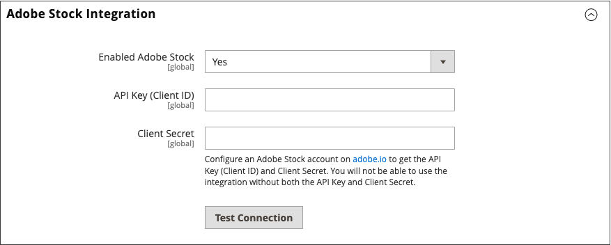

# Adobe Stock 통합

스토어에서 사용할 수 있는 수많은 미디어 자산에 액세스하려면 [Adobe Stock][adobe-stock]을(를) [!UICONTROL Commerce]과(와) 통합하십시오.

{width="700" zoomable="yes"}

Adobe Stock 서비스는 기업에게 모든 광고 프로젝트를 위해 고품질로 큐레이팅된 로열티가 없는 수백만 장의 사진, 벡터, 일러스트레이션, 비디오, 템플릿 및 3D 자산에 대한 액세스를 제공합니다. [!DNL Commerce]명의 사용자가 Adobe Stock 에셋을 빠르게 찾고, 미리 보고, 라이선스를 제공할 수 있습니다. 사용자는 관리 작업 영역을 종료하지 않고도 [미디어 저장소](./media-storage.md)에 저장할 수도 있습니다.

## 사전 요구 사항

이 통합에는 다음이 필요합니다.

- [Adobe Developer][dev-console] 계정
- Adobe Commerce 또는 Magento Open Source, 2.3.4 이상

Adobe Stock 이미지에 라이선스를 부여하려면 다음 작업을 수행하십시오.

- [Adobe 계정][adobe-signin]
- 계정과 연결된 유료 [Adobe Stock][adobe-stock] 플랜

## [!DNL Commerce]과(와) Adobe Stock 통합

Adobe Commerce에 대한 Adobe Stock 통합 구성은 두 단계 프로세스입니다.

1. API 키를 생성하려면 [adobe.developer 통합을 만듭니다](#create-an-adobe-developer-integration)
1. [Commerce 관리에서 Adobe Stock 통합 구성](#configure-the-adobe-stock-integration)

### Adobe Developer 통합 만들기

1. [Adobe Developer Console][dev-console]&#x200B;(으)로 이동합니다.

1. _[!UICONTROL Quick Start]_&#x200B;에서&#x200B;**[!UICONTROL Create new project]**&#x200B;을(를) 클릭합니다.

1. _[!UICONTROL Project overview]_&#x200B;블록에서&#x200B;**[!UICONTROL Add API]**&#x200B;을(를) 클릭합니다.

1. 통합 목록에서 **[!UICONTROL Adobe Stock]**&#x200B;을(를) 선택하고 **[!UICONTROL Next]**&#x200B;을(를) 클릭합니다.

1. OAuth 2.0 **[!UICONTROL Web App]**&#x200B;을(를) 선택합니다.

1. **[!UICONTROL redirect URI]**&#x200B;을(를) 지정하십시오.

   기본 리디렉션 URI는 `${HOST}/${ADMIN_URI}/adobe_ims/oauth/callback/` 형식(예: `https://store.myshop.com/admin_hgkq1l/adobe_ims/oauth/callback/`)입니다. 여기서,

   - `${HOST}`은(는) [!DNL Commerce] 정규화된 도메인 이름입니다(예: `https://store.myshop.com`).
   - `${ADMIN_URI}`은(는) `magento info:adminuri`을(를) 실행하여 검색할 수 있는 [!DNL Commerce] 관리자 URI(예: `admin_hgkq1l`)입니다.

1. 두 가지 차이점이 있는 리디렉션 URI와 동일한 **[!UICONTROL Redirect URI pattern]**&#x200B;을(를) 지정하십시오.

   - 모든 마침표(`.`)는 두 개의 백슬래시(`\\`)로 이스케이프해야 합니다.
   - 패턴 끝에 `.*`을(를) 추가합니다.

   이전 기본 리디렉션 URI의 예제를 사용하면 `https://store\\.myshop\\.com/admin_hgkq1l/adobe_ims/oauth/callback/.*`이(가) 됩니다.

1. **[!UICONTROL Next]**&#x200B;을(를) 클릭합니다.

1. 사용 가능한 범위를 검토하고 **[!UICONTROL Save configured API]**&#x200B;을(를) 클릭합니다.

1. 다음 페이지에서 **[!UICONTROL Client ID]**(API 키) 및 **[!UICONTROL Client secret]**&#x200B;을(를) 복사합니다.

   이 정보는 다음 섹션의 단계에 사용됩니다.

### Adobe Stock 통합 구성

[!DNL Commerce] 관리자의 시스템 구성을 설정하려면 [이전 섹션][create-integration]에서 생성된 _API 키_ 및 _클라이언트 암호_&#x200B;를 사용하십시오.

1. _관리자_ 사이드바에서 **[!UICONTROL Stores]** > _[!UICONTROL Settings]_>**[!UICONTROL Configuration]**(으)로 이동합니다.

1. 왼쪽 패널에서 **[!UICONTROL Advanced]**&#x200B;을(를) 확장하고 **[!UICONTROL System]**&#x200B;을(를) 선택합니다.

1.  **[!UICONTROL Adobe Stock Integration]**&#x200B;을(를) 확장하고 다음을 수행합니다.

   - **[!UICONTROL Enabled Adobe Stock]**&#x200B;을(를) `Yes`(으)로 설정합니다.

   - **[!UICONTROL API Key (Client ID)]**&#x200B;을(를) 입력하십시오.

   - **[!UICONTROL Client Secret]**&#x200B;을(를) 입력하십시오.

   - 키를 확인하려면 **[!UICONTROL Test Connection]**&#x200B;을(를) 클릭하십시오.

   {width="600" zoomable="yes"}

   몇 초 후에 유효성 검사를 수행합니다. 자격 증명이 유효하면 녹색 _연결이 성공했습니다!_&#x200B;개 메시지입니다.

1. 완료되면 **[!UICONTROL Save Config]**&#x200B;을(를) 클릭합니다.

[adobe-stock]: https://stock.adobe.com
[adobe-signin]: https://helpx.adobe.com/kr/manage-account/using/access-adobe-id-account.html
[dev-console]: https://developer.adobe.com/console/home
[create-integration]: #create-an-adobeio-integration
