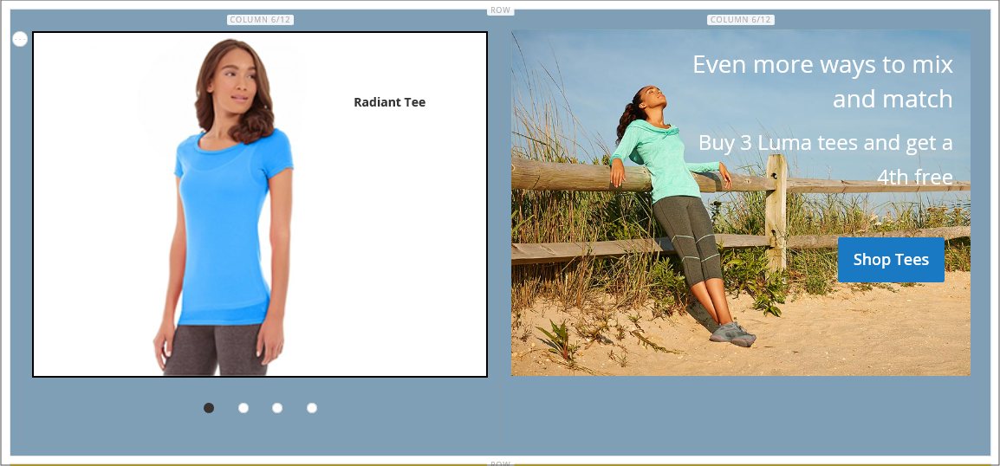

# 콘텐츠 블록 추가

콘텐츠의 사용자 지정 블록을 만든 다음 모든 페이지, 페이지 그룹 또는 다른 블록에 추가할 수 있습니다. 예를 들어 이미지 슬라이더를 블록에 배치한 다음 블록을 홈 페이지에 배치할 수 있습니다. 블록 작업 영역에서는 _페이지_ 작업 영역과 동일한 [기본 컨트롤](pages-workspace.md)을 사용하여 사용 가능한 블록을 찾고 일상적인 유지 관리를 수행하는 데 도움이 됩니다. 차단이 완료되면 [위젯](widget-static-block.md) 도구를 사용하여 저장소의 특정 페이지에 배치할 수 있습니다.

{width="700" zoomable="yes"}

## 블록 만들기

1. _관리자_ 사이드바에서 **[!UICONTROL Content]** > _[!UICONTROL Elements]_>**[!UICONTROL Blocks]**(으)로 이동합니다.

1. 오른쪽 상단 모서리에서 **새 블록 추가**&#x200B;를 클릭합니다.

   {width="500" zoomable="yes"}

1. 새 블록의 기본 사용 상태를 변경하려면 **블록 사용**&#x200B;을(를) `No`(으)로 설정하십시오.

1. 내부 참조를 위해 **블록 제목**&#x200B;을(를) 지정하십시오.

1. 블록에 대해 고유한 **식별자**&#x200B;을(를) 지정하십시오.

   공백 대신 밑줄이 있는 모든 소문자를 사용하십시오.

1. 블록을 사용할 각 **[!UICONTROL Store View]**&#x200B;을(를) 선택하십시오.

1. 표시된 콘텐츠 도구 세트를 사용하여 블록의 콘텐츠를 추가합니다.

   - [페이지 빌더](../page-builder/introduction.md)가 활성화된 경우 [작업 영역](../page-builder/workspace.md)에서 페이지 빌더 도구를 사용하려면 **[!UICONTROL Edit with Page Builder]**&#x200B;을(를) 선택하십시오.

     {width="500" zoomable="yes"}

     >[!NOTE]
     >
     >페이지 빌더를 사용하여 블록을 추가하는 방법에 대한 자세한 내용은 [자습서 2: 블록](../page-builder/2-blocks.md)을 참조하십시오.

   - [편집기](editor.md)를 사용하여 텍스트 서식을 지정하고, 링크를 만들고, 표, 이미지, 비디오 및 오디오를 추가합니다.

     HTML 코드를 사용하려면 **편집기 표시/숨기기**&#x200B;를 클릭하세요.

     {width="500" zoomable="yes"}

1. 완료되면 **[!UICONTROL Save]** 화살표를 클릭하고 **[!UICONTROL Save & Close]**&#x200B;을(를) 선택합니다.

   새 블록은 블록 격자에 있는 목록의 맨 아래에 나타납니다.

1. [위젯](widget-static-block.md) 도구를 사용하여 완료된 블록을 스토어의 특정 페이지에 배치합니다.

## 블록 삭제

사용자 지정 블록을 제거하는 방법에는 두 가지가 있습니다. _블록_ 그리드나 블록 편집 페이지에서 제거할 수 있습니다.

### 방법 1: 블록 그리드에서 블록 제거

1. _관리자_ 사이드바에서 **[!UICONTROL Content]** > _[!UICONTROL Elements]_>**[!UICONTROL Blocks]**(으)로 이동합니다.
1. 그리드 위에서 필터를 사용하여 블록을 찾고 삭제할 하나 이상의 블록에 대한 확인란을 선택합니다.
1. 목록의 왼쪽 상단 모서리에서 **[!UICONTROL Actions]**&#x200B;을(를) `Delete`(으)로 설정합니다.
1. 작업을 확인하려면 **[!UICONTROL OK]**&#x200B;을(를) 클릭합니다.

### 방법 2: 편집 페이지에서 블록 제거

1. _관리자_ 사이드바에서 **[!UICONTROL Content]** > _[!UICONTROL Elements]_>**[!UICONTROL Blocks]**(으)로 이동합니다.
1. 삭제할 블록을 찾습니다.
1. 블록의 _작업_ 열에서 **[!UICONTROL Select]**&#x200B;을(를) 클릭하고 **[!UICONTROL Edit]**&#x200B;을(를) 선택합니다.
1. 메뉴 모음에서 **[!UICONTROL Delete Block]**&#x200B;을(를) 클릭합니다.
1. 작업을 확인하려면 **[!UICONTROL OK]**&#x200B;을(를) 클릭합니다.

## 저장 메뉴

| 명령 | 설명 |
|----------|----------- |
| [!UICONTROL Save] | 현재 블록을 저장하고 작업을 계속합니다. |
| [!UICONTROL Save & Duplicate] | 현재 블록을 저장하고 닫은 다음 새 복사본을 엽니다. |
| [!UICONTROL Save & Close] | 현재 블록을 저장하고 닫은 다음 블록 그리드로 돌아갑니다. |

{style="table-layout:auto"}

## Lightbox 또는 슬라이더 추가

- [[!DNL Page Builder]](../page-builder/introduction.md)을(를) 사용하면 스토어에 [슬라이더](../page-builder/slider.md)를 쉽게 추가할 수 있습니다. 슬라이더는 자동으로 재생되도록 설정하거나 탐색 단추를 사용하여 수동으로 제어할 수 있습니다.

  {width="600" zoomable="yes"}

  [[!DNL Commerce Marketplace]][1]에서 사용할 수 있는 다양한 jQuery 기반 이미지 Lightbox도 있으며 일부는 무료입니다.

- [!DNL Commerce Marketplace]에서 확장을 다운로드할 수도 있습니다. 추가 도움말은 확장 개발자가 제공하는 설명서를 참조하십시오.

[1]: https://marketplace.magento.com/extensions.html?q=lightbox
