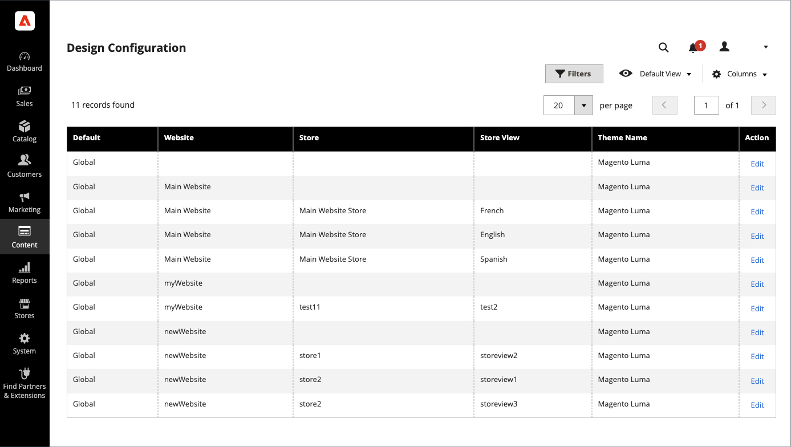

# 디자인 구성

디자인 구성을 사용하면 단일 페이지에 설정을 표시하여 디자인 관련 규칙과 구성 설정을 쉽게 편집할 수 있습니다.

{width="700" zoomable="yes"}

## 디자인 구성 변경

1. 다음에서 _관리자_ 사이드바, 이동 **[!UICONTROL Content]** > _[!UICONTROL Design]_>**[!UICONTROL Configuration]**.

1. 구성할 스토어 보기를 찾아 다음을 클릭합니다. **[!UICONTROL Edit]** 다음에서 _[!UICONTROL Action]_열.

   이 페이지에는 스토어 보기에 대한 현재 디자인 설정이 표시됩니다.

1. 기본 테마를 변경하려면 다음을 설정하십시오. **[!UICONTROL Applied Theme]** 를 뷰에 적용할 테마로 지정합니다.

   테마를 지정하지 않으면 시스템 기본 테마가 사용됩니다. 일부 타사 확장은 시스템 기본 테마를 수정합니다.

1. 테마를 특정 장치에만 사용할 경우에는 **[!UICONTROL User Agent Rules]**.

   {width="400" zoomable="yes"}

   테마를 지정할 각 장치 유형에 대해 다음 작업을 수행하십시오.

   - 클릭 **[!UICONTROL Add New User Agent Rule]**.

   - 대상 **[!UICONTROL Search String]**&#x200B;를 클릭하고 특정 장치의 브라우저 ID를 입력합니다.

     검색 문자열은 일반 표현식 또는 Perl 호환 정규 표현식(PCRE)일 수 있습니다(참조) [사용자 에이전트](https://en.wikipedia.org/wiki/User_agent) 을 참조하십시오. 다음 검색 문자열은 Firefox를 식별합니다.

         /^mozilla/i
     
   - 대상 **[!UICONTROL Theme Name]**&#x200B;지정된 장치에 사용할 테마를 선택합니다.

   >[!NOTE]
   >
   >지정하려는 장치에 대해 여러 규칙을 추가할 수 있습니다. 검색 문자열은 입력한 순서대로 일치합니다.

1. 아래 _[!UICONTROL Other Settings]_를 클릭하고 각 섹션을 확장한 다음 연결된 항목의 지침에 따라 필요에 따라 설정을 편집합니다.

   - [[!UICONTROL Pagination]](../catalog/navigation-product-listings.md#pagination-controls)
   - [[!UICONTROL HTML Head]](page-setup.md#html-head)
   - [[!UICONTROL Header]](page-setup.md#header)
   - [[!UICONTROL Footer]](page-setup.md#footer)
   - [[!UICONTROL Search Engine Robots]](../merchandising-promotions/seo-overview.md#search-engine-robots)
   - [[!UICONTROL Product Image Watermarks]](../catalog/product-image.md#watermarks)
   - [[!UICONTROL Transactional Emails]](../systems/email-templates.md#configure-email-templates)

   {width="500" zoomable="yes"}

1. 완료되면 다음을 클릭하십시오. **[!UICONTROL Save Configuration]**.
