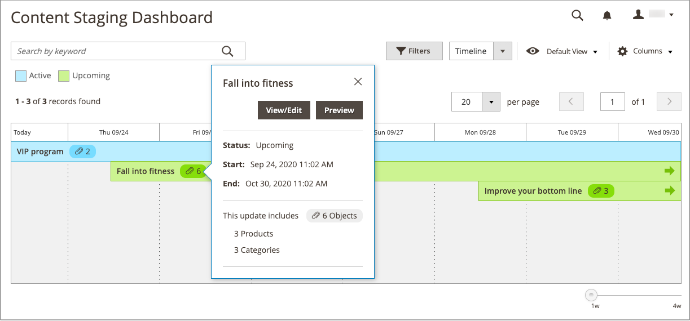

# 캠페인에 항목 추가

{{ee-feature}}

다음 예제에서는 캠페인 중에 카테고리 페이지에 홍보 이미지를 추가합니다. 제품 페이지나 CMS 페이지에 대해서도 동일한 작업을 수행할 수 있습니다.

## 범주에 대한 캠페인 항목 추가

1. _관리자_ 사이드바에서 **[!UICONTROL Catalog]** > **[!UICONTROL Categories]**(으)로 이동합니다.

1. 캠페인에 사용할 카테고리를 찾아 편집 모드로 엽니다.

1. **[!UICONTROL Schedule New Update]**&#x200B;을(를) 클릭합니다.

1. **[!UICONTROL Assign to Existing Campaign]**&#x200B;을(를) 선택합니다.

1. 목록에서 수정할 캠페인을 선택합니다.

   {width="600" zoomable="yes"}

1.  **[!UICONTROL Content]**&#x200B;을 확장합니다.

1. **[!UICONTROL Category Image]**&#x200B;의 경우 **[!UICONTROL Upload]**&#x200B;을(를) 클릭하고 캠페인 중에 카테고리 페이지에 표시할 이미지를 선택하십시오.

   {width="600" zoomable="yes"}

1. 완료되면 **[!UICONTROL Save]**&#x200B;을(를) 클릭합니다.

## 항목 유효성 검사

1. _관리자_ 사이드바에서 **[!UICONTROL Content]** > _[!UICONTROL Content Staging]_>**[!UICONTROL Dashboard]**(으)로 이동합니다.

1. 표시된 목록 또는 타임라인에서 캠페인을 찾아 열고 세부 정보에 액세스합니다.

   - 목록을 표시하려면 **[!UICONTROL Select]**&#x200B;을(를) 클릭한 다음 _[!UICONTROL Action]_열에서&#x200B;**[!UICONTROL View/Edit]**을(를) 클릭합니다.
   - 타임라인을 표시하려면 한 번 클릭하여 요약을 표시한 다음 **[!UICONTROL View/Edit]**&#x200B;을(를) 클릭합니다.

   {width="600" zoomable="yes"}

1.  **[!UICONTROL Categories]**&#x200B;을(를) 확장하여 할당된 범주 목록을 봅니다.

1. 캠페인이 활성 상태일 때 범주에 대한 페이지를 검토하려면 대시보드로 돌아가서 캠페인을 다시 클릭한 다음 **[!UICONTROL Preview]**&#x200B;을(를) 클릭합니다.
