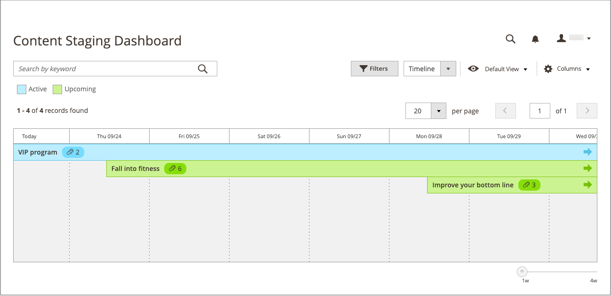
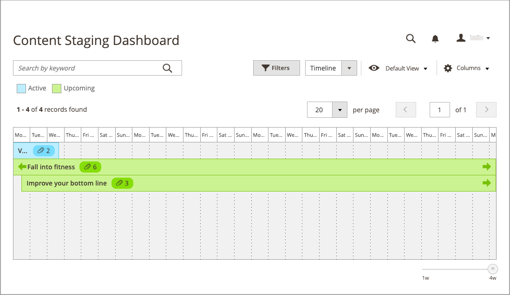
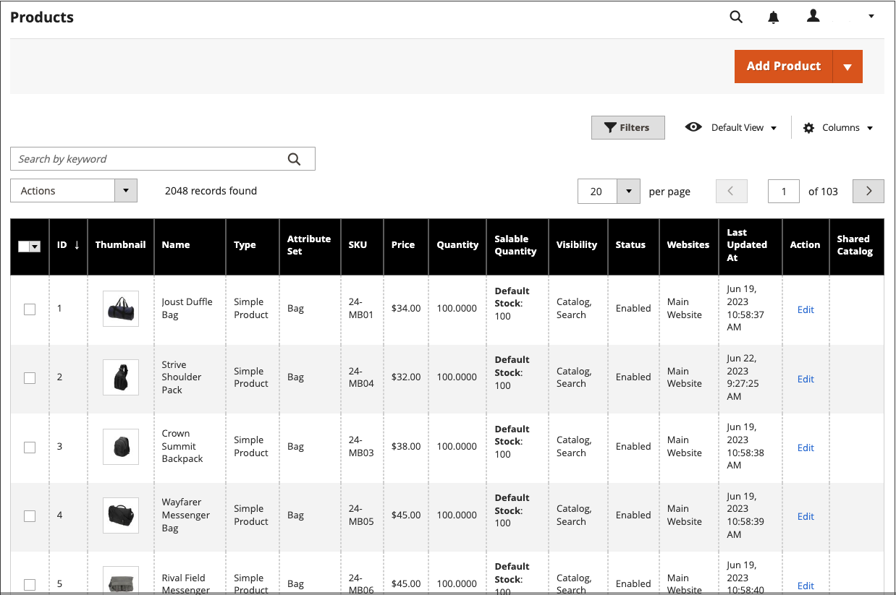

# 컨텐츠 스테이징 대시보드

{{ee-feature}}

[!UICONTROL Content Staging] 대시보드는 모든 활성 캠페인과 예정된 캠페인에 대한 개요를 제공합니다. 대시보드의 형식은 그리드에서 타임라인으로 변경할 수 있습니다. 필터를 사용하여 캠페인을 찾고, 열 레이아웃을 사용자 정의하고, 다양한 그리드 보기를 저장할 수도 있습니다. 작업 영역 컨트롤에 대한 자세한 내용은 [관리 작업 영역](../getting-started/admin-workspace.md)을 참조하세요.

눈금 보기의 {width="600" zoomable="yes"}

## 스테이징 대시보드 보기

1. _관리자_ 사이드바에서 **[!UICONTROL Content]** > _[!UICONTROL Content Staging]_>**[!UICONTROL Dashboard]**(으)로 이동합니다.

1. 대시보드의 형식을 변경하려면 **[!UICONTROL View As]** 컨트롤을 `list`, `Grid` 또는 `Timeline`(으)로 설정하십시오.

   {width="600" zoomable="yes"}

   타임라인이 표시되면 오른쪽 아래 모서리의 슬라이더를 사용하여 보기를 1주에서 4주로 조정할 수 있습니다. 각 열은 1일을 나타냅니다.

1. 타임라인이 표시되면 슬라이더를 오른쪽 끝에 있는 `4w` 위치로 드래그하여 더 긴 시간을 보십시오.

   {width="600" zoomable="yes"}

1. 캠페인에 대한 일반 정보를 표시하려면 페이지의 항목을 클릭합니다.

   - 캠페인을 열려면 **[!UICONTROL View/Edit]**&#x200B;을(를) 클릭합니다.

   - 해당 날짜의 스토어에서 캠페인이 고객에게 어떻게 보이는지 확인하려면 **[!UICONTROL Preview]**&#x200B;을(를) 클릭합니다.

   {width="600" zoomable="yes"}

## 스테이징 대시보드 열 설명

| 열 | 설명 |
|--- |--- |
| [!UICONTROL Status] | 캠페인 상태. `Active` 또는 `Upcoming`. |
| [!UICONTROL Update Name] | 캠페인의 이름입니다. |
| [!UICONTROL Includes] | 캠페인에 포함된 개체 수를 정의합니다. |
| [!UICONTROL Start Time] | 캠페인이 시작되는 날짜입니다. |
| [!UICONTROL End Time] | 캠페인이 종료되는 날짜입니다. |
| [!UICONTROL Description] | 각 캠페인에 대한 추가 설명. |
| [!UICONTROL Action] | 개별 레코드에 적용할 수 있는 작업은 다음과 같습니다.  **[!UICONTROL View/Edit]**- 편집 모드로 캠페인을 엽니다. **[!UICONTROL Preview]** - 캠페인을 미리 보기 모드로 표시합니다. |

{style="table-layout:auto"}

## 캠페인 편집

종료 일자가 없는 가격 규칙 캠페인을 제외하고 스테이징 대시보드에서 기존 캠페인 객체를 편집할 수 있습니다.

>[!NOTE]
>
>가격 규칙이 포함된 캠페인을 처음에 종료 날짜 없이 만든 경우 종료 날짜를 포함하도록 캠페인을 나중에 편집할 수 없습니다. 이러한 경우 중복 캠페인을 만들고 필요한 종료 날짜를 입력해야 합니다.

{width="600" zoomable="yes"}

이 예의 캠페인에는 두 개의 카테고리와 세 개의 개별 제품이 포함됩니다.

이 캠페인에 있는 개체를 편집하려면 아래 단계를 따르십시오.

1. _관리자_ 사이드바에서 **[!UICONTROL Content]** > _[!UICONTROL Content Staging]_>**[!UICONTROL Dashboard]**(으)로 이동합니다.

1. 표시된 목록 또는 타임라인에서 캠페인을 찾아 열고 세부 정보에 액세스합니다.

   - 목록을 표시하려면 **[!UICONTROL Select]**&#x200B;을(를) 클릭한 다음 _[!UICONTROL Action]_열에서&#x200B;**[!UICONTROL View/Edit]**을(를) 클릭합니다.
   - 타임라인을 표시하려면 한 번 클릭하여 요약을 표시한 다음 **[!UICONTROL View/Edit]**&#x200B;을(를) 클릭합니다.

1. 필요에 따라 _[!UICONTROL General]_섹션의 설정을 업데이트합니다.

1. 편집할 항목이 포함된 모든 섹션을 합니다.

   {width="600" zoomable="yes"}

1. **[!UICONTROL Save]**&#x200B;을(를) 클릭합니다.
