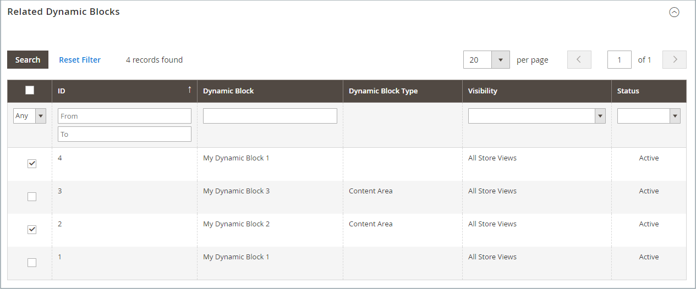

# 가격 규칙의 동적 블록

{{ee-feature}}

만든 [동적 블록](dynamic-blocks.md)은(는) 프로모션과 연결할 수 있습니다. 연결하려면 먼저 동적 블록과 [카탈로그 가격 규칙](../merchandising-promotions/price-rules-catalog.md) 또는 [장바구니 가격 규칙](../merchandising-promotions/price-rules-cart.md)을 모두 만들어야 합니다. 가격 규칙을 작업하는 동안 또는 동적 블록에서 작업할 때 연관을 만들 수 있습니다.

>[!IMPORTANT]
>
>이 연결을 만든 후 규칙이 실행될 때 동적 블록이 **only**&#x200B;로 표시됩니다. 프로모션이 세그먼트 A로 타겟팅되면 블록이 세그먼트 A로 표시됩니다. 프로모션이 활성화되지 않으면 블록이 표시되지 않습니다.

## 동적 블록을 가격 규칙과 연결

1. _관리자_ 사이드바에서 **[!UICONTROL Marketing]** > _[!UICONTROL Promotions]_(으)로 이동하여 다음 중 하나를 선택하십시오.

   - **[!UICONTROL Catalog Price Rules]**
   - **[!UICONTROL Cart Price Rules]**

1. 그리드에서 동적 블록과 연결할 규칙을 찾아 편집 모드로 엽니다.

1. 아래로 스크롤하여  **[!UICONTROL Related Dynamic Blocks]**&#x200B;를 확장합니다.

1. 첫 번째 열에서 필터를 `Any`(으)로 설정하고 **[!UICONTROL Reset Filter]**&#x200B;을(를) 클릭합니다.

   이제 격자에 사용 가능한 모든 동적 블록이 나열됩니다.

1. 규칙과 연결할 각 동적 블록의 확인란을 선택합니다.

   {width="600" zoomable="yes"}

1. 완료되면 **[!UICONTROL Save]**&#x200B;을(를) 클릭합니다.

## 가격 규칙을 동적 블록과 연결

1. _관리자_ 사이드바에서 **[!UICONTROL Content]** > _[!UICONTROL Elements]_>**[!UICONTROL Dynamic Blocks]**(으)로 이동합니다.

1. 그리드에서 동적 블록을 찾아 편집 모드로 엽니다.

1. 아래로 스크롤하여 **[!UICONTROL Related Promotions]**&#x200B;을(를) 확장합니다.

   현재 연관된 모든 가격 규칙이 그리드에 나타납니다.

1. 새 연결된 규칙을 추가하거나 현재 연결을 제거합니다.

   - 장바구니 프로모션을 연결하려면 **[!UICONTROL Add Cart Price Rules]**&#x200B;을(를) 클릭하십시오.

   - 제품 관련 프로모션을 연결하려면 **[!UICONTROL Add Catalog Price Rules]**&#x200B;을(를) 클릭하십시오.

1. 그리드에서 동적 블록과 연결할 각 규칙의 확인란을 선택합니다.

1. **[!UICONTROL Add Selected]**&#x200B;을(를) 클릭합니다.

   {width="600" zoomable="yes"}

1. 완료되면 **[!UICONTROL Save]**&#x200B;을(를) 클릭합니다.
