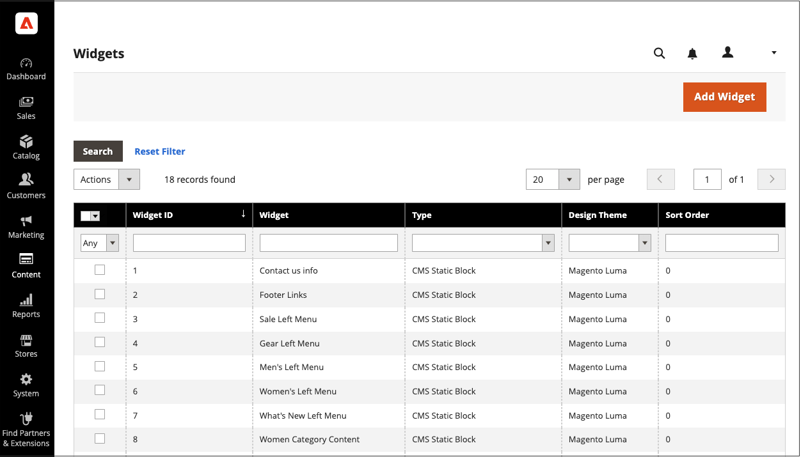

# 회전하는 동적 블록 추가

{{ee-feature}}

대화형 콘텐츠의 슬라이드 쇼를 표시하려면 회전자에 여러 [동적 블록](dynamic-blocks.md)을 추가할 수 있습니다. [위젯](widgets.md) 도구는 회전기가 한 페이지나 저장소의 여러 페이지에 있는 특정 위치에 배치되는 데 사용됩니다.

{width="700" zoomable="yes"}

## 1단계: 개별 동적 블록 만들기

회전자에 배치할 동적 블록을 [만들려면](dynamic-blocks.md) 다음 지침을 따르십시오.

## 2단계: 동적 블록 회전 위젯 추가

1. _관리자_ 사이드바에서 **[!UICONTROL Content]** > _[!UICONTROL Elements]_>**[!UICONTROL Widgets]**(으)로 이동합니다.

1. 오른쪽 상단에서 **[!UICONTROL Add Widget]**&#x200B;을(를) 클릭합니다.

1. _설정_&#x200B;에서 **[!UICONTROL Type]**&#x200B;을(를) `Dynamic Blocks Rotator`(으)로 설정합니다.

1. 스토어의 현재 **[!UICONTROL Design Theme]**&#x200B;을(를) 선택하십시오.

   이 설정은 스토어의 페이지 레이아웃을 결정하는 현재 패키지 또는 [theme](themes.md)을(를) 식별합니다.

1. **[!UICONTROL Continue]**&#x200B;을(를) 클릭합니다.

   {width="600" zoomable="yes"}

## 3단계: 옵션 완료

1. _Storefront 속성_&#x200B;에서 옵션을 설정합니다.

   - 회전자에 대한 **[!UICONTROL Title]**&#x200B;을(를) 입력하십시오.

   - **[!UICONTROL Assign to Store Views]** 목록에서 회전기가 있는 [저장소 보기](../getting-started/websites-stores-views.md)를 선택합니다.

   - (선택 사항) 대상 컨테이너에서 회전자의 위치를 결정하려면 **[!UICONTROL Sort Order]** 숫자를 입력합니다. 동일한 컨테이너에 할당될 수 있는 다른 위젯과 관련이 있습니다.

   {width="600" zoomable="yes"}

1. _레이아웃 옵션_&#x200B;에서 **[!UICONTROL Add Layout Update]**&#x200B;을(를) 클릭하고 다음을 수행합니다.

   - **[!UICONTROL Display on]**&#x200B;을(를) 회전자가 표시될 페이지 또는 페이지 유형으로 설정하십시오.

      - `Categories` - [앵커](../catalog/navigation-layered.md) 또는 비앵커 범주 페이지에 회전기가 표시됩니다. 옵션: 앵커 카테고리 / 비앵커 카테고리
      - `Products` - 특정 유형의 제품 페이지나 모든 제품 페이지에서 회전자를 표시합니다. 옵션: 모든 제품 유형 / [간단한 제품](../catalog/product-create-simple.md) / [가상 제품](../catalog/product-create-virtual.md) / [번들 제품](../catalog/product-create-bundle.md) / [다운로드 가능한 제품](../catalog/product-create-downloadable.md) / [기프트 카드](../catalog/product-gift-card-create.md) / [구성 가능한 제품](../catalog/product-create-configurable.md) / [그룹화된 제품](../catalog/product-create-grouped.md)
      - `Generic Pages` - 모든 페이지, 특정 페이지 또는 특정 레이아웃이 있는 페이지에서만 회전자를 표시합니다. 옵션: `All Pages` / `Specified Page` / `Page Layouts`

     이 예제에서 회전자는 `Specified Page`에 배치됩니다.

   - 회전기가 나타날 특정 **[!UICONTROL Page]**&#x200B;을(를) 선택하십시오.

   - **[!UICONTROL Container]**&#x200B;을(를) 회전자가 나타날 [페이지 레이아웃](page-layout.md#standard-page-layouts)의 일부로 설정합니다.

     다른 위젯이 동일한 컨테이너에 할당되면 정렬 순서에 따라 순서대로 표시됩니다.

   - `Dynamic Block Template`을(를) 기본 **[!UICONTROL Template]**(으)로 수락합니다.

     이 설정은 회전자가 독립형인지 또는 기존 텍스트 내부에 배치되는지를 기반으로 회전자의 서식을 지정하는 데 사용되는 템플릿을 결정합니다.

     {width="600" zoomable="yes"}

   - **[!UICONTROL Save and Continue Edit]**&#x200B;을(를) 클릭합니다.

1. 왼쪽 패널에서 **[!UICONTROL Widget Options]**&#x200B;을(를) 선택합니다.

1. **[!UICONTROL Dynamic Blocks to Display]**&#x200B;에 대해 `Specified Dynamic Blocks`을(를) 수락합니다.

   이 설정은 회전기에 포함된 동적 블록의 유형을 결정합니다.

   - `Specified Dynamic Blocks` - 특정 동적 블록만 포함합니다.
   - `Cart Price Rule Related` - 장바구니 가격 규칙과 연결된 동적 블록만 포함합니다.
   - `Catalog Price Rule Related` - 카탈로그 가격 규칙과 연결된 동적 블록만 포함합니다.

1. 위젯에 사용할 수 있는 **[!UICONTROL Restrict the Dynamic Block Types]**&#x200B;을(를) 사용하려면 `Content Area`을(를) 선택하십시오.

   이 설정은 배너를 페이지 레이아웃의 특정 부분으로 제한합니다.

   - `Content Area` - 동적 블록을 페이지의 기본 콘텐츠 영역에 배치합니다.
   - `Footer` - 동적 블록을 페이지 바닥글에 배치합니다.
   - `Header` - 동적 블록을 페이지 헤더에 배치합니다.
   - `Left Column` - 가능한 경우 페이지 레이아웃의 왼쪽 열에 동적 블록을 배치합니다.
   - `Right Column` - 가능한 경우 페이지 레이아웃의 오른쪽 열에 동적 블록을 배치합니다.

1. **[!UICONTROL Rotation Mode]**&#x200B;을(를) 다음 중 하나로 설정합니다.

   - `Display all instead of rotating` - 동적 블록의 스택을 표시합니다. 여기서 모든 동적 블록이 표시됩니다.
   - `One at a time, Random` - 지정한 동적 블록을 임의의 순서로 표시합니다. 페이지를 새로 고치면 다른(및 임의) 동적 블록이 나타납니다.
   - `One at the time, Series` - 추가된 시퀀스에 지정된 동적 블록을 표시합니다. 페이지를 새로 고치면 시퀀스의 다음 동적 블록이 나타납니다.
   - `One at the time, Shuffle` - 동적 블록을 섞은 순서로 한 번에 하나씩 표시합니다. 이 옵션은 동일한 동적 블록이 반복되지 않는다는 점을 제외하면 `One at a time, Random` 옵션과 비슷합니다.

     {width="600" zoomable="yes"}

1. **[!UICONTROL Specify Dynamic Blocks]** 그리드에서 회전자에 포함할 각 동적 블록의 확인란을 선택합니다.

1. 완료되면 **[!UICONTROL Save]**&#x200B;을(를) 클릭합니다.
