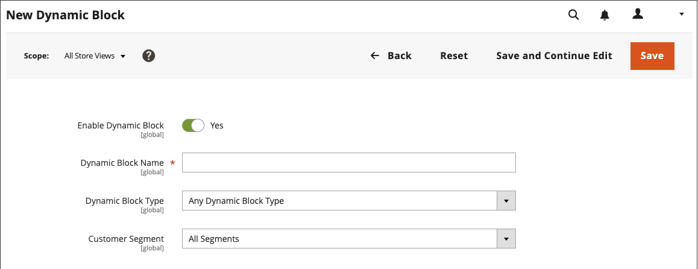
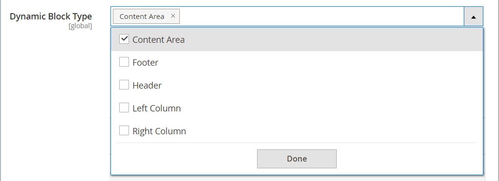

# 동적 블록

{{ee-feature}}

[가격 규칙](../merchandising-promotions/introduction.md#price-rules) 및 [고객 세그먼트](../customers/customer-segments.md)의 논리를 통해 제공되는 풍부한 대화형 콘텐츠를 만드십시오. 기존 [동적 블록](../page-builder/dynamic-block.md)을(를) [!DNL Page Builder] [단계](../page-builder/workspace.md)에 바로 추가할 수 있습니다. 동적 블록 사용에 대한 자세한 단계별 예제는 [자습서 2: 블록](../page-builder/2-blocks.md)을 참조하십시오.

>[!NOTE]
>
>[[!UICONTROL Content] 메뉴](content-menu.md)의 _[!UICONTROL Banner]_&#x200B;옵션은 2.3.1에서 더 이상 사용되지 않으며 2.4.0에서 제거되었습니다. 이 기능은 동적 블록으로 대체됩니다.

![[!DNL Page Builder] - 가격 규칙 및 고객 세그먼트가 있는 동적 블록](../page-builder/assets/pb-tutorial2-dynamic-block-storefront.png){width="600" zoomable="yes"}

## 1단계: 동적 블록 만들기

1. _관리자_ 사이드바에서 **[!UICONTROL Content]** > _[!UICONTROL Elements]_>**[!UICONTROL Dynamic Blocks]**(으)로 이동합니다.

   {width="600" zoomable="yes"}

1. 오른쪽 상단에서 **[!UICONTROL Add Dynamic Block]**&#x200B;을(를) 클릭합니다.

   {width="600" zoomable="yes"}

1. 해당되는 경우 동적 블록이 나타날 특정 저장소 보기로 **[!UICONTROL Store View]**&#x200B;을(를) 설정합니다.

1. 동적 블록을 활성화하려면 **[!UICONTROL Enable Dynamic Block]**&#x200B;을(를) `Yes`(으)로 설정합니다.

1. 내부 참조를 위해 설명 **[!UICONTROL Dynamic Block Name]**&#x200B;을(를) 입력하십시오.

1. 동적 블록을 표시할 페이지 영역으로 **[!UICONTROL Dynamic Block Type]**&#x200B;을(를) 설정하고 **[!UICONTROL Done]**&#x200B;을(를) 클릭합니다.

   {width="500" zoomable="yes"}

1. **[!UICONTROL Customer Segment]** 목록에서 동적 블록을 보려는 각 세그먼트의 확인란을 선택하고 **[!UICONTROL Done]**&#x200B;을(를) 클릭하여 설정을 저장합니다.

   {width="500" zoomable="yes"}

   >[!NOTE]
   >
   >- 세그먼트가 만들어지지 않으면 동적 블록이 모든 사용자에게 표시됩니다.
   >- 고객이 어떤 세그먼트에도 속하지 않고 모든 세그먼트에 대해 동적 블록이 만들어지면 동적 블록의 내용이 계속 표시됩니다.
   >- 동적 블록에 할당된 모든 고객 세그먼트가 삭제되면 해당 콘텐츠가 모든 사용자에게 표시됩니다.

### 동적 블록에서 Real-Time CDP 대상 사용

[!DNL Audience Activation] 확장을 [설치](../customers/audience-activation.md#install-the-extension) 및 [구성](../customers/audience-activation.md#configure-the-extension)하는 경우 **[!UICONTROL Audiences]** 섹션이 표시됩니다.

{width="600" zoomable="yes"}

**[!UICONTROL Real-Time CDP Audience]** 목록에서 동적 블록을 보려는 각 대상의 확인란을 선택하고 **[!UICONTROL Done]**&#x200B;을(를) 클릭하여 설정을 저장합니다.

## 2단계: 콘텐츠 완료

[!DNL Page Builder] [작업 영역](../page-builder/workspace.md)을(를) 사용하여 콘텐츠를 완료하십시오.

![[!DNL Page Builder] - 동적 차단 작업 영역](../page-builder/assets/pb-dynamic-block-workspace.png){width="600" zoomable="yes"}

## 3단계: 관련 판촉 선택

1. 아래로 스크롤하여  **[!UICONTROL Related Promotions]**&#x200B;를 확장합니다.

1. 동적 블록과 연결할 프로모션 유형을 클릭합니다.

   - **[!UICONTROL Add Cart Price Rules]**([장바구니 가격 규칙](../merchandising-promotions/price-rules-cart.md) 참조)

   - **[!UICONTROL Add Catalog Price Rules]**([카탈로그 가격 규칙](../merchandising-promotions/price-rules-catalog.md) 참조)

   >[!NOTE]
   >
   >Real-Time CDP 대상에 대해서는 카탈로그 가격 규칙이 지원되지 않습니다.

1. 사용 가능한 규칙 목록에서 사용할 각 규칙의 확인란을 선택하고 **[!UICONTROL Add Selected]**&#x200B;을(를) 클릭합니다.

1. 동적 블록이 완료되면 **[!UICONTROL Save]**&#x200B;을(를) 클릭합니다.

## 4단계: 페이지에 동적 블록 추가

1. 동적 블록을 표시할 페이지를 엽니다.

1. [[!UICONTROL Add Dynamic Block]](../page-builder/dynamic-block.md) 콘텐츠 형식을 사용하여 동적 블록을 단계에 추가하십시오.

## 필드 및 도구 설명

| 필드 | 설명 |
|--- |--- |
| [!UICONTROL Store View] | 동적 블록을 사용할 수 있는 저장소 보기를 지정합니다. |
| [!UICONTROL Enable Dynamic Block] | 동적 블록을 활성화하거나 비활성화합니다. 옵션: 예 / 아니요 |
| [!UICONTROL Dynamic Block Name] | 관리자의 동적 블록을 식별하는 수사적 이름입니다. |
| [!UICONTROL Dynamic Block Type] | [표준 페이지 레이아웃](layout-updates.md)에서 동적 블록이 배치된 위치를 식별합니다. 옵션:  **[!UICONTROL Content Area]**- 동적 블록을 페이지의 기본 [콘텐츠 영역](layout-updates.md)에 배치합니다. **[!UICONTROL Footer]** - [바닥글](page-setup.md#footer) 페이지에 동적 블록을 배치합니다.  **[!UICONTROL Header]**- [header](page-setup.md#header) 페이지에 동적 블록을 배치합니다. **[!UICONTROL Left Column]** - 동적 블록을 2열 또는 3열 레이아웃의 [왼쪽 사이드바](page-layout.md#standard-page-layouts)에 배치합니다.  **[!UICONTROL Right Column]**- 동적 블록을 2열 또는 3열 레이아웃의 [오른쪽 사이드바](page-layout.md#standard-page-layouts)에 배치합니다. |
| 고객 세그먼트 | 고객 세그먼트를 동적 블록과 연결하여 볼 수 있는 고객을 결정합니다. |
| Real-Time CDP 대상 | [Real-Time CDP 대상](../customers/audience-activation.md)을 동적 블록과 연결하여 볼 수 있는 고객을 파악합니다. |

{style="table-layout:auto"}

### 내용

| 필드 | 설명 |
|--- |--- |
| [!UICONTROL Layout] | 단계에 행, 열 또는 탭을 추가합니다. |
| [!UICONTROL Elements] | 텍스트, 머리글, 단추, 분할자 및 HTML 코드를 스테이지의 레이아웃 컨테이너에 추가합니다. |
| [!UICONTROL Media] | 이미지, 비디오, 배너, 슬라이더 및 Google 맵을 스테이지의 기존 레이아웃 컨테이너에 추가합니다. |
| [!UICONTROL Add Content] | 기존 블록, 동적 블록 및 제품을 스테이지에 추가합니다. |

{style="table-layout:auto"}

### 관련 프로모션

| 필드 | 설명 |
|--- |--- |
| [!UICONTROL Related Cart Price Rule] | **[!UICONTROL Add Cart Price Rules]** - 기존 [장바구니 가격 규칙](../merchandising-promotions/price-rules-cart.md)을(를) 프로모션으로 동적 블록과 연결합니다. |
| [!UICONTROL Related Catalog Price Rule] | **[!UICONTROL Add Catalog Price Rules]** - 기존 [카탈로그 가격 규칙](../merchandising-promotions/price-rules-catalog.md)을(를) 프로모션으로 동적 블록과 연결합니다. |

{style="table-layout:auto"}
