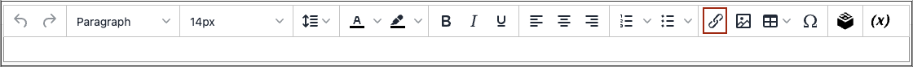

# 편집기에 링크 삽입

링크를 삽입하는 쉬운 방법은 _링크_ 의 단추 [편집자](editor.md) 도구 모음 이는 HTML에 대한 지식이 필요하지 않으며 결과는 동일합니다.

1. 링크를 만들 텍스트를 선택합니다.

1. 다음을 클릭합니다. _링크 삽입/편집_ 아이콘을 클릭합니다.

   {width="700" zoomable="yes"}

   이 작업을 수행하면 _[!UICONTROL Insert link]_대화 상자.

   {width="250" zoomable="yes"}

1. 대상 **[!UICONTROL Url]**&#x200B;를 클릭하고 다음 중 하나를 입력합니다.

   - 스토어에 있는 페이지의 URL 키.

   - 연결할 외부 페이지의 전체 URL입니다.

1. 필요한 경우 **[!UICONTROL Text to display]**.

   기본값은 링크에 대해 선택한 텍스트입니다. 텍스트 상자에서 변경할 수 있습니다.

1. 대상 **[!UICONTROL Title]**&#x200B;을 클릭하고 누군가가 링크 위로 마우스를 가져갈 때 표시할 도구 설명 텍스트를 입력합니다.

1. 설정 **[!UICONTROL Target]** 다음 중 하나를 수행합니다.

   - `Open link in the same window`

   - `Open in a new window`

1. 링크를 만들려면 **[!UICONTROL OK]**.
