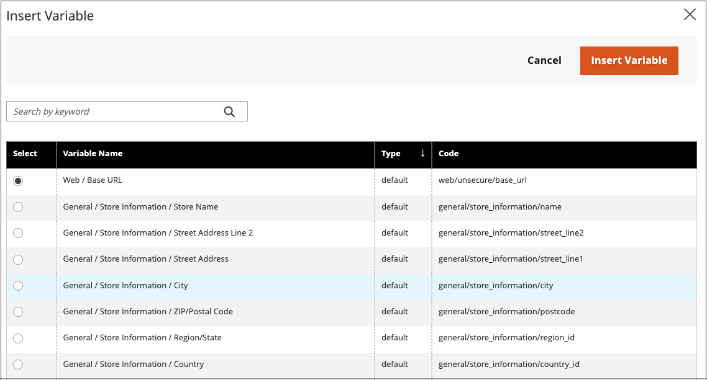

# 편집기에 변수 삽입

스토어에는 페이지 콘텐츠와 기타 통신에 통합할 수 있는 미리 정의된 많은 [변수](../systems/variables-predefined.md)가 포함되어 있습니다. 또한 필요에 따라 고유한 [사용자 지정 변수](../systems/variables-custom.md)를 포함할 수 있습니다.

1. 편집 모드로 페이지, 블록 또는 동적 블록을 엽니다.

1. _[!UICONTROL Content]_&#x200B;섹션으로 이동하여 편집기를 지원하는 요소를 클릭합니다.

1. 변수를 표시할 위치에 커서를 놓고 _변수 삽입_ 아이콘을 클릭합니다.

   {width="700" zoomable="yes"}

   [!UICONTROL Page Builder]을(를) 활성화하지 않았으며 HTML 코드를 사용하여 작업하려는 경우 **[!UICONTROL Show / Hide Editor]**&#x200B;을(를) 클릭합니다. 변수를 표시할 텍스트에 삽입 포인터를 놓습니다. **[!UICONTROL Insert Variable]**&#x200B;을(를) 클릭합니다.

1. 사용 가능한 변수 목록에서 원하는 변수를 선택하고 **[!UICONTROL Insert Variable]**&#x200B;을(를) 클릭합니다.

   {width="600" zoomable="yes"}

1. 콘텐츠 편집이 완료되면 **[!UICONTROL Save]**&#x200B;을(를) 클릭합니다.
