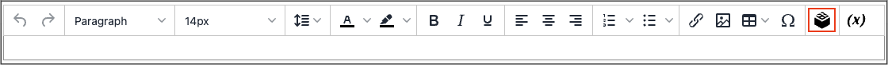

# 편집기에 위젯 삽입

다음 [위젯](widget-create.md) 도구를 사용하여 Commerce 콘텐츠 페이지 또는 노드, 제품 또는 카테고리에 대한 링크를 포함하여 다양한 콘텐츠 요소를 페이지에 추가할 수 있습니다. 링크는 페이지에 블록 형식으로 배치하거나 콘텐츠에 직접 통합할 수 있습니다. 위젯 도구를 사용하여 다음 유형의 콘텐츠에 대한 링크를 만들 수 있습니다.

- [컨텐츠 페이지](pages.md)
- [카탈로그 범주](../catalog/categories.md)
- [카탈로그 제품](../catalog/product-create.md)

기본적으로 링크는 테마의 스타일 시트에서 해당 스타일을 상속합니다.

{{$include /help/_includes/directives-caution.md}}

1. 편집 모드로 페이지, 블록 또는 동적 블록을 엽니다.

1. 로 이동 _[!UICONTROL Content]_를 클릭하고 편집기를 지원하는 요소를 클릭합니다.

1. 위젯을 표시할 위치에 커서를 놓고 _위젯 삽입_ 아이콘.

   {width="700" zoomable="yes"}

   페이지 빌더가 활성화되어 있지 않고 코드 작업을 하려는 경우 를 클릭합니다 **[!UICONTROL Show / Hide Editor]**. 위젯을 표시할 텍스트에 삽입 포인터를 놓습니다. 그런 다음 을 클릭합니다. **[!UICONTROL Insert Widget]**.

1. 다음을 선택합니다. **[!UICONTROL Widget Type]**.

   이러한 옵션에 대한 자세한 내용은 [위젯 유형](widgets.md#widget-types). 다음 단계에서는 제품에 대한 링크를 삽입하는 예를 사용합니다.

1. 제품 이름을 사용하려면 **[!UICONTROL Anchor Custom Text]** 필드가 비어 있습니다.

1. 다음을 입력하십시오. **[!UICONTROL Anchor Custom Title]** 우수 SEO 사례에 대해 설명합니다.

   이 제목은 페이지에 표시되지 않습니다.

1. 설정 **[!UICONTROL Template]** 다음 중 하나를 수행합니다.

   - 링크를 텍스트에 통합하려면 다음을 선택합니다 `Product Link Inline Template`.

   - 링크를 별도의 줄에 배치하려면 `Product Link Block Template`.

1. 클릭 **[!UICONTROL Select Product]** 다음을 수행합니다.

   - 트리에서 원하는 범주로 이동합니다.

   - 목록에서 연결된 제품을 선택합니다.

1. 클릭 **[!UICONTROL Insert Widget]** 를 클릭하여 페이지에 링크를 배치합니다.

   HTML 코드를 사용하여 작업하는 경우 [태그](../systems/markup-tags.md) 에 대한 링크가 중괄호로 묶인 페이지 맨 위에 나타납니다. 필요한 경우 다음을 사용하십시오. _잘라내기 및 붙여넣기_ 를 클릭하여 링크를 표시할 코드에 마크업 태그를 배치합니다.

1. 콘텐츠 편집이 완료되면 다음을 클릭하십시오. **[!UICONTROL Save]**.
