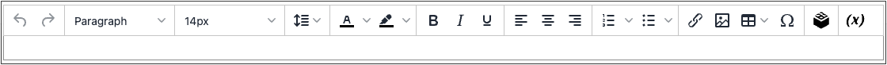

# WYSIWYG 편집기

편집기에서 콘텐츠를 _볼 수 있는 항목_(WYSIWYG) 보기에서 작업하는 동안 입력 및 서식을 지정할 수 있습니다. 기본 HTML 코드로 직접 작업하려는 경우 모드를 쉽게 변경할 수 있습니다. 편집기를 사용하여 [페이지](pages.md), [블록](blocks.md) 및 [제품 설명](../catalog/product-content.md)에 대한 콘텐츠를 만들 수 있습니다. 제품 세부 정보를 작업할 때 **[!UICONTROL Show / Hide Editor]**&#x200B;을(를) 클릭하여 편집기에 액세스합니다.

>[!NOTE]
>
>TinyMCE 5는 기본 WYSIWYG 편집기입니다. Adobe Commerce 및 Magento Open Source 2.4.5의 TinyMCE 5.10 라이브러리를 업데이트하면 일부 유형의 URL을 사용하여 이미지 또는 링크를 업데이트할 때 임의의 JavaScript 실행이 허용된 취약성이 해결됩니다. TinyMCE 3은 2.4.0 릴리스에서 더 이상 사용되지 않으며 2.4.3 릴리스에서 제거되었습니다. TinyMCE 4는 2.4.4 릴리스에서 제거되었습니다.

{width="700" zoomable="yes"}

다음 항목에서는 편집기 사용에 대한 자세한 정보를 제공합니다.

- [링크 삽입](editor-insert-link.md)
- [이미지 삽입](editor-insert-image.md)
- [위젯 삽입](editor-widget.md)
- [변수 삽입](editor-insert-variable.md)

## 편집기 구성

WYSIWYG 편집기는 기본적으로 활성화되어 있으며 CMS 페이지 및 블록, 제품 및 범주의 콘텐츠를 편집하는 데 사용할 수 있습니다. 구성에서 편집기를 활성화하거나 비활성화하고 제품 및 카테고리 설명의 미디어 콘텐츠에 대한 [dynamic](../catalog/catalog-urls.md#dynamic-url)이 아닌 정적 URL을 사용하도록 선택할 수 있습니다.

{width="600" zoomable="yes"}

모든 WYSIWYG 옵션에 대한 자세한 설명은 _구성 참조_&#x200B;에서 [콘텐츠 관리](../configuration-reference/general/content-management.md)를 참조하십시오.

1. _관리자_ 사이드바에서 **[!UICONTROL Stores]** > _[!UICONTROL Settings]_>**[!UICONTROL Configuration]**(으)로 이동합니다.

1. _[!UICONTROL General]_아래의 왼쪽 패널에서&#x200B;**[!UICONTROL Content Management]**을(를) 선택합니다.

1.  **[!UICONTROL WYSIWYG Options]**&#x200B;을 확장합니다.

1. **[!UICONTROL Enable WYSIWYG Editor]**&#x200B;을(를) 기본 설정으로 설정합니다.

   편집기는 기본적으로 활성화되어 있습니다.

1. WYSIWYG 편집기로 입력한 모든 [미디어 콘텐츠](../catalog/catalog-urls.md#static-url)에 대한 기본 설정으로 **[!UICONTROL Static URLs for Media Content in WYSIWYG]**&#x200B;을(를) 설정합니다.

1. 완료되면 **[!UICONTROL Save Config]**&#x200B;을(를) 클릭합니다.
