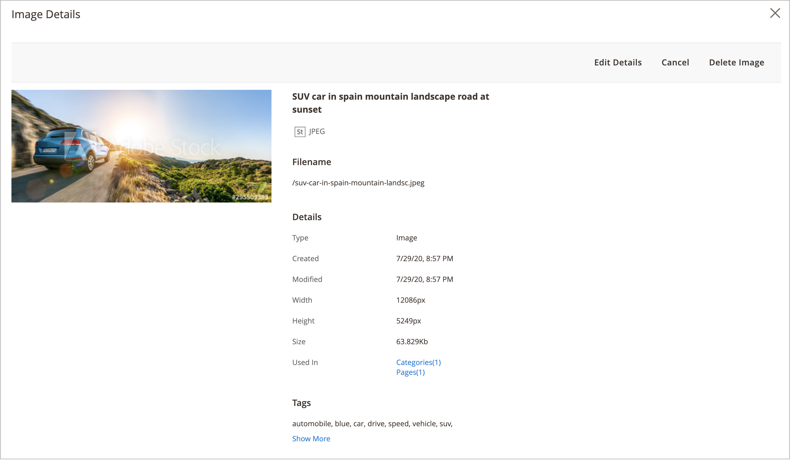
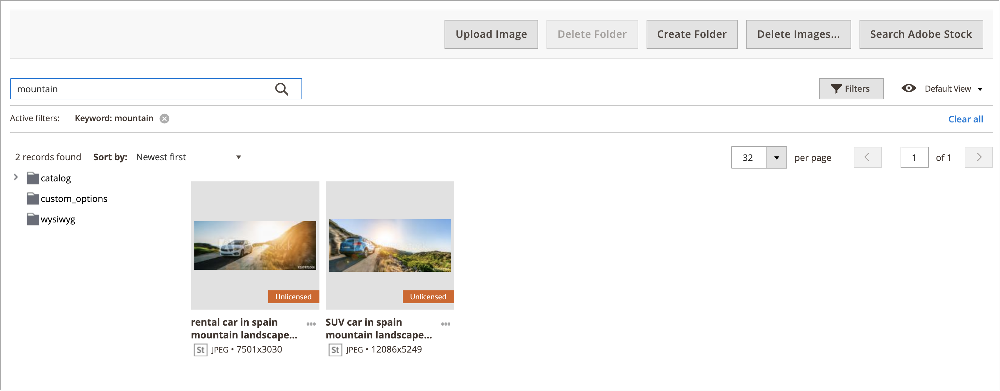

# 미디어 갤러리 자산 관리

새 [미디어 갤러리](media-gallery.md)에서는 업로드된 미디어 파일 및 [Adobe Stock 통합](adobe-stock.md)을 통해 얻은 자산을 관리하는 도구를 제공합니다. Adobe Stock [이미지 미리 보기](adobe-stock-save-preview.md)를 저장한 경우 새 미디어 갤러리에서 이미지를 [라이선스](adobe-stock-license-image.md)할 수도 있습니다.

## 에셋 업로드

1. _관리자_ 사이드바에서 **[!UICONTROL Content]** > _[!UICONTROL Media]_>**[!UICONTROL Media Gallery]**(으)로 이동합니다.

1. **[!UICONTROL Upload Image]**&#x200B;을(를) 클릭합니다.

1. 업로드할 파일을 선택합니다.

   선택한 에셋은 선택한 폴더(또는 폴더를 선택하지 않은 경우 스토리지 루트)에 자동으로 업로드됩니다.

## 자산 세부 사항 보기

1. _관리자_ 사이드바에서 **[!UICONTROL Content]** > _[!UICONTROL Media]_>**[!UICONTROL Media Gallery]**(으)로 이동합니다.

1. 자산({width="10" zoomable="no"}) 아래에 있는 세 점을 클릭한 다음 **[!UICONTROL View Details]**&#x200B;을(를) 클릭합니다.

   {width="600" zoomable="yes"}

   에셋 세부 사항이 슬라이드 패널에 표시됩니다. 여기에는 에셋이 사용되는 정보가 포함됩니다.

   - **[!UICONTROL Categories]**
   - **[!UICONTROL Products]**
   - **[!UICONTROL Pages]**
   - **[!UICONTROL Blocks]**

   {width="600" zoomable="yes"}

   자세한 내용을 보려면 **[!UICONTROL Used In]** 링크 를 클릭하십시오. 다음 예제의 표에는 특정 자산이 사용되는 모든 카테고리가 표시됩니다.

   {width="600" zoomable="yes"}

   _세부 정보 보기_ 섹션에서 에셋을 삭제할 수도 있습니다.

## 에셋 편집

1. _관리자_ 사이드바에서 **[!UICONTROL Content]** > _[!UICONTROL Media]_>**[!UICONTROL Media Gallery]**(으)로 이동합니다.

1. 자산 아래의 세 점({width="10" zoomable="no"})을 클릭한 다음 **[!UICONTROL Edit]**&#x200B;을(를) 클릭합니다.

   {width="600" zoomable="yes"}

1. 필요한 경우 다음 메타데이터 값 중 하나를 변경합니다.

   - **[!UICONTROL Title]**
   - **[!UICONTROL Description]**
   - **[!UICONTROL Tags/Keywords]**

   이 데이터는 데이터 베이스와 파일 메타데이터 자체에 저장됩니다. 현재 XMP 및 IPTC 형식이 지원됩니다.

   업데이트된 메타데이터로 이미지를 다운로드할 수 있습니다.

## 에셋 사용

Assets은 [페이지 추가 또는 편집](page-add.md), [카테고리 만들기 또는 편집](../catalog/category-create.md) 또는 [콘텐츠 편집기에서 이미지 삽입](editor-insert-image.md)과 같이 관리자 전체에서 광범위하게 사용할 수 있습니다.

1. 미디어 에셋을 사용할 수 있는 영역에서 새 미디어 갤러리에 액세스합니다.

1. 자산을 선택하고 **[!UICONTROL Add Selected]**&#x200B;을(를) 클릭합니다.

{{$include /help/_includes/image-optimization-animated-gif-note.md}}

## 에셋 삭제

1. _관리자_ 사이드바에서 **[!UICONTROL Content]** > _[!UICONTROL Media]_>**[!UICONTROL Media Gallery]**(으)로 이동합니다.

1. **[!UICONTROL Delete Images...]**&#x200B;을(를) 클릭하고 삭제할 각 에셋에 대한 확인란을 선택합니다.

1. 확인 대화 상자에서 **[!UICONTROL Delete Image]**&#x200B;을(를) 클릭합니다.

   {width="500" zoomable="yes"}

## 에셋 검색

1. _관리자_ 사이드바에서 **[!UICONTROL Content]** > _[!UICONTROL Media]_>**[!UICONTROL Media Gallery]**(으)로 이동합니다.

1. **[!UICONTROL Search by keywords]** 입력을 사용하여 키워드/태그로 이미지 검색을 수행합니다.

   다음 예제에서는 특정 태그(`mountain`)가 포함된 자산을 검색합니다.

   {width="600" zoomable="yes"}

>[!NOTE]
>
>이미지 태그를 업데이트하는 방법에 대한 자세한 내용은 _[자산 편집](#edit-an-asset)_ 섹션을 참조하십시오.

## 자산 필터링

>[!NOTE]
>
>_다음에서 사용_ 기능을 사용하려면 [!UICONTROL Media Gallery Image Optimization]구성 설정[에서 ](media-gallery-image-optimization.md)을(를) 사용하도록 설정해야 합니다.

1. _관리자_ 사이드바에서 **[!UICONTROL Content]** > _[!UICONTROL Media]_>**[!UICONTROL Media Gallery]**(으)로 이동합니다.

1. **[!UICONTROL Filters]** 탭을 클릭합니다.

   {width="600" zoomable="yes"}

1. 필터링 옵션을 설정합니다.

   엔티티의 사용에 따라 에셋을 필터링할 수 있습니다.

   - **[!UICONTROL Used in Categories]**
   - **[!UICONTROL Used in Products]**
   - **[!UICONTROL Used in Pages]**
   - **[!UICONTROL Used in Blocks]**

   자산을 **[!UICONTROL Store View]**, **[!UICONTROL License Status]** 및 **[!UICONTROL Content Status]**(으)로 필터링할 수도 있습니다. 파일 날짜에 따라 자산을 필터링하려면 **[!UICONTROL Uploaded Date]** 및/또는 **[!UICONTROL Modification Date]**&#x200B;의 날짜 범위를 설정하십시오.

1. 결과를 보려면 **[!UICONTROL Apply Filters]**&#x200B;을(를) 클릭하십시오.

   다음 예제의 필터링은 특정 범주(`cars`)에서 사용되고 활성화된 자산을 찾습니다.

   {width="600" zoomable="yes"}

## 중복 이미지 찾기

1. **[!UICONTROL Filters]** 탭을 클릭하고 **[!UICONTROL Show duplicates]** 확인란을 선택합니다.

1. 결과를 보려면 **[!UICONTROL Apply Filters]**&#x200B;을(를) 클릭하십시오.

<!-- Last updated from includes: 2024-01-30 15:43:39 -->
