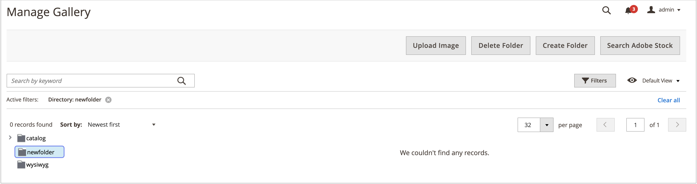

# 미디어 갤러리 폴더 관리

폴더를 사용하여 새 [미디어 갤러리](media-gallery.md)에서 이미지를 구성하세요. 미디어 에셋의 수가 증가하면 미디어 갤러리에서 폴더를 사용하여 기존 에셋을 보다 쉽게 찾고 관리할 수 있습니다.

## 폴더 만들기

>[!NOTE]
>
>`pub/media/wysywig` 및 `pub/media/catalog/category` 폴더에만 폴더를 만들 수 있습니다.

1. _관리자_ 사이드바에서 **[!UICONTROL Content]** > _[!UICONTROL Media]_>**[!UICONTROL Media Gallery]**(으)로 이동합니다.

1. **[!UICONTROL Create Folder]**&#x200B;을(를) 클릭합니다.

   하위 폴더를 만들려면 **[!UICONTROL Create Folder]**&#x200B;을(를) 클릭하기 전에 상위 폴더를 선택하십시오.

1. 새 폴더 이름을 입력하고 **[!UICONTROL Confirm]**&#x200B;을(를) 클릭합니다.

   {width="600" zoomable="yes"}

## 폴더 삭제

>[!WARNING]
>
>폴더를 삭제하면 해당 폴더 내의 모든 이미지가 제거됩니다. `pub/media/wysywig` 및 `pub/media/catalog/category` 폴더에서만 폴더를 삭제할 수 있습니다.

1. _관리자_ 사이드바에서 **[!UICONTROL Content]** > _[!UICONTROL Media]_>**[!UICONTROL Media Gallery]**(으)로 이동합니다.

1. 삭제할 폴더를 선택합니다.

   {width="600" zoomable="yes"}

1. **[!UICONTROL Delete Folder]**&#x200B;을(를) 클릭합니다.

1. 폴더 삭제를 확인하려면 **[!UICONTROL OK]**&#x200B;을(를) 클릭합니다.
